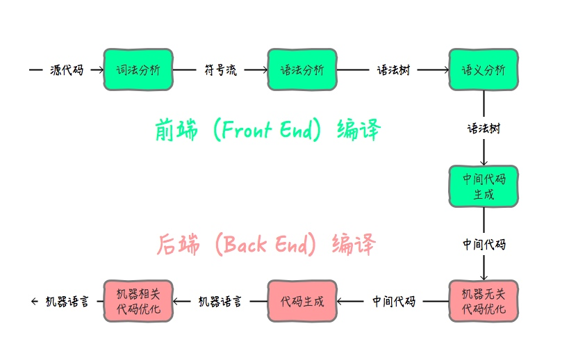
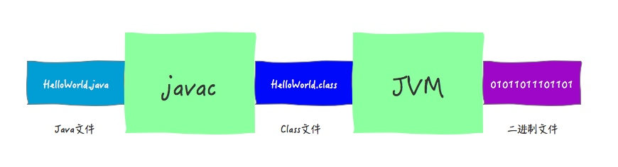
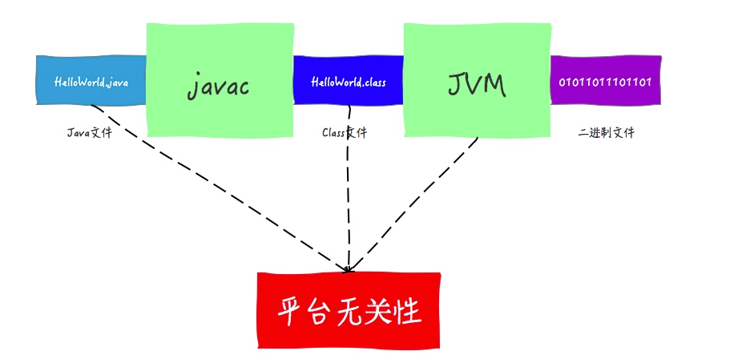
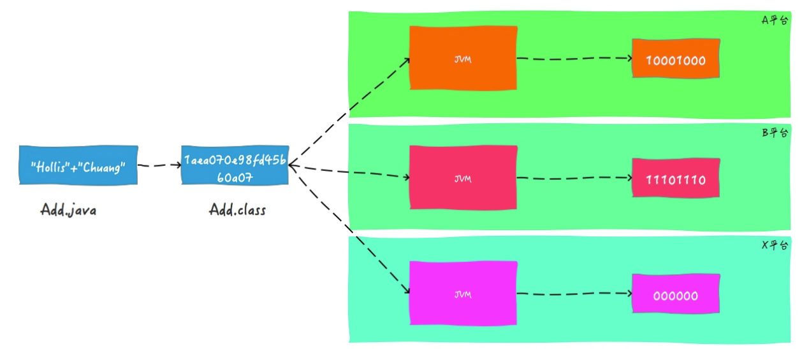

# Java是如何实现平台无关性的

## 什么是平台无关性

一次编译，到处运行

## 平台无关性的实现

扮演重要角色的是Java语言规范 、Class文件、Java虚拟机（JVM）

### 编译原理基础

把源代码翻译成01代码就是编译

前端编译和后端编译

#### 前端编译

前端编译主要指与源语言有关但与目标机无关的部分。Java中，我们所熟知的**javac的编译就是前端编译**。除了这种以外，我们使用的很多IDE，如eclipse，idea等，都内置了前端编译器。**主要功能就是把.java代码转换成.class代码**。

这里提到的.class文件就是Class类文件

#### 后端编译

后端编译主要是将中间代码再翻译成机器语言。Java中，这一步骤就是Java虚拟机来执行的。

#### 总结

Java的平台无关性实现主要作用于以上阶段。如下图所示：

### Java虚拟机

所谓平台无关性，就是说要能够做到可以在多个平台上都能无缝对接。但是，对于不同的平台，硬件和操作系统肯定都是不一样的。

对于不同的硬件和操作系统，最主要的区别就是指令不同。比如同样执行a+b，A操作系统对应的二进制指令可能是10001000，而B操作系统对应的指令可能是11101110。那么，想要做到跨平台，最重要的就是可以根据对应的硬件和操作系统生成对应的二进制指令。

虽然Java语言是平台无关的，但是JVM却是平台有关的，不同的操作系统上面要安装对应的JVM。

Java虚拟机，想要执行a+b操作，A操作系统上面的虚拟机就会把指令翻译成10001000，B操作系统上面的虚拟机就会把指令翻译成11101110。

Java之所以可以做到跨平台，是因为Java虚拟机充当了桥梁。他扮演了运行时Java程序与其下的硬件和操作系统之间的缓冲角色。

### 字节码

各种不同的平台的虚拟机都使用统一的程序存储格式——字节码（ByteCode）是构成平台无关性的另一个基石。Java虚拟机只与由字节码组成的Class文件进行交互。

我们说Java语言可以Write Once ,Run Anywhere。这里的Write其实指的就是生成Class文件的过程。

因为Java Class文件可以在任何平台创建，也可以被任何平台的Java虚拟机装载并执行，所以才有了Java的平台无关性。

### Java语言规范

Java中基本数据类型的值域和行为都是由其自己定义的。而C/C++中，基本数据类型是由它的占位宽度决定的，占位宽度则是由所在平台决定的。所以，在不同的平台中，对于同一个C++程序的编译结果会出现不同的行为。

举一个简单的例子，对于int类型，在Java中，int占4个字节，这是固定的。

但是在C++中却不是固定的了。在16位计算机上，int类型的长度可能为两字节；在32位计算机上，可能为4字节；当64位计算机流行起来后，int类型的长度可能会达到8字节。

通过保证基本数据类型在所有平台的一致性，Java语言为平台无关性提供强了有力的支持。

## 小结

对于Java的平台无关性的支持是分布在整个Java体系结构中的。其中扮演着重要角色的有Java语言规范、Class文件、Java虚拟机等。

- Java语言规范：通过规定Java语言中基本数据类型的取值范围和行为
- Class文件：所有Java文件要编译成统一的Class文件
- Java虚拟机：通过Java虚拟机将Class文件转成对应平台的二进制文件等

Java的平台无关性是建立在Java虚拟机的平台有关性基础之上的，是因为Java虚拟机屏蔽了底层操作系统和硬件的差异。

## 语言无关性

JVM其实并不是和Java文件进行交互的，而是和Class文件，也就是说，其实JVM运行的时候，并不依赖于Java语言。

如Groovy、Scala、Jython等。之所以可以支持，就是因为这些语言也可以被编译成字节码（Class文件）。而虚拟机并不关心字节码是有哪种语言编译而来的。

# JVM还支持那些语言

- Kotlin
- Groovy
- Scala
- Jruby
- Jython
- Fantom
- Clojure
- Rhino
- Ceylon