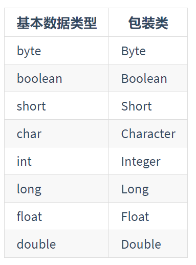

# 基本数据类型

基本类型：内置类型，是Java不同于类的特殊类型，它们是编程中使用使用最频繁的类型

Java是一种强类型语言，第一次申明必须说明数据类型，第一次变量赋值称为变量的初始化

## Java的数据类型

- 字符类型
- 布尔类型
- 数值类型
  - 整型类型
  - 浮点类型
  
Java的数值类型中是不存在无符号的，他们的取值范围是固定的，不会随着机器硬件或者操作系统的改变而改变

实际上还有一个基本数据类型，就是void，他有对应的包装类型：Void

## 基本数据类型有什么好处

在Java中，new一个对象是存储在堆中的，我们通过栈中的引用来使用这些对象，所以对象本身是比较消耗资原的

对于经常使用到数据类型，如果在使用的时候都需要去new的话，是比较费时和消耗资原，提供了基本数据类型，他们不会在堆上创建，而是**在栈上直接创建**

## 整型的取值范围

- short：short 用 2 个字节存储，范围为 -32,768(-2^15) 到 32,767(2^15-1)，在变量初始化的时候，short 类型的默认值为 0，一般情况下，因为 Java 本身转型的原因，可以直接写为 0。
- int：int 用 4 个字节存储，范围为 -2,147,483,648(-2^31) 到 2,147,483,647(2^31-1)，在变量初始化的时候，int 类型的默认值为 0。
- long：long 用 8 个字节存储，范围为 -9,223,372,036,854,775,808(-2^63) 到 9,223,372,036, 854,775,807(2^63-1)，在变量初始化的时候，long 类型的默认值为 0L 或 0l，也可直接写为 0。

## 超出范围怎么办

超出范围会溢出，溢出是不抛出任何异常的，也没有任何提示

# 包装类型

包装类均位于java.lang



**为什么需要包装类型**

因为Java是一种面向对象语言，很多地方都需要使用对象而不是基本数据类型，比如在集合中我们无法将int\doubl等类型放进去，因为集合元素需要是Object的子类。

# 拆箱和装箱

基本数据类型和包装类，肯定有些时候在他们之间进行转换

在Java 5之前，要进行装箱，可以通过以下的代码

```java
Integer i = new Integer(10);
```

自动拆箱和自动装箱：

- 在Java中为了减少开发人员的工作，Java提供了自动拆箱和自动装箱的功能
- 自动装箱：把基本数据类型自动转换成对应的包装类
- 自动拆箱：就是将包装类自动转换成对应的基本数据类型
- 代码示例

```java
Integer i = 10;  //自动装箱
int b = i;     //自动拆箱
```

# 自动装箱与自动拆箱和原理实现

int的自动装箱都是通过**Integer.valueOf()**方法来实现的

int的自动拆箱都是通过**Integer.intValue()**来实现的

**自动装箱都是通过包装类的 valueOf() 方法来实现的.自动拆箱都是通过包装类对象的 xxxValue() 来实现的。**

# 那些地方会用到自动拆装箱

- 将基本类型放进集合
- 包装类型和基本类型的大小比较：包装类型和基本类型比较大小，其实就是先将包装类型转成基本类型之后在比较大小的
- 包装类型的运算
- 三目运算
  - 当其中有一个是基本数据类型的时候，就会自动拆箱成为基本类型
  - 其中只要是有一个转换称为null，那么就会发生NPE
- 函数参数返回值

# 自动拆箱与缓存

例子

```java
public static void main(String... strings) {

    Integer integer1 = 3;
    Integer integer2 = 3;

    if (integer1 == integer2)
        System.out.println("integer1 == integer2");
    else
        System.out.println("integer1 != integer2");

    Integer integer3 = 300;
    Integer integer4 = 300;

    if (integer3 == integer4)
        System.out.println("integer3 == integer4");
    else
        System.out.println("integer3 != integer4");
}
```

我们普遍认为上面的两个结果都是false，虽然比较的值都是相等的，但是由于比较的对象，而对象的引用不一样，所以会认为两个if判断都是false。

在Java中，==比较的是对象引用，而equals比较的是值，所以在这个例子中，不同的对象有不同引用，所以在进行比较的时候，都将返回false，但是上面输出的真正结果是：

```java
integer1 == integer2
integer3 != integer4
```

原因就和Integer中的缓存机制有关，在 Integer 的操作上引入了一个新功能来节省内存和提高性能。整型对象通过使用相同的对象引用实现了缓存和重用。

**当需要进行自动装箱时，如果数字在 -128 至 127 之间时，会直接使用缓存中的对象，而不是重新创建一个对象**

其中的 Javadoc 详细的说明了缓存支持 -128 到 127 之间的自动装箱过程。最大值 127 可以通过 `-XX:AutoBoxCacheMax=size` 修改

实际上这个功能在 Java 5 中引入的时候,范围是固定的 -128 至 +127。后来在 Java 6 中，可以通过 `java.lang.Integer.IntegerCache.high` 设置最大值。

## 总结

如果一个变量 p 的值是

- -128 至 127 之间的整数
- true 和 false 的布尔值
- \u0000 至 \u007f 之间的字符

范围内的时，将 p 包装成 a 和 b 两个对象时，可以直接使用 a == b 判断 a 和 b 的值是否相等，但是其实还是不要使用这种方式去做判断，因为会容易引起上面的误会，直接是用equals比较值会更好。

# 自动拆箱带来的问题

包装对象的数值比较，不能简单的使用==，虽然 -128 到 127 之间的数字可以，但是这个范围之外还是需要使用 equals 比较。

前面提到，有些场景会进行自动拆装箱，同时也说过，由于自动拆箱，如果包装类对象为 null ，那么自动拆箱时就有可能抛出 NPE。

如果一个 for 循环中有大量拆装箱操作，会浪费很多资源。

# Integer的缓存机制

就是在-128~127之间的时候会直接从IntegerCache中引用同一个对象

# 如何正确定义接口的返回值

在定义一个布尔类型的变量，尤其是一个给外部提供的接口返回值时，要使用success来命名，阿里巴巴Java开发手册建议使用**封装类来定义POJO和RPC返回值中的变量**。但是这不意味着可以随意的使用null，我们还是要尽量避免出现对null的处理的。