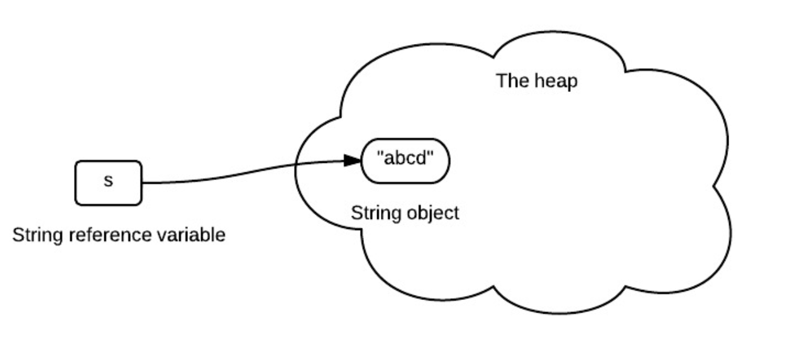
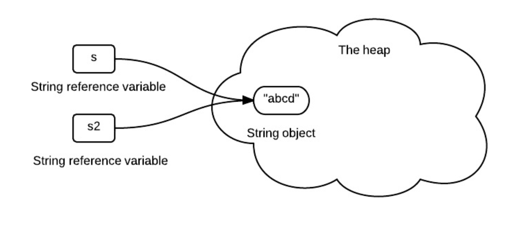
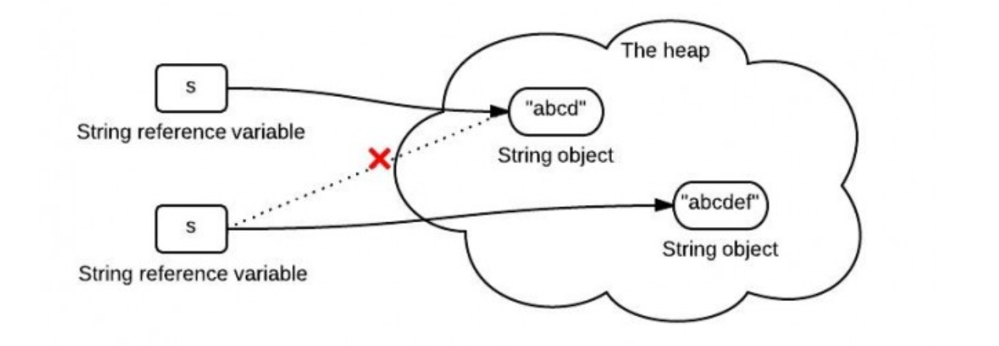
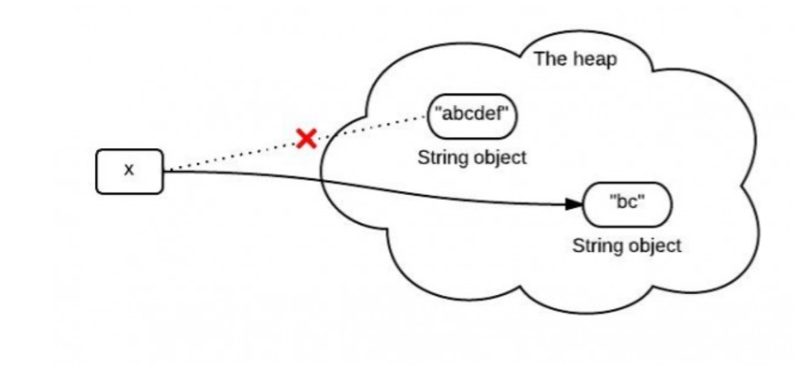
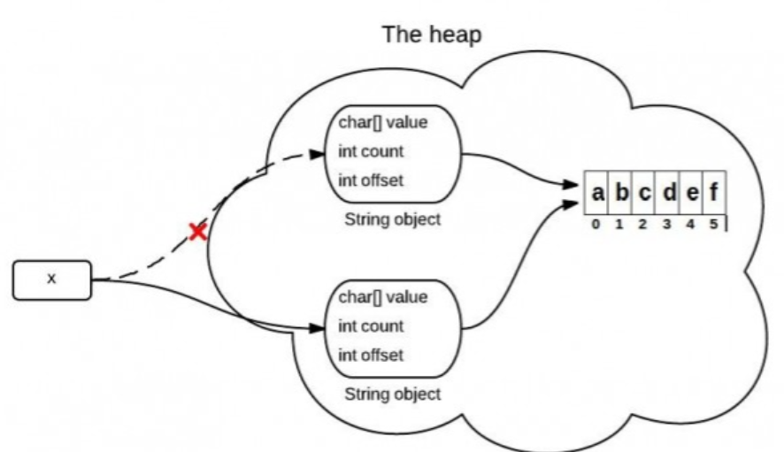
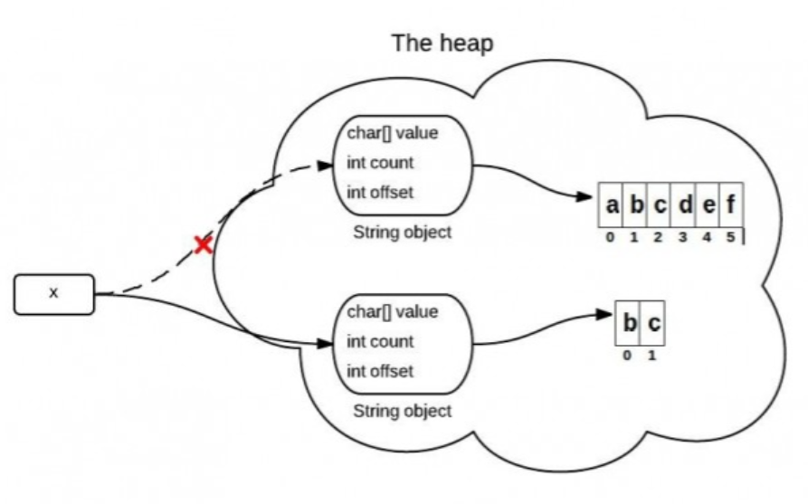
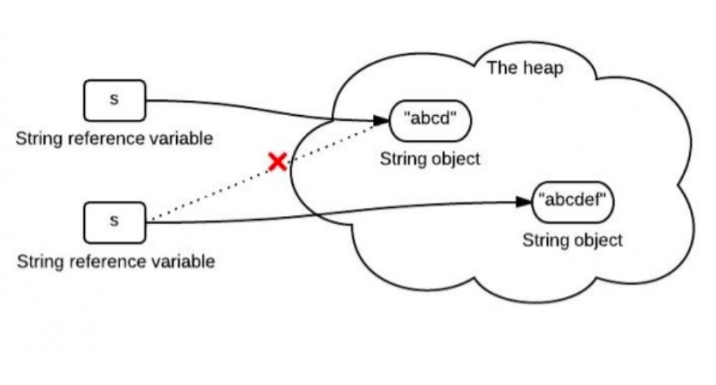
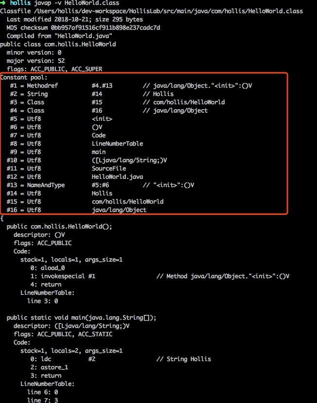

# 字符串的不变性

## 定义一个字符串



```java
String s="abcd";
```

s中保存了对string对象的引用，下面的箭头可以理解为对他的引用

## 使用变量来赋值变量



```java
String s2=s;
```

s2中保存了相同的引用值，因为他们代表了同一个对象

## 字符串连接

```java
s=s.concat("ef")
```



s中保存了一个重新创建出来的对象

## 总结

一旦一个string对象在堆中被创建出来就无法改变了，特别要注意的是，string的所有方法都没有改变字符串本身的能力，都是返回一个新的对象

如果需要修改一个对象，应该使用StringBuffer或者StringBuilder，否则会有大量时间浪费在垃圾回收上，因为试图修改的string都是被新创建出来的

# jdk6和jdk7中substring的原理和区别

substring(int beginIndex, int endIndex)方法在不同版本的JDK中的实现是不同的。了解他们的区别可以帮助你更好的使用他。为简单起见，后文中用substring()代表substring(int beginIndex, int endIndex)方法。

## substring的作用

substring(int beginIndex, int endIndex)方法截取字符串并返回其[beginIndex,endIndex-1]范围内的内容。

## 调用substring时发生了什么？

你可能知道，因为x是不可变的，当使用x.substring(1,3)对x赋值的时候，它会指向一个全新的字符串

```java
x=x.substring(1,3);
```



然而这个图中表示的不是完全正确的，因为在JDK 6 和 JDK 7 中调用substring发生的事情并不一样

## JDK 6 中的substring

string是通过字符数组实现的，在JDK 6 中SString类包含三个成员变量，char value[],int offset,int count，他们分别用来存储真正的字符数组，数组的第一个位置索引以及字符串中包含的字符个数

当d调用这个substring方法的时候，会创建一个新的string对象，但是这个string的值仍然指向堆中的同一个字符数组，这两个对象中只有count和offset的值是不同的



### JDK 6 中的源代码

```java
//JDK 6
String(int offset, int count, char value[]) {
    //这里的value是原来的value
    this.value = value;
    this.offset = offset;
    this.count = count;
}

public String substring(int beginIndex, int endIndex) {
    //check boundary
    //这里是关键，返回的同一个数组，只是开始的位置和长度不一样
    return  new String(offset + beginIndex, endIndex - beginIndex, value);
}
```

## JDK 6 中的substring会导致的问题

如果你有一个很长很长的字符串，但是当你使用substring进行切割的时候你只需要很短的一段。这可能导致性能问题，因为你需要的只是一小段字符序列，但是你却引用了整个字符串（**因为这个非常长的字符数组一直在被引用，所以无法被回收，就可能导致内存泄露**）。在JDK 6中，一般用以下方式来解决该问题，原理其实就是生成一个新的字符串并引用他。

```java
x = x.substring(x, y) + ""
```

## JDK 7 中的substring

在JDK 7 中substring会在堆内存中创建一个新的数组



### JDK 7 中的源码

```java
//JDK 7
public String(char value[], int offset, int count) {
    //check boundary
    //关键是这个，调用这个的时候创建一个原字符数组从指定为位置开始的指定长度的value
    this.value = Arrays.copyOfRange(value, offset, offset + count);
}

public String substring(int beginIndex, int endIndex) {
    //check boundary
    int subLen = endIndex - beginIndex;
    return new String(value, beginIndex, subLen);
}
```

# replaceFirst、replaceAll、replace的区别

- replace(CharSequence target, CharSequence replacement) ，用replacement替换所有的target，两个参数都是字符串。
- replaceAll(String regex, String replacement) ，用replacement替换所有的regex匹配项，regex很明显是个正则表达式，replacement是字符串。
- replaceFirst(String regex, String replacement) ，基本和replaceAll相同，区别是只替换第一个匹配项。

可以看到，其中replaceAll以及replaceFirst是和正则表达式有关的，而replace和正则表达式无关。

replaceAll和replaceFirst的区别主要是替换的内容不同，replaceAll是替换所有匹配的字符，而replaceFirst()仅替换第一次出现的字符

# String对+的重载

`String s="a"+"b"`，编译器会进行常量折叠（因为两个都是编译期常量，编译期可知），即变成 `String s="ab"`

对于能够进行优化的(String s = "a" + 变量 等)用 StringBuilder 的 append() 方法替代，最后调用 toString() 方法 (底层就是一个 new String())

# 字符串拼接的几种方式和区别

## 字符串拼接的几种方式

### concat



### +

有人把Java中使用+拼接字符串的功能理解为运算符重载。其实并不是，Java是不支持运算符重载的。这其实只是Java提供的一个语法糖

### StringBuffer

线程安全

### StringBuilder

线程不安全，append方法没有加线程锁。

### StringUtils.join

主要作用就是：将数组或者某拼接符拼接到一起形成新的字符串

```java
String []list  ={"Hollis","每日更新Java相关技术文章"};
String result= StringUtils.join(list,",");
System.out.println(result);
//结果：Hollis,每日更新Java相关技术文章
```

## 使用+拼接字符串的实现原理

代码示例

```java
String wechat = "Hollis";
String introduce = "每日更新Java相关技术文章";
String hollis = wechat + "," + introduce;
```

反编译之后

```java
String wechat = "Hollis";
String introduce = "\u6BCF\u65E5\u66F4\u65B0Java\u76F8\u5173\u6280\u672F\u6587\u7AE0";//每日更新Java相关技术文章
String hollis = (new StringBuilder()).append(wechat).append(",").append(introduce).toString();
```

总结：Java中的+对字符串的拼接，其实现原理是使用StringBuilder.append

## concat是如何实现的

源码

```java
public String concat(String str) {
    int otherLen = str.length();
    if (otherLen == 0) {
        return this;
    }
    int len = value.length;
    char buf[] = Arrays.copyOf(value, len + otherLen);
    str.getChars(buf, len);
    return new String(buf, true);
}
```

这段代码首先创建了一个字符数组，长度是已有字符串和待拼接字符串的长度之和，再把两个字符串的值复制到新的字符数组中，并使用这个字符数组创建一个新的String对象并返回。

通过源码我们也可以看到，经过concat方法，其实是new了一个新的String，这也就呼应到前面我们说的字符串的不变性问题上了。

其实我觉得到这里就表明了一件事：就是为什么String是要改变的，就是因为如果每次对String做什么操作都是返回与原来value这个字符数组相关联的，那么就会出现和jdk 6 中的substring方法一样的结果。

## StringBuffer和StringBuilder

和String类类似，StringBuilder类也封装了一个字符数组，定义如下：

```java
char[] value;
```

与String不同的是，它并不是final的，所以他是可以修改的。另外，与String不同，字符数组中不一定所有位置都已经被使用，它有一个实例变量，表示数组中已经使用的字符个数，定义如下：

```java
int count;
```

其append源码如下：

```java
public StringBuilder append(String str) {
    super.append(str);
    return this;
}
```

该类继承了AbstractStringBuilder类，看下其append方法：

```java
public AbstractStringBuilder append(String str) {
    if (str == null)
        return appendNull();
    int len = str.length();
    ensureCapacityInternal(count + len);
    str.getChars(0, len, value, count);
    count += len;
    return this;
}
```

append会直接拷贝字符到内部的字符数组中，如果字符数组长度不够，会进行扩展。

StringBuffer和StringBuilder类似，最大的区别就是StringBuffer是线程安全的

```java
public synchronized StringBuffer append(String str) {
    toStringCache = null;
    super.append(str);
    return this;
}
```

## StringUtils.join是如何实现的

通过查看StringUtils.join的源代码，我们可以发现，其实他也是通过StringBuilder来实现的

```java
public static String join(final Object[] array, String separator, final int startIndex, final int endIndex) {
    if (array == null) {
        return null;
    }
    if (separator == null) {
        separator = EMPTY;
    }

    // endIndex - startIndex > 0:   Len = NofStrings *(len(firstString) + len(separator))
    //           (Assuming that all Strings are roughly equally long)
    final int noOfItems = endIndex - startIndex;
    if (noOfItems <= 0) {
        return EMPTY;
    }

    final StringBuilder buf = new StringBuilder(noOfItems * 16);

    for (int i = startIndex; i < endIndex; i++) {
        if (i > startIndex) {
            buf.append(separator);
        }
        if (array[i] != null) {
            buf.append(array[i]);
        }
    }
    return buf.toString();
}
```

## 效率比较

用时从短到长的对比是：

StringBuilder<StringBuffer<concat<+<StringUtils.join

StringUtils.join也是使用了StringBuilder，并且其中还是有很多其他操作，所以耗时较长，这个也容易理解。其实StringUtils.join更擅长处理字符串数组或者列表的拼接。

前面我们分析过，其实使用+拼接字符串的实现原理也是使用的StringBuilder，那为什么结果相差这么多，高达1000多倍呢？

我们再把以下代码反编译下：

```java
long t1 = System.currentTimeMillis();
String str = "hollis";
for (int i = 0; i < 50000; i++) {
    String s = String.valueOf(i);
    str += s;
}
long t2 = System.currentTimeMillis();
System.out.println("+ cost:" + (t2 - t1));
```

反编译后代码如下：

```java
long t1 = System.currentTimeMillis();
String str = "hollis";
for(int i = 0; i < 50000; i++)
{
    String s = String.valueOf(i);
    str = (new StringBuilder()).append(str).append(s).toString();
}

long t2 = System.currentTimeMillis();
System.out.println((new StringBuilder()).append("+ cost:").append(t2 - t1).toString());
```

我们可以看到，反编译后的代码，在for循环中，每次都是new了一个StringBuilder，然后再把String转成StringBuilder，再进行append。

而频繁的新建对象当然要耗费很多时间了，不仅仅会耗费时间，频繁的创建对象，还会造成内存资源的浪费。

所以，阿里巴巴Java开发手册建议：循环体内，字符串的连接方式，使用 StringBuilder 的 append 方法进行扩展。而不要使用+。

## 总结

本文介绍了什么是字符串拼接，虽然字符串是不可变的，但是还是可以通过新建字符串的方式来进行字符串的拼接。

常用的字符串拼接方式有五种，分别是使用+、使用concat、使用StringBuilder、使用StringBuffer以及使用StringUtils.join。

由于字符串拼接过程中会创建新的对象，所以如果要在一个循环体中进行字符串拼接，就要考虑内存问题和效率问题。

因此，经过对比，我们发现，直接使用StringBuilder的方式是效率最高的。因为StringBuilder天生就是设计来定义可变字符串和字符串的变化操作的。

但是，还要强调的是：

1. 如果不是在循环体中进行字符串拼接的话，直接使用+就好了。

2. 如果在并发场景中进行字符串拼接的话，要使用StringBuffer来代替StringBuilder。

# String.valueOf和Integer.toString的区别

我们有三种方式将一个int类型的变量变成一个String类型，那么他们有什么区别？

代码

```java
int i = 5;
String i1 = "" + i;
String i2 = String.valueOf(i);
String i3 = Integer.toString(i);
```

第三行和第四行没有任何区别，因为String.valueOf(i)也是调用Integer.toString(i)来实现的。

第二行代码其实是String i1 = (new StringBuilder()).append(i).toString();，首先创建一个StringBuilder对象，然后再调用append方法，再调用toString方法。

# swtich对String的支持

Java 7中，switch的参数可以是String类型了，这对我们来说是一个很方便的改进。到目前为止switch支持这样几种数据类型：byte short int char String 。但是，作为一个程序员我们不仅要知道他有多么好用，还要知道它是如何实现的，switch对整型的支持是怎么实现的呢？对字符型是怎么实现的呢？String类型呢？有一点Java开发经验的人这个时候都会猜测switch对String的支持是使用equals()方法和hashcode()方法。那么到底是不是这两个方法呢？接下来我们就看一下，switch到底是如何实现的。

switch对int的判断是直接比较整数的值。

对char类型进行比较的时候，实际上比较的是ascii码，编译器会把char型变量转换成对应的int型变量

## switch对字符串的支持

代码

```java
public class switchDemoString {
    public static void main(String[] args) {
        String str = "world";
        switch (str) {
        case "hello":
            System.out.println("hello");
            break;
        case "world":
            System.out.println("world");
            break;
        default:
            break;
        }
    }
}
```

反编译

```java
public class switchDemoString
{
    public switchDemoString()
    {
    }
    public static void main(String args[])
    {
        String str = "world";
        String s;
        switch((s = str).hashCode())
        {
        default:
            break;
        case 99162322:
            //为什么要多做一个equals判断，哈希可能会发生碰撞
            if(s.equals("hello"))
                System.out.println("hello");
            break;
        case 113318802:
            if(s.equals("world"))
                System.out.println("world");
            break;
        }
    }
}
```

看到这个代码，你知道**原来字符串的switch是通过equals()和hashCode()方法来实现的**。记住，**switch中只能使用整型，比如byte。short，char(ackii码是整型)以及int**。还好hashCode()方法返回的是int，而不是long。通过这个很容易记住hashCode返回的是int这个事实。仔细看下可以发现，进行switch的实际是哈希值，**然后通过使用equals方法比较进行安全检查，这个检查是必要的，因为哈希可能会发生碰撞**。因此它的性能是不如使用枚举进行switch或者使用纯整数常量，但这也不是很差。因为Java编译器只增加了一个equals方法，如果你比较的是字符串字面量的话会非常快，比如”abc” ==”abc”。如果你把hashCode()方法的调用也考虑进来了，那么还会再多一次的调用开销，因为字符串一旦创建了，它就会把哈希值缓存起来。因此如果这个switch语句是用在一个循环里的，比如逐项处理某个值，或者游戏引擎循环地渲染屏幕，这里hashCode()方法的调用开销其实不会很大。

### 总结

其实switch只支持一种数据类型，那就是整型，其他数据类型都是转换成整型之后再使用switch的。

# 字符串池

在JVM中，为了减少相同的字符串的重复创建，为了达到节省内存的目的。会单独开辟一块内存，用于保存字符串常量，这个内存区域被叫做字符串常量池。

当代码中出现双引号形式（字面量）创建字符串对象时，JVM 会先对这个字符串进行检查，如果字符串常量池中存在相同内容的字符串对象的引用，则将这个引用返回；否则，创建新的字符串对象，然后将这个引用放入字符串常量池，并返回该引用。

在JDK 7以前的版本中，字符串常量池是放在永久代中的

因为按照计划，JDK会在后续的版本中通过元空间来代替永久代，所以首先在JDK 7中，将字符串常量池先从永久代中移出，暂时放到了堆内存中。

在JDK 8中，彻底移除了永久代，使用元空间替代了永久代，于是字符串常量池再次从堆内存移动到永久代中

# Class常量池

## 常量池分类

谈到常量池，在Java体系中，共用三种常量池。分别是字符串常量池、Class常量池和运行时常量池。

## 什么是Class文件

Java独具匠心的提供了一种可以在所有平台上都能使用的一种中间代码——字节码（ByteCode）

有了字节码，也解除了Java虚拟机和Java语言之间的耦合

目前Java虚拟机已经可以支持很多除Java语言以外的语言了，如Groovy、JRuby、Jython、Scala等。之所以可以支持，就是因为这些语言也可以被编译成字节码。而虚拟机并不关心字节码是有哪种语言编译而来的。

## Class常量池

Class常量池可以理解为是Class文件中的资源仓库。 Class文件中除了包含类的版本、字段、方法、接口等描述信息外，还有一项信息就是常量池(constant pool table)，用于存放编译器生成的各种字面量(Literal)和符号引用(Symbolic References)。

由于不同的Class文件中包含的常量的个数是不固定的，所以在Class文件的常量池入口处会设置两个字节的常量池容量计数器，记录了常量池中常量的个数。


一种比较简单的查看Class文件中常量池的方法，那就是通过javap命令。对于以上的HelloWorld.class

```java
javap -v  HelloWorld.class
```



从上图中可以看到，反编译后的class文件常量池中共有16个常量。而Class文件中常量计数器的数值是0011，将该16进制数字转换成10进制的结果是17。

原因是与Java的语言习惯不同，常量池计数器是从1开始而不是从0开始的，常量池的个数是10进制的17，这就代表了其中有16个常量，索引值范围为1-16。

## 常量池中有什么

### 字面量

#### 定义

在计算机科学中，字面量（literal）是用于表达源代码中一个固定值的表示法（notation）。几乎所有计算机编程语言都具有对基本值的字面量表示，诸如：整数、浮点数以及字符串；而有很多也对布尔类型和字符类型的值也支持字面量表示；还有一些甚至对枚举类型的元素以及像数组、记录和对象等复合类型的值也支持字面量表示法。

字面量就是指由字母、数字等构成的字符串或者数值。

字面量只可以右值出现，所谓右值是指等号右边的值，如：int a=123这里的a为左值，123为右值。在这个例子中123就是字面量。

#### 示例

代码

```java
int a = 123;
String s = "hollis";
```

123和hollis都是字面量。

### 符号引用

符号引用是编译原理中的概念，是相对于直接引用来说的。主要包括了以下三类常量： * 类和接口的全限定名 * 字段的名称和描述符 * 方法的名称和描述符

这也就可以印证前面的常量池中还包含一些`com/hollis/HelloWorld`、`main`、`([Ljava/lang/String;)V`等常量的原因了。

## Class常量池有什么用

Class是用来保存常量的一个媒介场所，并且是一个中间场所。在JVM真的运行时，需要把常量池中的常量加载到内存中。

# 运行时常量池

## 定义

运行时常量池（ Runtime Constant Pool）是每一个类或接口的常量池（ Constant_Pool）的运行时表示形式。

它包括了若干种不同的常量：从编译期可知的数值字面量到必须运行期解析后才能获得的方法或字段引用。运行时常量池扮演了类似传统语言中符号表（ SymbolTable）的角色，不过它存储数据范围比通常意义上的符号表要更为广泛。

每一个运行时常量池都分配在 Java 虚拟机的方法区之中，在类和接口被加载到虚拟机后，对应的运行时常量池就被创建出来。

## 运行时常量池在JDK各个版本中的实现

每一个运行时常量池都在Java虚拟机的方法区中分配，在加载类和接口到虚拟机后，就创建对应的运行时常量池。

在JDK 1.7之前，方法区位于堆内存的永久代中，运行时常量池作为方法区的一部分，也处于永久代中。

在JDK 1.8中，彻底移除了永久代，方法区通过元空间的方式实现。随之，运行时常量池也在元空间中实现。

## 运行时常量池中常量的来源

编译期可知的字面量和符号引用（来自Class常量池） 运行期解析后可获得的常量（如String的intern方法）

运行时常量池中的内容包含：Class常量池中的常量、字符串常量池中的内容

## 运行时常量池、Class常量池、字符串常量池的区别与联系

虚拟机启动过程中，会将各个Class文件中的常量池载入到运行时常量池中。

所以， Class常量池只是一个媒介场所。在JVM真的运行时，需要把常量池中的常量加载到内存中，进入到运行时常量池。

字符串常量池可以理解为运行时常量池分出来的部分。加载时，对于class的静态常量池，如果字符串会被装到字符串常量池中。

# intern

在JVM中，为了减少相同的字符串的重复创建，为了达到节省内存的目的。会单独开辟一块内存，用于保存字符串常量，这个内存区域被叫做字符串常量池。

当代码中出现双引号形式（字面量）创建字符串对象时，JVM 会先对这个字符串进行检查，如果字符串常量池中存在相同内容的字符串对象的引用，则将这个引用返回；否则，创建新的字符串对象，然后将这个引用放入字符串常量池，并返回该引用。

除了以上方式之外，还有一种可以在运行期将字符串内容放置到字符串常量池的办法，那就是使用intern

intern的功能很简单：在每次赋值的时候使用 String 的 intern 方法，如果常量池中有相同值，就会重复使用该对象，返回对象引用。

# String有没有长度限制？

## String的长度限制

String类中有很多重载的构造函数，其中有几个是支持用户传入length来执行长度的：

```java
public String(byte bytes[], int offset, int length) 
```

可以看到，这里面的参数length是使用int类型定义的，那么也就是说，String定义的时候，最大支持的长度就是int的最大范围值

根据Integer类的定义，**java.lang.Integer#MAX_VALUE的最大值是2^31 - 1**;

那么，我们是不是就可以认为String能支持的最大长度就是这个值了呢？

其实并不是，这个值只是在运行期，我们构造String的时候可以支持的一个最大长度，而实际上，在编译期，定义字符串的时候也是有长度限制的。

String s = "11111...1111";//其中有10万个字符"1"

当我们使用如上形式定义一个字符串的时候，当我们执行javac编译时，是会抛出异常的，提示如下：错误: 常量字符串过长

那么，明明String的构造函数指定的长度是可以支持2147483647(2^31 - 1)的，为什么像以上形式定义的时候无法编译呢？

其实，形如String s = "xxx";定义String的时候，xxx被我们称之为字面量，这种**字面量在编译之后会以常量的形式进入到Class常量池**。

那么问题就来了，因为要进入常量池，就要遵守常量池的有关规定。

## 常量池限制

我们知道，javac是将Java文件编译成class文件的一个命令，那么在Class文件生成过程中，就需要遵守一定的格式。

根据《Java虚拟机规范》中第4.4章节常量池的定义，CONSTANT_String_info 用于表示 java.lang.String 类型的常量对象，格式如下：

```C++
CONSTANT_String_info {
    u1 tag;
    u2 string_index;
}
```

其中，string_index 项的值必须是对常量池的有效索引， 常量池在该索引处的项必须是 CONSTANT_Utf8_info 结构，表示一组 Unicode 码点序列，这组 Unicode 码点序列最终会被初始化为一个 String 对象。

CONSTANT_Utf8_info 结构用于表示字符串常量的值：

```C++
CONSTANT_Utf8_info {
    u1 tag;
    u2 length;
    u1 bytes[length];
}
```

其中，length则指明了 bytes[]数组的长度，其类型为u2，

通过翻阅《规范》，我们可以获悉。u2表示两个字节的无符号数，那么1个字节有8位，2个字节就有16位。

16位无符号数可表示的最大值位2^16 - 1 = 65535。Class文件中常量池的格式规定了，其字符串常量的长度不能超过65535

那么，我们尝试使用以下方式定义字符串：

 String s = "11111...1111";//其中有65535个字符"1"

 尝试使用javac编译，同样会得到"错误: 常量字符串过长"，那么原因是什么呢？

 其实，这个原因在javac的代码中是可以找到的，在Gen类中有如下代码：

 ```java
private void checkStringConstant(DiagnosticPosition var1, Object var2) {
    if (this.nerrs == 0 && var2 != null && var2 instanceof String && ((String)var2).length() >= 65535) {
        this.log.error(var1, "limit.string", new Object[0]);
        ++this.nerrs;
    }
}
 ```

 代码中可以看出，当参数类型为String，并且长度大于等于65535的时候，就会导致编译失败。

## 运行期限制

上面提到的这种String长度的限制是编译期的限制，也就是使用`String s=""`;这种字面值方式定义的时候才会有的限制。

那么。String在运行期有没有限制呢，答案是有的，就是我们前文提到的那个Integer.MAX_VALUE ，这个值约等于4G，在运行期，如果String的长度超过这个范围，就可能会抛出异常。(在jdk 1.9之前）

int 是一个 32 位变量类型，取正数部分来算的话，他们最长可以有

```java
2^31-1 =2147483647 个 16-bit Unicodecharacter

2147483647 * 16 = 34359738352 位
34359738352 / 8 = 4294967294 (Byte)
4294967294 / 1024 = 4194303.998046875 (KB)
4194303.998046875 / 1024 = 4095.9999980926513671875 (MB)
4095.9999980926513671875 / 1024 = 3.99999999813735485076904296875 (GB)
```

很多人会有疑惑，编译的时候最大长度都要求小于65535了，运行期怎么会出现大于65535的情况呢。这其实很常见，如以下代码：

```java
String s = "";
for (int i = 0; i <100000 ; i++) {
    s+="i";
}
```

得到的字符串长度就有10万，另外我之前在实际应用中遇到过这个问题。

之前一次系统对接，需要传输高清图片，约定的传输方式是对方将图片转成BASE6编码，我们接收到之后再转成图片。

在将BASE64编码后的内容赋值给字符串的时候就抛了异常。

## 总结

字符串有长度限制，在编译期，要求字符串常量池中的常量不能超过65535，并且在javac执行过程中控制了最大值为65534。

在运行期，长度不能超过Int的范围，否则会抛异常。