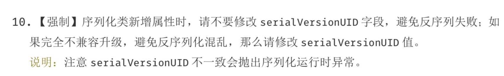
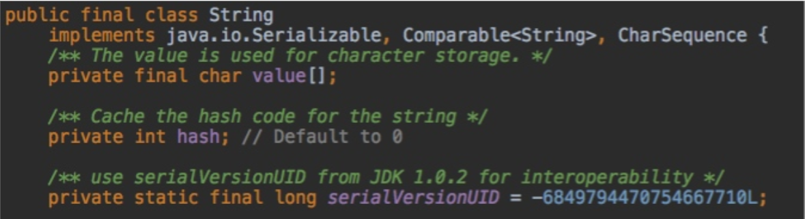
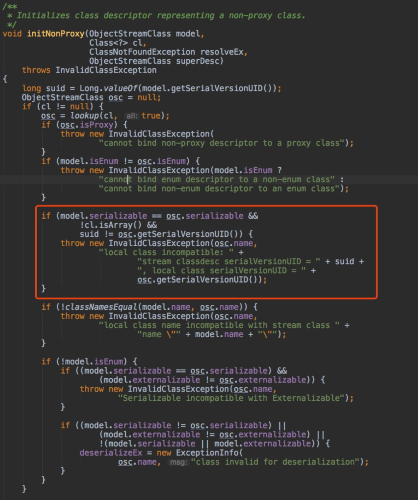
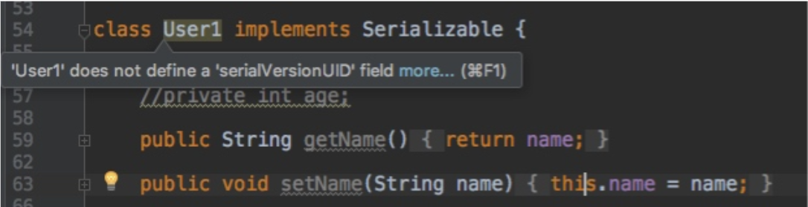
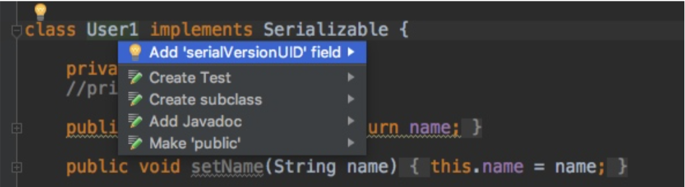
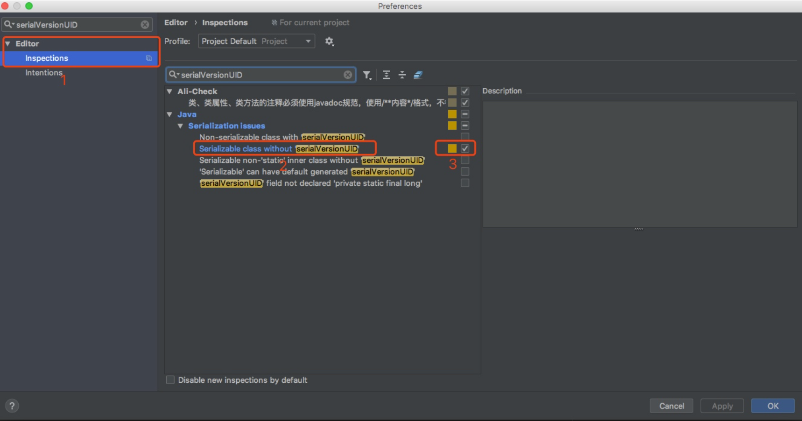
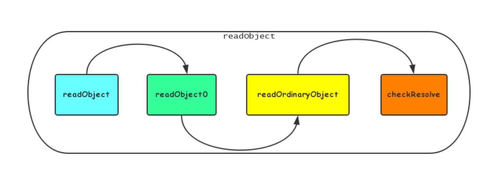
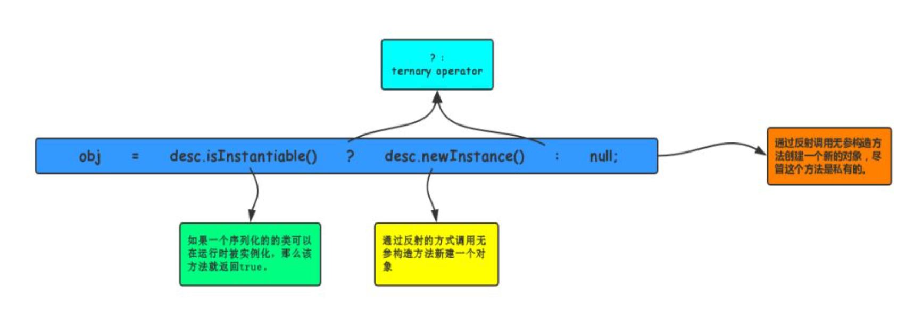

# 什么是序列化和反序列化

序列化是将对象转换为可传输格式的过程。 是一种数据的持久化手段。一般广泛应用于网络传输，RMI和RPC等场景中。（对象->可传输格式）

反序列化是序列化的逆操作。（可传输格式->对象）

序列化是将对象的状态信息转换为可存储或传输的形式的过程。一般是以字节码或XML格式传输。而字节码或XML编码格式可以还原为完全相等的对象。这个相反的过程称为反序列化。

# Java如何实现序列化和反序列化

## Java对象的序列化和反序列化

在真实的应用场景中，我们需要将这些对象持久化下来，并且能够在需要的时候把对象重新读取出来。Java的对象序列化可以帮助我们实现该功能。

对象序列化机制（object serialization）是Java语言内建的一种对象持久化方式，通过对象序列化，可以把对象的状态保存为字节数组，并且可以在有需要的时候将这个字节数组通过反序列化的方式再转换成对象。对象序列化可以很容易的在JVM中的活动对象和字节数组（流）之间进行转换。

在Java中，对象的序列化与反序列化被广泛应用到RMI(远程方法调用)及网络传输中。

## 相关接口及类

Java为了方便开发人员将Java对象进行序列化及反序列化提供了一套方便的API来支持。其中包括以下接口和类：

- java.io.Serializable
- java.io.Externalizable
- ObjectOutput
- ObjectInput
- ObjectOutputStream
- ObjectInputStream

## Serializable接口

类通过实现 java.io.Serializable 接口以启用其序列化功能。未实现此接口的类将无法使其任何状态序列化或反序列化。可序列化类的所有子类型本身都是可序列化的。序列化接口没有方法或字段，仅用于标识可序列化的语义

当试图对一个对象进行序列化的时候，如果遇到不支持 Serializable 接口的对象。在此情况下，将抛出 NotSerializableException。

**如果要序列化的类有父类，要想同时将在父类中定义过的变量持久化下来，那么父类也应该集成java.io.Serializable接口**。

下面是一个实现了java.io.Serializable接口的类

```java
package com.hollischaung.serialization.SerializableDemos;
import java.io.Serializable;
/**
 * Created by hollis on 16/2/17.
 * 实现Serializable接口
 */
public class User1 implements Serializable {

    private String name;
    private int age;

    public String getName() {
        return name;
    }

    public void setName(String name) {
        this.name = name;
    }

    public int getAge() {
        return age;
    }

    public void setAge(int age) {
        this.age = age;
    }

    @Override
    public String toString() {
        return "User{" +
                "name='" + name + '\'' +
                ", age=" + age +
                '}';
    }
}
```

通过下面的代码实现序列化和反序列化

```java
package com.hollischaung.serialization.SerializableDemos;

import org.apache.commons.io.FileUtils;
import org.apache.commons.io.IOUtils;

import java.io.*;
/**
 * Created by hollis on 16/2/17.
 * SerializableDemo1 结合SerializableDemo2说明 一个类要想被序列化必须实现Serializable接口
 */
public class SerializableDemo1 {

    public static void main(String[] args) {
        //Initializes The Object
        User1 user = new User1();
        user.setName("hollis");
        user.setAge(23);
        System.out.println(user);

        //Write Obj to File
        ObjectOutputStream oos = null;
        try {
            oos = new ObjectOutputStream(new FileOutputStream("tempFile"));
            oos.writeObject(user);
        } catch (IOException e) {
            e.printStackTrace();
        } finally {
            IOUtils.closeQuietly(oos);
        }

        //Read Obj from File
        File file = new File("tempFile");
        ObjectInputStream ois = null;
        try {
            ois = new ObjectInputStream(new FileInputStream(file));
            User1 newUser = (User1) ois.readObject();
            System.out.println(newUser);
        } catch (IOException e) {
            e.printStackTrace();
        } catch (ClassNotFoundException e) {
            e.printStackTrace();
        } finally {
            IOUtils.closeQuietly(ois);
            try {
                FileUtils.forceDelete(file);
            } catch (IOException e) {
                e.printStackTrace();
            }
        }

    }
}

//OutPut:
//User{name='hollis', age=23}
//User{name='hollis', age=23}
```

## Externalizable接口

除了Serializable 之外，java中还提供了另一个序列化接口Externalizable

为了了解Externalizable接口和Serializable接口的区别，先来看代码，我们把上面的代码改成使用Externalizable的形式。

```java
package com.hollischaung.serialization.ExternalizableDemos;

import java.io.Externalizable;
import java.io.IOException;
import java.io.ObjectInput;
import java.io.ObjectOutput;

/**
 * Created by hollis on 16/2/17.
 * 实现Externalizable接口
 */
public class User1 implements Externalizable {

    private String name;
    private int age;

    public String getName() {
        return name;
    }

    public void setName(String name) {
        this.name = name;
    }

    public int getAge() {
        return age;
    }

    public void setAge(int age) {
        this.age = age;
    }

    public void writeExternal(ObjectOutput out) throws IOException {

    }

    public void readExternal(ObjectInput in) throws IOException, ClassNotFoundException {

    }

    @Override
    public String toString() {
        return "User{" +
                "name='" + name + '\'' +
                ", age=" + age +
                '}';
    }
}
```

```java
package com.hollischaung.serialization.ExternalizableDemos;

import java.io.*;

/**
 * Created by hollis on 16/2/17.
 */
public class ExternalizableDemo1 {

    //为了便于理解和节省篇幅，忽略关闭流操作及删除文件操作。真正编码时千万不要忘记
    //IOException直接抛出
    public static void main(String[] args) throws IOException, ClassNotFoundException {
        //Write Obj to file
        ObjectOutputStream oos = new ObjectOutputStream(new FileOutputStream("tempFile"));
        User1 user = new User1();
        user.setName("hollis");
        user.setAge(23);
        oos.writeObject(user);
        //Read Obj from file
        File file = new File("tempFile");
        ObjectInputStream ois =  new ObjectInputStream(new FileInputStream(file));
        User1 newInstance = (User1) ois.readObject();
        //output
        System.out.println(newInstance);
    }
}
//OutPut:
//User{name='null', age=0}
```

通过上面的实例可以发现，对User1类进行序列化及反序列化之后得到的对象的所有属性的值都变成了默认值。也就是说，之前的那个对象的状态并没有被持久化下来。这就是Externalizable接口和Serializable接口的区别：

Externalizable继承了Serializable，该接口中定义了两个抽象方法：writeExternal()与readExternal()。

当使用Externalizable接口来进行序列化与反序列化的时候需要开发人员重写writeExternal()与readExternal()方法。

由于上面的代码中，并没有在这两个方法中定义序列化实现细节，所以输出的内容为空。

还有一点值得注意：在使用Externalizable进行序列化的时候，在读取对象时，会调用被序列化类的无参构造器去创建一个新的对象，然后再将被保存对象的字段的值分别填充到新对象中。所以，实现Externalizable接口的类必须要提供一个public的无参的构造器。

按照要求之后修改如下

```java
package com.hollischaung.serialization.ExternalizableDemos;

import java.io.Externalizable;
import java.io.IOException;
import java.io.ObjectInput;
import java.io.ObjectOutput;

/**
 * Created by hollis on 16/2/17.
 * 实现Externalizable接口,并实现writeExternal和readExternal方法
 */
public class User2 implements Externalizable {

    private String name;
    private int age;

    public String getName() {
        return name;
    }

    public void setName(String name) {
        this.name = name;
    }

    public int getAge() {
        return age;
    }

    public void setAge(int age) {
        this.age = age;
    }

    public void writeExternal(ObjectOutput out) throws IOException {
        out.writeObject(name);
        out.writeInt(age);
    }

    public void readExternal(ObjectInput in) throws IOException, ClassNotFoundException {
        name = (String) in.readObject();
        age = in.readInt();
    }

    @Override
    public String toString() {
        return "User{" +
                "name='" + name + '\'' +
                ", age=" + age +
                '}';
    }
}
```

```java
package com.hollischaung.serialization.ExternalizableDemos;

import java.io.*;

/**
 * Created by hollis on 16/2/17.
 */
public class ExternalizableDemo2 {

    //为了便于理解和节省篇幅，忽略关闭流操作及删除文件操作。真正编码时千万不要忘记
    //IOException直接抛出
    public static void main(String[] args) throws IOException, ClassNotFoundException {
        //Write Obj to file
        ObjectOutputStream oos = new ObjectOutputStream(new FileOutputStream("tempFile"));
        User2 user = new User2();
        user.setName("hollis");
        user.setAge(23);
        oos.writeObject(user);
        //Read Obj from file
        File file = new File("tempFile");
        ObjectInputStream ois =  new ObjectInputStream(new FileInputStream(file));
        User2 newInstance = (User2) ois.readObject();
        //output
        System.out.println(newInstance);
    }
}
//OutPut:
//User{name='hollis', age=23}
```

这次，就可以把之前的对象状态持久化下来了

如果User类中没有无参数的构造函数，在运行时会抛出异常：java.io.InvalidClassException

# Serializable 和 Externalizable 有何不同

Java中的类通过实现 java.io.Serializable 接口以启⽤其序列化功能。 未实现此接⼜的类将⽆法使其任何状态序列化或反序列化。

可序列化类的所有⼦类型本⾝都是可序列化的。

序列化接口没有⽅法或字段， 仅⽤于标识可序列化的语义。

当试图对⼀个对象进⾏序列化的时候， 如果遇到不⽀持Serializable 接口的对象。 在此情况下， 将抛NotSerializableException。

如果要序列化的类有⽗类， 要想同时将在⽗类中定义过的变量持久化下来， 那么⽗类也应该集成java.io.Serializable接口。

Externalizable继承了Serializable， 该接⼜中定义了两个抽象⽅法：writeExternal()与readExternal()。 当使⽤Externalizable接口来进⾏序列化与反序列化的时候需要开发⼈员重写writeExternal()与readExternal()⽅法。

如果没有在这两个⽅法中定义序列化实现细节， 那么序列化之后， 对象内容为空。

实现Externalizable接⼜的类必须要提供⼀个public的⽆参的构造器。

所以， 实现Externalizable， 并实现writeExternal()和readExternal()⽅法可以指定序列化哪些属性。

# 为什么序列化

## serialVersionUID

虚拟机是否允许反序列化， 不仅取决于类路径和功能代码是否⼀致， ⼀个⾮常重要的⼀点是两个类的序列化 ID 是否⼀致， 即**serialVersionUID要求⼀致**。

在进⾏反序列化时， JVM会把传来的字节流中的serialVersionUID与本地相应实体类的serialVersionUID进⾏⽐较， 如果相同就认为是⼀致的， 可以进⾏反序列化， 否则就会出现序列化版本不⼀致的异常， 即是InvalidCastException。

这样做是为了保证安全， 因为⽂件存储中的内容可能被篡改。

当实现java.io.Serializable接口的类没有显式地定义⼀个serialVersionUID变量时候， Java序列化机制会根据编译的Class⾃动⽣成⼀个serialVersionUID作序列化版本⽐较⽤， 这种情况下， 如果Class⽂件没有发⽣变化， 就算再编译多次， serialVersionUID也不会变化的。

但是， 如果发⽣了变化，那么这个⽂件对应的serialVersionUID也就会发⽣变化。

基于以上原理， 如果我们⼀个类实现了Serializable接口， 但是没有定义serialVersionUID， 然后序列化。 在序列化之后， 由于某些原因， 我们对该类做了变更， 重新启动应⽤后， 我们相对之前序列化过的对象进⾏反序列化的话就会报错

## 为什么serialVersionUID不能随便改

关于serialVersionUID 。这个字段到底有什么用？如果不设置会怎么样？为什么《阿里巴巴Java开发手册》中有以下规定：



### 背景知识

#### Serializable 和 Externalizable

类通过实现 java.io.Serializable 接口以启用其序列化功能。未实现此接口的类将无法进行序列化或反序列化。可序列化类的所有子类型本身都是可序列化的。

如果读者看过Serializable的源码，就会发现，他只是一个空的接口，里面什么东西都没有。Serializable接口没有方法或字段，仅用于标识可序列化的语义。但是，如果一个类没有实现这个接口，想要被序列化的话，就会抛出java.io.NotSerializableException异常。

它是怎么保证只有实现了该接口的方法才能进行序列化与反序列化的呢？

原因是在执行序列化的过程中，会执行到以下代码：

```java
if (obj instanceof String) {
    writeString((String) obj, unshared);
} else if (cl.isArray()) {
    writeArray(obj, desc, unshared);
} else if (obj instanceof Enum) {
    writeEnum((Enum<?>) obj, desc, unshared);
} else if (obj instanceof Serializable) {
    writeOrdinaryObject(obj, desc, unshared);
} else {
    if (extendedDebugInfo) {
        throw new NotSerializableException(
            cl.getName() + "\n" + debugInfoStack.toString());
    } else {
        throw new NotSerializableException(cl.getName());
    }
}
```

在进行序列化操作时，会判断要被序列化的类是否是Enum、Array和Serializable类型，如果都不是则直接抛出NotSerializableException。

Java中还提供了Externalizable接口，也可以实现它来提供序列化能力。

Externalizable继承自Serializable，该接口中定义了两个抽象方法：writeExternal()与readExternal()。

当使用Externalizable接口来进行序列化与反序列化的时候需要开发人员重写writeExternal()与readExternal()方法。否则所有变量的值都会变成默认值。

#### transient

transient 关键字的作用是控制变量的序列化，<font color="tomato">在变量声明前加上该关键字，可以阻止该变量被序列化到文件中</font>，在被反序列化后，transient 变量的值被设为初始值，如 int 型的是 0，对象型的是 null。

#### 自定义序列化策略

在序列化过程中，如果被序列化的类中定义了writeObject 和 readObject 方法，虚拟机会试图调用对象类里的 writeObject 和 readObject 方法，进行用户自定义的序列化和反序列化。

<font color="tomato">如果没有这样的方法，则默认调用是 ObjectOutputStream 的 defaultWriteObject 方法以及 ObjectInputStream 的 defaultReadObject 方法</font>。

用户自定义的 writeObject 和 readObject 方法可以允许用户控制序列化的过程，比如可以在序列化的过程中动态改变序列化的数值。

所以，对于一些特殊字段需要定义序列化的策略的时候，可以考虑使用transient修饰，并自己重写writeObject 和 readObject 方法，如java.util.ArrayList中就有这样的实现。

我们随便找几个Java中实现了序列化接口的类，如String、Integer等，我们可以发现一个细节，那就是这些类除了实现了Serializable外，还定义了一个serialVersionUID



### 什么是serialVersionUID

序列化是将对象的状态信息转换为可存储或传输的形式的过程。我们都知道，Java对象是保存在JVM的堆内存中的，也就是说，如果JVM堆不存在了，那么对象也就跟着消失了。

而序列化提供了一种方案，可以让你在即使JVM停机的情况下也能把对象保存下来的方案。就像我们平时用的U盘一样。把Java对象序列化成可存储或传输的形式（如二进制流），比如保存在文件中。这样，当再次需要这个对象的时候，从文件中读取出二进制流，再从二进制流中反序列化出对象。

虚拟机是否允许反序列化，不仅取决于类路径和功能代码是否一致，一个非常重要的一点是两个类的**序列化 ID 是否一致**，这个所谓的序列化ID，就是我们在代码中定义的serialVersionUID。

### 如果serialVersionUID变了会怎样

我们举个例子吧，看看如果serialVersionUID被修改了会发生什么？

```java
public class SerializableDemo1 {
    public static void main(String[] args) {
        //Initializes The Object
        User1 user = new User1();
        user.setName("hollis");
        //Write Obj to File
        ObjectOutputStream oos = null;
        try {
            oos = new ObjectOutputStream(new FileOutputStream("tempFile"));
            oos.writeObject(user);
        } catch (IOException e) {
            e.printStackTrace();
        } finally {
            IOUtils.closeQuietly(oos);
        }
    }
}

class User1 implements Serializable {
    private static final long serialVersionUID = 1L;
    private String name;
    public String getName() {
        return name;
    }
    public void setName(String name) {
        this.name = name;
    }
}
```

我们先执行以上代码，把一个User1对象写入到文件中。然后我们修改一下User1类，把serialVersionUID的值改为2L。

```java
class User1 implements Serializable {
    private static final long serialVersionUID = 2L;
    private String name;
    public String getName() {
        return name;
    }
    public void setName(String name) {
        this.name = name;
    }
}
```

我们先执行以上代码，把一个User1对象写入到文件中。然后我们修改一下User1类，把serialVersionUID的值改为2L。

```java
class User1 implements Serializable {
    private static final long serialVersionUID = 2L;
    private String name;
    public String getName() {
        return name;
    }
    public void setName(String name) {
        this.name = name;
    }
}
```

然后执行以下代码，把文件中的对象反序列化出来：

```java
public class SerializableDemo2 {
    public static void main(String[] args) {
        //Read Obj from File
        File file = new File("tempFile");
        ObjectInputStream ois = null;
        try {
            ois = new ObjectInputStream(new FileInputStream(file));
            User1 newUser = (User1) ois.readObject();
            System.out.println(newUser);
        } catch (IOException e) {
            e.printStackTrace();
        } catch (ClassNotFoundException e) {
            e.printStackTrace();
        } finally {
            IOUtils.closeQuietly(ois);
            try {
                FileUtils.forceDelete(file);
            } catch (IOException e) {
                e.printStackTrace();
            }
        }
    }
}
```

执行结果如下

```java
java.io.InvalidClassException: com.hollis.User1; local class incompatible: stream classdesc serialVersionUID = 1, local class serialVersionUID = 2
```

可以发现，以上代码抛出了一个java.io.InvalidClassException，并且指出serialVersionUID不一致。

这是因为，在进行反序列化时，JVM会把传来的字节流中的serialVersionUID与本地相应实体类的serialVersionUID进行比较，如果相同就认为是一致的，可以进行反序列化，否则就会出现序列化版本不一致的异常，即是InvalidCastException。

这也是《阿里巴巴Java开发手册》中规定，在兼容性升级中，在修改类的时候，不要修改serialVersionUID的原因。除非是完全不兼容的两个版本。所以，**serialVersionUID其实是验证版本一致性的。**

如果读者感兴趣，可以把各个版本的JDK代码都拿出来看一下，那些向下兼容的类的serialVersionUID是没有变化过的。比如String类的serialVersionUID一直都是-6849794470754667710L。

但是，作者认为，这个规范其实还可以再严格一些，那就是规定：

如果一个类实现了Serializable接口，就必须手动添加一个private static final long serialVersionUID变量，并且设置初始值。

### 为什么要明确定一个serialVersionUID

上面已经说明了

### 背后原理

知其然，要知其所以然，我们再来看看源码，分析一下为什么serialVersionUID改变的时候会抛异常？在没有明确定义的情况下，默认的serialVersionUID是怎么来的？

为了简化代码量，反序列化的调用链如下：

```java
ObjectInputStream.readObject -> readObject0 -> readOrdinaryObject -> readClassDesc -> readNonProxyDesc -> ObjectStreamClass.initNonProxy
```

在initNonProxy中 ，关键代码如下：



在反序列化过程中，对serialVersionUID做了比较，如果发现不相等，则直接抛出异常。

深入看一下getSerialVersionUID方法：

```java
public long getSerialVersionUID() {
    // REMIND: synchronize instead of relying on volatile?
    if (suid == null) {
        suid = AccessController.doPrivileged(
            new PrivilegedAction<Long>() {
                public Long run() {
                    return computeDefaultSUID(cl)
                }
            }
        );
    }
    return suid.longValue();
}
```

在没有定义serialVersionUID的时候，会调用computeDefaultSUID 方法，生成一个默认的serialVersionUID。

这也就找到了以上两个问题的根源，其实是代码中做了严格的校验。

### IDEA提示

为了确保我们不会忘记定义serialVersionUID，可以调节一下Intellij IDEA的配置，在实现Serializable接口后，如果没定义serialVersionUID的话，IDEA（eclipse一样）会进行提示：



并且可以一键生成一个：



当然，这个配置并不是默认生效的，需要手动到IDEA中设置一下：



### 总结

serialVersionUID是用来验证版本一致性的。所以在做兼容性升级的时候，不要改变类中serialVersionUID的值。

如果一个类实现了Serializable接口，一定要记得定义serialVersionUID，否则会发生异常。可以在IDE中通过设置，让他帮忙提示，并且可以一键快速生成一个serialVersionUID。

之所以会发生异常，是因为反序列化过程中做了校验，并且如果没有明确定义的话，会根据类的属性自动生成一个。

## transient

在关于java的集合类的学习中，我们发现ArrayList类和Vector类都是使用数组实现的，但是在定义数组elementData这个属性时稍有不同，那就是ArrayList使用transient关键字

```java
private transient Object[] elementData;

protected Object[] elementData;
```

那么，首先我们来看一下transient关键字的作用是什么。

简单点说，就是被transient修饰的成员变量，在序列化的时候其值会被忽略，在被反序列化后， transient 变量的值被设为初始值， 如 int 型的是 0，对象型的是 null。

## 序列化底层原理

序列化是一种对象持久化的手段。普遍应用在网络传输、RMI等场景中。本文通过分析ArrayList的序列化来介绍Java序列化的相关内容。主要涉及到以下几个问题：

- 怎么实现Java的序列化
- 为什么实现了java.io.Serializable接口才能被序列化
- transient的作用是什么
- 怎么自定义序列化策略
- 自定义的序列化策略是如何被调用的
- ArrayList对序列化的实现有什么好处

### Java对象的序列化

使用Java对象序列化，在保存对象时，会把其状态保存为一组字节，在未来，再将这些字节组装成对象。必须注意地是，对象序列化保存的是对象的"状态"，即它的成员变量。由此可知，对象序列化不会关注类中的静态变量。

除了在持久化对象时会用到对象序列化之外，当使用RMI(远程方法调用)，或在网络中传递对象时，都会用到对象序列化。Java序列化API为处理对象序列化提供了一个标准机制，该API简单易用。

### 如何对Java对象进行序列化与反序列化

在Java中，只要一个类实现了java.io.Serializable接口，那么它就可以被序列化

code 1 创建一个User类，用于序列化及反序列化

```java
package com.hollis;
import java.io.Serializable;
import java.util.Date;

/**
 * Created by hollis on 16/2/2.
 */
public class User implements Serializable{
    private String name;
    private int age;
    private Date birthday;
    private transient String gender;
    private static final long serialVersionUID = -6849794470754667710L;

    public String getName() {
        return name;
    }

    public void setName(String name) {
        this.name = name;
    }

    public int getAge() {
        return age;
    }

    public void setAge(int age) {
        this.age = age;
    }

    public Date getBirthday() {
        return birthday;
    }

    public void setBirthday(Date birthday) {
        this.birthday = birthday;
    }

    public String getGender() {
        return gender;
    }

    public void setGender(String gender) {
        this.gender = gender;
    }

    @Override
    public String toString() {
        return "User{" +
                "name='" + name + '\'' +
                ", age=" + age +
                ", gender=" + gender +
                ", birthday=" + birthday +
                '}';
    }
}
```

code 2 对User进行序列化及反序列化的Demo

```java
package com.hollis;
import org.apache.commons.io.FileUtils;
import org.apache.commons.io.IOUtils;
import java.io.*;
import java.util.Date;

/**
 * Created by hollis on 16/2/2.
 */
public class SerializableDemo {

    public static void main(String[] args) {
        //Initializes The Object
        User user = new User();
        user.setName("hollis");
        user.setGender("male");
        user.setAge(23);
        user.setBirthday(new Date());
        System.out.println(user);

        //Write Obj to File
        ObjectOutputStream oos = null;
        try {
            oos = new ObjectOutputStream(new FileOutputStream("tempFile"));
            oos.writeObject(user);
        } catch (IOException e) {
            e.printStackTrace();
        } finally {
            IOUtils.closeQuietly(oos);
        }

        //Read Obj from File
        File file = new File("tempFile");
        ObjectInputStream ois = null;
        try {
            ois = new ObjectInputStream(new FileInputStream(file));
            User newUser = (User) ois.readObject();
            System.out.println(newUser);
        } catch (IOException e) {
            e.printStackTrace();
        } catch (ClassNotFoundException e) {
            e.printStackTrace();
        } finally {
            IOUtils.closeQuietly(ois);
            try {
                FileUtils.forceDelete(file);
            } catch (IOException e) {
                e.printStackTrace();
            }
        }

    }
}
//output 
//User{name='hollis', age=23, gender=male, birthday=Tue Feb 02 17:37:38 CST 2016}
//User{name='hollis', age=23, gender=null, birthday=Tue Feb 02 17:37:38 CST 2016}
```

### 序列化及反序列化相关知识

- 1、在Java中，只要一个类实现了java.io.Serializable接口，那么它就可以被序列化。
- 2、通过ObjectOutputStream和ObjectInputStream对对象进行序列化及反序列化
- 3、虚拟机是否允许反序列化，不仅取决于类路径和功能代码是否一致，一个非常重要的一点是两个类的序列化 ID 是否一致（就是 private static final long serialVersionUID）
- 4、序列化并不保存静态变量。
- 5、要想将父类对象也序列化，就需要让父类也实现Serializable 接口。
- 6、transient 关键字的作用是控制变量的序列化，在变量声明前加上该关键字，可以阻止该变量被序列化到文件中，在被反序列化后，transient 变量的值被设为初始值，如 int 型的是 0，对象型的是 null。
- 7、服务器端给客户端发送序列化对象数据，对象中有一些数据是敏感的，比如密码字符串等，希望对该密码字段在序列化时，进行加密，而客户端如果拥有解密的密钥，只有在客户端进行反序列化时，才可以对密码进行读取，这样可以一定程度保证序列化对象的数据安全。

### ArrayList的序列化

在介绍ArrayList序列化之前，先来考虑一个问题：如何自定义的序列化和反序列化策略

带着这个问题，我们来看java.util.ArrayList的源码

```java
public class ArrayList<E> extends AbstractList<E>
        implements List<E>, RandomAccess, Cloneable, java.io.Serializable
{
    private static final long serialVersionUID = 8683452581122892189L;
    transient Object[] elementData; // non-private to simplify nested class access
    private int size;
}
```

从上面的代码中可以知道ArrayList实现了java.io.Serializable接口，那么我们就可以对它进行序列化及反序列化。因为elementData是transient的，所以我们认为这个成员变量不会被序列化而保留下来。我们写一个Demo，验证一下我们的想法：

```java
public static void main(String[] args) throws IOException, ClassNotFoundException {
    List<String> stringList = new ArrayList<String>();
    stringList.add("hello");
    stringList.add("world");
    stringList.add("hollis");
    stringList.add("chuang");
    System.out.println("init StringList" + stringList);
    ObjectOutputStream objectOutputStream = new ObjectOutputStream(new FileOutputStream("stringlist"));
    objectOutputStream.writeObject(stringList);

    IOUtils.close(objectOutputStream);
    File file = new File("stringlist");
    ObjectInputStream objectInputStream = new ObjectInputStream(new FileInputStream(file));
    List<String> newStringList = (List<String>)objectInputStream.readObject();
    IOUtils.close(objectInputStream);
    if(file.exists()){
        file.delete();
    }
    System.out.println("new StringList" + newStringList);
}
//init StringList[hello, world, hollis, chuang]
//new StringList[hello, world, hollis, chuang]
```

了解ArrayList的人都知道，ArrayList底层是通过数组实现的。那么数组elementData其实就是用来保存列表中的元素的。通过该属性的声明方式我们知道，他是无法通过序列化持久化下来的。那么为什么code 4的结果却通过序列化和反序列化把List中的元素保留下来了呢？


#### writeObject和readObject方法

在ArrayList中定义了两个方法： writeObject和readObject。

在序列化过程中，如果被序列化的类中定义了writeObject 和 readObject 方法，虚拟机会试图调用对象类里的 writeObject 和 readObject 方法，进行用户自定义的序列化和反序列化。

如果没有这样的方法，则默认调用是 ObjectOutputStream 的 defaultWriteObject 方法以及 ObjectInputStream 的 defaultReadObject 方法。

用户自定义的 writeObject 和 readObject 方法可以允许用户控制序列化的过程，比如可以在序列化的过程中动态改变序列化的数值。

来看一下这两个方法的具体实现：

readObject

```java
private void readObject(java.io.ObjectInputStream s)
    throws java.io.IOException, ClassNotFoundException {
    elementData = EMPTY_ELEMENTDATA;

    // Read in size, and any hidden stuff
    s.defaultReadObject();

    // Read in capacity
    s.readInt(); // ignored

    if (size > 0) {
        // be like clone(), allocate array based upon size not capacity
        ensureCapacityInternal(size);

        Object[] a = elementData;
        // Read in all elements in the proper order.
        for (int i=0; i<size; i++) {
            a[i] = s.readObject();
        }
    }
}
```

writeObject

```java
private void writeObject(java.io.ObjectOutputStream s)
    throws java.io.IOException{
    // Write out element count, and any hidden stuff
    int expectedModCount = modCount;
    s.defaultWriteObject();

    // Write out size as capacity for behavioural compatibility with clone()
    s.writeInt(size);

    // Write out all elements in the proper order.
    for (int i=0; i<size; i++) {
        s.writeObject(elementData[i]);
    }

    if (modCount != expectedModCount) {
        throw new ConcurrentModificationException();
    }
}
```

#### why transient

ArrayList实际上是动态数组，每次在放满以后自动增长设定的长度值，如果数组自动增长长度设为100，而实际只放了一个元素，那就会序列化99个null元素。为了保证在序列化的时候不会将这么多null同时进行序列化，ArrayList把元素数组设置为transient。

#### why writeObject and readObject

前面说过，为了防止一个包含大量空对象的数组被序列化，为了优化存储，所以，ArrayList使用transient来声明elementData。 但是，作为一个集合，在序列化过程中还必须保证其中的元素可以被持久化下来，所以，通过重写writeObject 和 readObject方法的方式把其中的元素保留下来。

writeObject方法把elementData数组中的元素遍历的保存到输出流（ObjectOutputStream）中。

readObject方法从输入流（ObjectInputStream）中读出对象并保存赋值到elementData数组中。

至此，我们先试着来回答刚刚提出的问题：如何自定义的序列化和反序列化策略

答：可以通过在被序列化的类中增加writeObject 和 readObject方法。

那么问题又来了：虽然ArrayList中写了writeObject 和 readObject 方法，但是这两个方法并没有显示的被调用啊。那么如果一个类中包含writeObject 和 readObject 方法，那么这两个方法是怎么被调用的呢?

#### ObjectOutputStream

从code 4中，我们可以看出，对象的序列化过程通过ObjectOutputStream和ObjectInputputStream来实现的，那么带着刚刚的问题，我们来分析一下ArrayList中的writeObject 和 readObject 方法到底是如何被调用的呢？

这里给出ObjectOutputStream的writeObject的调用栈：

```java
writeObject ---> writeObject0 --->writeOrdinaryObject--->writeSerialData--->invokeWriteObject
```

这里看一下invokeWriteObject：

```java
void invokeWriteObject(Object obj, ObjectOutputStream out) throws IOException, UnsupportedOperationException
{
    if (writeObjectMethod != null) {
        try {
            writeObjectMethod.invoke(obj, new Object[]{ out });
        } catch (InvocationTargetException ex) {
            Throwable th = ex.getTargetException();
            if (th instanceof IOException) {
                throw (IOException) th;
            } else {
                throwMiscException(th);
            }
        } catch (IllegalAccessException ex) {
            // should not occur, as access checks have been suppressed
            throw new InternalError(ex);
        }
    } else {
        throw new UnsupportedOperationException();
    }
}
```

如果一个类中包含writeObject 和 readObject 方法，那么这两个方法是怎么被调用的?

<font color="tomato">在使用ObjectOutputStream的writeObject方法和ObjectInputStream的readObject方法时，会通过反射的方式调用</font>。

Serializable明明就是一个空的接口，它是怎么保证只有实现了该接口的方法才能进行序列化与反序列化的呢？

其中`writeObjectMethod.invoke(obj, new Object[]{ out });`是关键，通过反射的方式调用writeObjectMethod方法。官方是这么解释这个writeObjectMethod的：class-defined writeObject method, or null if none

在我们的例子中，**这个方法就是我们在ArrayList中定义的writeObject方法。通过反射的方式被调用了**。

如果一个类中包含writeObject 和 readObject 方法，那么这两个方法是怎么被调用的?

在使用ObjectOutputStream的writeObject方法和ObjectInputStream的readObject方法时，会通过反射的方式调用。

Serializable明明就是一个空的接口，它是怎么保证只有实现了该接口的方法才能进行序列化与反序列化的呢？

Serializable接口的定义：

```java
public interface Serializable {
}
```

解释

writeObject0方法中有这么一段代码

```java
if (obj instanceof String) {
    writeString((String) obj, unshared);
} else if (cl.isArray()) {
    writeArray(obj, desc, unshared);
} else if (obj instanceof Enum) {
    writeEnum((Enum<?>) obj, desc, unshared);
} else if (obj instanceof Serializable) {
    writeOrdinaryObject(obj, desc, unshared);
} else {
    if (extendedDebugInfo) {
        throw new NotSerializableException(
            cl.getName() + "\n" + debugInfoStack.toString());
    } else {
        throw new NotSerializableException(cl.getName());
    }
}
```

### 总结

- 1、如果一个类想被序列化，需要实现Serializable接口。否则将抛出NotSerializableException异常，这是因为，在序列化操作过程中会对类型进行检查，要求被序列化的类必须属于Enum、Array和Serializable类型其中的任何一种。
- 2、在变量声明前加上该关键字，可以阻止该变量被序列化到文件中。
- 3、在类中增加writeObject 和 readObject 方法可以实现自定义序列化策略

## 序列化如何破坏单例模式

单例模式真的能够实现实例的唯一性吗？

答案是否定的，很多人都知道使用反射可以破坏单例模式，除了反射以外，使用序列化与反序列化也同样会破坏单例。

### 序列化对单例的破坏

通过对Singleton的序列化与反序列化得到的对象是一个新的对象，这就破坏了Singleton的单例性。

### ObjectInputStream

ObjectInputStream的readObject的调用栈：



readOrdinaryObject方法的代码片段

```java
private Object readOrdinaryObject(boolean unshared)
    throws IOException
{
    //此处省略部分代码

    Object obj;
    try {
        obj = desc.isInstantiable() ? desc.newInstance() : null;
    } catch (Exception ex) {
        throw (IOException) new InvalidClassException(
            desc.forClass().getName(),
            "unable to create instance").initCause(ex);
    }

    //此处省略部分代码

    if (obj != null &&
        handles.lookupException(passHandle) == null &&
        desc.hasReadResolveMethod())
    {
        Object rep = desc.invokeReadResolve(obj);
        if (unshared && rep.getClass().isArray()) {
            rep = cloneArray(rep);
        }
        if (rep != obj) {
            handles.setObject(passHandle, obj = rep);
        }
    }

    return obj;
}
```

先分析第一部分：

```java
Object obj;
try {
    obj = desc.isInstantiable() ? desc.newInstance() : null;
} catch (Exception ex) {
    throw (IOException) new InvalidClassException(desc.forClass().getName(),"unable to create instance").initCause(ex);
}
```

这里创建的这个obj对象，就是本方法要返回的对象，也可以暂时理解为是ObjectInputStream的readObject返回的对象。



isInstantiable：如果一个serializable/externalizable的类可以在运行时被实例化，那么该方法就返回true。

desc.newInstance：该方法通过反射的方式调用无参构造方法新建一个对象。

序列化会通过反射调用无参数的构造方法创建一个新的对象。序列化可以破坏单例

### 防止序列化破坏单例模式

只要在Singleton类中定义readResolve就可以解决该问题：

```java
package com.hollis;
import java.io.Serializable;
/**
 * Created by hollis on 16/2/5.
 * 使用双重校验锁方式实现单例
 */
public class Singleton implements Serializable{
    private volatile static Singleton singleton;
    private Singleton (){}
    public static Singleton getSingleton() {
        if (singleton == null) {
            synchronized (Singleton.class) {
                if (singleton == null) {
                    singleton = new Singleton();
                }
            }
        }
        return singleton;
    }

    private Object readResolve() {
        return singleton;
    }
}
```

分析上面说到的第二段代码

```java
if (obj != null && handles.lookupException(passHandle) == null && desc.hasReadResolveMethod())
{
    Object rep = desc.invokeReadResolve(obj);
    if (unshared && rep.getClass().isArray()) {
        rep = cloneArray(rep);
    }
    if (rep != obj) {
        handles.setObject(passHandle, obj = rep);
    }
}
```

分析

hasReadResolveMethod:如果实现了serializable 或者 externalizable接口的类中包含readResolve则返回true

invokeReadResolve:**通过反射的方式调用要被反序列化的类的readResolve方法**。

所以，原理也就清楚了，<font color="tomato">主要在Singleton中定义readResolve方法，并在该方法中指定要返回的对象的生成策略，就可以防止单例被破坏</font>。

## protobuf

Protocol Buffer (简称Protobuf) 是Google出品的性能优异、跨语言、跨平台的序列化库。

2001年初，Protobuf首先在Google内部创建， 我们把它称之为 proto1，一直以来在Google的内部使用，其中也不断的演化，根据使用者的需求也添加很多新的功能，一些内部库依赖它。几乎每个Google的开发者都会使用到它。

Google开始开源它的内部项目时，因为依赖的关系，所以他们决定首先把Protobuf开源出去。
目前Protobuf的稳定版本是3.9.2，于2019年9月23日发布。由于很多公司很早的就采用了Protobuf，所以很多项目还在使用proto2协议，目前是proto2和proto3同时在使用的状态。

## Apache-Commons-Collections的反序列化漏洞

## fastjson的反序列化漏洞