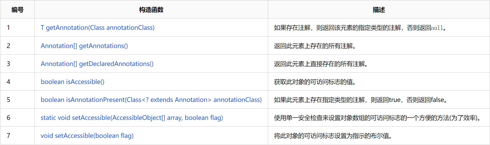
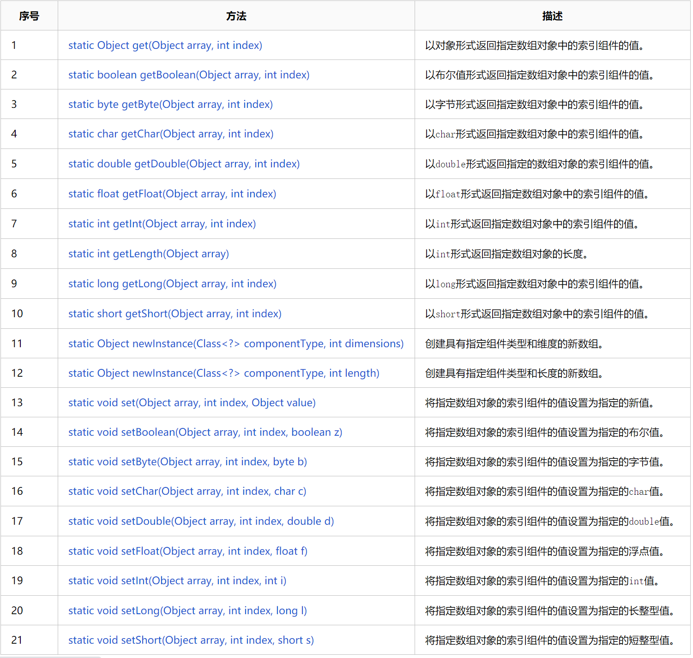
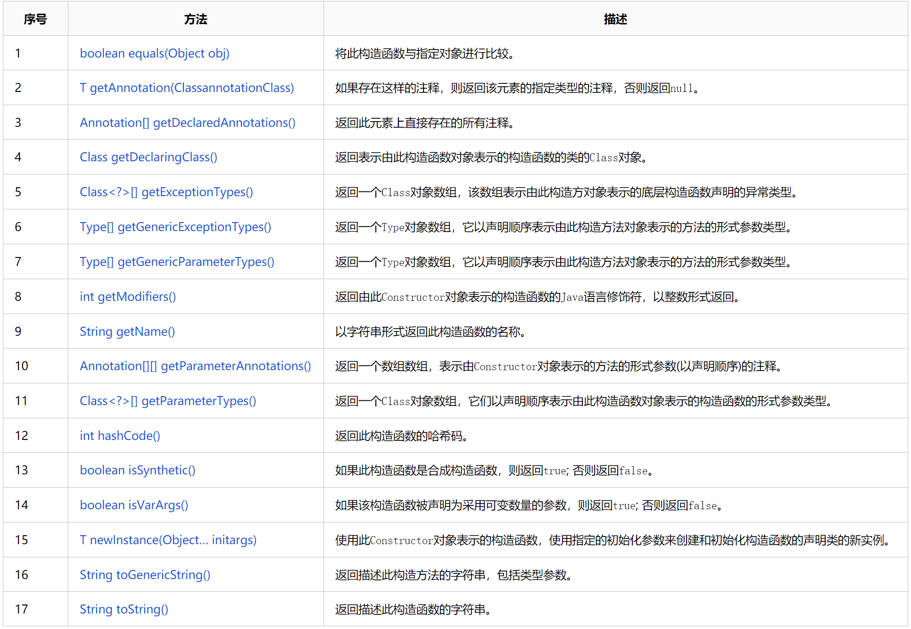
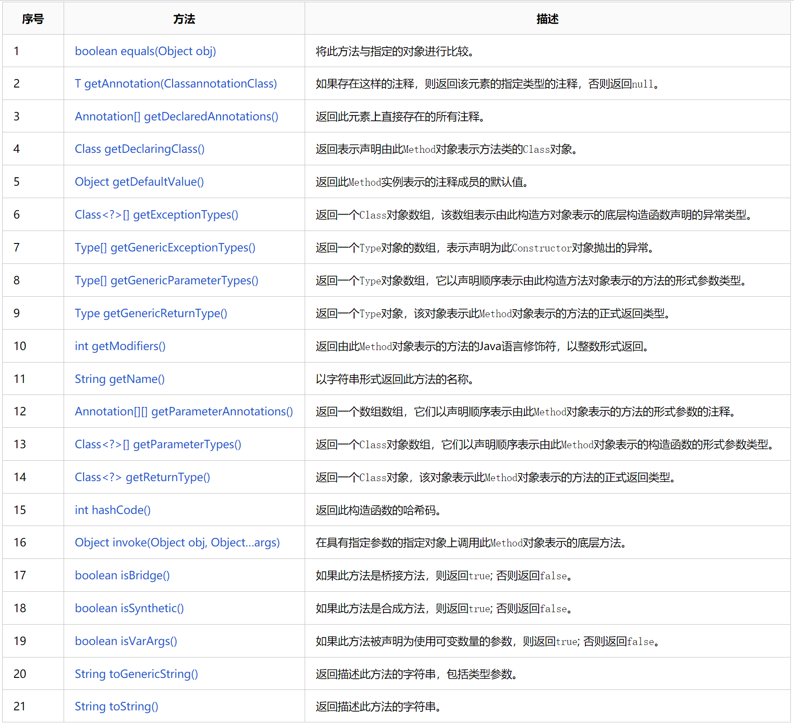
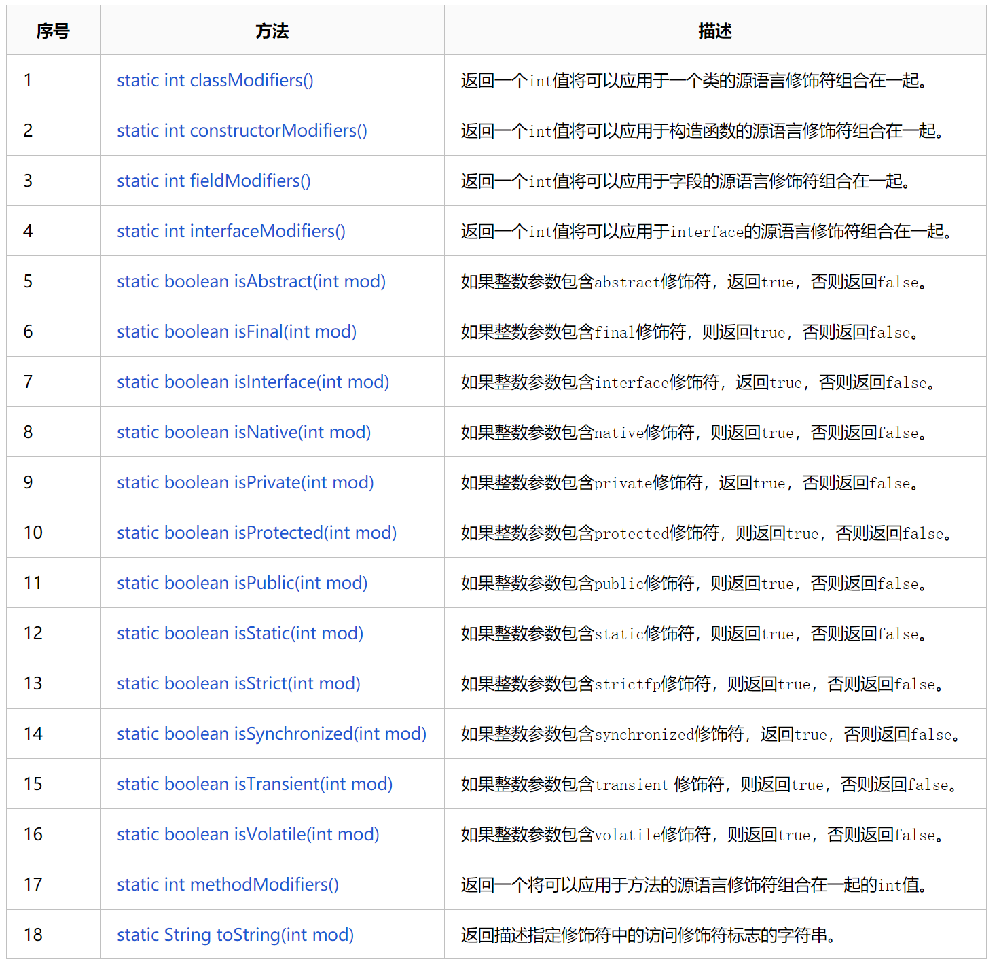
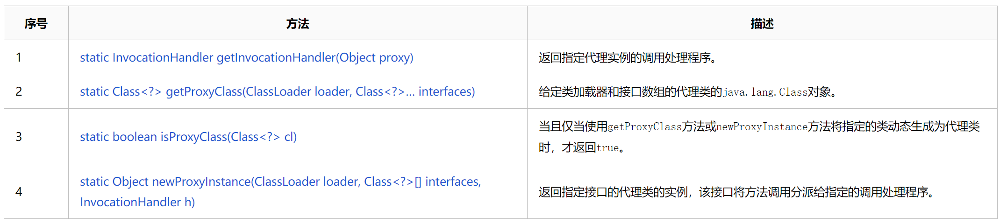

# 反射

反射机制指的是程序在运行时能够获取自身的信息。在java中，只要给定类的名字，那么就可以通过反射机制来获得类的所有属性和方法。

# 反射有什么作用

- 在运行时判断任意一个对象所属的类。（获得到的是一个对象，在堆中开辟了空间）
- 在运行时判断任意一个类所具有的成员变量和方法。
- 在运行时任意调用一个对象的方法
- 在运行时构造任意一个类的对象

# Class类

Java的Class类是java反射机制的基础,通过Class类我们可以获得关于一个类的相关信息

Java.lang.Class是一个比较特殊的类，它用于封装被装入到JVM中的类（包括类和接口）的信息。当一个类或接口被装入的JVM时便会产生一个与之关联的java.lang.Class对象，可以通过这个Class对象对被装入类的详细信息进行访问。

<font color="red">虚拟机为每种类型管理一个独一无二的Class对象。也就是说，每个类（型）都有一个Class对象。运行程序时，Java虚拟机(JVM)首先检查是否所要加载的类对应的Class对象是否已经加载。如果没有加载，JVM就会根据类名查找.class文件，并将其Class对象载入。</font>

# 反射与工厂模式实现Spring IOC

## 反射机制概念

我们考虑一个场景，如果我们在程序运行时，一个对象想要检视自己所拥有的成员属性，该如何操作？再考虑另一个场景，如果我们想要在运行期获得某个类的Class信息如它的属性、构造方法、一般方法后再考虑是否创建它的对象，这种情况该怎么办呢？这就需要用到反射！

我们.java文件在编译后会变成.class文件，这就像是个镜面，本身是.java，在镜中是.class，他们其实是一样的；那么同理，我们看到镜子的反射是.class，就能通过**反编译**，了解到.java文件的本来面目。

对于反射，官方给出的概念：反射是Java语言的一个特性，它允许程序在运行时（注意不是编译的时候）来进行自我检查并且对内部的成员进行操作。例如它允许一个Java类获取它所有的成员变量和方法并且显示出来。

反射主要是指程序可以访问，检测和修改它本身状态或行为的一种能力，并能根据自身行为的状态和结果，调整或修改应用所描述行为的状态和相关的语义。在Java中，只要给定类的名字，那么就可以通过反射机制来获得类的所有信息。

反射是Java中一种强大的工具，能够使我们很方便的创建灵活的代码，这些代码可以再运行时装配，无需在组件之间进行源代码链接。但是反射使用不当会成本很高！类中有什么信息，利用反射机制就能可以获得什么信息，不过前提是得知道类的名字。

## 反射机制的作用

1、在运行时判断任意一个对象所属的类；
2、在运行时获取类的对象；
3、在运行时访问java对象的属性，方法，构造方法等。

首先要搞清楚为什么要用反射机制？直接创建对象不就可以了吗，这就涉及到了动态与静态的概念。

- 静态编译：在<font color="Tomato">编译时</font>确定类型，绑定对象，即通过。
- 动态编译：<font color="Tomato">运行时</font>确定类型，绑定对象。动态编译最大限度发挥了Java的灵活性，体现了多态的应用，有以降低类之间的藕合性。

## 反射机制的优缺点

反射机制的优点：可以实现动态创建对象和编译，体现出很大的灵活性（特别是在J2EE的开发中它的灵活性就表现的十分明显）。通过反射机制我们可以获得类的各种内容，进行反编译。对于JAVA这种先编译再运行的语言来说，反射机制可以使代码更加灵活，更加容易实现面向对象。

比如，一个大型的软件，不可能一次就把把它设计得很完美，把这个程序编译后，发布了，当发现需要更新某些功能时，我们不可能要用户把以前的卸载，再重新安装新的版本，假如这样的话，这个软件肯定是没有多少人用的。采用静态的话，需要把整个程序重新编译一次才可以实现功能的更新，而采用反射机制的话，它就可以不用卸载，只需要在运行时动态地创建和编译，就可以实现该功能。

反射机制的缺点：对性能有影响。使用反射基本上是一种解释操作，我们可以告诉JVM，我们希望做什么并且让它满足我们的要求。这类操作<font color="tomato">总是慢于</font>直接执行相同的操作。

## 反射与工厂模式实现IOC

Spring中的IoC的实现原理就是工厂模式加反射机制。 我们首先看一下不用反射机制时的工厂模式：

```java
interface fruit{
    public abstract void eat();
} 
class Apple implements fruit{
     public void eat(){
         System.out.println("Apple");
     }
} 
class Orange implements fruit{
     public void eat(){
         System.out.println("Orange");
     }
}
//构造工厂类
//也就是说以后如果我们在添加其他的实例的时候只需要修改工厂类就行了
class Factory{
     public static fruit getInstance(String fruitName){
         fruit f=null;
         if("Apple".equals(fruitName)){
             f=new Apple();
         }
         if("Orange".equals(fruitName)){
             f=new Orange();
         }
         return f;
     }
}
class hello{
     public static void main(String[] a){
         fruit f=Factory.getInstance("Orange");
         f.eat();
     }
}
```

上面写法的缺点是当我们再添加一个子类的时候，就需要修改工厂类了。如果我们添加太多的子类的时候，改动就会很多。下面用反射机制实现工厂模式：

```java
interface fruit{
     public abstract void eat();
}
class Apple implements fruit{
public void eat(){
         System.out.println("Apple");
     }
}
class Orange implements fruit{
public void eat(){
        System.out.println("Orange");
    }
}
class Factory{
    public static fruit getInstance(String ClassName){
        fruit f=null;
        try{
            f=(fruit)Class.forName(ClassName).newInstance();
        }catch (Exception e) {
            e.printStackTrace();
        }
        return f;
    }
}
class hello{
    public static void main(String[] a){
        fruit f=Factory.getInstance("Reflect.Apple");
        if(f!=null){
            f.eat();
        }
    }
}
```

现在就算我们添加任意多个子类的时候，工厂类都不需要修改。使用反射机制实现的工厂模式可以通过反射取得接口的实例，但是需要传入完整的包和类名。而且用户也无法知道一个接口有多少个可以使用的子类，所以我们通过属性文件的形式配置所需要的子类。

下面编写使用反射机制并结合属性文件的工厂模式（即IoC）。首先创建一个fruit.properties的资源文件：

```java
apple=Reflect.Apple
orange=Reflect.Orange
```

然后编写主类代码：

```java
interface fruit{
    public abstract void eat();
}
class Apple implements fruit{
    public void eat(){
        System.out.println("Apple");
    }
}
class Orange implements fruit{
    public void eat(){
        System.out.println("Orange");
    }
}
//操作属性文件类
class init{
    public static Properties getPro() throws FileNotFoundException, IOException{
        Properties pro=new Properties();
        File f=new File("fruit.properties");
        if(f.exists()){
            pro.load(new FileInputStream(f));
        }else{
            pro.setProperty("apple", "Reflect.Apple");
            pro.setProperty("orange", "Reflect.Orange");
            pro.store(new FileOutputStream(f), "FRUIT CLASS");
        }
        return pro;
    }
}
class Factory{
    public static fruit getInstance(String ClassName){
        fruit f=null;
        try{
            f=(fruit)Class.forName(ClassName).newInstance();
        }catch (Exception e) {
            e.printStackTrace();
        }
        return f;
    }
}
class hello{
    public static void main(String[] a) throws FileNotFoundException, IOException{
        Properties pro=init.getPro();
        fruit f=Factory.getInstance(pro.getProperty("apple"));
        if(f!=null){
            f.eat();
        }
    }
}
```

运行结果：

```java
Apple
```

## IOC容器的技术剖析

IOC中最基本的技术就是“反射(Reflection)”编程，通俗来讲就是<font color="tomato">根据给出的类名（字符串方式）来动态地生成对象</font>，这种编程方式可以让对象在生成时才被决定到底是哪一种对象。只是在Spring中要生产的对象都在配置文件中给出定义，<font color="tomato">目的就是提高灵活性和可维护性</font>。

目前C#、Java和PHP5等语言均支持反射，其中PHP5的技术书籍中，有时候也被翻译成“映射”。有关反射的概念和用法，大家应该都很清楚。反射的应用是很广泛的，很多的成熟的框架，比如像Java中的Hibernate、Spring框架，.Net中NHibernate、Spring.NET框架都是把”反射“做为最基本的技术手段。

反射技术其实很早就出现了，但一直被忽略，没有被进一步的利用。当时的反射编程方式相对于正常的对象生成方式要慢至少得10倍。现在的反射技术经过改良优化，已经非常成熟，反射方式生成对象和通常对象生成方式，速度已经相差不大了，大约为1-2倍的差距。

我们可以把IOC容器的工作模式看做是工厂模式的升华，可以把IOC容器看作是一个工厂，这个工厂里要生产的对象都在配置文件中给出定义，然后利用编程语言提供的反射机制，根据配置文件中给出的类名生成相应的对象。从实现来看，IOC是把以前在工厂方法里写死的对象生成代码，改变为由配置文件来定义，也就是把工厂和对象生成这两者独立分隔开来，目的就是提高灵活性和可维护性。

## 使用IOC框架应该注意什么

使用IOC框架产品能够给我们的开发过程带来很大的好处，但是也要充分认识引入IOC框架的缺点，做到心中有数，杜绝滥用框架。

- 软件系统中由于引入了第三方IOC容器，生成对象的步骤变得有些复杂，本来是两者之间的事情，又凭空多出一道手续，所以，我们在刚开始使用IOC框架的时候，会感觉系统变得不太直观。所以，引入了一个全新的框架，就会增加团队成员学习和认识的培训成本，并且在以后的运行维护中，还得让新加入者具备同样的知识体系。
- 由于IOC容器生成对象是通过反射方式，在运行效率上有一定的损耗。如果你要追求运行效率的话，就必须对此进行权衡。
- 具体到IOC框架产品（比如Spring）来讲，需要进行大量的配制工作，比较繁琐，对于一些小的项目而言，客观上也可能加大一些工作成本。
- IOC框架产品本身的成熟度需要进行评估，如果引入一个不成熟的IOC框架产品，那么会影响到整个项目，所以这也是一个隐性的风险。

# java.lang.reflect.*

java.lang.reflect包提供了用于获取类和对象的反射信息的类和接口。反射API允许对程序访问有关加载类的字段，方法和构造函数的信息进行编程访问。它允许在安全限制内使用反射的字段，方法和构造函数对其底层对等进行操作。

## java.lang.reflect AccessibleObject类

java.lang.reflect.AccessibleObject类是Field，Method和Constructor类对象的基类。 它提供了**将反射对象标记为在使用它时抑制默认Java语言访问控制检查的功能**。 

当使用Fields，Methods或Constructors类对象来设置或获取字段，调用方法，或创建和初始化新的类实例时，执行访问分别检查(对于public，默认(包)访问，protected和private成员) 。 

在反射对象中设置可访问标志允许具有足够权限的复杂应用程序(如Java对象序列化或其他持久性机制)**以被禁止的方式操作对象**。

构造函数：protected AccessibleObject()，仅由Java虚拟机使用。



## java.lang.reflect.Array类

java.lang.reflect.Array类提供静态方法来动态创建和访问Java数组。 Array允许在get或set操作期间扩展转换，但如果发生缩小转换，则会抛出IllegalArgumentException异常

```java
public final class Array extends Object
```



## java.lang.reflect Constructor<T>类

java.lang.reflect.Constructor类提供了一个类的单个构造函数的信息和访问权限。 构造函数允许在将实际参数传到newInstance()与底层构造函数的形式参数进行匹配时进行扩展转换，但如果发生缩小转换，则会抛出IllegalArgumentException异常。

```java
public final class Constructor extends AccessibleObject implements GenericDeclaration, Member
```



## java.lang.reflect.Field类

java.lang.reflect.Field类提供有关类或接口的单个字段的信息和动态访问。反射的字段可以是类(静态)字段或实例字段。字段允许在获取或设置访问操作期间扩展转换，但如果发生缩小转换，则会引发IllegalArgumentException。

```java
public final class Field extends AccessibleObject implements Member
```

| 序号 | 方法 | 描述 |
| ---- | ---- | ---- |
| 1 | boolean equals(Object obj)| 将此字段与指定对象进行比较。 |
| 2 | Object get(Object obj) | 返回指定对象上由Field表示的字段的值。 |
| 3 | T getAnnotation(ClassannotationClass) | 如果存在这样的注释，则返回该元素的指定类型的注释，否则返回null。 |
| 4 | boolean getBoolean(Object obj) | 获取静态或实例布尔字段的值。 |
| 5 | byte getByte(Object obj) | 获取静态或实例字节字段的值。 |
| 6 | char getChar(Object obj) | 获取char类型的静态或实例字段的值，或者通过加宽转换可转换为char类型的另一个基本类型的值。 |
| 7 | Annotation[] getDeclaredAnnotations() | 返回此元素上直接存在的所有注释。 |
| 8 | Class<?> getDeclaringClass() | 返回表示声明由Field对象表示的字段的类或接口的| Class对象。 |
| 9 | double getDouble(Object obj) | 获取double类型的静态或实例字段的值，或者通过加宽转换可转换为double类型的另一个基本类型的值。 |
| 10 | float getFloat(Object obj) | 获取类型为float的静态或实例字段的值，或者通过加宽转换可转换为float类型的另一个原始类型的值。 |
| 11 | Type getGenericType() | 返回一个Type对象，该对象表示由Field对象表示的字段的声明类型。 |
| 12 | int getInt(Object obj) | 获取类型为int的静态或实例字段的值，或者通过加宽转换可转换为类型int的另一个原始类型的值。 |
| 13 | long getLong(Object obj) | 获取long类型的静态或实例字段的值，或者通过扩展转换可转换为long类型的另一个原始类型的值。 |
| 14 | int getModifiers() | 返回由Field对象表示的字段的Java语言修饰符，以整数形式返回。 |
| 15 | String getName() | 返回Field对象表示的字段的名称。 |
| 16 | short getShort(Object obj) | 获取类型为short的另一个原始类型的静态或实例字段的值，通过加宽转换可转换为short类型。 |
| 17 | Class<?> getType() | 返回一个Class对象，用于标识Field对象所表示的字段的声明类型。 |
| 18 | int hashCode() | 返回Field的哈希码。 |
| 19 | boolean isEnumConstant() | 如果字段表示枚举类型的元素，则返回true; 否则返回false。 |
| 20 | boolean isSynthetic() | 将指定对象参数上的Field对象表示的字段设置为指定的新值。 |
| 21 | void setBoolean(Object obj, boolean z) | 为指定对象上字段的值设置为布尔值。 |
| 22 | void setByte(Object obj, byte b) | 为指定对象上字段的值设置为字节值。 |
| 23 | void setChar(Object obj, char c) | 为指定对象上字段的值设置为字符值。 |
| 24 | void setDouble(Object obj, double d) | 为指定对象上字段的值设置为double值。 |
| 25 | void setFloat(Object obj, float f) | 为指定对象上字段的值设置为浮点数。 |
| 26 | void setInt(Object obj, int i) | 为指定对象上字段的值设置为int值。 |
| 27 | void setLong(Object obj, long l) | 为指定对象上字段的值设置为long值。 |
| 28 | void setShort(Object obj, short s) | 为指定对象上字段的值设置为short值。 |
| 29 | String toGenericString() | 返回描述此Field对象的字符串，包括其通用类型。 |
| 30 | String toString() | 返回描述此Field对象的字符串。 |

## java.lang.reflect.Method类

java.lang.reflect.Method类提供有关类或接口上单个方法的信息和访问权限。反映的方法可以是类方法或实例方法(包括抽象方法)。 当匹配实际参数以使用底层方法的形式参数调用时，方法允许扩展转换，但如果发生缩小转换，则会引发IllegalArgumentException异常。

```java
public final class Method<T> extends AccessibleObject implements GenericDeclaration, Member
```



## java.lang.reflect.Modifier类

java.lang.reflect.Modifier类提供了用于解码类和成员访问修饰符的静态方法和常量。修饰符集合被表示为具有表示不同修饰符的不同位位置的整数。

```java
public class Modifier extends Object
```

以下是java.lang.reflect.Modifier类的字段 

- static int ABSTRACT - 表示abstract修饰符的int值。
- static int FINAL - 表示final修饰符的int值。
- static int INTERFACE - 表示interface修饰符的int值。
- static int NATIVE - 表示abstract修饰符的int值。
- static int PRIVATE - 表示private修饰符的int值。
- static int PROTECTED - 表示protected修饰符的int值。
- static int PUBLIC - 表示public修饰符的int值。
- static int STATIC - 表示static修饰符的int值。
- static int STRICT - 表示strictfp修饰符的int值。
- static int SYNCHRONIZED - 表示synchronized修饰符的int值。
- static int TRANSIENT - 表示transient修饰符的int值。
- static int VOLATILE - 表示volatile修饰符的int值。



## java.lang.reflect.Proxy类

java.lang.reflect.Proxy类提供用于创建动态代理类和实例的静态方法，它也是由这些方法创建的所有动态代理类的超类。

```java
public class Proxy extends Object implements Serializable
```

构造方法

```java
protected Proxy(InvocationHandler h)//从一个子类(通常是一个动态代理类)构造一个新的Proxy实例，并为其调用处理程序指定一个值。
```



## 使用示例

1. 得到某个对象的属性

```java
public Object getProperty(Object owner,String fieldName) throws Exception{
    Class ownerClass=owner.getClass();
    Field field=ownerClass.getField(fieldName);
    Object property=field.get(owner);
    return property;
}
```

Class ownerClass = owner.getClass()：得到该对象的Class。

Field field = ownerClass.getField(fieldName)：通过Class得到类声明的属性。

Object property = field.get(owner)：通过对象得到该属性的实例，如果这个属性是非公有的，这里会报IllegalAccessException。

2. 得到某个类的静态属性

```java
public Object getStaticProperty(String className,String fieldName) throws Exception {
    Class ownerClass=Class.forName(className);
    Field field =ownerClass.getField(fieldName);
    Object propery=field.get(ownerClass);
    return property;
}
```

Class ownerClass = Class.forName(className) ：首先得到这个类的Class。

Field field = ownerClass.getField(fieldName)：和上面一样，通过Class得到类声明的属性。

Object property = field.get(ownerClass) ：这里和上面有些不同，因为该属性是静态的，所以直接从类的Class里取。

3. 执行某对象的方法

```java
public Object invokeMethod(Object owner, String methodName, Object[] args) throws Exception {
    Class ownerClass =  owner.getClass();
    Class[] argsClass = new  Class[args.length];
    for (int i = 0, j = args.length; i < j; i++ ) {
        argsClass[i] =  args[i].getClass();
    }
    
    Method method =  ownerClass.getMethod(methodName, argsClass);
    return  method.invoke(owner, args);
}
```

Class owner_class = owner.getClass() ：首先还是必须得到这个对象的Class。

5～9行：配置参数的Class数组，作为寻找Method的条件。

`Method method = ownerClass.getMethod(methodName, argsClass)`：通过Method名和参数的Class数组得到要执行的Method。

`method.invoke(owner, args)`：执行该Method，invoke方法的参数是执行这个方法的对象，和参数数组。返回值是Object，也既是该方法的返回值。

4. 执行某个类的静态方法

```java
public Object invokeStaticMethod(String className,String methodName,Object[] args) throws  Exception {
    Class ownerClass=Class.forName(className);
    Class[] argsClass = new  Class[args.length];

    for (int i = 0, j = args.length; i < j; i++ ) {
        argsClass[i] =  args[i].getClass();
    }

    Method method =  ownerClass.getMethod(methodName, argsClass);

    return method.invoke(null , args);
}
```

基本的原理和实例3相同，不同点是最后一行，invoke的一个参数是null，因为这是静态方法，不需要借助实例运行。

5. 新建实例

```java
public Object newInstance(String className,Object[] args) throws Exception {
    Class newownClass=Class.forName(className);

    Class[] argsClass=new Class[args.length];

    for (int i = 0, j = args.length; i < j; i++ ) {
        argsClass[i] =  args[i].getClass();
    }

    Constructor cons =  newoneClass.getConstructor(argsClass);

    return  cons.newInstance(args);
}
```

这里说的方法是执行带参数的构造函数来新建实例的方法。如果不需要参数，可以直接使用newoneClass.newInstance()来实现。

Class newoneClass = Class.forName(className)：第一步，得到要构造的实例的Class。

第5～第9行：得到参数的Class数组。

Constructor cons = newoneClass.getConstructor(argsClass)：得到构造子。

cons.newInstance(args)：新建实例。

6. 判断是否为某个类的实例

```java
public boolean isInstance(Object obj, Class cls) {
    return cls.isInstance(obj);
}
```

7. 得到数组中的某个元素

```java
public Object getByArray(Object array,int index){
    return Array.get(array,index);
}
```

