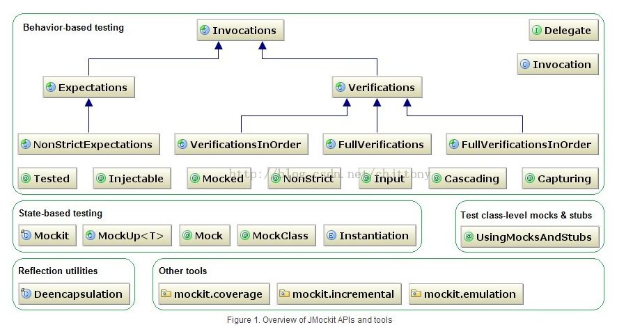

# junit

JUnit是一个Java语言的单元测试框架。它由肯特·贝克和埃里希·伽玛（Erich Gamma）建立，逐渐成为源于Kent Beck的sUnit的xUnit家族中为最成功的一个。 JUnit有它自己的JUnit扩展生态圈。

JUnit 促进了“先测试后编码”的理念，强调建立测试数据的一段代码，可以先测试，然后再应用。这个方法就好比“测试一点，编码一点，测试一点，编码一点……”，增加了程序员的产量和程序的稳定性，可以减少程序员的压力和花费在排错上的时间。

特点：

- JUnit 是一个开放的资源框架，用于编写和运行测试。
- 提供注释来识别测试方法。
- 提供断言来测试预期结果。
- 提供测试运行来运行测试。
- JUnit 测试允许你编写代码更快，并能提高质量。
- JUnit 优雅简洁。没那么复杂，花费时间较少。
- JUnit 测试可以自动运行并且检查自身结果并提供即时反馈。所以也没有必要人工梳理测试结果的报告。
- JUnit 测试可以被组织为测试套件，包含测试用例，甚至其他的测试套件。
- JUnit 在一个条中显示进度。如果运行良好则是绿色；如果运行失败，则变成红色。 JUnit知识经常 和测试驱动开发的讨论融合在一起。可以参考Kent Beck的 《Test-Driven Development: By Example》一书（有中文版和影印版）。

# junit 和Spring 的结合

# mock

## why

不知道你在日常开发中有没有遇到过以下问题或需求：

1. 和别人一起做同一个项目，相互之间已经约定好接口。然后你开始开发，开发完自己的代码后，你想测试下你的服务实现逻辑是否正确。但是因为你依赖的只是接口，真正的服务还有开发出来。

2. 还是和上面类似的场景，你要依赖的服务是通过RPC的方式调用的，而外部服务的稳定性很难保证。

3. 对于一个接口或者方法，你希望测试其各种不同情况，但是依赖的服务的执行策略及返回值你没办法决定。

4. 你依赖的服务或者对象很难创建！(比如具体的web容器)

5. 依赖的对象的某些行为很难触发！（比如网络异常）

6. 以上问题你都没有，但是你要用的那个服务他处理速度实在是太慢了。

上面这些情况都是日常开发测试过程中可能遇到的比较麻烦的问题。这些问题都会大大的提高测试成本。可以说，很多开发人员不愿意写单元测试很大程度上都和以上这六点有关系。

幸运的是，Mock对象可以解决以上问题。使用mock对象进行的测试就是mock测试。

## what

mock测试就是在测试过程中，对于某些不容易构造或者不容易获取的对象，用一个虚拟的对象来创建以便测试的测试方法。

mock对象，就是非真实对象，是模拟出来的一个对象。可以理解为汽车碰撞测试的那个假人。mock对象就是真实对象在调试期间的代替品。

你创建这样一个“假人”的成本比较低，这个“假人”可以按照你设定的“剧情”来运行。

在Java的单元测试中，很多Mock框架可以使用，用的比较多的有easymock、mockito、powermock、jmockit等。

面向对象开发中，我们通常定义一个接口，使用一个接口来描述这个对象。在被测试代码中只是通过接口来引用对象，所以它不知道这个引用的对象是真实对象，还是mock对象。

# JMockit

JMockit是基于JavaSE5中的java.lang.instrument包开发，内部使用ASM库来动态修改java的字节码，使得java这种静态语言可以想动态脚本语言一样动态设置被Mock对象私有属性，模拟静态、私有方法行为等等，对于手机开发，嵌入式开发等要求代码尽量简洁的情况下，或者对于被测试代码不想做任何修改的前提下，使用JMockit可以轻松搞定很多测试场景。

通过如下方式在maven中添加JMockit的相关依赖：

```xml
<dependency>  
    <groupId>com.googlecode.jmockit</groupId>  
    <artifactId>jmockit</artifactId>  
    <version>1.5</version>  
    <scope>test</scope>  
</dependency>  
<dependency>  
    <groupId>com.googlecode.jmockit</groupId>  
    <artifactId>jmockit-coverage</artifactId>  
    <version>0.999.24</version>  
    <scope>test</scope>  
</dependency>
```

JMockit有两种Mock方式：基于行为的Mock方式和基于状态的Mock方式：

引用单元测试中mock的使用及mock神器jmockit实践中JMockit API和工具如下：



## 基于行为的Mock方式

非常类似与EasyMock和PowerMock的工作原理，基本步骤为：

1. 录制方法预期行为。

2. 真实调用。

3. 验证录制的行为被调用。

通过一个简单的例子来介绍JMockit的基本流程：

1. 要Mock测试的方法如下：

```java
public class MyObject {
    public String hello(String name){
        return "Hello " + name;
    }
}
```

2. 使用JMockit编写的单元测试如下：

```java
@Mocked  //用@Mocked标注的对象，不需要赋值，jmockit自动mock  
MyObject obj;  

@Test  
public void testHello() {  
    new NonStrictExpectations() {//录制预期模拟行为  
        {  
            obj.hello("Zhangsan");  
            returns("Hello Zhangsan");  
            //也可以使用：result = "Hello Zhangsan";  
        }  
    };  
    assertEquals("Hello Zhangsan", obj.hello("Zhangsan"));//调用测试方法  
    new Verifications() {//验证预期Mock行为被调用  
        {  
            obj.hello("Hello Zhangsan");  
            times = 1;  
        }  
    };  
}
```

JMockit也可以分类为非局部模拟与局部模拟，区分在于Expectations块是否有参数，有参数的是局部模拟，反之是非局部模拟。

而Expectations块一般由Expectations类和NonStrictExpectations类定义，类似于EasyMock和PowerMock中的Strict Mock和一般性Mock。

用Expectations类定义的，则mock对象在运行时只能按照 Expectations块中定义的顺序依次调用方法，不能多调用也不能少调用，所以可以省略掉Verifications块；

而用NonStrictExpectations类定义的，则没有这些限制，所以如果需要验证，则要添加Verifications块。

上述的例子使用了非局部模拟，下面我们使用局部模拟来改写上面的测试，代码如下：

```java
@Test  
public void testHello() {  
    final MyObject obj = new MyObject();  
    new NonStrictExpectations(obj) {//录制预期模拟行为  
        {  
            obj.hello("Zhangsan");  
            returns("Hello Zhangsan");  
            //也可以使用：result = "Hello Zhangsan";  
        }  
    };  
    assertEquals("Hello Zhangsan", obj.hello("Zhangsan"));//调用测试方法  
    new Verifications() {//验证预期Mock行为被调用  
        {  
            obj.hello("Hello Zhangsan");  
            times = 1;  
        }  
    };  
}  
```

3. 模拟静态方法：

```java
@Test  
public void testMockStaticMethod() {  
    new NonStrictExpectations(ClassMocked.class) {  
        {  
            ClassMocked.getDouble(1);//也可以使用参数匹配：ClassMocked.getDouble(anyDouble);  
            result = 3;  
        }  
    };  

    assertEquals(3, ClassMocked.getDouble(1));  

    new Verifications() {  
        {  
            ClassMocked.getDouble(1);  
            times = 1;  
        }  
    };  
}  
```

4. 模拟私有方法：

如果ClassMocked类中的getTripleString(int)方法指定调用一个私有的multiply3(int)的方法，我们可以使用如下方式来Mock：

```java
@Test  
public void testMockPrivateMethod() throws Exception {  
    final ClassMocked obj = new ClassMocked();  
    new NonStrictExpectations(obj) {  
        {  
            this.invoke(obj, "multiply3", 1);//如果私有方法是静态的，可以使用：this.invoke(null, "multiply3")  
            result = 4;  
        }  
    };  

    String actual = obj.getTripleString(1);  
    assertEquals("4", actual);  

    new Verifications() {  
        {  
            this.invoke(obj, "multiply3", 1);  
            times = 1;  
        }  
    };  
}  
```

5. 设置Mock对象私有属性的值： 

我们知道EasyMock和PowerMock的Mock对象是通过JDK/CGLIB动态代理实现的，本质上是类的继承或者接口的实现，但是在java面向对象编程中，基类对象中的私有属性是无法被子类继承的，所以如果被Mock对象的方法中使用到了其自身的私有属性，并且这些私有属性没有提供对象访问方法，则使用传统的Mock方法是无法进行测试的，JMockit提供了设置Mocked对象私有属性值的方法，代码如下： 被测试代码：

```java
public class ClassMocked {  
    private String name = "name_init";  

    public String getName() {  
        return name;  
    }  

    private static String className="Class3Mocked_init";  

    public static String getClassName(){  
        return className;  
    }  
}  
```

使用JMockit设置私有属性：

```java
@Test  
public void testMockPrivateProperty() throws IOException {  
    final ClassMocked obj = new ClassMocked();  
    new NonStrictExpectations(obj) {  
        {  
            this.setField(obj, "name", "name has bean change!");  
        }  
    };  

    assertEquals("name has bean change!", obj.getName());  
}  
```

使用JMockit设置静态私有属性：

```java
@Test  
public void testMockPrivateStaticProperty() throws IOException {  
    new NonStrictExpectations(Class3Mocked.class) {  
        {  
            this.setField(ClassMocked.class, "className", "className has bean change!");  
        }  
    };  

    assertEquals("className has bean change!", ClassMocked.getClassName());  
}  
```

## 基于状态的Mock方式

JMockit上面的基于行为Mock方式和传统的EasyMock和PowerMock流程基本类似，相当于把被模拟的方法当作黑盒来处理，而JMockit的基于状态的Mock可以直接改写被模拟方法的内部逻辑，更像是真正意义上的白盒测试，下面通过简单例子介绍JMockit基于状态的Mock。 被测试的代码如下：

```java
public class StateMocked {  

    public static int getDouble(int i){  
        return i*2;  
    }  

    public int getTriple(int i){  
        return i*3;  
    }  
} 
```

改写普通方法内容：

```java
@Test  
public void testMockNormalMethodContent() throws IOException {  
    StateMocked obj = new StateMocked();  
    new MockUp<StateMocked>() {//使用MockUp修改被测试方法内部逻辑  
        @Mock  
      public int getTriple(int i) {  
            return i * 30;  
        }  
    };  
    assertEquals(30, obj.getTriple(1));  
    assertEquals(60, obj.getTriple(2));  
    Mockit.tearDownMocks();//注意：在JMockit1.5之后已经没有Mockit这个类，使用MockUp代替，mockUp和tearDown方法在MockUp类中  
}  
```

修改静态方法的内容：

基于状态的JMockit改写静态/final方法内容和测试普通方法没有什么区别，需要注意的是在MockUp中的方法除了不包含static关键字以外，其他都和被Mock的方法签名相同，并且使用@Mock标注，测试代码如下：

```java
@Test  
public void testGetTriple() {  
    new MockUp<StateMocked>() {  
        @Mock    
        public int getDouble(int i){    
            return i*20;    
        }  
    };    
    assertEquals(20, StateMocked.getDouble(1));    
    assertEquals(40, StateMocked.getDouble(2));   
}  
```

# 内存数据库（h2）

H2是一个开源的嵌入式（非嵌入式设备）数据库引擎，它是一个用Java开发的类库，可直接嵌入到应用程序中，与应用程序一起打包发布，不受平台限制。

H2与Derby、HSQLDB、MySQL、PostgreSQL等开源数据库相比，H2的优势为：

- Java开发，不受平台限制；
- H2只有一个jar包，占用空间小，适合嵌入式数据库；
- 有web控制台，用于管管理数据库。

接下来介绍Spring+Mybatis+H2的数据库访问实践

添加H2数据库依赖：

```xml
<dependency>
    <groupId>com.h2database</groupId>
    <artifactId>h2</artifactId>
    <version>1.4.190</version>
</dependency>
```

H2数据库属性文件配置如下，本文采用内存模式访问H2数据库：

```xml
driver=org.h2.Driver
# 内存模式
url=jdbc:h2:mem:testdb;MODE=MYSQL;DB_CLOSE_DELAY=-1
# 持久化模式
#url= jdbc:h2:tcp://localhost/~/test1;MODE=MYSQL;DB_CLOSE_DELAY=-1
```

H2数据库访问的Spring配置文件为：

```xml
<?xml version="1.0" encoding="UTF-8"?>
<beans xmlns:xsi="http://www.w3.org/2001/XMLSchema-instance"
       xmlns="http://www.springframework.org/schema/beans"
       xmlns:tx="http://www.springframework.org/schema/tx"
       xmlns:jdbc="http://www.springframework.org/schema/jdbc"
       xsi:schemaLocation="
            http://www.springframework.org/schema/beans
                http://www.springframework.org/schema/beans/spring-beans-4.0.xsd
            http://www.springframework.org/schema/tx
                http://www.springframework.org/schema/tx/spring-tx-4.0.xsd
            http://www.springframework.org/schema/jdbc
                http://www.springframework.org/schema/jdbc/spring-jdbc-3.0.xsd">

    <!-- 引入属性文件 -->
    <bean id="propertyConfigurer" class="org.springframework.beans.factory.config.PropertyPlaceholderConfigurer">
        <property name="locations">
            <list>
                <value>classpath:config.properties</value>
            </list>
        </property>
    </bean>

    <!-- 自动扫描DAO -->
    <bean class="org.mybatis.spring.mapper.MapperScannerConfigurer">
        <property name="basePackage" value="com.xiaofan.test" />
    </bean>

    <!-- 配置Mybatis sqlSessionFactory -->
    <bean id="sqlSessionFactory" class="org.mybatis.spring.SqlSessionFactoryBean">
        <property name="dataSource" ref="dataSource"/>
        <property name="configLocation" value="classpath:mybatis_config.xml"/>
        <property name="mapperLocations" value="classpath:user_mapper.xml"/>
    </bean>

    <!-- 配置数据源 -->
    <bean id="dataSource"
          class="org.springframework.jdbc.datasource.DriverManagerDataSource">
        <property name="driverClassName" value="${driver}" />
        <property name="url" value="${url}" />
        <!--<property name="username" value="sa" />-->
        <!--<property name="password" value="123" />-->
    </bean>

    <!-- 初始化数据库 -->
    <jdbc:initialize-database data-source="dataSource" ignore-failures="DROPS">
        <jdbc:script location="classpath:sql/ddl.sql" />
        <jdbc:script location="classpath:sql/dml.sql" />
    </jdbc:initialize-database>

    <!-- 配置事务管理 -->
    <tx:annotation-driven transaction-manager="transactionManager" proxy-target-class="true"/>
    <bean id="transactionManager"
          class="org.springframework.jdbc.datasource.DataSourceTransactionManager">
        <property name="dataSource" ref="dataSource"/>
    </bean>

</beans>
```

初始化数据库的DDL语句文件为：

```sql
CREATE TABLE `user` (
  `id` int(11) unsigned NOT NULL AUTO_INCREMENT,
  `name` varchar(100) NOT NULL,
  `age` int(11) NOT NULL,
  PRIMARY KEY (`id`)
);
```

初始化数据库的DML语句文件为：

```sql
insert into `user` (`id`,`name`,`age`) values (1, 'Jerry', 27);
insert into `user` (`id`,`name`,`age`) values (2, 'Angel', 25);
```

编写测试文件，如下：

```java
/**
 * Created by Jerry on 17/7/30.
 */
@ContextConfiguration(locations = {"classpath:config.xml"})
@RunWith(SpringJUnit4ClassRunner.class)
public class Test extends AbstractJUnit4SpringContextTests{

    @Resource
    UserDAO userDAO;

    @org.junit.Test
    public void testInsert() {

        int result = userDAO.insert(new User(null, "LiLei", 27));

        Assert.assertTrue(result > 0);
    }

    @org.junit.Test
    public void testUpdate() {
        int result = userDAO.update(new User(2L, "Jerry update", 28));

        Assert.assertTrue(result > 0);
    }

    @org.junit.Test
    public void testSelect() {
        User result = userDAO.findByName(new User(null, "Jerry", null));

        Assert.assertTrue(result.getAge() != null);
    }

    @org.junit.Test
    public void testDelete() {
        int result = userDAO.delete("Jerry");

        Assert.assertTrue(result > 0);
    }
}
```