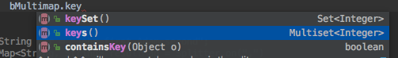

转载：https://www.cnblogs.com/wynjauu/p/10297370.html

通用工具类(字符串、时间格式化、BeanUtils、IO)

# commons.lang3

## org.apache.commons.lang3.StringUtils类

日常代码中，我们经常和String字符串打交道，经常对字符串进行处理，稍微不注意的话，很容易出现类似NullPointerException这种简单的错误，我们经常写各种if来判断处理这些非业务的逻辑。这时，我们可以利用大牛apache的轮子，通过其StringUtils里面的一些常用方法，改善我们的代码，让我们的业务代码更简洁、优雅。

示例代码： 

```java
@Slf4j
 public class AppTest {
    @Test
    public void stringUtils(){
        String a = " ";
        String b = null;
        //判断字符对象是否为空以及内容是否为空串(有空格则认为不是空串)
        log.info("StringUtils.isEmpty(a): {}", StringUtils.isEmpty(a));
        //判断字符对象是否为空以及内容是否为空串(有空格也会认为是空串)
        log.info("StringUtils.isBlank(a): {}", StringUtils.isBlank(a));
        //当b=null时，如果b.trim()则会报空指针异常，使用StringUtils.trim(b)可以避免
        log.info("StringUtils.trim(d): {}", StringUtils.trim(b));
        
        String num = "12.3";
        //当b=null时，如果b.trim()则会报空指针异常，使用StringUtils.trim(b)可以避免
        log.info("org.apache.commons.lang3.StringUtils.isNumericSpace(): {} isNumber: {}", num, StringUtils.isNumericSpace(b));
        log.info("com.alibaba.druid.util.StringUtils.isNumber(): {} isNumber: {}", num, com.alibaba.druid.util.StringUtils.isNumber(num));
    }
 }
```

<font color="tomato">注意：common-lang3中的StringUtils. isNumeric()或isNumericSpace()并不能判断字符串中带小数点的数字值字符为数字。可以通过com.alibaba.druid.util.StringUtils.isNumber(str)，此方法来判断。</font>

## org.apache.commons.lang3.time.DateFormatUtils/DateUtils

时间转换工具类:

```java
@Test
 public void dateFormatUtils() throws Exception{
    String pattern = "yyyy-MM-dd HH:mm:ss";
    String timeStr = DateFormatUtils.format(new Date(), pattern);
    long timestamp = DateUtils.parseDate(timeStr, pattern).getTime();
    log.info("==> current time: {}", timeStr);
    log.info("==> current time timestamp: {}", timestamp);
 }
```

## 总结

- StringUtils.isEmpty(str)/StringUtils.isNotEmpty(str): 判断字符对象是否为null或空串(有空格则认为不是空串)
- StringUtils.isBlank(str)/StringUtils.isNotBlank(str): 判断字符对象是否为null或空串(有空格也会认为是空串)
- DateFormatUtils.format(date, pattern): 将Date时间对象按表达式的格式转换成时间字符串
- DateUtils.parseDate(timeStr, pattern): 将时间字符串反转成Date对象
- ToStringBuilder.reflectionToString(obj): 将对象内容转换成字符串输出

以上示例使用到的jar包可通过maven的pom.xml文件依赖导入：

```xml
<dependency>
    <groupId>org.apache.commons</groupId>
    <artifactId>commons-lang3</artifactId>
    <version>3.8.1</version>
</dependency>
<dependency>
    <groupId>com.alibaba</groupId>
    <artifactId>druid</artifactId>
    <version>1.1.9</version>
</dependency>
```

# commons.*...

## common-beanutils库

Map、JavaBean是我们日常业务代码中经常使用到的2种类，有时因为业务原因，Map、JavaBean需要相互转换copy啥的操作时，如果手动set/put，字段多的时候，就要吐血了。这里我们推荐使用BeanUtils来简化我们的代码

### org.apache.commons.beanutils.BeanUtils类

```java
@Test
public void beanUtils() throws InvocationTargetException, IllegalAccessException {
    CompanyBean bean = new CompanyBean();
    bean.setId(1);
    bean.setName("中国移动广州分公司");
    bean.setAddress("广州市天河区中山大道");
    bean.setTel("020-10086000");
    CompanyBean destObj = new CompanyBean();
    //复制bean之间复制内容, 新对象destObj需要先实例化
    BeanUtils.copyProperties(destObj, bean);

    //ToStringBuilder类来自commons-lang3库：将对象内容转换成字符串输出，方便于日志输出
    log.info("destObj from BeanUtils.copyProperties: {}", ToStringBuilder.reflectionToString(destObj));

    Map<String, Object> map = new HashMap<>();
    map.put("id", 2);
    map.put("name", "中国联通广州分公司");
    map.put("address", "广州市天河区中山大道2号");
    map.put("tel", "020-10000110");

    //将map(key,value)映射成bean
    BeanUtils.populate(destObj, map);
    log.info("destObj from BeanUtils.populate: {}", ToStringBuilder.reflectionToString(destObj));
    //复制对象，与copyProperties()方法比较，这里新对象可以不先实例化
    CompanyBean cloneBean = (CompanyBean)BeanUtils.cloneBean(destObj);
    log.info("cloneBean from BeanUtils.cloneBean: {}", ToStringBuilder.reflectionToString(cloneBean));

    //将JavaBean转换成Map
    Map newMap = BeanUtils.describe(cloneBean);
    log.info("newMap from BeanUtils.describe: {}", new Gson().toJson(newMap));
}
```

日志输出如下：

```shell
2019-01-19 13:17:21.064 [main] INFO com.monbuilder.AppTest - destObj from BeanUtils.copyProperties: com.monbuilder.bean.CompanyBean@10683d9d[id=1,name=中国移动广州分公司,address=广州市天河区中山大道1号,tel=020-10086000]
2019-01-19 13:17:21.070 [main] INFO com.monbuilder.AppTest - destObj from BeanUtils.populate: com.monbuilder.bean.CompanyBean@10683d9d[id=2,name=中国联通广州分公司,address=广州市天河区中山大道2号,tel=020-10000110]
2019-01-19 13:48:14.966 [main] INFO com.monbuilder.AppTest - newMap from BeanUtils.describe: {"address":"广州市天河区中山大道2号","name":"中国联通广州分公司","tel":"020-10000110","id":"2","class":"class com.monbuilder.bean.CompanyBean"}
```

### 总结

- BeanUtils.copyProperties(destObj, sourceObj): JavaBean之间内容的复制
- BeanUtils.cloneBean(obj): 复制对象
- BeanUtils.populate(destObj, sourceMap): Map转换成JavaBean
- BeanUtils.describe(bean): 将JavaBean转换成Map

## commons-io库

### org.apache.commons.io.IOUtils类

这个io工具类非常有用，当我们在处理流的过程中，经常需要把流与字节数组之间相互转换，以及在处理完之后，关闭流等等这些操作时，我们需要写挺多处理逻辑，close时还需要写if判空啥的，但是使用了这个IOUtil后，我们的处理代码或简洁非常多的。

```java
@Test
public void ioUtils() throws IOException {
    InputStream io = this.getClass().getClassLoader().getResourceAsStream("README.md");
    BufferedReader br = new BufferedReader(new InputStreamReader(io));
    log.info("==> IOUtils.toString(br): {}", IOUtils.toString(br));
    IOUtils.closeQuietly(br);
    IOUtils.closeQuietly(io);
}
```

输出结果：

```shell
2019-01-19 14:29:26.140 [main] INFO com.monbuilder.AppTest - ==> IOUtils.toString(br): toolkit-demo,工具类库使用示例
```

上面只是简单的展示将文件流内容转换成字符串，之后再关闭流，是不是非常简洁呢？IOUtils里面还有非常多的好方法可以使用，这些可以根据自己在具体的工作场景下，查看IOUtils的方法列表，找到自己需要的方法

### 总结

IOUtils常用的方法有：

- IOUtils.closeQuietly(obj): 可关闭流SocketSocketServer等多种对象
- IOUtils.copy(InputStream, Writer): 复制输入流
- IOUtils.write(byte[], OutputStream): 将字节数组转换成流
- IOUtils.toByteArray(InputStream): 将输入流转换成字节数组
- IOUtils.toInputStream(String): 将字符串转换成输入流
- IOUtils.toString(InputStream): 将输入流转换成字符串

# guava-libraries

转载：https://www.cnblogs.com/wwxzdl/p/11150907.html

## 什么是guava呢？

guava就是类库，是java api的增强与扩展，里面有大量的方法供我们使用，使用之前需要引入包

```xml
<dependencies>
    <!--guava依赖-->
    <dependency>
        <groupId>com.google.guava</groupId>
        <artifactId>guava</artifactId>
        <version>27.0.1</version>
    </dependency>
</dependencies>
```

guava有哪些方法呢？我们先从以下几方面开始学习：

- 字符串处理：分割，连接，填充
- 新增的集合类型
- 原生类型

## 字符串的处理：分割，连接，填充

###  joiner 连接器

**joiner on就是将list用，连接转成字符串**

```java
@Test
public void joinerListTest() {
    List<String> lists = Lists.newArrayList("a","b","g","8","9");
    String result = Joiner.on(",").join(lists);
    System.out.println(result);
}
```

输出结果：

```shell
结果：a,b,g,8,9
```

**joiner skipNulls()连接跳过null元素(第一个test为了跟第二个进行比对一下)**

```java
@Test
    public void joinerListTest1() {
        List<String> lists = Lists.newArrayList("a","b","g",null,"8","9");
        String result = Joiner.on(",").join(lists);
        System.out.println(result);
    }
```

输出结果：

```shell
结果：a,b,g,null,8,9
```

```
@Test
public void joinerListTest2() {
    List<String> lists = Lists.newArrayList("a","b,"g",null,"8","9");
    String result = Joiner.on(",").skipNulls().join(lists);
    System.out.println(result);
}
```

输出结果：

```shell
结果：a,b,g,8,9
```

如果连接的时候list里面含有null值，会报空指针，因为join实现如下：

```java
1.x
public final String join(Iterable<?> parts) {
    return this.join(parts.iterator());
}

public final String join(Iterator<?> parts) {
    return this.appendTo(new StringBuilder(), parts).toString();
}

@CanIgnoreReturnValue
public final StringBuilder appendTo(StringBuilder builder, Iterator<?> parts) {
    try {
        this.appendTo((Appendable)builder, (Iterator)parts);
        return builder;
    } catch (IOException var4) {
        throw new AssertionError(var4);
    }
}

@CanIgnoreReturnValue
public <A extends Appendable> A appendTo(A appendable, Iterator<?> parts) throws IOException {
    Preconditions.checkNotNull(appendable);
    if (parts.hasNext()) {
        appendable.append(this.toString(parts.next()));

        while(parts.hasNext()) {
            appendable.append(this.separator);
            appendable.append(this.toString(parts.next()));
        }
    }
    return appendable;
}

@CanIgnoreReturnValue
public static <T> T checkNotNull(T reference) {
    if (reference == null) {
        throw new NullPointerException();
    } else {
        return reference;
    }
}
```

**joiner useForNull(final String value)用value替换null元素值**

```java
@Test
public void useNullListTest() {
    List<String> lists = Lists.newArrayList("a", "b", "g", null, "8", "9");
    String result = Joiner.on(",").useForNull("哈哈").join(lists);
    System.out.println(result);
}
```

输出结果：

```shell
结果：a,b,g,哈哈,8,9
```

**joiner withKeyValueSeparator(String value)   map连接器，keyValueSeparator为key和value之间的分隔符**

```java
@Test
public void withMapTest() {
    Map<Integer, String> maps = Maps.newHashMap();
    maps.put(1, "哈哈");
    maps.put(2, "压压");
    String result = Joiner.on(",").withKeyValueSeparator(":").join(maps);
    System.out.println(result);
    System.out.println(maps);
}
```

输出结果：

```java
结果：
1:哈哈,2:压压
{1=哈哈, 2=压压}
```

### splitter 拆分器

**splitter on 拆分**

```java
@Test
public void splitterListTest() {
    String test = "34344,34,34,哈哈";
    List<String> lists = Splitter.on(",").splitToList(test);
    System.out.println(lists);
}
```

输出结果：

```shell
结果：[34344, 34, 34, 哈哈]
```

**splitter trimResults 拆分去除前后空格**

```java
@Test
public void trimResultListTest() {
    String test = "  34344,34,34,哈哈 ";
    List<String> lists = Splitter.on(",").trimResults().splitToList(test);
    System.out.println(lists);
}
```

输出结果：

```shell
结果：[34344, 34, 34, 哈哈]
```

**splitter omitEmptyStrings 去除拆分出来空的字符串**

```java
@Test
public void omitEmptyStringsTest() {
    String test = "  3434,434,34,,哈哈 ";
    List<String> lists = Splitter.on(",").omitEmptyStrings().splitToList(test);
    System.out.println(lists);
}
```

输出结果：

```shell
结果：[  3434, 434, 34, 哈哈 ]
```

**splitter fixedLength(int lenght) 把字符串按固定长度分割**

```java
@Test
public void fixedLengthTest() {
    String test = "343443434哈哈";
    List<String> lists = Splitter.fixedLength(3).splitToList(test);
    System.out.println(lists);
}
```

输出结果

```shell
结果：[343, 443, 434, 哈哈]
```

### charMatcher 匹配器

**charMatcher is(Char char)  给单一字符匹配**

```java
@Test
public void isTest() {
    String str = "12312,agg";
    CharMatcher charMatcher1 = CharMatcher.is('g');
    System.out.println(charMatcher1.retainFrom(str));
}
```

输出结果：

```shell
结果：gg
```

**charMatcher  retainFrom(String s)  在字符序列中保留匹配字符，移除其他字符**

```java
@Test
public void charMatcherTest() {
    String str = "12312,agg  ";
    //两个匹配符,先匹配再操作
    CharMatcher charMatcher1 = CharMatcher.is('1');
    CharMatcher charMatcher2 = CharMatcher.is('2');
    //两个CharMatcher或操作
    CharMatcher charMatcher3 = charMatcher1.or(charMatcher2);
    System.out.println(charMatcher3.retainFrom(str));
}
```

输出结果：

```shell
结果：1212
```

**charMatcher matchersAllOf(Char char) 测试是否字符序列所有字符都匹配**

```java
@Test
public void matchesAllOfTest() {
    String str = "12312,agg";
    CharMatcher charMatcher1 = CharMatcher.is('g');
    System.out.println(charMatcher1.matchesAllOf(str));
}
```

输出结果：

```shell
结果：false
```

```java
@Test
public void matchesAllOfTest() {
    String str = "ggggg";
    CharMatcher charMatcher1 = CharMatcher.is('g');
    System.out.println(charMatcher1.matchesAllOf(str));
}
```

输出结果：

```shell
结果：true
```

## 原生类型

### 定义list，map

```java
@Test
public void test() {
    //JDK 
    List<String> list = new ArrayList<String>();
    list.add("a");
    list.add("b");
    list.add("c");
    list.add("d");
    //guava
    List<String> lists = Lists.newArrayList("a", "b", "g", null, "8", "9");
    List<String> lists1 = Lists.newArrayList();
    Map<Integer, String> maps = Maps.newHashMap();
}
```

## 新增集合（这里我只讲一下Mulitmap,平时用这个会使代码很方便，这里我就多讲一下）

Multimap就是将相同key的value值放在一个list里面，这样子取相同key下面的所有value值就非常简单了，不然还得for循环去匹配，把相同key值的value值找出来，在进行处理。map<key,value>键值key不能重复，所以当遇到这样子场景的时候map就非常不适合了，下面我们看下例子：

```java
@Test
public void test1(){
    //假设a表跟b表是一对多的关系，通过a表id是b表的外键，比如从b表查出了一堆数据，想把a.id相同的数据放在一起,A,B分别代表a,b表的model
    List<B> bList = BMapper.selectByExample(XXXXX);
    Multimap<Integer,B> bMultimap = ArrayListMultimap.create();
    bList.forEach(v->{
        bMultimap.put(v.getAId(),v);   
    });
}
```

Multimap.get(key)即使没有key值，会返回空的list。

Multimap.keySet()返回的用set\<T\>表示的不重复key;Multimap.keys()返回的是用Multiset表示的key,key数量跟value值数量一致；Multimap.containKeys()是表示是否包含这个key；

Multimap.size()返回所有值的个数，而非不同键的个数。要得到不同键的个数，要用Multimap.keySet().size()



# netty

Netty是什么？

1）本质：JBoss做的一个Jar包

2）目的：快速开发高性能、高可靠性的网络服务器和客户端程序

3）优点：提供异步的、事件驱动的网络应用程序框架和工具

通俗的说：一个好使的处理Socket的框架。