转载：https://www.cnblogs.com/dongguacai/p/5900507.html

# JMX的定义

JMX(Java Management Extensions)是一个为应用程序植入管理功能的框架。JMX是一套标准的代理和服务，实际上，用户可以在任何Java应用程序中使用这些代理和服务实现管理。这是官方文档上的定义，我看过很多次也无法很好的理解。我个人的理解是JMX让程序有被管理的功能，例如你开发一个WEB网站，它是在24小时不间断运行，那么你肯定会对网站进行监控，如每天的UV、PV是多少；又或者在业务高峰的期间，你想对接口进行限流，就必须去修改接口并发的配置值。

应用场景：中间件软件WebLogic的管理页面就是基于JMX开发的，而JBoss则整个系统都基于JMX构架。

对于一些参数的修改，网上有一段描述还是比较形象的：

1. 程序初哥一般是写死在程序中，到要改变的时候就去修改代码，然后重新编译发布。
2. 程序熟手则配置在文件中（JAVA一般都是properties文件），到要改变的时候只要修改配置文件，但还是必须重启系统，以便读取配置文件里最新的值。
3. 程序好手则会写一段代码，把配置值缓存起来，系统在获取的时候，先看看配置文件有没有改动，如有改动则重新从配置里读取，否则从缓存里读取。
4. 程序高手则懂得物为我所用，用JMX把需要配置的属性集中在一个类中，然后写一个MBean，再进行相关配置。另外JMX还提供了一个工具页，以方便我们对参数值进行修改。

# JMX架构图


从图中我们可以看到，JMX的结构一共分为三层：

**1、基础层：主要是MBean，被管理的资源。**

MBean分为如下四种，我接下来主要介绍standard MBean

|   类型    |   描述    |
|   ---   | --- |
|   standard MBean  |   这种类型的MBean最简单，它能管理的资源（包括属性，方法，时间）必须定义在接口中，然后MBean必须实现这个接口。它的命名也必须遵循一定的规范，例如我们的MBean为Hello，则接口必须为HelloMBean。    |
|   dynamic MBean | 必须实现javax.management.DynamicMBean接口，所有的属性，方法都在运行时定义   |
|   open MBean  |   此MBean的规范还不完善，正在改进中   |
|   model MBean |   与标准和动态MBean相比，你可以不用写MBean类，只需使用javax.management.modelmbean.RequiredModelMBean即可。RequiredModelMBean实现了ModelMBean接口，而ModelMBean扩展了DynamicMBean接口，因此与DynamicMBean相似，Model MBean的管理资源也是在运行时定义的。与DynamicMBean不同的是，DynamicMBean管理的资源一般定义在DynamicMBean中（运行时才决定管理那些资源），而model MBean管理的资源并不在MBean中，而是在外部（通常是一个类），只有在运行时，才通过set方法将其加入到model MBean中。后面的例子会有详细介绍   |

**2、适配层：MBeanServer，主要是提供对资源的注册和管理。**

**3、接入层：提供远程访问的入口。**

接下来我这里会用程序来介绍三种访问JMX的方式：

# JDK的小工具Jconsole访问

**1、首先定义一个MBean接口，接口的命名规范为以具体的实现类为前缀（这个规范很重要）**

```java
package jmx;

public interface HelloMBean
{
     public String getName();

     public void setName(String name);

     public String getAge();

     public void setAge(String age);

     public void helloWorld();

     public void helloWorld(String str);

     public void getTelephone();
}
```

**2、定义一个实现类，实现上面的接口：**

```java
package jmx;

/*
 * 该类名称必须与实现的接口的前缀保持一致（即MBean前面的名称
 */
public class Hello implements HelloMBean
{
    private String name;
        
    private String age;

    public void getTelephone()
    {
        System.out.println("get Telephone");
    }

    public void helloWorld()
    {
        System.out.println("hello world");
    }

    public void helloWorld(String str)
    {
        System.out.println("helloWorld:" + str);
    }

    public String getName()
    {
        System.out.println("get name 123");
        return name;
    }

    public void setName(String name)
    {
        System.out.println("set name 123");
        this.name = name;
    }

    public String getAge()
    {
        System.out.println("get age 123");
        return age;
    }

    public void setAge(String age)
    {
        System.out.println("set age 123");
        this.age = age;
    }      
}
```

**3、定义agent层：**

```java
package jmx;

import java.lang.management.ManagementFactory;

import javax.management.JMException;
import javax.management.MBeanServer;
import javax.management.ObjectName;

public class HelloAgent
{
    public static void main(String[] args) throws JMException, Exception
    {
         MBeanServer server = ManagementFactory.getPlatformMBeanServer();//通过工厂类获取MBeanServer，用来做MBean的容器。
         ObjectName helloName = new ObjectName("jmxBean:name=hello");//ObjectName中的取名是有一定规范的，格式为：“域名：name=MBean名称”，其中域名和MBean的名称可以任意取。这样定义后，就可以唯一标识我们定义的这个MBean的实现类了。
         //create mbean and register mbean
         server.registerMBean(new Hello(), helloName);//将Hello这个类注入到MBeanServer中，注入需要创建一个ObjectName类
         Thread.sleep(60*60*1000);
    }
}
```

这样，一个简单的JMX的DEMO已经写完了，现在我们通过JDK提供的Jconsole来进行操作。

**1、首先在自己的本地路径下：C:\Program Files (x86)\Java\jdk1.6.0_43\bin找到jconsole.exe这个小工具，双击打开：**


**2、双击打开我们的本地进程：HelloAgent：**

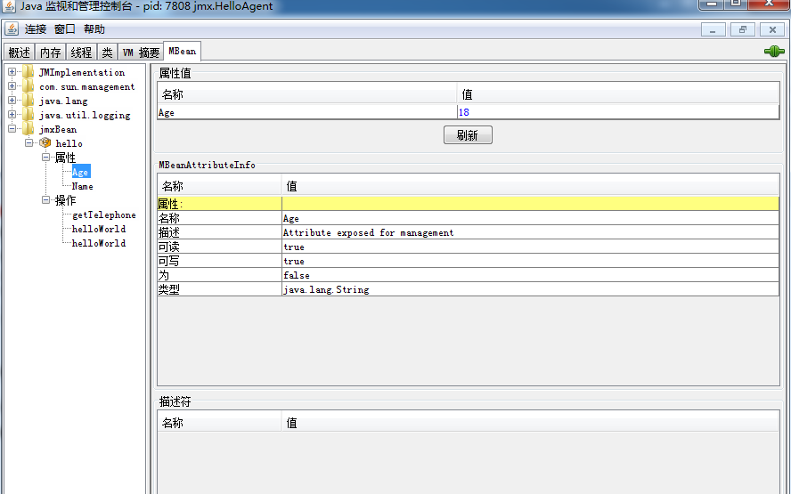

**3、在这个界面上，我们可以给程序中HelloMBean的属性赋值，也可以调用其中的方法：**

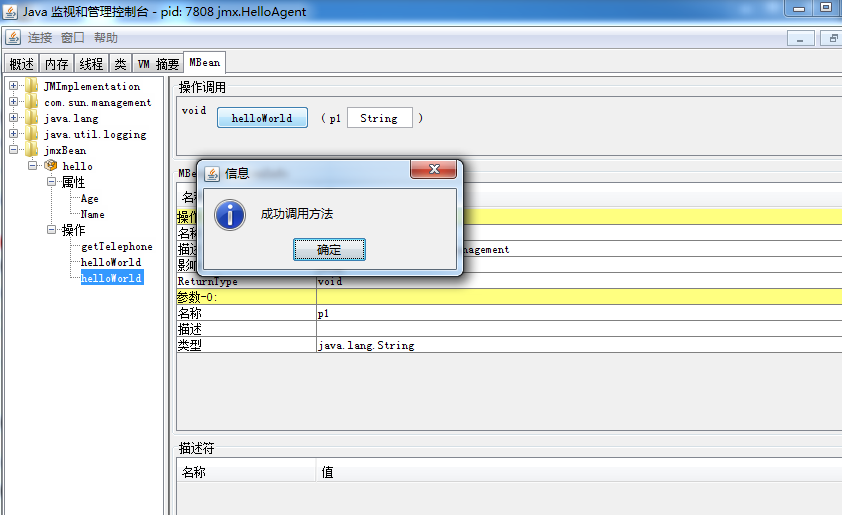

4、控制台打印如下：

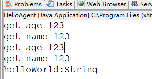


# 通过JMX提供的工具页访问

这里，我们复用上面的接口和实现类，只需要改动适配层，这里需要到导入外部jar包jdmk

```java
package jmx;

import java.lang.management.ManagementFactory;

import javax.management.JMException;
import javax.management.MBeanServer;
import javax.management.ObjectName;

import com.sun.jdmk.comm.HtmlAdaptorServer;

public class HelloAgent
{
    public static void main(String[] args) throws JMException, Exception
    {
         MBeanServer server = ManagementFactory.getPlatformMBeanServer();
         ObjectName helloName = new ObjectName("jmxBean:name=hello");
         //create mbean and register mbean
         server.registerMBean(new Hello(), helloName);
         
         ObjectName adapterName = new ObjectName("HelloAgent:name=htmladapter,port=8082");   
         HtmlAdaptorServer adapter = new HtmlAdaptorServer();   
         server.registerMBean(adapter, adapterName);  
         adapter.start();
    }
}
```

我们访问地址：http://localhost:8082，点击name=hello：

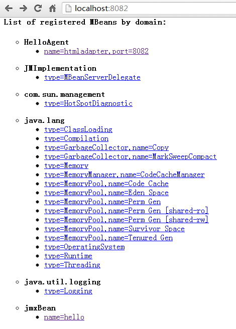

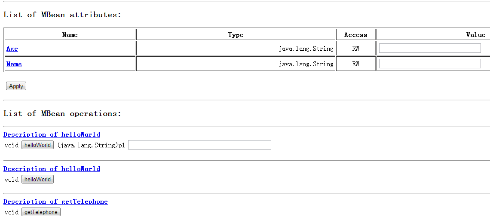

1、在这里创建一个AdaptorServer，这个类将决定MBean的管理界面，这里用最普通的Html型界面。AdaptorServer其实也是一个MBean。 

2、我们可以看到这个工具页，其实与我们上一个案例中的Jconsole中的管理界面类似，都可以操作资源中的属性和方法。

# 通过客户端程序进行远程访问

1、这里需要对agent进行修改，增加ip和porta绑定部分的逻辑

```java
package jmxTest;

import java.io.IOException;
import java.lang.management.ManagementFactory;
import java.rmi.RemoteException;
import java.rmi.registry.LocateRegistry;

import javax.management.JMException;
import javax.management.MBeanServer;
import javax.management.ObjectName;
import javax.management.remote.JMXConnectorServer;
import javax.management.remote.JMXConnectorServerFactory;
import javax.management.remote.JMXServiceURL;

public class HelloAgent
{
    public static void main(String[] args) throws JMException, NullPointerException
    {
        MBeanServer server = ManagementFactory.getPlatformMBeanServer();
        ObjectName helloName = new ObjectName("jmxBean:name=hello");
        //create mbean and register mbean
        server.registerMBean(new Hello(), helloName);
        try
        {
            //这个步骤很重要，注册一个端口，绑定url后用于客户端通过rmi方式连接JMXConnectorServer
            LocateRegistry.createRegistry(9999);
            //URL路径的结尾可以随意指定，但如果需要用Jconsole来进行连接，则必须使用jmxrmi
            JMXServiceURL url = new JMXServiceURL
                  ("service:jmx:rmi:///jndi/rmi://localhost:9999/jmxrmi");
            JMXConnectorServer jcs = JMXConnectorServerFactory.newJMXConnectorServer(url, null, server);
            System.out.println("begin rmi start");
            jcs.start();
            System.out.println("rmi start");
        }
        catch (RemoteException e)
        {
            e.printStackTrace();
        }
        catch (IOException e)
        {
            e.printStackTrace();
        }
    }
}
```

写到这里，如果没有client进行远程连接，可以使用Jconsole进行远程访问：

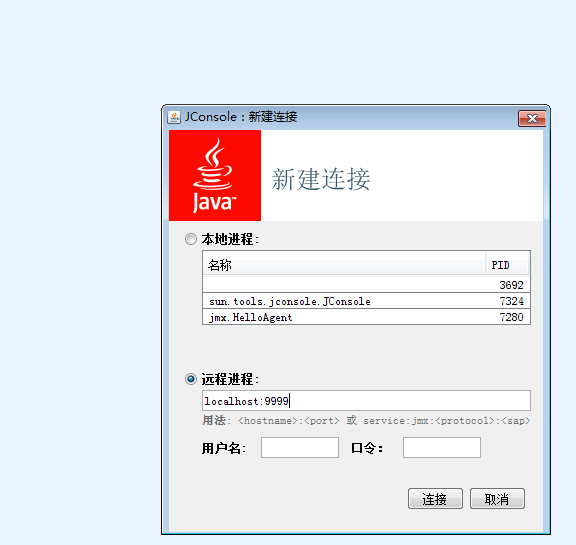

2、客户端Client程序，用于与agent进行远程连接：

```java
package jmx;

import java.io.IOException;

import javax.management.Attribute;
import javax.management.MBeanServerConnection;
import javax.management.MBeanServerInvocationHandler;
import javax.management.ObjectName;
import javax.management.remote.JMXConnector;
import javax.management.remote.JMXConnectorFactory;
import javax.management.remote.JMXServiceURL;


public class Client
{
    public static void main(String[] args) throws IOException, Exception, NullPointerException
    {
        JMXServiceURL url = new JMXServiceURL
            ("service:jmx:rmi:///jndi/rmi://localhost:9999/jmxrmi");
        JMXConnector jmxc = JMXConnectorFactory.connect(url,null);

        MBeanServerConnection mbsc = jmxc.getMBeanServerConnection();
        //ObjectName的名称与前面注册时候的保持一致
        ObjectName mbeanName = new ObjectName("jmxBean:name=hello");

        System.out.println("Domains ......");
        String[] domains = mbsc.getDomains();

        for(int i=0;i<domains.length;i++)
        {
            System.out.println("doumain[" + i + "]=" + domains[i] );
        }

        System.out.println("MBean count = " + mbsc.getMBeanCount());
        //设置指定Mbean的特定属性值
        //这里的setAttribute、getAttribute操作只能针对bean的属性
        //例如对getName或者setName进行操作，只能使用Name，需要去除方法的前缀
        mbsc.setAttribute(mbeanName, new Attribute("Name","杭州"));
        mbsc.setAttribute(mbeanName, new Attribute("Age","1990"));
        String age = (String)mbsc.getAttribute(mbeanName, "Age");
        String name = (String)mbsc.getAttribute(mbeanName, "Name");
        System.out.println("age=" + age + ";name=" + name);

        HelloMBean proxy = MBeanServerInvocationHandler.
            newProxyInstance(mbsc, mbeanName, HelloMBean.class, false);
        proxy.helloWorld();
        proxy.helloWorld("migu");
        proxy.getTelephone();
        //invoke调用bean的方法，只针对非设置属性的方法
        //例如invoke不能对getName方法进行调用
        mbsc.invoke(mbeanName, "getTelephone", null, null);
        mbsc.invoke(mbeanName, "helloWorld",
            new String[]{"I'll connect to JMX Server via client2"}, new String[]{"java.lang.String"});
        mbsc.invoke(mbeanName, "helloWorld", null, null);
    }
}
```

<font color="tomato">
a、在35到41行，是对属性进行赋值和取值，这里我们不能直接调用方法，而是通过setAttribute、getAttrubute方法来进行操作，则属性的首字母要大写。

b、对资源里面的方法进行操作有两种方式：一是通过代理直接调用方法；二是通过JAVA的反射注入的方式进行方法的调用。
</font>

下面我们来看看执行结果，先执行agent，再执行客户端：

c、client的控制台打印结果：

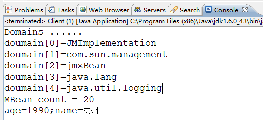

d、agent控制台打印结果：

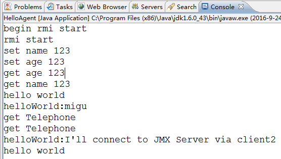

# Notification

MBean之间的通信是必不可少的，Notification就起到了在MBean之间沟通桥梁的作用。JMX 的通知由四部分组成：

- Notification这个相当于一个信息包，封装了需要传递的信息
- Notification broadcaster这个相当于一个广播器，把消息广播出
- Notification listener 这是一个监听器，用于监听广播出来的通知信息
- Notification filiter 这个一个过滤器，过滤掉不需要的通知。这个一般很少使用

这里我们使用日常打招呼的场景：jack与我偶遇，jack说：hi；我礼貌的回答：hello，jack。

这里我们先分别创建两个资源：

```java
package jmx;

/*
 * 接口名必须以MBean结尾
 */
public interface HelloMBean
{
    public String getName();   
    
    public void setName(String name);   
  
    public void printHello();   
  
    public void printHello(String whoName);
}
```

```java
package jmx;

/*
 * 该类名称必须与实现的接口的前缀保持一致（即MBean前面的名称
 */
public class Hello implements HelloMBean
{
    private String name;

    public String getName()
    {
        return name;
    }

    public void setName(String name)
    {
        this.name = name;
    }

    public void printHello()
    {
        System.out.println("Hello World, " + name);
    }

    public void printHello(String whoName)
    {
        System.out.println("Hello , " + whoName);
    }
}
```

```java
package jmx;

public interface JackMBean
{
    public void hi();
}
```

```java
package jmx;

import javax.management.Notification;
import javax.management.NotificationBroadcasterSupport;

public class Jack extends NotificationBroadcasterSupport implements JackMBean
{
    private int seq = 0;
    public void hi()
    {
         //创建一个信息包
        Notification notify = 
            //通知名称；谁发起的通知；序列号；发起通知时间；发送的消息
            new Notification("jack.hi",this,++seq,System.currentTimeMillis(),"jack");
        sendNotification(notify);
    }

}
```

这里的类Jack不仅实现了MBean接口，还继承了NotificationBroadcasterSupport。jack在这里创建并发送了一个消息包。

```java
package jmx;

import javax.management.Notification;
import javax.management.NotificationListener;

public class HelloListener implements NotificationListener
{

    public void handleNotification(Notification notification, Object handback)
    {
        if(handback instanceof Hello)
        {
            Hello hello = (Hello)handback;
            hello.printHello(notification.getMessage());
        }
    }
    
}
```

```java
package jmx;

import java.lang.management.ManagementFactory;

import javax.management.JMException;
import javax.management.MBeanServer;
import javax.management.ObjectName;

public class HelloAgent
{
    public static void main(String[] args) throws JMException, Exception
    {
        MBeanServer server = ManagementFactory.getPlatformMBeanServer();
        ObjectName helloName = new ObjectName("yunge:name=Hello");    
        Hello hello=new Hello();          
        server.registerMBean(hello, helloName);  
        Jack jack = new Jack();
        server.registerMBean(jack, new ObjectName("jack:name=Jack"));
        jack.addNotificationListener(new HelloListener(), null, hello);
        Thread.sleep(500000);
    }
}
```

我们用Jconsole来进行访问：

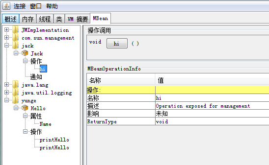

这里我们可以看到有两个MBean，一个是yunge，一个是jack。我们执行jack的hi方法后，去看下控制台上的打印信息

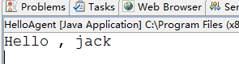

# linux下利用JMX监控Tomcat

利用JMX监控Tomcat，就是相当于部署在tomcat上的应用作为服务端，也就是被管理资源的对象。然后通过程序或者jconsole远程连接到该应用上来。远程连接需要服务器端提供ip和port。如果需要加密访问的话，还需要配置用户名、密码等参数。

主要是在tomcat下的文件catalina.sh中进行一些环境变量的配置配置：

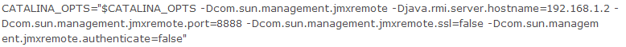

- -Dcom.sun.management.jmxremote=true                   相关 JMX 代理侦听开关
- -Djava.rmi.server.hostname                            服务器端的IP
- -Dcom.sun.management.jmxremote.port=29094             相关 JMX 代理侦听请求的端口
- -Dcom.sun.management.jmxremote.ssl=false              指定是否使用 SSL 通讯
- -Dcom.sun.management.jmxremote.authenticate=false     指定是否需要密码验证

这样就可以通过客户端或者jconsole对tomcat进行监控。