# 线程池概述

转载：https://www.jianshu.com/p/7726c70cdc40

## 优势

1. 降低系统资源消耗，通过重用已存在的线程，降低线程创建和销毁造成的消耗；
2. 提高系统响应速度，当有任务到达时，通过复用已存在的线程，无需等待新线程的创建便能立即执行；
3. 方便线程并发数的管控。因为线程若是无限制的创建，可能会导致内存占用过多而产生OOM，并且会造成cpu过度切换（cpu切换线程是有时间成本的（需要保持当前执行线程的现场，并恢复要执行线程的现场））。
4. 提供更强大的功能，延时定时线程池。

## 主要参数

```java
public ThreadPoolExecutor(int corePoolSize, int maximumPoolSize, long keepAliveTime, TimeUnit unit, BlockingQueue<Runnable> workQueue) {
    this(corePoolSize, maximumPoolSize, keepAliveTime, unit, workQueue,
         Executors.defaultThreadFactory(), defaultHandler);
}
```

1. corePoolSize（线程池基本大小）：当向线程池提交一个任务时，若线程池已创建的线程数小于corePoolSize，即便此时存在空闲线程，也会通过创建一个新线程来执行该任务，直到已创建的线程数大于或等于corePoolSize时，（除了利用提交新任务来创建和启动线程（按需构造），也可以通过 prestartCoreThread() 或 prestartAllCoreThreads() 方法来提前启动线程池中的基本线程。）

2. maximumPoolSize（线程池最大大小）：线程池所允许的最大线程个数。当队列满了，且已创建的线程数小于maximumPoolSize，则线程池会创建新的线程来执行任务。另外，对于无界队列，可忽略该参数。

3. keepAliveTime（线程存活保持时间）当线程池中线程数大于核心线程数时，线程的空闲时间如果超过线程存活时间，那么这个线程就会被销毁，直到线程池中的线程数小于等于核心线程数。

4. workQueue（任务队列）：用于传输和保存等待执行任务的阻塞队列。

5. threadFactory（线程工厂）：用于创建新线程。threadFactory创建的线程也是采用new Thread()方式，threadFactory创建的线程名都具有统一的风格：pool-m-thread-n（m为线程池的编号，n为线程池内的线程编号）。

5. handler（线程饱和策略）：当线程池和队列都满了，再加入线程会执行此策略。

## 常用方法

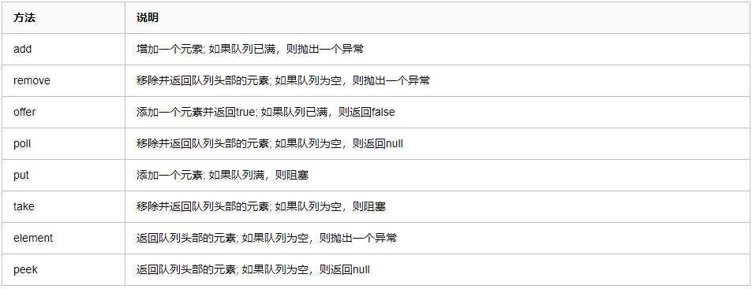

## 流程


1. 判断核心线程池是否已满，没满则创建一个新的工作线程来执行任务。已满则。
2. 判断任务队列是否已满，没满则将新提交的任务添加在工作队列，已满则。
3. 判断整个线程池是否已满，没满则创建一个新的工作线程来执行任务，已满则执行饱和策略。

## 线程池为什么需要使用（阻塞）队列？

回到了非线程池缺点中的第3点：
1. 因为线程若是无限制的创建，可能会导致内存占用过多而产生OOM，并且会造成cpu过度切换。

另外回到了非线程池缺点中的第1点：
2. 创建线程池的消耗较高。
或者下面这个网上并不高明的回答：
3. 线程池创建线程需要获取mainlock这个全局锁，影响并发效率，阻塞队列可以很好的缓冲。

## 线程池为什么要使用阻塞队列而不使用非阻塞队列？

阻塞队列可以保证任务队列中没有任务时阻塞获取任务的线程，使得线程进入wait状态，释放cpu资源。
当队列中有任务时才唤醒对应线程从队列中取出消息进行执行。
使得在线程不至于一直占用cpu资源。

（线程执行完任务后通过循环再次从任务队列中取出任务进行执行，代码片段如下
while (task != null || (task = getTask()) != null) {}）。

不用阻塞队列也是可以的，不过实现起来比较麻烦而已，有好用的为啥不用呢？

# 4种常用线程池介绍

转载：https://www.cnblogs.com/jiawen010/p/11855768.html

Executors类提供了4种不同的线程池：newCachedThreadPool, newFixedThreadPool, newScheduledThreadPool, newSingleThreadExecutor

1. newCachedThreadPool：用来创建一个可以无限扩大的线程池，适用于负载较轻的场景，执行短期异步任务。（可以使得任务快速得到执行，因为任务时间执行短，可以很快结束，也不会造成cpu过度切换）
2. newFixedThreadPool：创建一个固定大小的线程池，因为采用无界的阻塞队列，所以实际线程数量永远不会变化，适用于负载较重的场景，对当前线程数量进行限制。（保证线程数可控，不会造成线程过多，导致系统负载更为严重）
3. newSingleThreadExecutor：创建一个单线程的线程池，适用于需要保证顺序执行各个任务。
4. newScheduledThreadPool：适用于执行延时或者周期性任务。

1. 线程池的概念：

线程池就是首先创建一些线程，它们的集合称为线程池。使用线程池可以很好地提高性能，线程池在系统启动时即创建大量空闲的线程，程序将一个任务传给线程池，线程池就会启动一条线程来执行这个任务，执行结束以后，该线程并不会死亡，而是再次返回线程池中成为空闲状态，等待执行下一个任务。

2. 线程池的工作机制

    1. 在线程池的编程模式下，任务是提交给整个线程池，而不是直接提交给某个线程，线程池在拿到任务后，就在内部寻找是否有空闲的线程，如果有，则将任务交给某个空闲的线程。
    2. 一个线程同时只能执行一个任务，但可以同时向一个线程池提交多个任务。

3. 使用线程池的原因：

多线程运行时间，系统不断的启动和关闭新线程，成本非常高，会过渡消耗系统资源，以及过渡切换线程的危险，从而可能导致系统资源的崩溃。这时，线程池就是最好的选择了。

线程池的返回值ExecutorService简介：

ExecutorService是Java提供的用于管理线程池的类。该类的两个作用：**控制线程数量和重用线程**。

下面的四种创建方式返回值都是ExecutorService。

## newCacheThreadPool

可缓存线程池，先查看池中有没有以前建立的线程，如果有，就直接使用。如果没有，就建一个新的线程加入池中，缓存型池子通常用于执行一些生存期很短的异步型任务

```java
package com.mianshi.test;

import java.util.concurrent.ExecutorService;
import java.util.concurrent.Executors;

public class NewCachedThreadPoolTest {

    public static void main(String[] args) {
        // 创建一个可缓存线程池
        ExecutorService cachedThreadPool = Executors.newCachedThreadPool();
        for (int i = 0; i < 10; i++) {
            try {
                // sleep可明显看到使用的是线程池里面以前的线程，没有创建新的线程
                Thread.sleep(1000);
            } catch (InterruptedException e) {
                e.printStackTrace();
            }
            cachedThreadPool.execute(new Runnable() {
                public void run() {
                    // 打印正在执行的缓存线程信息
                    System.out.println(Thread.currentThread().getName()
                            + "正在被执行");
                    try {
                        Thread.sleep(1000);
                    } catch (InterruptedException e) {
                        e.printStackTrace();
                    }
                }
            });
        }
    }
}
```

输出结果：

```java
pool-1-thread-1正在被执行
pool-1-thread-1正在被执行
pool-1-thread-1正在被执行
pool-1-thread-1正在被执行
pool-1-thread-1正在被执行
pool-1-thread-1正在被执行
pool-1-thread-1正在被执行
pool-1-thread-1正在被执行
pool-1-thread-1正在被执行
pool-1-thread-1正在被执行
```

线程池为无限大，当执行当前任务时上一个任务已经完成，会复用执行上一个任务的线程，而不用每次新建线程。

## newFixedThreadPool

创建一个可重用固定个数的线程池，以共享的无界队列方式来运行这些线程。

```java
package com.mianshi.test;

import java.util.concurrent.ExecutorService;
import java.util.concurrent.Executors;

public class NewFixedThreadPoolTest {

    public static void main(String[] args) {
        // 创建一个可重用固定个数的线程池
        ExecutorService fixedThreadPool = Executors.newFixedThreadPool(3);
        for (int i = 0; i < 10; i++) {
            fixedThreadPool.execute(new Runnable() {
                public void run() {
                    try {
                        // 打印正在执行的缓存线程信息
                        System.out.println(Thread.currentThread().getName()
                                + "正在被执行");
                        Thread.sleep(2000);
                    } catch (InterruptedException e) {
                        e.printStackTrace();
                    }
                }
            });
        }
    }
}
```

输出结果：

```java
pool-1-thread-1正在被执行
pool-1-thread-2正在被执行
pool-1-thread-3正在被执行
pool-1-thread-1正在被执行
pool-1-thread-2正在被执行
pool-1-thread-3正在被执行
pool-1-thread-1正在被执行
pool-1-thread-2正在被执行
pool-1-thread-3正在被执行
pool-1-thread-1正在被执行
```

因为线程池大小为3，每个任务输出打印结果后sleep 2秒，所以每两秒打印3个结果。
定长线程池的大小最好根据系统资源进行设置。如`Runtime.getRuntime().availableProcessors()`

## newSingleThreadExecutor

创建一个单线程化的线程池，它只会用唯一的工作线程来执行任务，保证所有任务按照指定顺序(FIFO, LIFO, 优先级)执行。

```java
package com.mianshi.test;

import java.util.concurrent.ExecutorService;
import java.util.concurrent.Executors;

public class NewSingleThreadExecutorTest {

    public static void main(String[] args) {
        //创建一个单线程化的线程池
        ExecutorService singleThreadExecutor = Executors.newSingleThreadExecutor();
        for (int i = 0; i < 10; i++) {
            final int index = i;
            singleThreadExecutor.execute(new Runnable() {
                public void run() {
                    try {
                        //结果依次输出，相当于顺序执行各个任务
                        System.out.println(Thread.currentThread().getName() + "正在被执行,打印的值是:" + index);
                        Thread.sleep(5000);
                    } catch (InterruptedException e) {
                        e.printStackTrace();
                    }
                }
            });
        }
    }
}
```

输出结果：

```java
pool-1-thread-1正在被执行,打印的值是:0
pool-1-thread-1正在被执行,打印的值是:1
pool-1-thread-1正在被执行,打印的值是:2
pool-1-thread-1正在被执行,打印的值是:3
pool-1-thread-1正在被执行,打印的值是:4
pool-1-thread-1正在被执行,打印的值是:5
pool-1-thread-1正在被执行,打印的值是:6
pool-1-thread-1正在被执行,打印的值是:7
pool-1-thread-1正在被执行,打印的值是:8
pool-1-thread-1正在被执行,打印的值是:9
```

## newScheduledThreadPool

创建一个定长线程池，支持定时及周期性任务执行

延迟执行示例代码：

```java
package com.mianshi.test;

import java.util.concurrent.Executors;
import java.util.concurrent.ScheduledExecutorService;
import java.util.concurrent.TimeUnit;

public class NewScheduledThreadPoolTest {

    public static void main(String[] args) {
        //创建一个定长线程池，支持定时及周期性任务执行——延迟执行
        ScheduledExecutorService scheduledThreadPool = Executors.newScheduledThreadPool(5);
        //延迟1秒执行
        scheduledThreadPool.schedule(new Runnable() {
            public void run() {
                System.out.println("延迟1秒执行");
            }
        }, 1, TimeUnit.SECONDS);
        
        //延迟1秒后每3秒执行一次
        /*scheduledThreadPool.scheduleAtFixedRate(new Runnable() {
            public void run() {
                System.out.println("延迟1秒后每3秒执行一次");
            }
        }, 1, 3, TimeUnit.SECONDS);*/
    }
}
```

输出结果：

```java
延迟1秒执行
```

定期执行示例代码：

```java
package com.mianshi.test;

import java.util.concurrent.Executors;
import java.util.concurrent.ScheduledExecutorService;
import java.util.concurrent.TimeUnit;

public class NewScheduledThreadPoolTest {

    public static void main(String[] args) {
        //创建一个定长线程池，支持定时及周期性任务执行——延迟执行
        ScheduledExecutorService scheduledThreadPool = Executors.newScheduledThreadPool(5);
        //延迟1秒执行
        /*scheduledThreadPool.schedule(new Runnable() {
            public void run() {
                System.out.println("延迟1秒执行");
            }
        }, 1, TimeUnit.SECONDS);*/
        
        //延迟1秒后每3秒执行一次
        scheduledThreadPool.scheduleAtFixedRate(new Runnable() {
            public void run() {
                System.out.println("延迟1秒后每3秒执行一次");
            }
        }, 1, 3, TimeUnit.SECONDS);
    }
}
```

输出结果：

```java
延迟1秒后每3秒执行一次
延迟1秒后每3秒执行一次
......
```

# 缓冲队列BlockingQueue

转载：https://segmentfault.com/a/1190000021916434

## 为什么要使用阻塞队列

BlockingQueue是一个阻塞队列。那么，小伙伴们有没有想过，为什么此处的线程池要用阻塞队列呢？

我们知道队列是先进先出的。当放入一个元素的时候，会放在队列的末尾，取出元素的时候，会从队头取。那么，当队列为空或者队列满的时候怎么办呢。

这时，阻塞队列，会自动帮我们处理这种情况。

当阻塞队列为空的时候，从队列中取元素的操作就会被阻塞。当阻塞队列满的时候，往队列中放入元素的操作就会被阻塞。

而后，一旦空队列有数据了，或者满队列有空余位置时，被阻塞的线程就会被自动唤醒。

这就是阻塞队列的好处，你不需要关心线程何时被阻塞，也不需要关心线程何时被唤醒，一切都由阻塞队列自动帮我们完成。我们只需要关注具体的业务逻辑就可以了。

而这种阻塞队列经常用在生产者消费者模式中。

## 常用的阻塞队列

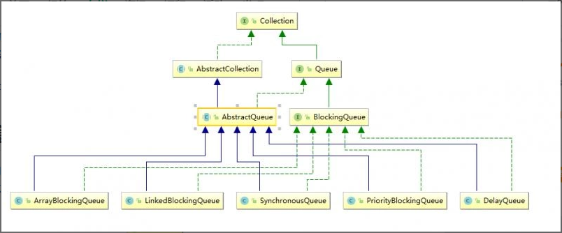

阻塞队列中，所有常用的方法都在 BlockingQueue 接口中定义。如

- 插入元素的方法： put，offer，add。
- 移除元素的方法： remove，poll，take。

它们有四种不同的处理方式，第一种是在失败时抛出异常，第二种是在失败时返回特殊值，第三种是一直阻塞当前线程，最后一种是在指定时间内阻塞，否则返回特殊值。（以上特殊值，是指在插入元素时，失败返回false，在取出元素时，失败返回null）

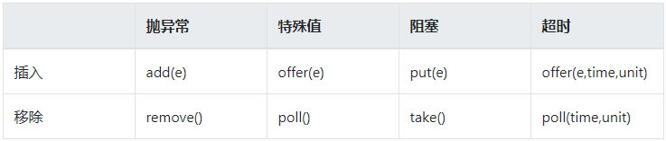

### ArrayBlockingQueue

这是一个由数组结构组成的有界阻塞队列。首先看下它的构造方法，有三个。


第一个可以指定队列的大小，第二个还可以指定队列是否公平，不指定的话，默认是非公平。它是使用 ReentrantLock 的公平锁和非公平锁实现的（后续讲解AQS时，会详细说明）。

简单理解就是，ReentrantLock 内部会维护一个有先后顺序的等待队列，假如有五个任务一起过来，都被阻塞了。如果是公平的，则等待队列中等待最久的任务就会先进入阻塞队列。如果是非公平的，那么这五个线程就需要抢锁，谁先抢到，谁就先进入阻塞队列。

第三个构造方法，是把一个集合的元素初始化到阻塞队列中。

另外，ArrayBlockingQueue 没有实现读写分离，也就是说，读和写是不能同时进行的。因为，它读写时用的是同一把锁，如下图所示：


### LinkedBlockingQueue

这是一个由链表结构组成的有界阻塞队列。它的构造方法有三个。


可以看到和 ArrayBlockingQueue 的构造方法大同小异，不过是，LinkedBlockingQueue 可以不指定队列的大小，默认值是 Integer.MAX_VALUE 。

但是，最好不要这样做，建议指定一个固定大小。因为，如果生产者的速度比消费者的速度大的多的情况下，这会导致阻塞队列一直膨胀，直到系统内存被耗尽（此时，还没达到队列容量的最大值）。

此外，LinkedBlockingQueue 实现了读写分离，可以实现数据的读和写互不影响，这在高并发的场景下，对于效率的提高无疑是非常巨大的。

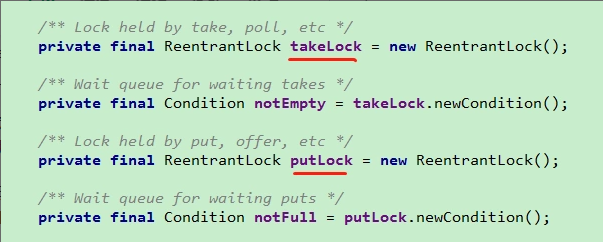

### SynchronousQueue

这是一个没有缓冲的无界队列。什么意思，看一下它的 size 方法：

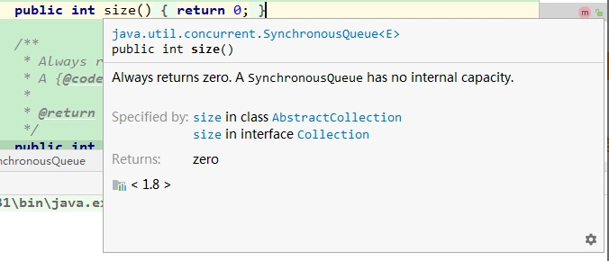

总是返回 0 ，因为它是一个没有容量的队列。

当执行插入元素的操作时，必须等待一个取出操作。也就是说，put元素的时候，必须等待 take 操作。

那么，有的同学就好奇了，这没有容量，还叫什么队列啊，这有什么意义呢。

我的理解是，这适用于并发任务不大，而且生产者和消费者的速度相差不多的场景下，直接把生产者和消费者对接，不用经过队列的入队出队这一系列操作。所以，效率上会高一些。

可以去查看一下 Excutors.newCachedThreadPool 方法用的就是这种队列。

这个队列有两个构造方法，用于传入是公平还是非公平，默认是非公平。


### PriorityBlockingQueue

这是一个支持优先级排序的无界队列。有四个构造方法：


可以指定初始容量大小（注意初始容量并不代表最大容量），或者不指定，默认大小为 11。也可以传入一个比较器，把元素按一定的规则排序，不指定比较器的话，默认是自然顺序。

PriorityBlockingQueue 是基于二叉树最小堆实现的，每当取元素的时候，就会把优先级最高的元素取出来。我们测试一下：

```java
public class Person {
    private int id;
    private String name;

    public int getId() {
        return id;
    }

    public void setId(int id) {
        this.id = id;
    }

    public String getName() {
        return name;
    }

    public void setName(String name) {
        this.name = name;
    }

    @Override
    public String toString() {
        return "Person{" +
                "id=" + id +
                ", name='" + name + '\'' +
                '}';
    }

    public Person(int id, String name) {
        this.id = id;
        this.name = name;
    }

    public Person() {
    }
}

public class QueueTest {
    public static void main(String[] args) throws InterruptedException {

        PriorityBlockingQueue<Person> priorityBlockingQueue = new PriorityBlockingQueue<>(1, new Comparator<Person>() {
            @Override
            public int compare(Person o1, Person o2) {
                return o1.getId() - o2.getId();
            }
        });

        Person p2 = new Person(7, "李四");
        Person p1 = new Person(9, "张三");
        Person p3 = new Person(6, "王五");
        Person p4 = new Person(2, "赵六");
        priorityBlockingQueue.add(p1);
        priorityBlockingQueue.add(p2);
        priorityBlockingQueue.add(p3);
        priorityBlockingQueue.add(p4);

        //由于二叉树最小堆实现，用这种方式直接打印元素，不能保证有序
        System.out.println(priorityBlockingQueue);
        System.out.println(priorityBlockingQueue.take());
        System.out.println(priorityBlockingQueue);
        System.out.println(priorityBlockingQueue.take());
        System.out.println(priorityBlockingQueue);

    }
}
```

打印结果：

```java
[Person{id=2, name='赵六'}, Person{id=6, name='王五'}, Person{id=7, name='李四'}, Person{id=9, name='张三'}]
Person{id=2, name='赵六'}
[Person{id=6, name='王五'}, Person{id=9, name='张三'}, Person{id=7, name='李四'}]
Person{id=6, name='王五'}
[Person{id=7, name='李四'}, Person{id=9, name='张三'}]
```

可以看到，第一次取出的是 id 最小值 2， 第二次取出的是 6。

### DelayQueue

这是一个带有延迟时间的无界阻塞队列。队列中的元素，只有等延时时间到了，才能取出来。此队列一般用于过期数据的删除，或任务调度。以下，模拟一下定长时间的数据删除。

首先定义数据元素，需要实现 Delayed 接口，实现 getDelay 方法用于计算剩余时间，和 CompareTo方法用于优先级排序。

```java
public class DelayData implements Delayed {

    private int id;
    private String name;
    //数据到期时间
    private long endTime;
    private TimeUnit timeUnit = TimeUnit.MILLISECONDS;

    public int getId() {
        return id;
    }

    public void setId(int id) {
        this.id = id;
    }

    public String getName() {
        return name;
    }

    public void setName(String name) {
        this.name = name;
    }

    public long getEndTime() {
        return endTime;
    }

    public void setEndTime(long endTime) {
        this.endTime = endTime;
    }

    public DelayData(int id, String name, long endTime) {
        this.id = id;
        this.name = name;
        //需要把传入的时间endTime 加上当前系统时间，作为数据的到期时间
        this.endTime = endTime + System.currentTimeMillis();
    }

    public DelayData() {
    }

    @Override
    public long getDelay(TimeUnit unit) {
        return this.endTime - System.currentTimeMillis();
    }

    @Override
    public int compareTo(Delayed o) {
        return o.getDelay(this.timeUnit) - this.getDelay(this.timeUnit) < 0 ? 1: -1;
    }
}
```

模拟三条数据，分别设置不同的过期时间：

```java
public class ProcessData {
    public static void main(String[] args) throws InterruptedException {
        DelayQueue<DelayData> delayQueue = new DelayQueue<>();

        DelayData a = new DelayData(5, "A", 5000);
        DelayData b = new DelayData(8, "B", 8000);
        DelayData c = new DelayData(2, "C", 2000);

        delayQueue.add(a);
        delayQueue.add(b);
        delayQueue.add(c);

        System.out.println("开始计时时间:" + System.currentTimeMillis());
        for (int i = 0; i < 3; i++) {
            DelayData data = delayQueue.take();
            System.out.println("id:"+data.getId()+"，数据:"+data.getName()+"被移除，当前时间:"+System.currentTimeMillis());
        }
    }
}
```

最后结果：

```java
开始计时时间:1583333583216
id:2，数据:C被移除，当前时间:1583333585216
id:5，数据:A被移除，当前时间:1583333588216
id:8，数据:B被移除，当前时间:1583333591216
```

可以看到，数据是按过期时间长短，按顺序移除的。C的时间最短 2 秒，然后过了 3 秒 A 也过期，再过 3 秒，B 过期。

# 自己设计线程池ThreadPoolExecutor

转载：https://www.cnblogs.com/jiawen010/p/11855768.html

自定义线程池，可以用ThreadPoolExecutor类创建，它有多个构造方法来创建线程池。

常见的构造函数：`ThreadPoolExecutor(int corePoolSize, int maximumPoolSize, long keepAliveTime, TimeUnit unit, BlockingQueue<Runnable> workQueue)`

示例代码：

```java
package com.mianshi.test;

import java.util.concurrent.ArrayBlockingQueue;
import java.util.concurrent.BlockingQueue;
import java.util.concurrent.ThreadPoolExecutor;
import java.util.concurrent.TimeUnit;

public class CustomThreadPoolExecutor {

    public static class TempThread implements Runnable {
        @Override
        public void run() {
            // 打印正在执行的缓存线程信息
            System.out.println(Thread.currentThread().getName() + "正在被执行");
            try {
                // sleep一秒保证3个任务在分别在3个线程上执行
                Thread.sleep(1000);
            } catch (InterruptedException e) {
                e.printStackTrace();
            }
        }
    }

    public static void main(String[] args) {
        // 创建数组型缓冲等待队列
        BlockingQueue<Runnable> bq = new ArrayBlockingQueue<Runnable>(10);
        // ThreadPoolExecutor:创建自定义线程池，池中保存的线程数为3，允许最大的线程数为6
        ThreadPoolExecutor tpe = new ThreadPoolExecutor(3, 6, 50, TimeUnit.MILLISECONDS, bq);

        // 创建3个任务
        Runnable t1 = new TempThread();
        Runnable t2 = new TempThread();
        Runnable t3 = new TempThread();
        Runnable t4 = new TempThread();
        Runnable t5 = new TempThread();
        Runnable t6 = new TempThread();

        // 3个任务在分别在3个线程上执行
        tpe.execute(t1);
        tpe.execute(t2);
        tpe.execute(t3);
        tpe.execute(t4);
        tpe.execute(t5);
        tpe.execute(t6);

        // 关闭自定义线程池
        tpe.shutdown();
    }
}
```

输出结果：

```java
pool-1-thread-1正在被执行
pool-1-thread-2正在被执行
pool-1-thread-3正在被执行
```

# submit() 和 execute()

转载：https://www.cnblogs.com/handsomeye/p/6225033.html

在使用java.util.concurrent下关于线程池一些类的时候，相信很多人和我一样，总是分不清submit()和execute()的区别，今天从源码方面分析总结一下。

通常，我们通过Executors这个工具类提供多种方法来创建适合不同场景的线程池，这里就不一一介绍了。

例如，创建可缓存线程池，Executors.newCachedThreadPool()，源码如下：

```java
public static ExecutorService newCachedThreadPool() {
    return new ThreadPoolExecutor(0, Integer.MAX_VALUE, 60L, TimeUnit.SECONDS, new SynchronousQueue<Runnable>());
}
```

通过上面源码可以看出，该方法返回的是一个ExecutorService接口，而这个接口继承Executor接口，Executor是最上层的，其中只包含一个execute()方法：

```java
public interface Executor {
    void execute(Runnable command);
}
```

execute()方法的入参为一个Runnable，返回值为void，这时候我们已经知道了execute()方法的来源以及其定义。

接下来，我们来看看，submit()是从哪来的呢？

打开ExecutorService接口源码，看到了submit()方法：

```java
public interface ExecutorService extends Executor {
　　<T> Future<T> submit(Callable<T> task);

　　<T> Future<T> submit(Runnable task, T result);

　　Future<?> submit(Runnable task);
}
```

可以看出，在ExecutorService接口中，一共有以上三个sumbit()方法，入参可以为Callable\<T\>，也可以为Runnable，而且方法有返回值Future\<T\>。

(补充说明：Callable\<T\>与Runnable类似，也是创建线程的一种方式，实现其call()方法即可，方法可以有返回值，而且方法上可以抛出异常;)

总结，从上面的源码以及讲解可以总结execute()和submit()方法的区别：

1. 接收的参数不一样。

2. submit()有返回值，而execute()没有。例如，有个validation的task，希望该task执行完后告诉我它的执行结果，是成功还是失败，然后继续下面的操作。

3. submit()可以进行Exception处理。例如，如果task里会抛出checked或者unchecked exception，而你又希望外面的调用者能够感知这些exception并做出及时的处理，那么就需要用到submit，通过对Future.get()进行抛出异常的捕获，然后对其进行处理。

# 线程池原理

转载：https://mp.weixin.qq.com/s/-89-CcDnSLBYy3THmcLEdQ

程序的运行，其本质上，是对系统资源（CPU、内存、磁盘、网络等等）的使用。如何高效的使用这些资源是我们编程优化演进的一个方向。今天说的线程池就是一种对CPU利用的优化手段。

网上有不少介绍如何使用线程池的文章，那我想说点什么呢？我希望通过学习线程池原理，明白所有池化技术的基本设计思路。遇到其他相似问题可以解决。

## 池化技术

池化技术简单点来说，就是提前保存大量的资源，以备不时之需。在机器资源有限的情况下，使用池化技术可以大大的提高资源的利用率，提升性能等。

在编程领域，比较典型的池化技术有：

线程池、连接池、内存池、对象池等。

本文主要来介绍一下其中比较简单的线程池的实现原理，希望读者们可以举一反三，通过对线程池的理解，学习并掌握所有编程中池化技术的底层原理。

## 创建一个线程

在Java的并发编程中，线程是十分重要的，在Java中，创建一个线程比较简单：

```java
public class App {
    public static void main(String[] args) throws Exception {
        new Thread(new Runnable() {
            @Override
            public void run() {
                System.out.println("线程运行中");
            }
        }).start();
    }
}
```

我们通过创建一个线程对象，并且实现Runnable接口就可以实现一个简单的线程。可以利用上多核CPU。当一个任务结束，当前线程就接收。

但很多时候，我们不止会执行一个任务。如果每次都是如此的创建线程->执行任务->销毁线程，会造成很大的性能开销。

那能否一个线程创建后，执行完一个任务后，又去执行另一个任务，而不是销毁。这就是线程池。

这也就是池化技术的思想，通过预先创建好多个线程，放在池中，这样可以在需要使用线程的时候直接获取，避免多次重复创建、销毁带来的开销。

## 线程池的简单使用

以下代码，是在Java中创建线程池：

```java
import java.util.concurrent.*;

public class App {
    public static void main(String[] args) throws Exception {
        ExecutorService executorService = new ThreadPoolExecutor(1, 1,
                60L, TimeUnit.SECONDS,
                new ArrayBlockingQueue<>(10));

        executorService.execute(new Runnable() {
            @Override
            public void run() {
                System.out.println("abcdefg");
            }
        });

        executorService.shutdown();
    }
}
```

Jdk提供给外部的接口也很简单。直接调用ThreadPoolExecutor构造一个就可以了，也可以通过Executors静态工厂构建，但一般不建议。

可以看到，开发者想要在代码中使用线程池还是比较简单的，这得益于Java给我们封装好的一系列API。但是，这些API的背后是什么呢，让我们来揭开这个迷雾，看清线程池的本质。

## 线程池的构造函数

通常，一般构造函数会反映出这个工具或这个对象的数据存储结构。

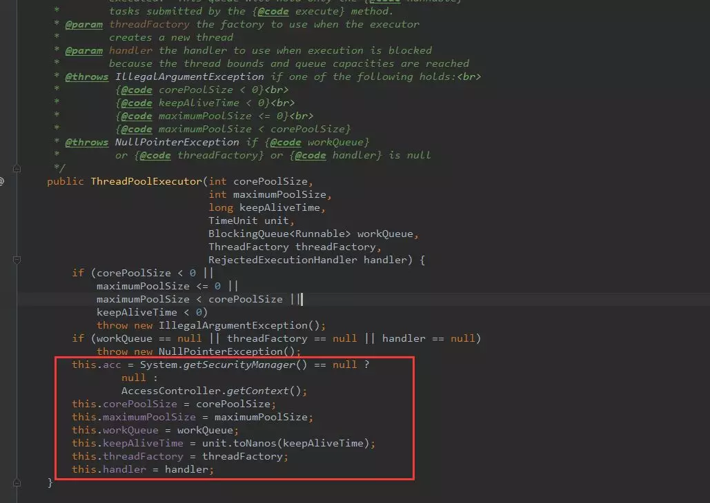

> 如果把线程池比作一个公司。公司会有正式员工处理正常业务，如果工作量大的话，会雇佣外包人员来工作。
> 闲时就可以释放外包人员以减少公司管理开销。一个公司因为成本关系，雇佣的人员始终是有最大数。
> 如果这时候还有任务处理不过来，就走需求池排任务。

- acc : 获取调用上下文
- corePoolSize: 核心线程数量，可以类比正式员工数量，常驻线程数量。
- maximumPoolSize: 最大的线程数量，公司最多雇佣员工数量。常驻+临时线程数量。
- workQueue：多余任务等待队列，再多的人都处理不过来了，需要等着，在这个地方等。
- keepAliveTime：非核心线程空闲时间，就是外包人员等了多久，如果还没有活干，解雇了。
- threadFactory: 创建线程的工厂，在这个地方可以统一处理创建的线程的属性。每个公司对员工的要求不一样，恩，在这里设置员工的属性。
- handler：线程池拒绝策略，什么意思呢？就是当任务实在是太多，人也不够，需求池也排满了，还有任务咋办？默认是不处理，抛出异常告诉任务提交者，我这忙不过来了。

## 添加一个任务

接着，我们看一下线程池中比较重要的execute方法，该方法用于向线程池中添加一个任务。

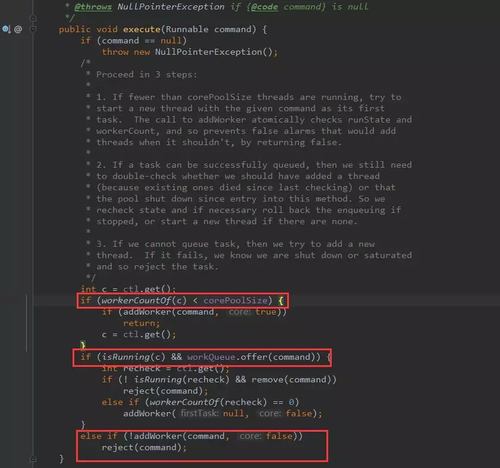

- 第一个红框：workerCountOf方法根据ctl的低29位，得到线程池的当前线程数，如果线程数小于corePoolSize，则执行addWorker方法创建新的线程执行任务；
- 第二个红框：判断线程池是否在运行，如果在，任务队列是否允许插入，插入成功再次验证线程池是否运行，如果不在运行，移除插入的任务，然后抛出拒绝策略。如果在运行，没有线程了，就启用一个线程。
- 第三个红框：如果添加非核心线程失败，就直接拒绝了。

这里逻辑稍微有点复杂，画了个流程图仅供参考

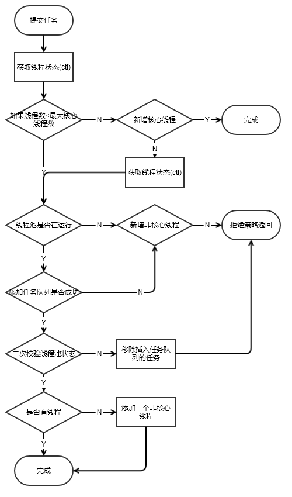

## 添加worker线程

从方法execute的实现可以看出：addWorker主要负责创建新的线程并执行任务，代码如下（这里代码有点长，没关系，也是分块的，总共有5个关键的代码块）：

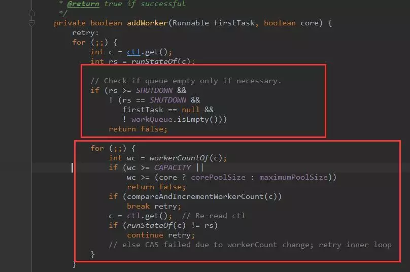

- 第一个红框：做是否能够添加工作线程条件过滤：判断线程池的状态，如果线程池的状态值大于或等SHUTDOWN，则不处理提交的任务，直接返回；

- 第二个红框：做自旋，更新创建线程数量：通过参数core判断当前需要创建的线程是否为核心线程，如果core为true，且当前线程数小于corePoolSize，则跳出循环，开始创建新的线程

> 有人或许会疑问 retry 是什么？这个是java中的goto语法。只能运用在break和continue后面。

接着看后面的代码：

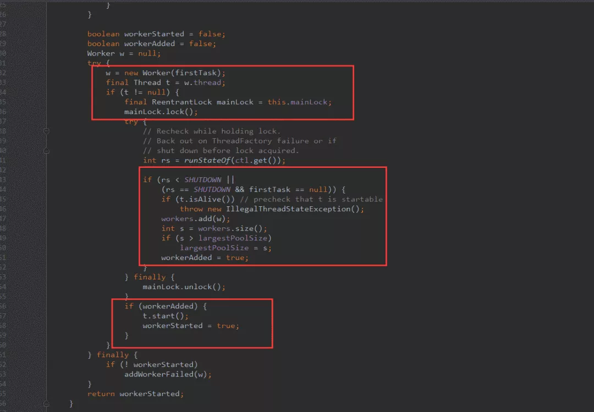

- 第一个红框：获取线程池主锁。线程池的工作线程通过Woker类实现，通过ReentrantLock锁保证线程安全。

- 第二个红框：添加线程到workers中（线程池中）。

- 第三个红框：启动新建的线程。

接下来，我们看看workers是什么。

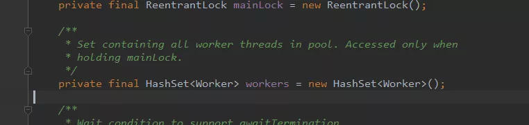

一个hashSet。所以，线程池底层的存储结构其实就是一个HashSet。

## worker线程处理队列任务

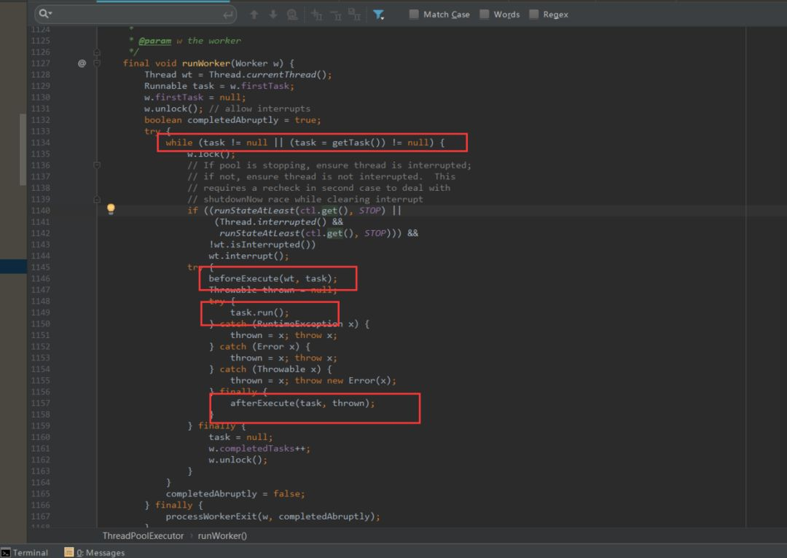

- 第一个红框：是否是第一次执行任务，或者从队列中可以获取到任务。
- 第二个红框：获取到任务后，执行任务开始前操作钩子。
- 第三个红框：执行任务。
- 第四个红框：执行任务后钩子。

这两个钩子（beforeExecute，afterExecute）允许我们自己继承线程池，做任务执行前后处理。

到这里，源代码分析到此为止。接下来做一下简单的总结。

## 总结

所谓线程池本质是一个hashSet。多余的任务会放在阻塞队列中。

只有当阻塞队列满了后，才会触发非核心线程的创建。所以非核心线程只是临时过来打杂的。直到空闲了，然后自己关闭了。

线程池提供了两个钩子（beforeExecute，afterExecute）给我们，我们继承线程池，在执行任务前后做一些事情。

线程池原理关键技术：锁（lock,cas）、阻塞队列、hashSet（资源池）

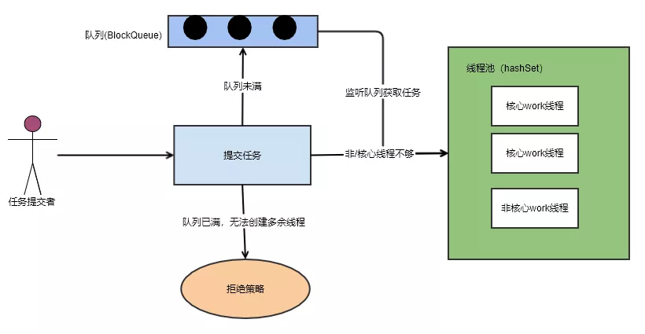

# 为什么不允许使用Executors创建线程池

为什么我说不建议大家使用这个类来创建线程池呢？

我提到的是『不建议』，但是在阿里巴巴Java开发手册中也明确指出，而且用的词是『不允许』使用Executors创建线程池。

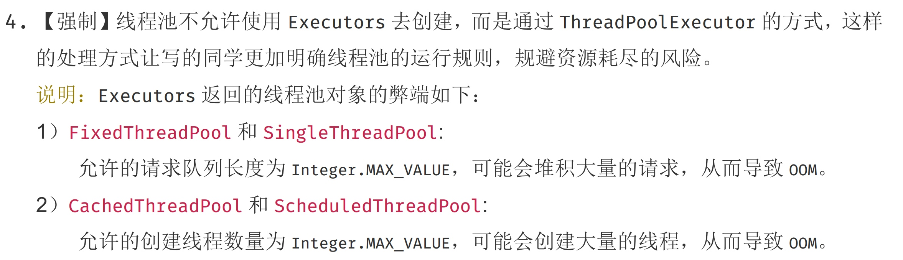

## Executors存在什么问题

在阿里巴巴Java开发手册中提到，使用Executors创建线程池可能会导致OOM(OutOfMemory ,内存溢出)，但是并没有说明为什么，那么接下来我们就来看一下到底为什么不允许使用Executors？

我们先来一个简单的例子，模拟一下使用Executors导致OOM的情况。

```java
/**
 * @author Hollis
 */
public class ExecutorsDemo {
    private static ExecutorService executor = Executors.newFixedThreadPool(15);
    public static void main(String[] args) {
        for (int i = 0; i < Integer.MAX_VALUE; i++) {
            executor.execute(new SubThread());
        }
    }
}

class SubThread implements Runnable {
    @Override
    public void run() {
        try {
            Thread.sleep(10000);
        } catch (InterruptedException e) {
            //do nothing
        }
    }
}
```

通过指定JVM参数：-Xmx8m -Xms8m 运行以上代码，会抛出OOM：

```java
Exception in thread "main" java.lang.OutOfMemoryError: GC overhead limit exceeded
    at java.util.concurrent.LinkedBlockingQueue.offer(LinkedBlockingQueue.java:416)
    at java.util.concurrent.ThreadPoolExecutor.execute(ThreadPoolExecutor.java:1371)
    at com.hollis.ExecutorsDemo.main(ExecutorsDemo.java:16)
```

以上代码指出，ExecutorsDemo.java的第16行，就是代码中的executor.execute(new SubThread());。

## Executors为什么存在缺陷

通过上面的例子，我们知道了Executors创建的线程池存在OOM的风险，那么到底是什么原因导致的呢？我们需要深入Executors的源码来分析一下。

其实，在上面的报错信息中，我们是可以看出蛛丝马迹的，在以上的代码中其实已经说了，真正的导致OOM的其实是LinkedBlockingQueue.offer方法。

```java
Exception in thread "main" java.lang.OutOfMemoryError: GC overhead limit exceeded
    at java.util.concurrent.LinkedBlockingQueue.offer(LinkedBlockingQueue.java:416)
    at java.util.concurrent.ThreadPoolExecutor.execute(ThreadPoolExecutor.java:1371)
    at com.hollis.ExecutorsDemo.main(ExecutorsDemo.java:16)
```

其实底层确实是通过LinkedBlockingQueue实现的：

```java
public static ExecutorService newFixedThreadPool(int nThreads) {
        return new ThreadPoolExecutor(nThreads, nThreads, 0L, TimeUnit.MILLISECONDS, new LinkedBlockingQueue<Runnable>());
```

Java中的BlockingQueue主要有两种实现，分别是ArrayBlockingQueue 和 LinkedBlockingQueue。

ArrayBlockingQueue是一个用数组实现的有界阻塞队列，必须设置容量。

LinkedBlockingQueue是一个用链表实现的有界阻塞队列，容量可以选择进行设置，不设置的话，将是一个无边界的阻塞队列，最大长度为Integer.MAX_VALUE。

这里的问题就出在：**不设置的话，将是一个无边界的阻塞队列，最大长度为Integer.MAX_VALUE。也就是说，如果我们不设置LinkedBlockingQueue的容量的话，其默认容量将会是Integer.MAX_VALUE**。

而newFixedThreadPool中创建LinkedBlockingQueue时，并未指定容量。此时，LinkedBlockingQueue就是一个无边界队列，对于一个无边界队列来说，是可以不断的向队列中加入任务的，这种情况下就有可能因为任务过多而导致内存溢出问题。

上面提到的问题主要体现在newFixedThreadPool和newSingleThreadExecutor两个工厂方法上，并不是说newCachedThreadPool和newScheduledThreadPool这两个方法就安全了，这两种方式创建的最大线程数可能是Integer.MAX_VALUE，而创建这么多线程，必然就有可能导致OOM。

## 创建线程池的正确姿势

避免使用Executors创建线程池，主要是避免使用其中的默认实现，那么我们可以自己直接调用ThreadPoolExecutor的构造函数来自己创建线程池。在创建的同时，给BlockQueue指定容量就可以了。

```java
private static ExecutorService executor = new ThreadPoolExecutor(10, 10, 60L, TimeUnit.SECONDS, new ArrayBlockingQueue(10));
```

这种情况下，一旦提交的线程数超过当前可用线程数时，就会抛出java.util.concurrent.RejectedExecutionException，这是因为当前线程池使用的队列是有边界队列，队列已经满了便无法继续处理新的请求。但是异常（Exception）总比发生错误（Error）要好。

除了自己定义ThreadPoolExecutor外。还有其他方法。这个时候第一时间就应该想到开源类库，如apache和guava等。

作者推荐使用guava提供的ThreadFactoryBuilder来创建线程池。

```java
public class ExecutorsDemo {

    private static ThreadFactory namedThreadFactory = new ThreadFactoryBuilder().setNameFormat("demo-pool-%d").build();

    private static ExecutorService pool = new ThreadPoolExecutor(5, 200,
        0L, TimeUnit.MILLISECONDS,
        new LinkedBlockingQueue<Runnable>(1024), namedThreadFactory, new ThreadPoolExecutor.AbortPolicy());

    public static void main(String[] args) {

        for (int i = 0; i < Integer.MAX_VALUE; i++) {
            pool.execute(new SubThread());
        }
    }
}
```

通过上述方式创建线程时，不仅可以避免OOM的问题，还可以自定义线程名称，更加方便的出错的时候溯源。