转载：https://www.hollischuang.com/archives/3060

# 什么是线程安全

线程安全，维基百科中的解释是：

> 线程安全是编程中的术语，指某个函数、函数库在并发环境中被调用时，能够正确地处理多个线程之间的共享变量，使程序功能正确完成。

我们把这个定义拆解一下，我们需要弄清楚这么几点： 1、并发 2、多线程 3、共享变量

## 并发

提到线程安全，必须要提及的一个词那就是并发，如果没有并发的话，那么也就不存在线程安全问题了。

### 什么是并发

并发（Concurrent），在操作系统中，是指一个时间段中有几个程序都处于已启动运行到运行完毕之间，且这几个程序都是在同一个处理机上运行。

那么，操作系统视如何实现这种并发的呢？

现在我们用到操作系统，无论是Windows、Linux还是MacOS等其实都是**多用户多任务分时操作系统**。使用这些操作系统的用户是可以“同时”干多件事的。

但是实际上，对于单CPU的计算机来说，在CPU中，同一时间是只能干一件事儿的。为了看起来像是“同时干多件事”，分时操作系统是把CPU的时间划分成长短基本相同的时间区间,即”时间片”，通过操作系统的管理，把这些时间片依次轮流地分配给各个用户使用。

如果某个作业在时间片结束之前,整个任务还没有完成，那么该作业就被暂停下来,放弃CPU，等待下一轮循环再继续做.此时CPU又分配给另一个作业去使用。

由于计算机的处理速度很快，只要时间片的间隔取得适当,那么一个用户作业从用完分配给它的一个时间片到获得下一个CPU时间片，中间有所”停顿”，但用户察觉不出来,好像整个系统全由它”独占”似的。

所以，在单CPU的计算机中，我们看起来“同时干多件事”，其实是通过CPU时间片技术，并发完成的。

提到并发，还有另外一个词容易和他混淆，那就是并行。

### 并发与并行之间的关系

并行（Parallel），当系统有一个以上CPU时，当一个CPU执行一个进程时，另一个CPU可以执行另一个进程，两个进程互不抢占CPU资源，可以同时进行，这种方式我们称之为并行(Parallel)。

Erlang 之父 Joe Armstrong 用一张比较形象的图解释了并发与并行的区别：


并发是两个队伍交替使用一台咖啡机。并行是两个队伍同时使用两台咖啡机。

映射到计算机系统中，上图中的咖啡机就是CPU，两个队伍指的就是两个进程。

## 多线程

### 进程和线程

理解了并发和并行之间的关系和区别后，我们再回到前面介绍的多任务分时操作系统，看看CPU是如何进行进程调度的。

为了看起来像是“同时干多件事”，分时操作系统是把CPU的时间划分成长短基本相同的”时间片”，通过操作系统的管理，把这些时间片依次轮流地分配给各个用户的各个任务使用。

在多任务处理系统中，CPU需要处理所有程序的操作，当用户来回切换它们时，需要记录这些程序执行到哪里。在操作系统中，CPU切换到另一个进程需要保存当前进程的状态并恢复另一个进程的状态：当前运行任务转为就绪（或者挂起、删除）状态，另一个被选定的就绪任务成为当前任务。**上下文切换**就是这样一个过程，他允许CPU记录并恢复各种正在运行程序的状态，使它能够完成切换操作。

> 在上下文切换过程中，CPU会停止处理当前运行的程序，并保存当前程序运行的具体位置以便之后继续运行。从这个角度来看，上下文切换有点像我们同时阅读几本书，在来回切换书本的同时我们需要记住每本书当前读到的页码。在程序中，上下文切换过程中的“页码”信息是保存在进程控制块（PCB）中的。PCB还经常被称作“切换帧”（switchframe）。“页码”信息会一直保存到CPU的内存中，直到他们被再次使用。

对于操作系统来说，一个任务就是一个进程（Process），比如打开一个浏览器就是启动一个浏览器进程，打开一个记事本就启动了一个记事本进程，打开两个记事本就启动了两个记事本进程，打开一个Word就启动了一个Word进程。

而在多个进程之间切换的时候，需要进行上下文切换。但是上下文切换势必会耗费一些资源。于是人们考虑，能不能在一个进程中增加一些“子任务”，这样减少上下文切换的成本。比如我们使用Word的时候，它可以同时进行打字、拼写检查、字数统计等，这些子任务之间共用同一个进程资源，但是他们之间的切换不需要进行上下文切换。

在一个进程内部，要同时干多件事，就需要同时运行多个“子任务”，我们把进程内的这些“子任务”称为线程（Thread）。

随着时间的慢慢发展，人们进一步的切分了进程和线程之间的职责。**把进程当做资源分配的基本单元，把线程当做执行的基本单元，同一个进程的多个线程之间共享资源**。

拿我们比较熟悉的Java语言来说，Java程序是运行在JVM上面的，每一个JVM其实就是一个进程。所有的资源分配都是基于JVM进程来的。而在这个JVM进程中，又可以创建出很多线程，多个线程之间共享JVM资源，并且多个线程可以并发执行。

## 共享变量

所谓共享变量，**指的是多个线程都可以操作的变量**。

前面我们提到过，进程视分配资源的基本单位，线程是执行的基本单位。所以，多个线程之间是可以共享一部分进程中的数据的。在JVM中，Java堆和方法区的区域是多个线程共享的数据区域。也就是说，多个线程可以操作保存在堆或者方法区中的同一个数据。那么，换句话说，保存在堆和方法区中的变量就是Java中的共享变量。

那么，Java中哪些变量是存放在堆中，哪些变量是存放在方法区中，又有哪些变量是存放在栈中的呢？

### 类变量、成员变量和局部变量

Java中共有三种变量，分别是类变量、成员变量和局部变量。他们分别存放在JVM的方法区、堆内存和栈内存中。

```java
/**
 * @author Hollis
 */
public class Variables {

    /**
     * 类变量
     */
    private static int a;

    /**
     * 成员变量
     */
    private int b;

    /**
     * 局部变量
     * @param c
     */
    public void test(int c){
        int d;
    }
}
```

上面定义的三个变量中，变量a就是类变量，变量b就是成员变量，而变量c和d是局部变量。

所以，变量a和b是共享变量，变量c和d是非共享变量。所以如果遇到多线程场景，对于变量a和b的操作是需要考虑线程安全的，而对于线程c和d的操作是不需要考虑线程安全的。

# 多级缓存和一致性问题

转载：https://blog.csdn.net/zlt995768025/article/details/81275373

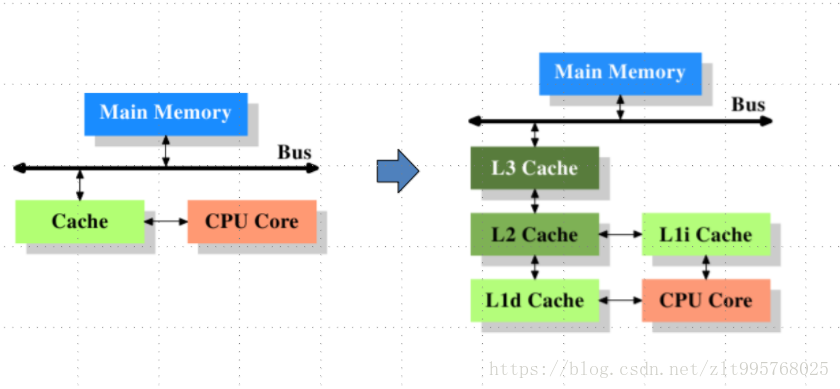

## CPU缓存定义

cpu缓存是位于CPU与内存之间的临时存储器，它的容量比内存小的多，但是交换速度却比内存要快得多

## 为什么需要CPU cache?

cpu的频率太快了，快到主存跟不上，这样在处理器时钟周期内，cpu常常需要等待主存，浪费资源。cache的出现，是为了缓解cpu和主存之间速度的不匹配问题（结构：cpu->cache>memory）

## CPU cache有什么意义？

1. 时间局部性：如果某个数据被访问，那么在不久的将来它很可能被再次访问

2. 空间局部性：如果某个数据被访问，那么与它相邻的数据很快也可能被访问

## CPU多级缓存-缓存一致性(MESI) 多个CPU


用于保证多个CPU cache之间缓存共享数据的一致，也可以通过给总线加LOCK锁的方式来保证缓存一致性

每个缓存行有如下M、E、S、I 四种状态

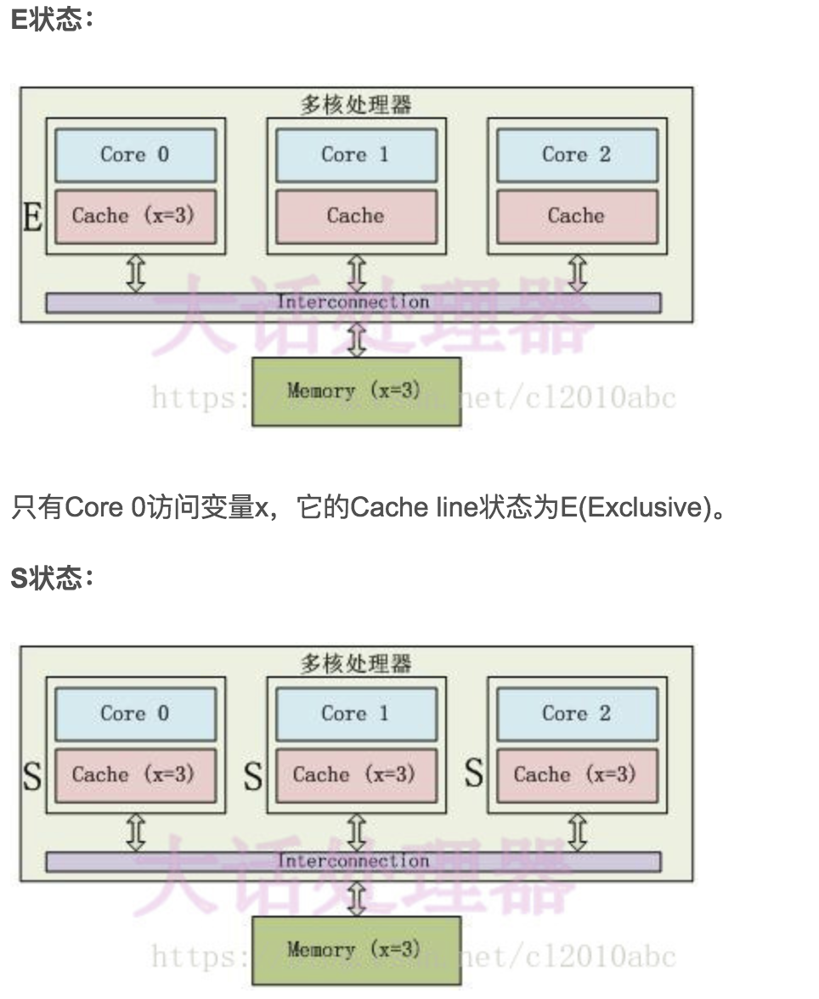

3个Core都访问变量x，它们对应的Cache line为S(Shared)状态

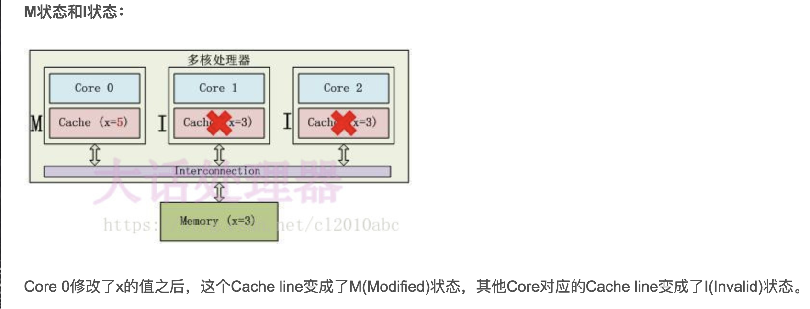

MESI四种状态的转换：


- M(Modified)：被修改，该缓存行只被缓存在该CPU的缓存中，并且是被修改过的，目前与主存的数据不一致，即该缓存需要在未来的某个时间点（并且允许其他CPU读取该主存中相应内存之间）写回主内存，当被写回主存之后，该缓存行的状态会变成独享（Exclusive）状态
- E(Exclusive)：独享的，该缓存行只被缓存在该CPU的缓存中，它是未被修改过的，与主存中的数据一致。该状态可以在任何时刻当有其它CPU读取该内存时变成共享状态。同样地，当CPU修改该缓存行中内容时，该状态可以变成Modified状态
- S(Shared)：共享的，该状态意味着该缓存行可能被多个CPU缓存，并且各个缓存中的数据与主存数据一致，当有一个CPU修改该缓存行时，其他CPU中对该缓存行的缓存可以被作废，变为无效状态（Invalid）
- I(Invalid)：该缓存是无效的

|   状态    |   描述    |
|  ----  | ----  |
|   M(Modified) |   这行数据有效，数据被修改了，和内存中的数据不一致，数据只存在于本Cache中。   |
|   E(Exclusive)    |   这行数据有效，数据和内存中的数据一致，数据只存在于本Cache中。   |
|   S(Shared)   |   这行数据有效，数据和内存中的数据一致，数据存在于很多Cache中。   |
|   I(Invalid)  |   这行数据无效    |

MESI状态之间的迁移过程

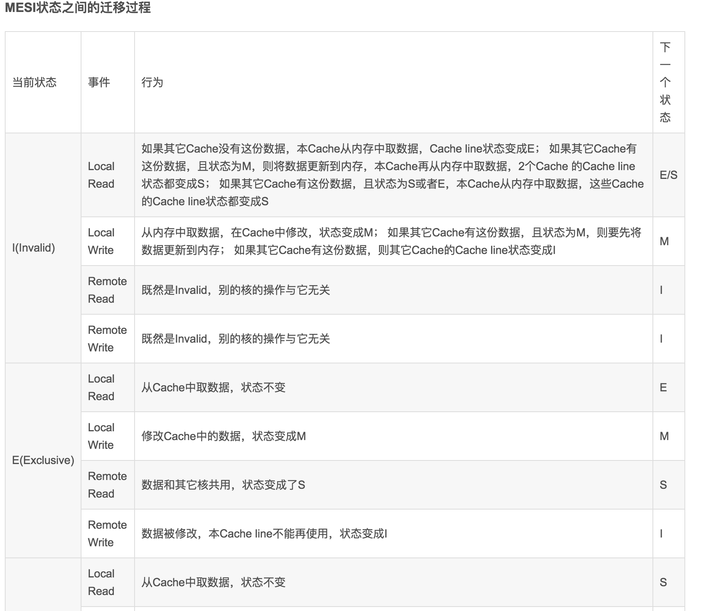


从CPU读写角度来说：

- CPU读请求：缓存处于M、E、S状态都可以被读取，I状态CPU只能从主存中读取数据
- CPU写请求：缓存处于M、E状态才可以被写。对于S状态的写，需要将其他CPU中缓存行置为无效才可写

典型的例子如下：

在一个典型系统中，可能会有几个缓存（在多核系统中，每个核心都会有自己的缓存）共享主存总线，每个相应的CPU会发出读写请求，而缓存的目的是为了减少CPU读写共享主存的次数。

**一个缓存除在Invalid状态外都可以满足cpu的读请求**，**一个invalid的缓存行必须从主存中读取（变成S或者E状态）来满足该CPU的读请求**。

**一个写请求只有在该缓存行是M或者E状态时才能被执行，如果缓存行处于S状态，必须先将其它缓存中该缓存行变成Invalid状态（也即是不允许不同CPU同时修改同一缓存行，即使修改该缓存行中不同位置的数据也不允许）**。该操作经常作用广播的方式来完成，例如：Request For Ownership (RFO)

**缓存可以随时将一个非M状态的缓存行作废，或者变成Invalid状态，而一个M状态的缓存行必须先被写回主存。**

**一个处于M状态的缓存行必须时刻监听所有试图读该缓存行相对于主存的操作，这种操作必须在缓存将该缓存行写回主存并将状态变成S状态之前被延迟执行**。就是这个处于M状态的缓存保存了主存中某一位置的数据，处于M表示这个数据已经改变了，所以其他缓存如果想要读取主存中这个位置的数据，就需要先将处于M状态的缓存写回主存才能让他读取。

**一个处于S状态的缓存行也必须监听其它缓存使该缓存行无效或者独享该缓存行的请求，并将该缓存行变成无效**(Invalid)。

**一个处于E状态的缓存行也必须监听其它缓存读主存中该缓存行的操作，一旦有这种操作，该缓存行需要变成S状态**。
此时其他缓存也存有主存中对应位置的数据，所以他不在是独享的了，变成共享的。

**​对于M和E状态而言总是精确的，他们在和该缓存行的真正状态是一致的**。而S状态可能是非一致的，如果一个缓存将处于S状态的缓存行作废了，而另一个缓存实际上可能已经独享了该缓存行，但是该缓存却不会将该缓存行升迁为E状态，这是因为其它缓存不会广播他们作废掉该缓存行的通知，同样由于缓存并没有保存该缓存行的copy的数量，因此（即使有这种通知）也没有办法确定自己是否已经独享了该缓存行。

## 缓存一致性的核心思想为（以多核CPU为例）

当CPU写数据时，如果发现操作的变量是共享变量，即在其他CPU中也存在该变量的副本，会发出信号通知其他CPU将该变量的缓存行置为无效状态，因此当其他CPU需要读取这个变量时，发现自己缓存中的缓存该变量的缓存行是无效的，那么它就会重新从内存中读取。

## 既然有缓存一致性了，为什么还要有volatile？

JVM的工作内存，还包括了内存中的一部分，仅仅依靠缓存一致性，不能保证工作内存的变量在线程之间可见。

# CPU时间片和原子性问题

## 时间片的概念是什么？

时间片即CPU分配给各个程序的时间，每个线程被分配一个时间段，称作它的时间片，即该进程允许运行的时间，使各个程序从表面上看是同时进行的。

如果在时间片结束时进程还在运行，则CPU将被剥夺并分配给另一个进程。如果进程在时间片结束前阻塞或结束，则CPU当即进行切换。而不会造成CPU资源浪费。

在宏观上：我们可以同时打开多个应用程序，每个程序并行不悖，同时运行。但在微观上：由于只有一个CPU，一次只能处理程序要求的一部分，如何处理公平，一种方法就是引入时间片，每个程序轮流执行。

## 原子性

是指CPU在执行操作时，要么执行要么不执行，对于单个的读/写操作，在多线程环境下保证是原子操作，但复合操作比如i++，相当于是以下三个操作：

```java
int temp = get();  // 读
temp += 1;         // ADD
set(temp);         // 写
```

Java主要提供了锁机制以及CAS操作实现原子性，对于单个读/写操作是通过LOCK#信号或“缓存锁定”实现的。
除此之外，long和double类型的变量读/写是非原子性的，每次都只读/写32位数据，所以一个单个的读/写操作就变成了两个读/写操作，有可能在只读/写了其中32位操作后CPU就被其他线程抢占到。


# 指令重排和有序性问题

转载：https://blog.csdn.net/sdr_zd/article/details/81323519

编译器和处理器会通过多种方式比如重排序对代码进行优化，然而在重排序后可能会导致运行结果与预想的不同。

## 指令重排

### 重排序的方式

计算机在执行程序时，为了提高性能，编译器和处理器的常常会对指令做重排，一般分以下3种：


- 编译器优化的重排序：编译器在不改变单线程程序语义的前提下，可以重新安排语句的执行顺序。【as-if-serial原则保证，as-if-serial语义：不管怎么重排序（编译器和处理器为了提高并行度），（单线程）程序的执行结果不能被改变。】
- 指令级并行的重排序：现代处理器采用了指令级并行技术来将多条指令重叠执行。如果不存在数据依赖性(即后一个执行的语句无需依赖前面执行的语句的结果)，处理器可以改变语句对应的机器指令的执行顺序。
- 内存系统重排序：由于处理器使用缓存和读写缓存冲区，这使得加载(load)和存储(store)操作看上去可能是在乱序执行，因为三级缓存的存在，导致内存与缓存的数据同步存在时间差。

### 内存屏障（Memory Barrier，又称内存栅栏）

内存屏障是一个CPU指令，Java编译器在生成指令序列的适当位置会插入内存屏障指令来禁止特定类型的处理器重排序。它的作用有两个：

- 一是保证特定操作的执行顺序；
- 二是保证某些变量的内存可见性。

如果在指令间插入一条Memory Barrier则会告诉编译器和CPU，不管什么指令都不能和这条Memory Barrier指令重排序，也就是说通过**插入内存屏障禁止在内存屏障前后的指令执行重排序优化**。

Memory Barrier的另外一个作用是**强制刷出各种CPU的缓存数据**，因此任何CPU上的线程都能读取到这些数据的最新版本。

JMM把内存屏障指令分为下列四类：


## 有序性

# 线程安全和内存模型的关系

# happens-before

转载：https://blog.csdn.net/weixin_34242658/article/details/91405561

https://blog.csdn.net/fristjcjdncg/article/details/107836688

happens-before字面翻译过来就是先行发生，A happens-before B 就是A 先行发生于B？

不准确！在Java内存模型中，happens-before 应该翻译成：**前一个操作的结果可以被后续的操作获取。讲白点就是前面一个操作把变量a赋值为1，那后面一个操作肯定能知道a已经变成了1**。

我们再来看看为什么需要这几条规则？

因为我们现在电脑都是多CPU,并且都有缓存，导致多线程直接的可见性问题。

所以为了解决多线程的可见性问题，就搞出了happens-before原则，让线程之间遵守这些原则。编译器还会优化我们的语句，所以等于是给了编译器优化的约束。不能让它优化的不知道东南西北了！

咱们来看看这几条规则：

- 程序次序规则：在一个线程内一段代码的执行结果是有序的。就是还会指令重排，但是随便它怎么排，**结果是按照我们代码的顺序生成的不会变**！
- 管程锁定规则：就是无论是在单线程环境还是多线程环境，**对于同一个锁来说，一个线程对这个锁解锁之后，另一个线程获取了这个锁都能看到前一个线程的操作结果**！(管程是一种通用的同步原语,synchronized就是管程的实现）
- volatile变量规则：就是如果一个线程先去写一个volatile变量，然后一个线程去读这个变量，那么这个写操作的结果一定对读的这个线程可见。
- 线程启动规则：在主线程A执行过程中，启动子线程B，那么线程A在启动子线程B之前对共享变量的修改结果对线程B可见。
- 线程终止规则：在主线程A执行过程中，子线程B终止，那么线程B在终止之前对共享变量的修改结果在线程A中可见。
- 线程中断规则：对**线程interrupt()方法的调用**先行发生于**被中断线程代码检测到中断事件**的发生，可以通过Thread.interrupted()检测到是否发生中断。
- 传递规则：这个简单的，就是happens-before原则**具有传递性**，即A happens-before B , B happens-before C，那么A happens-before C。
- 对象终结规则：这个也简单的，就是一个对象的初始化的完成，也就是构造函数执行的结束一定 happens-before它的finalize()方法。

# as-if-serial

as-if-serial语义的意思指：

不管怎么重排序（编译器和处理器为了提高并行度），（单线程）程序的执行结果不能被改变。编译器，runtime 和处理器都必须遵守as-if-serial语义。为了遵守as-if-serial语义，编译器和处理器不会对存在数据依赖关系的操作做重排序，因为这种重排序会改变执行结果。但是，如果操作之间不存在数据依赖关系

这些操作可能被编译器和处理器重排序。为了具体说明，请看下面计算圆面积的代码示例：

```java
double pi  = 3.14;    //A
double r   = 1.0;     //B
double area = pi * r * r; //C
```

上面三个操作的数据依赖关系如下图所示：


如上图所示，A和C之间存在数据依赖关系，同时B和C之间也存在数据依赖关系。因此在最终执行的指令序列中，C不能被重排序到A和B的前面（C排到 A和B的前面，程序的结果将会被改变）。

但A和B之间没有数据依赖关系，编译器和处理器可以重排序A和B之间的执行顺序。下图是该程序的两种执行顺序：


as-if-serial语义把单线程程序保护了起来，遵守as-if-serial语义的编译器，runtime 和处理器共同为编写单线程程序的程序员创建了一个幻觉：单线程程序是按程序的顺序来执行的。

as-if-serial语义使单线程程序员无需担心重排序会 干扰他们，也无需担心内存可见性问题。

> 前面的一些文章我看得一头雾水，补一下这个JMM和底层实现原理（JAVA内存模型(java memory model)）

# JMM和底层实现原理

转载：https://www.jianshu.com/p/8a58d8335270

## 并发编程领域的关键问题

### 线程之间的通信

线程的通信是指线程之间以何种机制来交换信息。在编程中，线程之间的通信机制有两种，**共享内存和消息传递**。

在共享内存的并发模型里，线程之间共享程序的公共状态，线程之间通过写-读内存中的公共状态来隐式进行通信，典型的共享内存通信方式就是通过共享对象进行通信。

在消息传递的并发模型里，线程之间没有公共状态，线程之间必须通过明确的发送消息来显式进行通信，在java中典型的消息传递方式就是wait()和notify()。

### 线程间的同步

同步是指程序用于控制不同线程之间操作发生相对顺序的机制。

在共享内存并发模型里，同步是显式进行的。程序员必须显式指定某个方法或某段代码需要在线程之间互斥执行。

在消息传递的并发模型里，由于消息的发送必须在消息的接收之前，因此同步是隐式进行的。

## Java内存模型——JMM

Java的并发采用的是共享内存模型

### 现代计算机的内存模型

物理计算机中的并发问题，物理机遇到的并发问题与虚拟机中的情况有不少相似之处，物理机对并发的处理方案对于虚拟机的实现也有相当大的参考意义。

其中一个重要的复杂性来源是绝大多数的运算任务都不可能只靠处理器“计算”就能完成，处理器至少要与内存交互，如读取运算数据、存储运算结果等，这个I/O操作是很难消除的（无法仅靠寄存器来完成所有运算任务）。早期计算机中cpu和内存的速度是差不多的，但在现代计算机中，**cpu的指令速度远超内存的存取速度,由于计算机的存储设备与处理器的运算速度有几个数量级的差距，所以现代计算机系统都不得不加入一层读写速度尽可能接近处理器运算速度的高速缓存（Cache）来作为内存与处理器之间的缓冲：将运算需要使用到的数据复制到缓存中，让运算能快速进行，当运算结束后再从缓存同步回内存之中，这样处理器就无须等待缓慢的内存读写了**。

基于高速缓存的存储交互很好地解决了处理器与内存的速度矛盾，但是也为计算机系统带来更高的复杂度，因为它引入了一个新的问题：**缓存一致性（Cache Coherence）**。在多处理器系统中，每个处理器都有自己的高速缓存，而它们又共享同一主内存（MainMemory）。当多个处理器的运算任务都涉及同一块主内存区域时，将可能导致各自的缓存数据不一致，举例说明变量在多个CPU之间的共享。如果真的发生这种情况，那同步回到主内存时以谁的缓存数据为准呢？为了解决一致性的问题，需要各个处理器访问缓存时都遵循一些协议，在读写时要根据协议来进行操作，这类协议有MSI、MESI（Illinois Protocol）、MOSI、Synapse、Firefly及Dragon Protocol等。

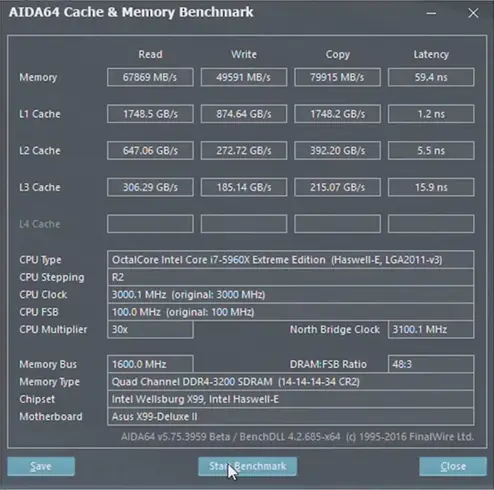

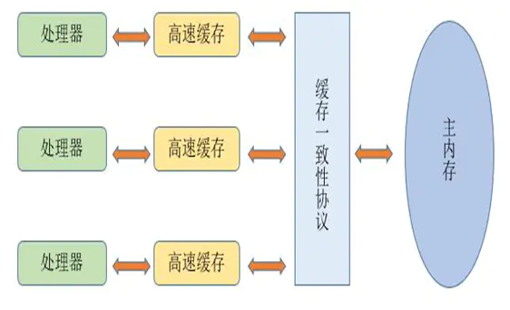

1. **该内存模型带来的问题**

现代的处理器**使用写缓冲区临时保存向内存写入的数据**。写缓冲区可以保证指令流水线持续运行，它可以避免由于处理器停顿下来等待向内存写入数据而产生的延迟。

同时，**通过以批处理的方式刷新写缓冲区，以及合并写缓冲区中对同一内存地址的多次写，减少对内存总线的占用**。

虽然写缓冲区有这么多好处，**但每个处理器上的写缓冲区，仅仅对它所在的处理器可见。这个特性会对内存操作的执行顺序产生重要的影响：处理器对内存的读/写操作的执行顺序，不一定与内存实际发生的读/写操作顺序一致**！

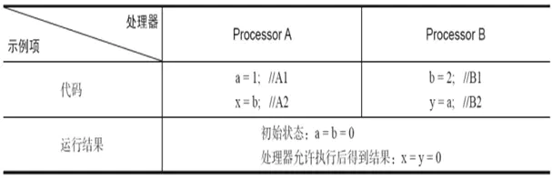

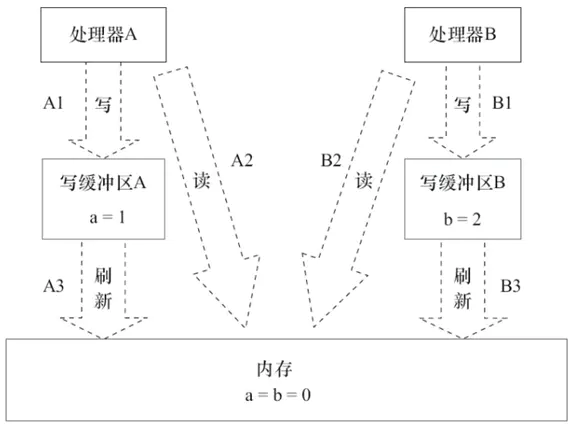

处理器A和处理器B按程序的顺序并行执行内存访问，最终可能得到x=y=0的结果。

处理器A和处理器B可以同时把共享变量写入自己的写缓冲区（A1，B1），然后从内存中读取另一个共享变量（A2，B2），最后才把自己写缓存区中保存的脏数据刷新到内存中（A3，B3）。当以这种时序执行时，程序就可以得到x=y=0的结果。

从内存操作实际发生的顺序来看，直到处理器A执行A3来刷新自己的写缓存区，写操作A1才算真正执行了。虽然处理器A执行内存操作的顺序为：A1→A2，但内存操作实际发生的顺序却是A2→A1。

### Java内存模型（JMM）

JMM定义了Java 虚拟机(JVM)在计算机内存(RAM)中的工作方式。JVM是整个计算机虚拟模型，所以JMM是隶属于JVM的。

从抽象的角度来看，JMM定义了线程和主内存之间的抽象关系：线程之间的共享变量存储在主内存（Main Memory）中，每个线程都有一个私有的本地内存（Local Memory），本地内存中存储了该线程以读/写共享变量的副本。

本地内存是JMM的一个抽象概念，并不真实存在。它涵盖了缓存、写缓冲区、寄存器以及其他的硬件和编译器优化。


#### JVM对Java内存模型的实现

在JVM内部，Java内存模型把内存分成了两部分：线程栈区和堆区

JVM中运行的每个线程都拥有自己的线程栈，线程栈包含了当前线程执行的方法调用相关信息，我们也把它称作调用栈。随着代码的不断执行，调用栈会不断变化。


**所有原始类型(boolean,byte,short,char,int,long,float,double)的局部变量都直接保存在线程栈当中**，对于它们的值各个线程之间都是独立的。对于原始类型的局部变量，一个线程可以传递一个副本给另一个线程，**但它们之间是无法共享的**。

堆区包含了Java应用创建的所有对象信息，不管对象是哪个线程创建的，**其中的对象包括原始类型的封装类（如Byte、Integer、Long等等）。不管对象是属于一个成员变量还是方法中的局部变量，它都会被存储在堆区**。

一个**局部变量如果是原始类型，那么它会被完全存储到栈区**。 一个**局部变量也有可能是一个对象的引用，这种情况下，这个本地引用会被存储到栈中，但是对象本身仍然存储在堆区**。

对于一个对象的成员方法，这些**方法中包含局部变量，仍需要存储在栈区**，即使它们所属的对象在堆区。 **对于一个对象的成员变量，不管它是原始类型还是包装类型，都会被存储到堆区**。**Static类型的变量以及类本身相关信息都会随着类本身存储在堆区**。

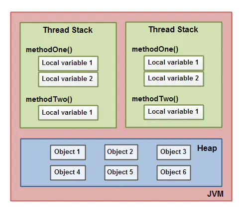

### Java内存模型带来的问题

#### 可见性问题

CPU中运行的线程从主存中拷贝共享对象obj到它的CPU缓存，把对象obj的count变量改为2。但这个变更对运行在右边CPU中的线程不可见，因为这个更改还没有flush到主存中：**要解决共享对象可见性这个问题，我们可以使用java volatile关键字或者是加锁**

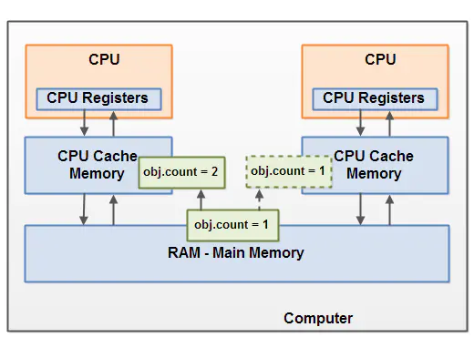

#### 竞争现象

线程A和线程B共享一个对象obj。假设线程A从主存读取Obj.count变量到自己的CPU缓存，同时，线程B也读取了Obj.count变量到它的CPU缓存，并且这两个线程都对Obj.count做了加1操作。此时，Obj.count加1操作被执行了两次，不过都在不同的CPU缓存中。如果这两个加1操作是串行执行的，那么Obj.count变量便会在原始值上加2，最终主存中的Obj.count的值会是3。然而下图中两个加1操作是并行的，不管是线程A还是线程B先flush计算结果到主存，最终主存中的Obj.count只会增加1次变成2，尽管一共有两次加1操作。 **要解决上面的问题我们可以使用java synchronized代码块**。

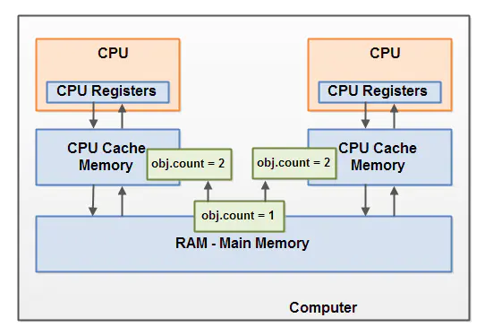

### Java内存模型中的重排序

在执行程序时，为了提高性能，编译器和处理器常常会对指令做重排序。

#### 重排序类型


1. 编译器优化的重排序。编译器在不改变单线程程序语义的前提下，可以重新安排语句的执行顺序。
2. 指令级并行的重排序。现代处理器采用了指令级并行技术（Instruction-LevelParallelism，ILP）来将多条指令重叠执行。如果不存在数据依赖性，处理器可以改变语句对应机器指令的执行顺序。
3. 内存系统的重排序。由于处理器使用缓存和读/写缓冲区，这使得加载和存储操作看上去可能是在乱序执行。

#### 重排序与依赖性

**数据依赖性**

如果两个操作访问同一个变量，且这两个操作中有一个为写操作，此时这两个操作之间就存在数据依赖性。数据依赖分为下列3种类型，这3种情况，只要重排序两个操作的执行顺序，程序的执行结果就会被改变。


**控制依赖性**

flag变量是个标记，用来标识变量a是否已被写入，在use方法中比变量i依赖if (flag)的判断，这里就叫控制依赖，如果发生了重排序，结果就不对了。


**as-if-serial**

不管如何重排序，都必须保证代码在单线程下的运行正确，连单线程下都无法正确，更不用讨论多线程并发的情况，所以就提出了一个as-if-serial的概念。

as-if-serial语义的意思是：不管怎么重排序（编译器和处理器为了提高并行度），（单线程）程序的执行结果不能被改变。编译器、runtime和处理器都必须遵守as-if-serial语义。

为了遵守as-if-serial语义，编译器和处理器不会对存在数据依赖关系的操作做重排序，因为这种重排序会改变执行结果。（强调一下，这里所说的数据依赖性仅针对单个处理器中执行的指令序列和单个线程中执行的操作，不同处理器之间和不同线程之间的数据依赖性不被编译器和处理器考虑。）但是，如果操作之间不存在数据依赖关系，这些操作依然可能被编译器和处理器重排序。

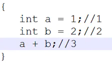

1和3之间存在数据依赖关系，同时2和3之间也存在数据依赖关系。因此在最终执行的指令序列中，3不能被重排序到1和2的前面（3排到1和2的前面，程序的结果将会被改变）。

但1和2之间没有数据依赖关系，编译器和处理器可以重排序1和2之间的执行顺序。

asif-serial语义使单线程下无需担心重排序的干扰，也无需担心内存可见性问题。

#### 并发下重排序带来的问题

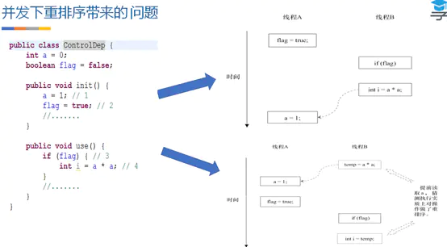

这里假设有两个线程A和B，A首先执行init ()方法，随后B线程接着执行use ()方法。线程B在执行操作4时，能否看到线程A在操作1对共享变量a的写入呢？答案是：不一定能看到。

由于操作1和操作2没有数据依赖关系，编译器和处理器可以对这两个操作重排序；同样，操作3和操作4没有数据依赖关系，编译器和处理器也可以对这两个操作重排序。

让我们先来看看，当操作1和操作2重排序时，可能会产生什么效果？操作1和操作2做了重排序。程序执行时，线程A首先写标记变量flag，随后线程B读这个变量。由于条件判断为真，线程B将读取变量a。此时，变量a还没有被线程A写入，这时就会发生错误！

当操作3和操作4重排序时会产生什么效果？

在程序中，操作3和操作4存在控制依赖关系。当代码中存在控制依赖性时，会影响指令序列执行的并行度。为此，**编译器和处理器会采用猜测（Speculation）执行来克服控制相关性对并行度的影响**。

以处理器的猜测执行为例，执行线程B的处理器可以提前读取并计算a*a，然后把计算结果临时保存到一个名为**重排序缓冲（Reorder Buffer，ROB）的硬件缓存**中。当操作3的条件判断为真时，就把该计算结果写入变量i中。猜测执行实质上对操作3和4做了重排序，问题在于这时候，a的值还没被线程A赋值。

在单线程程序中，对存在控制依赖的操作重排序，不会改变执行结果（这也是as-if-serial语义允许对存在控制依赖的操作做重排序的原因）；但在多线程程序中，对存在控制依赖的操作重排序，可能会改变程序的执行结果。

#### 解决在并发下的问题

1. **内存屏障——禁止重排序**

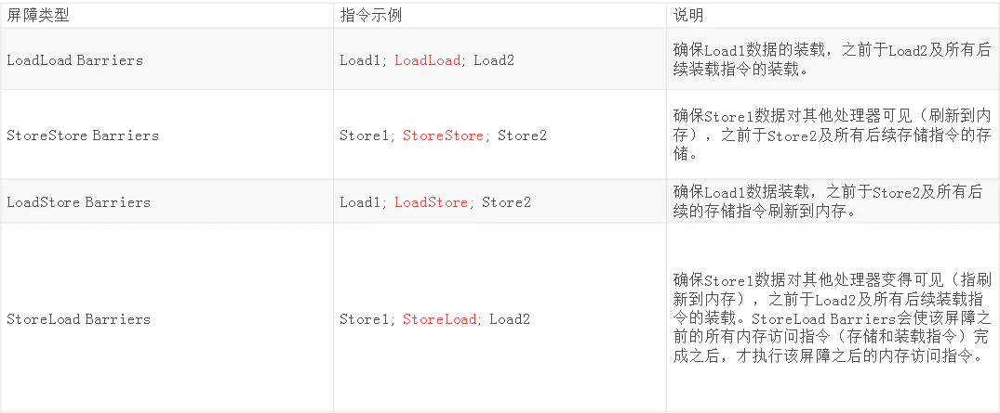

Java编译器在生成指令序列的适当位置会插入内存屏障指令来禁止特定类型的处理器重排序，从而让程序按我们预想的流程去执行。

1. 保证特定操作的执行顺序。
2. 影响某些数据（或则是某条指令的执行结果）的内存可见性。

编译器和CPU能够重排序指令，保证最终相同的结果，尝试优化性能。插入一条Memory Barrier会告诉编译器和CPU：不管什么指令都不能和这条Memory Barrier指令重排序。

Memory Barrier所做的另外一件事是强制刷出各种CPU cache，如一个Write-Barrier（写入屏障）将刷出所有在Barrier之前写入 cache 的数据，因此，任何CPU上的线程都能读取到这些数据的最新版本。

JMM把内存屏障指令分为4类，解释表格，StoreLoad Barriers是一个“全能型”的屏障，它同时具有其他3个屏障的效果。现代的多处理器大多支持该屏障（其他类型的屏障不一定被所有处理器支持）。

2. **临界区（synchronized？）**

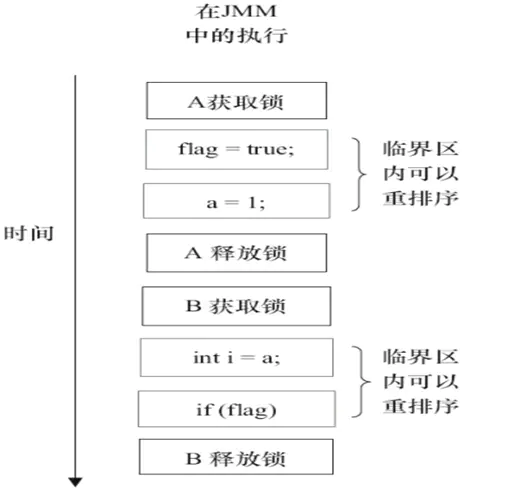

临界区内的代码可以重排序（但JMM不允许临界区内的代码“逸出”到临界区之外，那样会破坏监视器的语义）。

JMM会在退出临界区和进入临界区这两个关键时间点做一些特别处理，虽然线程A在临界区内做了重排序，但由于监视器互斥执行的特性，这里的线程B根本无法“观察”到线程A在临界区内的重排序。

这种重排序既提高了执行效率，又没有改变程序的执行结果。

### Happens-Before

用happens-before的概念来阐述操作之间的内存可见性。在JMM中，如果一个操作执行的结果需要对另一个操作可见，那么这两个操作之间必须要存在happens-before关系。

两个操作之间具有happens-before关系，并不意味着前一个操作必须要在后一个操作之前执行！happens-before仅仅要求前一个操作（执行的结果）对后一个操作可见，且前一个操作按顺序排在第二个操作之前（the first is visible to and ordered before the second）。

1）如果一个操作happens-before另一个操作，那么第一个操作的执行结果将对第二个操作可见，而且第一个操作的执行顺序排在第二个操作之前。(对程序员来说)

2）两个操作之间存在happens-before关系，并不意味着Java平台的具体实现必须要按照happens-before关系指定的顺序来执行。如果重排序之后的执行结果，与按happens-before关系来执行的结果一致，那么这种重排序是允许的(对编译器和处理器来说)

在Java规范提案中为让大家理解内存可见性的这个概念，提出了happens-before的概念来阐述操作之间的内存可见性。对应Java程序员来说，理解happens-before是理解JMM的关键。

JMM这么做的原因是：程序员对于这两个操作是否真的被重排序并不关心，程序员关心的是程序执行时的语义不能被改变（即执行结果不能被改变）。因此，happens-before关系本质上和as-if-serial语义是一回事。as-if-serial语义保证单线程内程序的执行结果不被改变，happens-before关系保证正确同步的多线程程序的执行结果不被改变。

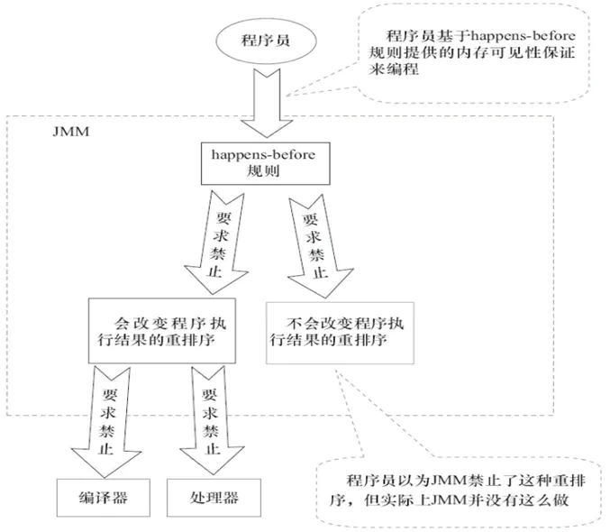

Happens-Before规则-无需任何同步手段就可以保证的：

- 程序顺序规则：一个线程中的每个操作，happens-before于该线程中的任意后续操作。
- 监视器锁规则：对一个锁的解锁，happens-before于随后对这个锁的加锁。
- volatile变量规则：对一个volatile域的写，happens-before于任意后续对这个volatile域的读。
- 传递性：如果A happens-before B，且B happens-before C，那么A happens-before C。
- start()规则：如果线程A执行操作ThreadB.start()（启动线程B），那么A线程的ThreadB.start()操作happens-before于线程B中的任意操作。
- join()规则：如果线程A执行操作ThreadB.join()并成功返回，那么线程B中的任意操作happens-before于线程A从ThreadB.join()操作成功返回。
- 线程中断规则:对线程interrupt方法的调用happens-before于被中断线程的代码检测到中断事件的发生。

## 实现原理

内存语义：可以简单理解为 volatile，synchronize，atomic，lock 之类的在 JVM 中的内存方面实现原则

### volatile的内存语义

volatile变量自身具有下列特性：

- 可见性。对一个volatile变量的读，总是能看到（任意线程）对这个volatile变量最后的写入。
- 原子性：对任意单个volatile变量的读/写具有原子性，但类似于volatile++这种复合操作不具有原子性。

volatile写的内存语义如下：当写一个volatile变量时，JMM会把该线程对应的本地内存中的共享变量值刷新到主内存。

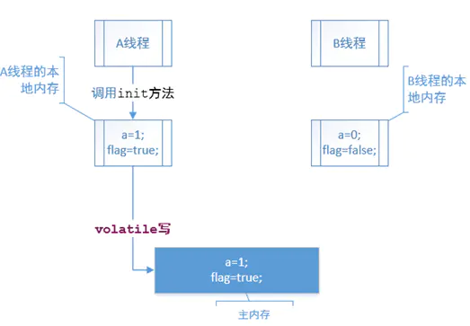

volatile读的内存语义如下：当读一个volatile变量时，JMM会把该线程对应的本地内存置为无效。线程接下来将从主内存中读取共享变量。

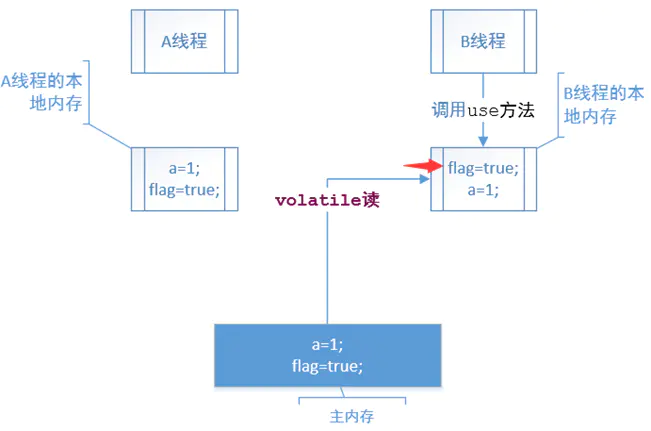

volatile重排序规则：

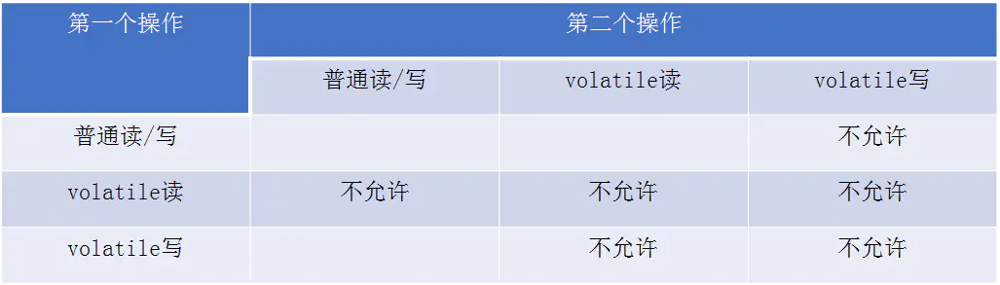

volatile内存语义的实现——JMM对volatile的内存屏障插入策略：

在每个volatile写操作的前面插入一个StoreStore屏障。在每个volatile写操作的后面插入一个StoreLoad屏障。

在每个volatile读操作的后面插入一个LoadLoad屏障。在每个volatile读操作的后面插入一个LoadStore屏障。

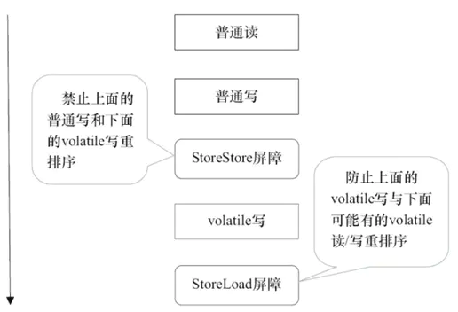

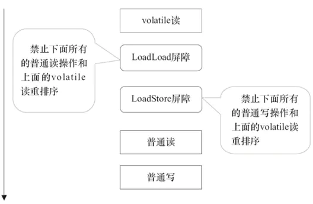

#### volatile的实现原理

有volatile变量修饰的共享变量进行写操作的时候会使用CPU提供的Lock前缀指令：

- 将当前处理器缓存行的数据写回到系统内存
- 这个写回内存的操作会使在其他CPU里缓存了该内存地址的数据无效。

### 锁的内存语义

当线程释放锁时，JMM会把该线程对应的本地内存中的共享变量刷新到主内存中。

当线程获取锁时，JMM会把该线程对应的本地内存置为无效。从而使得被监视器保护的临界区代码必须从主内存中读取共享变量。

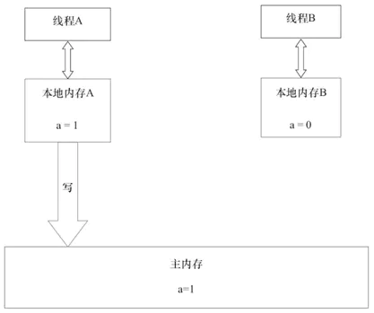

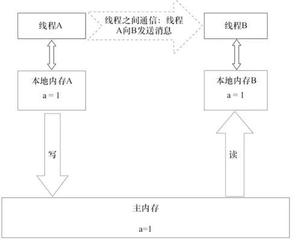

#### synchronized的实现原理

使用monitorenter和monitorexit指令实现的：

monitorenter指令是在编译后插入到同步代码块的开始位置，而monitorexit是插入到方法结束处和异常处
每个monitorenter必须有对应的monitorexit与之配对
任何对象都有一个monitor与之关联，当且一个monitor被持有后，它将处于锁定状态

锁的存放位置：

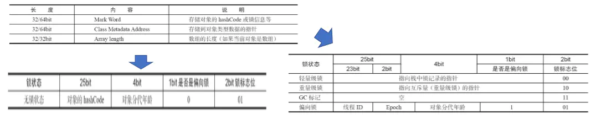

### 了解各种锁

锁一共有4种状态，级别从低到高依次是：无锁状态、偏向锁状态、轻量级锁状态和重量级锁状态。

偏向锁：大多数情况下，锁不仅不存在多线程竞争，而且总是由同一线程多次获得，为了让线程获得锁的代价更低而引入了偏向锁。无竞争时不需要进行CAS操作来加锁和解锁。

轻量级锁：无竞争时通过CAS操作来加锁和解锁。（自旋锁——是一种锁的机制，不是状态）

重量级锁：真正的加锁操作

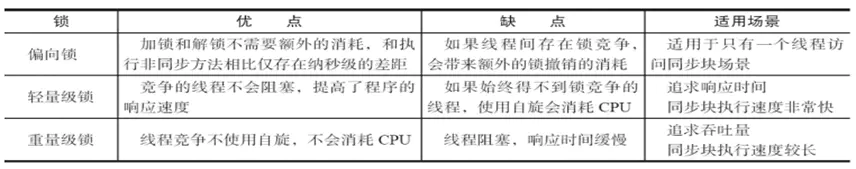

## final的内存语义

编译器和处理器要遵守两个重排序规则：

- 在构造函数内对一个final域的写入，与随后把这个被构造对象的引用赋值给一个引用变量，这两个操作之间不能重排序。
- 初次读一个包含final域的对象的引用，与随后初次读这个final域，这两个操作之间不能重排序。


final域为引用类型：

增加了如下规则：
- 在构造函数内对一个final引用的对象的成员域的写入，与随后在构造函数外把这个被构造对象的引用赋值给一个引用变量，这两个操作之间不能重排序。

final语义在处理器中的实现：

- 会要求编译器在final域的写之后，构造函数return之前插入一个StoreStore障屏。
- 读final域的重排序规则要求编译器在读final域的操作前面插入一个LoadLoad屏障
