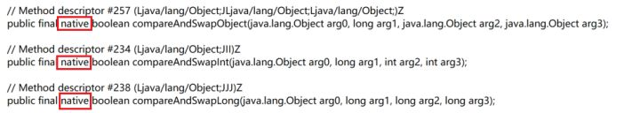

# 通俗易懂 悲观锁、乐观锁、可重入锁、自旋锁、偏向锁、轻量/重量级锁、读写锁、各种锁及其Java实现！

转载：https://zhuanlan.zhihu.com/p/71156910

首先要打消一种想法，就是一个锁只能属于一种分类。其实并不是这样，比如一个锁可以同时是悲观锁、可重入锁、公平锁、可中断锁等等，就像一个人可以是男人、医生、健身爱好者、游戏玩家，这并不矛盾。

## synchronized与Lock

Java中有两种加锁的方式：**一种是用synchronized关键字，另一种是用Lock接口的实现类**。

形象地说，synchronized关键字是自动档，可以满足一切日常驾驶需求。但是如果你想要玩漂移或者各种骚操作，就需要手动档了——各种Lock的实现类。

所以如果你只是想要简单的加个锁，对性能也没什么特别的要求，用synchronized关键字就足够了。

自Java 5之后，才在java.util.concurrent.locks包下有了另外一种方式来实现锁，那就是Lock。

也就是说，**synchronized是Java语言内置的关键字，而Lock是一个接口**，这个接口的实现类在代码层面实现了锁的功能，具体细节不在本文展开，有兴趣可以研究下AbstractQueuedSynchronizer类，写得可以说是牛逼爆了。


其实只需要关注三个类就可以了：ReentrantLock类、ReadLock类、WriteLock类。

ReentrantLock、ReadLock、WriteLock 是Lock接口最重要的三个实现类。对应了“可重入锁”、“读锁”和“写锁”，后面会讲它们的用途。

ReadWriteLock其实是一个工厂接口，而ReentrantReadWriteLock是ReadWriteLock的实现类，它包含两个静态内部类ReadLock和WriteLock。这两个静态内部类又分别实现了Lock接口。

我们停止深究源码，仅从使用的角度看，Lock与synchronized的区别是什么？在接下来的几个小节中，我将梳理各种锁分类的概念，以及synchronized关键字、各种Lock实现类之间的区别与联系。

## 悲观锁与乐观锁

悲观锁（Pessimistic Lock）, 就是很悲观，每次去拿数据的时候都认为别人会修改。所以每次在拿数据的时候都会上锁。这样别人想拿数据就被挡住，直到悲观锁被释放。

乐观锁（Optimistic Lock）, 就是很乐观，每次去拿数据的时候都认为别人不会修改。所以**不会上锁，不会上锁**！但是如果想要更新数据，则会在**更新前检查在读取至更新这段时间别人有没有修改过这个数据**。如果修改过，则重新读取，再次尝试更新，循环上述步骤直到更新成功（当然也允许更新失败的线程放弃操作）。

**不会上锁，不会上锁**，它们各有优缺点，不要认为一种一定好于另一种。像乐观锁适用于写比较少的情况下，即冲突真的很少发生的时候，这样可以省去锁的开销，加大了系统的整个吞吐量。但如果经常产生冲突，上层应用会不断的进行重试，这样反倒是降低了性能，所以这种情况下用悲观锁就比较合适。

### 乐观锁的基础——CAS

说到乐观锁，就必须提到一个概念：CAS

什么是CAS呢？Compare-and-Swap，即比较并替换，也有叫做Compare-and-Set的，比较并设置。

1. 比较：读取到了一个值A，在将其更新为B之前，检查原值是否仍为A（未被其他线程改动）。
2. 设置：如果是，将A更新为B，结束。如果不是，则什么都不做。

上面的两步操作是原子性的，可以简单地理解为瞬间完成，在CPU看来就是一步操作。

有了CAS，就可以实现一个乐观锁：

```java
data = 123; // 共享数据

/* 更新数据的线程会进行如下操作 */
flag = true;
while (flag) {
    oldValue = data; // 保存原始数据
    newValue = doSomething(oldValue); 

    // 下面的部分为CAS操作，尝试更新data的值
    if (data == oldValue) { // 比较
        data = newValue; // 设置
        flag = false; // 结束
    } else {
	// 啥也不干，循环重试
    }
}
/* 
   很明显，这样的代码根本不是原子性的，
   因为真正的CAS利用了CPU指令，
   这里只是为了展示执行流程，本意是一样的。
*/
```

这是一个简单直观的乐观锁实现，它允许多个线程同时读取（因为根本没有加锁操作），但是只有一个线程可以成功更新数据，并导致其他要更新数据的线程回滚重试。 CAS利用CPU指令，从硬件层面保证了操作的原子性，以达到类似于锁的效果。

Java中真正的CAS操作调用的native方法



因为整个过程中并没有“加锁”和“解锁”操作，因此乐观锁策略也被称为无锁编程。换句话说，乐观锁其实不是“锁”，它仅仅是一个循环重试CAS的算法而已！

## 自旋锁

有一种锁叫自旋锁。所谓自旋，说白了就是一个 while(true) 无限循环。

刚刚的乐观锁就有类似的无限循环操作，那么它是自旋锁吗？

不是。尽管自旋与 while(true) 的操作是一样的，但还是应该将这两个术语分开。“自旋”这两个字，特指自旋锁的自旋。

然而在JDK中并没有自旋锁（SpinLock）这个类，那什么才是自旋锁呢？读完下个小节就知道了。

## synchronized锁升级：偏向锁 → 轻量级锁 → 重量级锁

前面提到，synchronized关键字就像是汽车的自动档，现在详细讲这个过程。

一脚油门踩下去，synchronized会从无锁升级为偏向锁，再升级为轻量级锁，最后升级为重量级锁，就像自动换挡一样。那么自旋锁在哪里呢？这里的轻量级锁就是一种自旋锁。

## 可重入锁（递归锁）

## 公平锁、非公平锁

## 可中断锁

## 读写锁、共享锁、互斥锁

## 回到悲观锁和乐观锁

# 悲观锁与乐观锁

# 可重入锁

# 阻塞锁

# 乐观锁与悲观锁

# 数据库相关锁机制

# 分布式锁