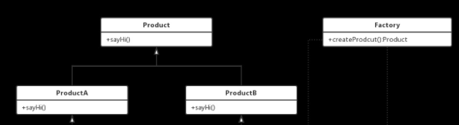

# 定义

简单工厂模式也被称为静态工厂模式;使用简单工厂模式可以将产品的“消费”和生产完全分开，客户端只需要知道自己需要什么产品，如何来使用产品就可以了，具体的产品生产任务由具体的工厂类来实现。

工厂类根据传进来的参数生产具体的产品供消费者使用。这种模式使得更加利于扩展，当有新的产品加入时仅仅需要在工厂中加入新产品的构造就可以了。

# 构成

- 具体的工厂角色：Factory；在工厂中可以调用方法生产出具体的某个类型的产品；这里，抽象的产品角色依赖的是具体的工厂角色。不是依赖倒置的那种关系
- 抽象的产品角色：Product；在抽象产品类型中可以声明抽象接口，在具体的产品类中实现；
- 具体的产品角色：ProductA 和ProdcutB；在具体的类中必须实现抽象类的接口，也可以实现自己的业务逻辑。

# UML



# 代码实现

产品类：

```java
//抽象产品类
public abstract class Prodcut {
    //抽象产品方法
    public abstract sayHi();
}


//继承抽象类实现产品A类
public class ProductA extends Product {
    
    //实现抽象产品方法
    @Overide
    public abstract sayHi(){
        System.out.println("Hi, I'm ProductA");
    }
}


//继承抽象类实现产品A类
public class ProductB extends Product {
    
    //实现抽象产品方法
    @Overide
    public abstract sayHi(){
        System.out.println("Hi, I'm ProductB");
    }
}
```

工厂类：

```java
public class Factory {
    
    public Factory() {
        
    }
    
    //第一种写法
    //根据产品名称生产产品
    public Product createProduct(String productName) {
        Product product = NULL;
        
        switch(productName){
            case "A":
                product = new ProductA();//生产产品A
                break;
                
            case "B":
                product = new ProductB();//生产产品B
                break;
                
            default:
                break;
                
        }
        return product;
    }
    
    //第二种写法
    //生产产品A
    public ProductA createProductA() {
        return new ProductA();//生产产品A
    }
    
    //生产产品B
    public ProductB createProductB() {
        return new ProductB();//生产产品B
    }
}
```

# 优点与缺点

- 优点：客户端与产品的创建分离，客户端不需要知道产品创建的逻辑，只需要消费该产品即可。
- 缺点：工厂类集成了所有产品的创建逻辑，当工厂类出现问题，所有产品都会出现问题；还有当新增加产品都会修改工厂类，违背开闭原则