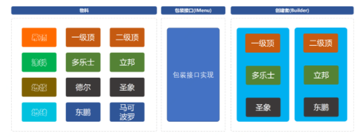

# 概念

建造者模式（英：Builder Pattern）是一种创建型设计模式，又名：生成器模式。GOF 给建造者模式的定义为：将一个复杂对象的构建与它的表示分离，使得同样的构建过程可以创建不同的表示。这句话说的比较抽象，其实解释一下就是：将建造复杂对象的过程和组成对象的部件解耦。

建造者模式所要完成的工作就是通过将多个简单的对象通过一步步的组装构建出一个复杂对象的过程。

那么哪里有这样的场景呢？

例如你玩王者荣耀的时的初始化界面；有三条路、有树木、有野怪、有守卫塔等等，甚至依赖于你的网络情况会控制清晰度。而当你换一个场景进行其他不同模式的选择时，同样会建设道路、树木、野怪等等，但是他们的摆放和大小都有不同。这里就可以用到建造者模式来初始化游戏元素。

而这样的根据相同的物料，不同的组装所产生出的具体的内容，就是建造者模式的最终意图，也就是：**将一个复杂的构建与其表示相分离，使得同样的构建过程可以创建不同的表示**。

# 用途

假设现在我们是一家网游设计公司，现在我们要"抄袭"梦幻西游这款游戏，你是该公司的游戏角色设计人员。你怎么设计出该游戏中的各种角色呢？ 在梦幻西游来中包括人、仙、魔等种族的角色，而每种不同的种族的角色中又包含龙太子、逍遥生等具体的角色。

作为一个出色的开发人员，我们设计的角色生成系统应该包含以下功能和特性：

- 为了保证游戏平衡，所有角色的基本属性应该一致
- 因为角色的创建过程可能很复杂，所以角色的生成细节不应该对外暴露
- 随时可以新增角色
- 对某个具体角色的修改应该不影响其他角色

其实，对于角色的设计，我们可以使用抽象工厂模式，将同一种族的角色看成是一个产品族。但是，这样做可能存在一个问题，那就是我们可能要在每个角色的创建过程中都要从头到尾的构建一遍该角色。比如一个角色包含头部、身体。其中头部又包括脸部、和其他部位。其中脸部又包含眉毛、嘴巴、鼻子等部位。整个角色的创建过程是极其复杂的。很容易遗漏其中的某个步骤。

那么，我们可以将这些具体部位的创建工作和对象的创建进行解耦。这就是建造者模式。

又或者，很多装修公司都会给出自家的套餐服务，一般有：欧式豪华、轻奢田园、现代简约等等，而这些套餐的后面是不同的商品的组合。例如；一级&二级吊顶、多乐士涂料、圣象地板、马可波罗地砖等等，按照不同的套餐的价格选取不同的品牌组合，最终再按照装修面积给出一个整体的报价。

这里我们就模拟装修公司想推出一些套餐装修服务，按照不同的价格设定品牌选择组合，以达到使用建造者模式的过程。

# 实现方式

## 角色创建

建造者模式包含如下角色：

- Builder：抽象建造者(Builder)
- ConcreteBuilder：具体建造者(CommonBuilder、SuperBuilder)
- Director：指挥者(Director)
- Product：产品角色(Role)


这里采用设计角色的例子，为了便于理解，我们只创建两个角色，分别是普通角色和超级角色。他们都有设置头部、脸部、身体、气血值、魔法值、能量值等方法。值得注意的是设置脸部是依赖于设置头部的，要有先后顺序。

产品角色：Role

```java
public class Role {

    private String head; //头部
    private String face; //脸部（脸部依赖于头部）
    private String body; //身体
    private Double hp;   //生命值
    private Double sp;   //能量值
    private Double mp;   //魔法值

    //setter and getter 
     // toString 
}
```

抽象建造者：Builder

```java
public abstract class Builder {

    protected Role role = new Role();

    public abstract void buildHead();

    public abstract void buildFace();

    public abstract void buildBody();

    public abstract void buildHp();

    public abstract void buildSp();

    public abstract void buildMp();

    public Role getResult() {
        return role;
    }
}
```

具体建造者：

```java
/**
* 人
*/
public class CommonRoleBuilder extends Builder {

    private Role role = new Role();

    @Override
    public void buildHead() {
        role.setBody("common head");
    }

    @Override
    public void buildFace() {
        role.setFace("common face");
    }

    @Override
    public void buildBody() {
        role.setBody("common body");
    }

    @Override
    public void buildHp() {
        role.setHp(100d);
    }

    @Override
    public void buildSp() {
        role.setSp(100d);
    }

    @Override
    public void buildMp() {
        role.setMp(100d);
    }

    @Override
    public Role getResult() {
        return role;
    }
}

/**
* 仙 
*/
public class SuperRoleBuilder extends Builder {

    private Role role = new Role();

    @Override
    public void buildHead() {
        role.setBody("suoer head");
    }

    @Override
    public void buildFace() {
        role.setFace("super face");
    }

    @Override
    public void buildBody() {
        role.setBody("super body");
    }

    @Override
    public void buildHp() {
        role.setHp(120d);
    }

    @Override
    public void buildSp() {
        role.setSp(120d);
    }

    @Override
    public void buildMp() {
        role.setMp(120d);
    }

    @Override
    public Role getResult() {
        return role;
    }
}
```

指挥者：

```java
public class Director {

    public void construct(Builder builder){
        builder.buildBody();
        builder.buildHead();
        builder.buildFace();
        builder.buildHp();
        builder.buildMp();
        builder.buildSp();
    }
}
```

测试类：

```java
public class Main {

    public static void main(String[] args) {

        Director director = new Director();
        Builder commonBuilder = new CommonRoleBuilder();

        director.construct(commonBuilder);
        Role commonRole = commonBuilder.getResult();
        System.out.println(commonRole);

    }
}
```

到这里，一个建造者模式已经完成了。

由于建造角色的过程比较复杂，其中还有相互依赖关系（如脸部依赖于头部），所以我们使用建造者模式将将建造复杂对象的过程和组成对象的部件解耦。这样既保证了基本属性全都一致（这里的一致指的是该包含的应该全都包含）也封装了其中的具体实现细节。

同时，在修改某个具体角色的时候我们只需要修改对应的具体角色就可以了，不会影响到其他角色。

如果需要新增角色，只要再增加一个具体建造者，并在该建造者中写好具体细节的建造部分代码就OK了。

## 装修方案

物料接口：

```java
public interface Matter {

    String scene();      // 场景：地板、地砖、涂料、吊顶

    String brand();      // 品牌

    String model();      // 型号

    BigDecimal price();  // 价格

    String desc();       // 描述
}
```

吊顶：

```java
//一级顶
public class LevelOneCeiling implements Matter {

    public String scene() {
        return "吊顶";
    }

    public String brand() {
        return "装修公司自带";
    }

    public String model() {
        return "一级顶";
    }

    public BigDecimal price() {
        return new BigDecimal(260);
    }

    public String desc() {
        return "造型只做低一级，只有一个层次的吊顶，一般离顶120-150mm";
    }
}
//二级顶
public class LevelTwoCeiling  implements Matter {

    public String scene() {
        return "吊顶";
    }

    public String brand() {
        return "装修公司自带";
    }

    public String model() {
        return "二级顶";
    }

    public BigDecimal price() {
        return new BigDecimal(850);
    }

    public String desc() {
        return "两个层次的吊顶，二级吊顶高度一般就往下吊20cm，要是层高很高，也可增加每级的厚度";
    }
    
}
```

涂料：

```java
//多乐士
public class DuluxCoat  implements Matter {

    public String scene() {
        return "涂料";
    }

    public String brand() {
        return "多乐士(Dulux)";
    }

    public String model() {
        return "第二代";
    }

    public BigDecimal price() {
        return new BigDecimal(719);
    }

    public String desc() {
        return "多乐士是阿克苏诺贝尔旗下的著名建筑装饰油漆品牌，产品畅销于全球100个国家，每年全球有5000万户家庭使用多乐士油漆。";
    }
}
//立邦
public class LiBangCoat implements Matter {

    public String scene() {
        return "涂料";
    }

    public String brand() {
        return "立邦";
    }

    public String model() {
        return "默认级别";
    }

    public BigDecimal price() {
        return new BigDecimal(650);
    }

    public String desc() {
        return "立邦始终以开发绿色产品、注重高科技、高品质为目标，以技术力量不断推进科研和开发，满足消费者需求。";
    }
}
```

地板

```java
//德尔
public class DerFloor implements Matter {

    public String scene() {
        return "地板";
    }

    public String brand() {
        return "德尔(Der)";
    }

    public String model() {
        return "A+";
    }

    public BigDecimal price() {
        return new BigDecimal(119);
    }

    public String desc() {
        return "DER德尔集团是全球领先的专业木地板制造商，北京2008年奥运会家装和公装地板供应商";
    }
}
//圣象
public class ShengXiangFloor implements Matter {

    public String scene() {
        return "地板";
    }

    public String brand() {
        return "圣象";
    }

    public String model() {
        return "一级";
    }

    public BigDecimal price() {
        return new BigDecimal(318);
    }

    public String desc() {
        return "圣象地板是中国地板行业著名品牌。圣象地板拥有中国驰名商标、中国名牌、国家免检、中国环境标志认证等多项荣誉。";
    }
}
```

地砖

```java
//东鹏
public class DongPengTile implements Matter {

    public String scene() {
        return "地砖";
    }

    public String brand() {
        return "东鹏瓷砖";
    }

    public String model() {
        return "10001";
    }

    public BigDecimal price() {
        return new BigDecimal(102);
    }

    public String desc() {
        return "东鹏瓷砖以品质铸就品牌，科技推动品牌，口碑传播品牌为宗旨，2014年品牌价值132.35亿元，位列建陶行业榜首。";
    }
}
//马可波罗
public class MarcoPoloTile implements Matter {

    public String scene() {
        return "地砖";
    }

    public String brand() {
        return "马可波罗(MARCO POLO)";
    }

    public String model() {
        return "缺省";
    }

    public BigDecimal price() {
        return new BigDecimal(140);
    }

    public String desc() {
        return "“马可波罗”品牌诞生于1996年，作为国内最早品牌化的建陶品牌，以“文化陶瓷”占领市场，享有“仿古砖至尊”的美誉。";
    }
}
```

以上就是本次装修公司所提供的装修配置单，接下我们会通过案例去使用不同的物料组合出不同的套餐服务。

使用建造者构建：

建造者主要解决的问题是：在软件系统中，有时候面临着一个复杂对象的创建工作，其通常由各个部分的子对象用一定的过程构成，由于需求的变化，这个复杂对象的各个部分经常面临着重大的变化，但是将他们组合在一起的过程却相对稳定。

建造者模型结构:



工程中有三个核心类和一个测试类，核心类是建造者模式的具体实现。与ifelse实现方式相比，多出来了两个二外的类。具体功能如下：

- Builder，建造者类具体的各种组装由此类实现。
- DecorationPackageMenu，是IMenu接口的实现类，主要是承载建造过程中的填充器。相当于这是一套承载物料和创建者中间衔接的内容。

定义装修包接口：

```java
public interface IMenu {

    IMenu appendCeiling(Matter matter); // 吊顶

    IMenu appendCoat(Matter matter);    // 涂料

    IMenu appendFloor(Matter matter);   // 地板

    IMenu appendTile(Matter matter);    // 地砖

    String getDetail();                 // 明细 
}
```

接口类中定义了填充各项物料的方法；吊顶、涂料、地板、地砖，以及最终提供获取全部明细的方法。

装修包实现

```java
public class DecorationPackageMenu implements IMenu {

    private List<Matter> list = new ArrayList<Matter>();  // 装修清单
    private BigDecimal price = BigDecimal.ZERO;      // 装修价格

    private BigDecimal area;  // 面积
    private String grade;     // 装修等级；豪华欧式、轻奢田园、现代简约

    private DecorationPackageMenu() {
    }

    public DecorationPackageMenu(Double area, String grade) {
        this.area = new BigDecimal(area);
        this.grade = grade;
    }

    public IMenu appendCeiling(Matter matter) {
        list.add(matter);
        price = price.add(area.multiply(new BigDecimal("0.2")).multiply(matter.price()));
        return this;
    }

    public IMenu appendCoat(Matter matter) {
        list.add(matter);
        price = price.add(area.multiply(new BigDecimal("1.4")).multiply(matter.price()));
        return this;
    }

    public IMenu appendFloor(Matter matter) {
        list.add(matter);
        price = price.add(area.multiply(matter.price()));
        return this;
    }

    public IMenu appendTile(Matter matter) {
        list.add(matter);
        price = price.add(area.multiply(matter.price()));
        return this;
    }

    public String getDetail() {

        StringBuilder detail = new StringBuilder("\r\n-------------------------------------------------------\r\n" +
                "装修清单" + "\r\n" +
                "套餐等级：" + grade + "\r\n" +
                "套餐价格：" + price.setScale(2, BigDecimal.ROUND_HALF_UP) + " 元\r\n" +
                "房屋面积：" + area.doubleValue() + " 平米\r\n" +
                "材料清单：\r\n");

        for (Matter matter: list) {
            detail.append(matter.scene()).append("：").append(matter.brand()).append("、").append(matter.model()).append("、平米价格：").append(matter.price()).append(" 元。\n");
        }

        return detail.toString();
    }
}
```

- 装修包的实现中每一个方法都会了 this，也就可以非常方便的用于连续填充各项物料。
- 同时在填充时也会根据物料计算平米数下的报价，吊顶和涂料按照平米数适量乘以常熟计算。
- 最后同样提供了统一的获取装修清单的明细方法。

建造者方法：

```java
public class Builder {

    public IMenu levelOne(Double area) {
        return new DecorationPackageMenu(area, "豪华欧式")
                .appendCeiling(new LevelTwoCeiling())    // 吊顶，二级顶
                .appendCoat(new DuluxCoat())             // 涂料，多乐士
                .appendFloor(new ShengXiangFloor());     // 地板，圣象
    }

    public IMenu levelTwo(Double area){
        return new DecorationPackageMenu(area, "轻奢田园")
                .appendCeiling(new LevelTwoCeiling())   // 吊顶，二级顶
                .appendCoat(new LiBangCoat())           // 涂料，立邦
                .appendTile(new MarcoPoloTile());       // 地砖，马可波罗
    }

    public IMenu levelThree(Double area){
        return new DecorationPackageMenu(area, "现代简约")
                .appendCeiling(new LevelOneCeiling())   // 吊顶，二级顶
                .appendCoat(new LiBangCoat())           // 涂料，立邦
                .appendTile(new DongPengTile());        // 地砖，东鹏
    }
}
```

建造者的使用中就已经非常容易了，统一的建造方式，通过不同物料填充出不同的装修风格；豪华欧式、轻奢田园、现代简约，如果将来业务扩展也可以将这部分内容配置到数据库自动生成。但整体的思想还可以使用创建者模式进行搭建。

测试验证：

```java
@Test
public void test_Builder(){
    Builder builder = new Builder();
    // 豪华欧式
    System.out.println(builder.levelOne(132.52D).getDetail());
    // 轻奢田园
    System.out.println(builder.levelTwo(98.25D).getDetail());
    // 现代简约
    System.out.println(builder.levelThree(85.43D).getDetail());
}
```

# 优缺点

## 优点

建造者模式的封装性很好。使用建造者模式可以有效的封装变化，在使用建造者模式的场景中，一般产品类和建造者类是比较稳定的，因此，将主要的业务逻辑封装在导演类中对整体而言可以取得比较好的稳定性。

在建造者模式中，客户端不必知道产品内部组成的细节，将产品本身与产品的创建过程解耦，使得相同的创建过程可以创建不同的产品对象。

可以更加精细地控制产品的创建过程 。将复杂产品的创建步骤分解在不同的方法中，使得创建过程更加清晰，也更方便使用程序来控制创建过程。

其次，建造者模式很容易进行扩展。如果有新的需求，通过实现一个新的建造者类就可以完成，基本上不用修改之前已经测试通过的代码，因此也就不会对原有功能引入风险。符合开闭原则。

## 缺点

建造者模式所创建的产品一般具有较多的共同点，其组成部分相似，如果产品之间的差异性很大，则不适合使用建造者模式，因此其使用范围受到一定的限制。

如果产品的内部变化复杂，可能会导致需要定义很多具体建造者类来实现这种变化，导致系统变得很庞大。

# 适用环境

在以下情况下可以使用建造者模式：

- 需要生成的产品对象有复杂的内部结构，这些产品对象通常包含多个成员属性。
- 需要生成的产品对象的属性相互依赖，需要指定其生成顺序。
- 对象的创建过程独立于创建该对象的类。在建造者模式中引入了指挥者类，将创建过程封装在指挥者类中，而不在建造者类中。
- 隔离复杂对象的创建和使用，并使得相同的创建过程可以创建不同的产品。

# 建造者模式与工厂模式的区别

建造者模式与工厂模式是极为相似的，总体上，建造者模式仅仅只比工厂模式多了一个"指挥者"的角色。在建造者模式的类图中，假如把这个导演类看做是最终调用的客户端，那么图中剩余的部分就可以看作是一个简单的工厂模式了。

与工厂模式相比，建造者模式一般用来创建更为复杂的对象，因为对象的创建过程更为复杂，因此将对象的创建过程独立出来组成一个新的类——导演类。

也就是说，工厂模式是将对象的全部创建过程封装在工厂类中，由工厂类向客户端提供最终的产品；而建造者模式中，建造者类一般只提供产品类中各个组件的建造，而将具体建造过程交付给导演类。由导演类负责将各个组件按照特定的规则组建为产品，然后将组建好的产品交付给客户端。

# 总结

建造者模式将一个复杂对象的构建与它的表示分离，使得同样的构建过程可以创建不同的表示。

在建造者模式的结构中引入了一个指挥者类，该类的作用主要有两个：一方面它隔离了客户与生产过程；另一方面它负责控制产品的生成过程。指挥者针对抽象建造者编程，客户端只需要知道具体建造者的类型，即可通过指挥者类调用建造者的相关方法，返回一个完整的产品对象。