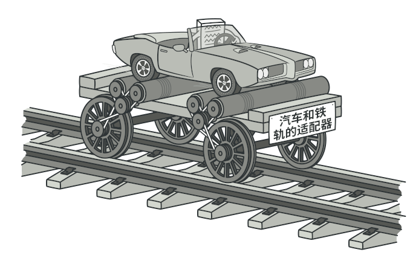
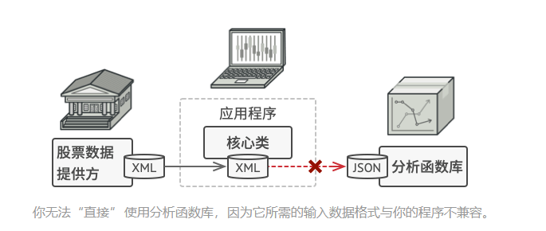
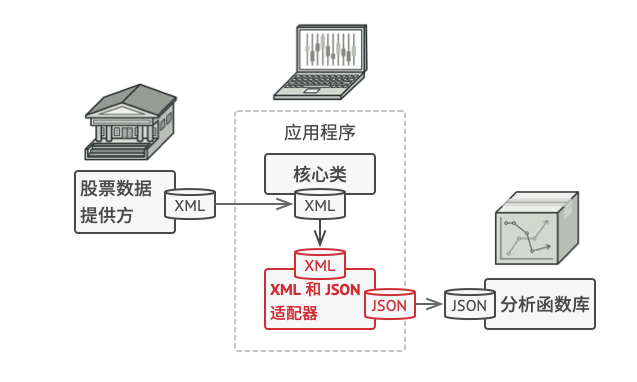
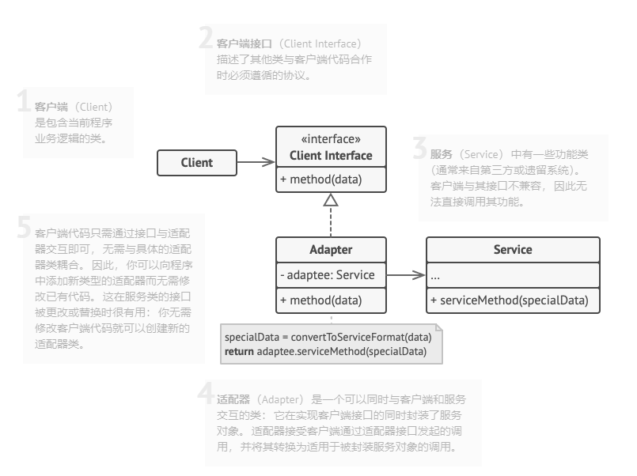
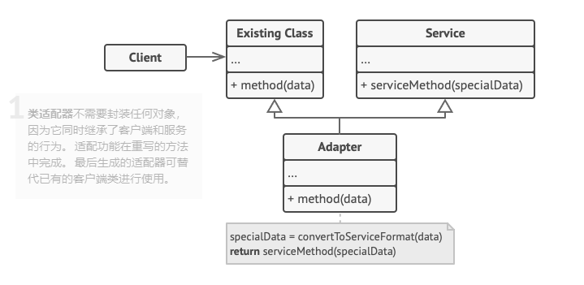

# 介绍

Adapter Pattern，通常被翻译成适配器模式，有时候也叫做包装模式（Wrapper Pattern），是GOF 23种设计模式之一。主要作用是将一个类的接口转换成客户希望的另外一个接口。适配器模式使得原本由于接口不兼容而不能一起工作的那些类可以一起工作。

GOF中将适配器模式分为类适配器模式和对象适配器模式。

## 对象适配器模式

在这种适配器模式中，适配器容纳一个它包裹的类的实例。在这种情况下，适配器调用被包裹对象的物理实体。就是接下来举例的例子。

## 类适配器模式

这种适配器模式下，适配器继承自已实现的类（一般多重继承）。

# 用途

二者区别仅在于适配器角色对于被适配角色的适配是通过继承还是组合来实现的，由于Java中不支持多继承，而且类适配器模式有破坏封装之嫌，而且我们也提倡多用组合少用继承。所以本文主要介绍对象适配器。

我们生活中经常需要用到插口转换器，比如现在很多手机都只有一个插口，这个口可以直接用来充电和听音乐。但是前提是我们使用的充电器和耳机的插口要和这个设备适配的。

目前市面上很多手机的插口都是Type-C或者Lightning型号：但是，我们常用的耳机型号却是2.5mm和3.5mm的圆形接口。

所以，当我们想要把自己的3.5mm圆形接口的耳机插入Lightning或者Type-C接口的时候，就需要一个转换器。

同理，在软件系统中，常常要将一些"现存的对象"放到新的环境中，而新环境要求的接口是现对象不能满足。如以下类似的场景：

1. 系统需要使用现有的类，而此类的接口不符合系统的需要。
2. 想要建立一个可以重复使用的类，用于与一些彼此之间没有太大关联的一些类，包括一些可能在将来引进的类一起工作，这些源类不一定有一致的接口。

# 意图



# 问题

假如你正在开发一款股票市场监测程序， 它会从不同来源下载 XML 格式的股票数据， 然后向用户呈现出美观的图表。

在开发过程中， 你决定在程序中整合一个第三方智能分析函数库。 但是遇到了一个问题， 那就是分析函数库只兼容 JSON 格式的数据。



你可以修改程序库来支持 XML。 但是， 这可能需要修改部分依赖该程序库的现有代码。 甚至还有更糟糕的情况， 你可能根本没有程序库的源代码， 从而无法对其进行修改。

# 解决方案

你可以创建一个适配器。 这是一个特殊的对象， 能够转换对象接口， 使其能与其他对象进行交互。

适配器模式通过封装对象将复杂的转换过程隐藏于幕后。 被封装的对象甚至察觉不到适配器的存在。 例如， 你可以使用一个将所有数据转换为英制单位 （如英尺和英里） 的适配器封装运行于米和千米单位制中的对象。

适配器不仅可以转换不同格式的数据， 其还有助于采用不同接口的对象之间的合作。 它的运作方式如下：
- 适配器实现与其中一个现有对象兼容的接口。
- 现有对象可以使用该接口安全地调用适配器方法。
- 适配器方法被调用后将以另一个对象兼容的格式和顺序将请求传递给该对象。
- 有时你甚至可以创建一个双向适配器来实现双向转换调用。


# 结构

## 对象适配器

实现的时候使用了构成原则：适配器实现了其中一个对象的接口，并对另一个对象进行封装，所有流行的编程语言都可以实现适配器。


## 类适配器

这一实现使用了继承机制： 适配器同时继承两个对象的接口。 请注意， 这种方式仅能在支持多重继承的编程语言中实现， 例如 C++。(我的是java，这个就不多言了)


# 应用场景

经过上面的案例之后，大概会了解到适配器应该使用在什么地方：
- 当你希望使用某个类，但是其接口与其他代码不兼容时，可以使用适配器类，适配器模式允许你创建一个中间层类，其可作为代码与遗留类、第三方类或者怪异接口的类之间的转换器
- 如果你需要复用这样的一些类，他们处于同一个继承体系，并且他们又有了额外的一些共同的方法，但是这些共同的方法不是所有在这一继承体系中的子类所具有的共性，你可以扩展每个子类， 将缺少的功能添加到新的子类中。 但是， 你必须在所有新子类中重复添加这些代码， 这样会使得代码有坏味道。

# 实现方式

1. 确保至少有两个类的接口不兼容：
- 一个无法修改（通常是第三方、遗留系统或者存在众多已有依赖的类）的功能性服务类，就比如该项目的`RoundPeg`和`RoundHole`一样，假设他们就是第三方类，不能改变
- 一个或者多个将受益于使用服务类的客户端类，就比如`SquarePeg`。

2. 声明客户端接口， 描述客户端如何与服务交互。

3. 创建遵循客户端接口的适配器类。 所有方法暂时都为空。
   
4. 在适配器类中添加一个成员变量用于保存对于服务对象的引用，就比如在`SquarePegAdapter`中的`private SquarePeg peg`。 通常情况下会通过构造函数对该成员变量进行初始化， 但有时在调用其方法时将该变量传递给适配器会更方便。
   
5. 依次实现适配器类客户端接口的所有方法。 适配器会将实际工作委派给服务对象， 自身只负责接口或数据格式的转换。就比如在`SquarePegAdapter`中重写`getRadius`。
   
6. 客户端必须通过客户端接口使用适配器。 这样一来， 你就可以在不影响客户端代码的情况下修改或扩展适配器。就比如：
```java
//通过是使用适配器解决
SquarePegAdapter smallSqPegAdapter = new SquarePegAdapter(smallSqPeg);
SquarePegAdapter largeSqPegAdapter = new SquarePegAdapter(largeSqPeg);
if (hole.fits(smallSqPegAdapter)) {
    System.out.println("Square peg w2 fits round hole r5.");
}
if (!hole.fits(largeSqPegAdapter)) {
    System.out.println("Square peg w20 does not fit into round hole r5.");
}
```

# 优缺点

这个还是要备注的，复制粘贴过来就好了：

- 单一职责原则_你可以将接口或数据转换代码从程序主要业务逻辑中分离。
- 开闭原则。 只要客户端代码通过客户端接口与适配器进行交互， 你就能在不修改现有客户端代码的情况下在程序中添加新类型的适配器。
- 代码整体复杂度增加， 因为你需要新增一系列接口和类。 有时直接更改服务类使其与其他代码兼容会更简单。

# 方钉和圆孔项目的解释

原本是圆孔中只能放入圆钉，但是如果想要把一个方钉放入到圆孔中的话，由于类型不匹配，并且是否能放入也是个需要考虑的问题。

所以我们直接使用适配器（对象适配器），让该适配器继承`RoundPeg`，并重写他的`getRadius`方法：
- 继承就表明消除了方钉因为类型不匹配不能放入到圆孔的问题
- 复写`getRadius`方法重新判定方钉能不能放入到圆孔的中的问题

综上：

适配器假扮成一个圆钉 （Round­Peg）， 其半径等于方钉 （Square­Peg） 横截面对角线的一半 （即能够容纳方钉的最小外接圆的半径）。