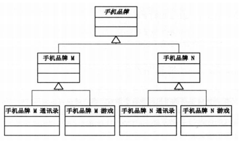
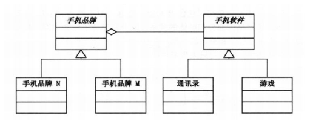
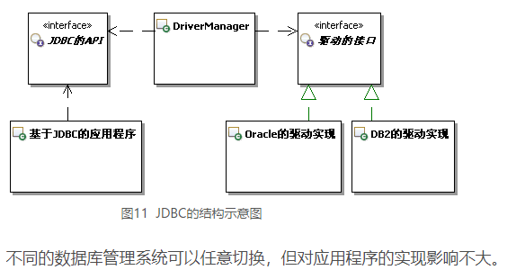
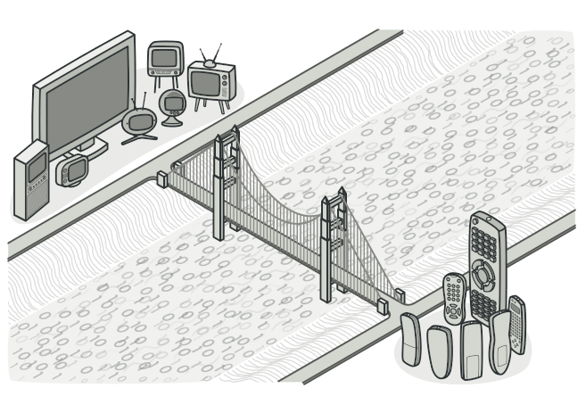
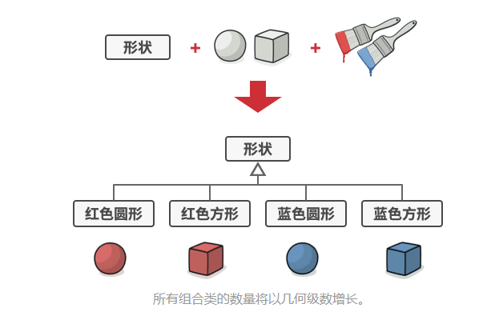
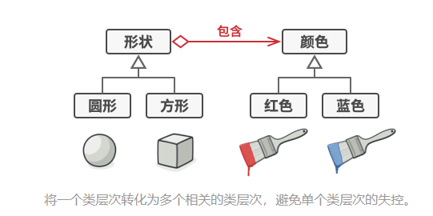
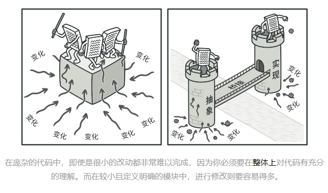
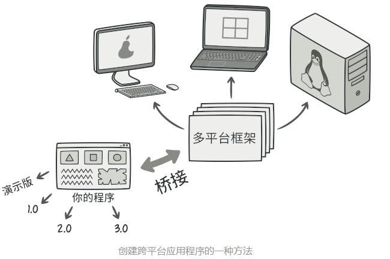
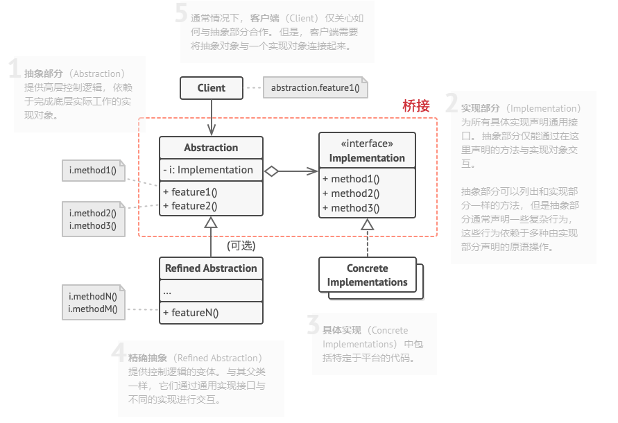
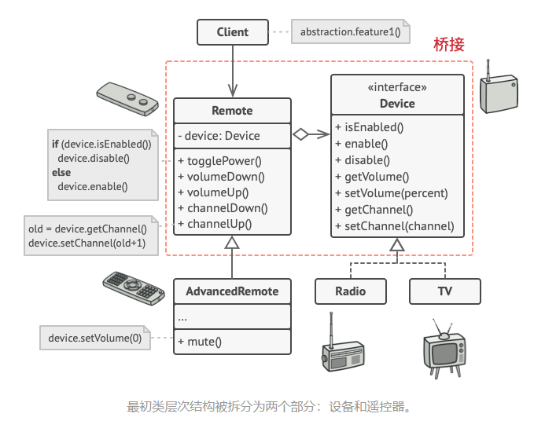

# 举例说明

那就是手机和手机应用的，手机有很多牌子，应用也有很多，那某个手机上的应用，该是怎么实现的呢？

第一种架构



这种架构非常简单，但是有一个明显的问题就是可扩展性差，比如在来一种手机或者应用，那类又得增加好几个，他虽然符合开放封闭原则，但却违背了职责单一原则，即一个类应该只有一个引起他变化的原因，这个时候，桥接模式就派上用场了。



从UML类图里我们就能看出来，它使用了类的聚合而不是继承，设计模式里有一个原则，那就是合成/聚合复用原则。即尽量使用合成/聚合而不是继承。这是为了提高类的可复用性。

```java
public abstract class Phone {
	protected App app;
	public abstract void phone();
	public App getApp() {
		return app;
	}
	public void setApp(App app) {
		this.app = app;
	}
	public void useApp() {
		phone();
        app.app();
	}
}

//IPhone
public class IPhone extends Phone {
 
	@Override
	public void phone() {
		// TODO Auto-generated method stub
		System.out.print("--IPhone--");
	}
}

//Android
public class Android extends Phone {
 
	@Override
	public void phone() {
		// TODO Auto-generated method stub
		System.out.print("--Android--");
	}
}
```

```java
public interface App {
	void app();
}

//Game
public class Game implements App {
 
	@Override
	public void app() {
		// TODO Auto-generated method stub
		System.out.println("play game");
	}
}

//MailList
public class MailList implements App {
 
	@Override
	public void app() {
		// TODO Auto-generated method stub
		System.out.println("open maillist");
	}
}
```

使用方式：

```java
public class Client {
	public static void main(String[] args) {
		// TODO Auto-generated method stub
		Phone iPhone=new IPhone();
		iPhone.setApp(new Game());
		iPhone.useApp();
		
		Phone android=new Android();
		android.setApp(new MailList());
		android.useApp();
	}
}
```

jdbc就应用了桥接模式



----------------------------读取的另一篇博客---------------------------------

原本遥控和设备作为一个大类，将这个大类使用桥接模式拆分成更小的类，其中Demo作为使用者，Remote作为顶层接口，Device作为底层Api实现，所以Remote中持有一个Device的引用，应该是这个引用就是一个桥。

# 意图

桥接模式是一种结构型设计模式，可将一个大类或者一系统紧密相关的类拆分成为抽象和实现连个独立的层次结构，从而能在开发时分别使用。



# 问题

假如你有一个几何形状的`Shape`类，从他能扩展出两个子类：圆形`Circle`和方形`Square`。你希望对这样的类层次结构进行扩展以使其包含颜色， 所以你打算创建名为红色`Red`和蓝色`Blue`的形状子类。 但是， 由于你已有两个子类， 所以总共需要创建四个类才能覆盖所有组合， 例如 蓝色圆形`Blue­Circle`和红色方形`Red­Square` 。



在层次结构中新增形状和颜色将导致代码复杂程度指数增长。 例如添加三角形状， 你需要新增两个子类， 也就是每种颜色一个； 此后新增一种新颜色需要新增三个子类， 即每种形状一个。 如此以往， 情况会越来越糟糕。

# 解决方案

问题的根本原因是我们试图在两个独立的维度——形状与颜色——上扩展形状类。 这在处理类继承时是很常见的问题。

桥接模式通过将继承改为组合的方式来解决这个问题。 具体来说， 就是抽取其中一个维度并使之成为独立的类层次， 这样就可以在初始类中引用这个新层次的对象， 从而使得一个类不必拥有所有的状态和行为。



根据该方法， 我们可以将颜色相关的代码抽取到拥有 红色和 蓝色两个子类的颜色类中， 然后在 形状类中添加一个指向某一颜色对象的引用成员变量。 现在， 形状类可以将所有与颜色相关的工作委派给连入的颜色对象。 这样的引用就成为了 形状和 颜色之间的桥梁。 此后， 新增颜色将不再需要修改形状的类层次， 反之亦然。

## 抽象部分和实现部分

设计模式四人组的著作  在桥接定义中提出了抽象部分和实现部分两个术语。 我觉得这些术语过于学术了， 反而让模式看上去比实际情况更加复杂。 在介绍过形状和颜色的简单例子后， 我们来看看四人组著作中让人望而生畏的词语的含义。

抽象部分 （也被称为接口） 是一些实体的高阶控制层。 该层自身不完成任何具体的工作， 它需要将工作委派给实现部分层 （也被称为平台）。

注意， 这里提到的内容与编程语言中的接口或抽象类无关。 它们并不是一回事。

在实际的程序中， 抽象部分是图形用户界面 （GUI）， 而实现部分则是底层操作系统代码 （API）， GUI 层调用 API 层来对用户的各种操作做出响应。

一般来说， 你可以在两个独立方向上扩展这种应用：

- 开发多个不同的 GUI （例如面向普通用户和管理员进行分别配置）
- 支持多个不同的 API （例如， 能够在 Windows、 Linux 和 macOS 上运行该程序）。

在最糟糕的情况下， 程序可能会是一团乱麻， 其中包含数百种条件语句， 连接着代码各处不同种类的 GUI 和各种 API。



让我们试着用桥接模式来解决这个问题。 该模式建议将类拆分为两个类层次结构：
- 抽象部分： 程序的 GUI 层。
- 实现部分： 操作系统的 API。



抽象对象控制程序的外观， 并将真实工作委派给连入的实现对象。 不同的实现只要遵循相同的接口就可以互换， 使同一 GUI 可在 Windows 和 Linux 下运行。

最后的结果是： 你无需改动与 API 相关的类就可以修改 GUI 类。 此外如果想支持一个新的操作系统， 只需在实现部分层次中创建一个子类即可。

# 桥接模式结构



# 桥接模式适合应用场景

1. 如果你想要拆分或重组一个具有多重功能的庞杂类 （例如能与多个数据库服务器进行交互的类）， 可以使用桥接模式。

- 类的代码行数越多， 弄清其运作方式就越困难， 对其进行修改所花费的时间就越长。 一个功能上的变化可能需要在整个类范围内进行修改， 而且常常会产生错误， 甚至还会有一些严重的副作用。

- 桥接模式可以将庞杂类拆分为几个类层次结构。 此后， 你可以修改任意一个类层次结构而不会影响到其他类层次结构。 这种方法可以简化代码的维护工作， 并将修改已有代码的风险降到最低。

2. 如果你希望在几个独立维度上扩展一个类， 可使用该模式。

- 桥接建议将每个维度抽取为独立的类层次。 初始类将相关工作委派给属于对应类层次的对象， 无需自己完成所有工作。

3. 如果你需要在运行时切换不同实现方法， 可使用桥接模式。

- 当然并不是说一定要实现这一点， 桥接模式可替换抽象部分中的实现对象， 具体操作就和给成员变量赋新值一样简单。

- 顺便提一句， 最后一点是很多人混淆桥接模式和策略模式的主要原因。 记住， 设计模式并不仅是一种对类进行组织的方式， 它还能用于沟通意图和解决问题。

# 实现方式

1. 明确类中独立的维度。 独立的概念可能是： 抽象/平台， 域/基础设施， 前端/后端或接口/实现。

2. 了解客户端的业务需求， 并在抽象基类中定义它们。

3. 确定在所有平台上都可执行的业务。 并在通用实现接口中声明抽象部分所需的业务。

4. 为你域内的所有平台创建实现类， 但需确保它们遵循实现部分的接口。

5. 在抽象类中添加指向实现类型的引用成员变量。 抽象部分会将大部分工作委派给该成员变量所指向的实现对象。

6. 如果你的高层逻辑有多个变体， 则可通过扩展抽象基类为每个变体创建一个精确抽象。

7. 客户端代码必须将实现对象传递给抽象部分的构造函数才能使其能够相互关联。 此后， 客户端只需与抽象对象进行交互， 无需和实现对象打交道。

# 桥接模式的优缺点

- 你可以创建与平台无关的类和程序。
- 客户端代码仅与高层抽象部分进行互动， 不会接触到平台的详细信息。
- 开闭原则。 你可以新增抽象部分和实现部分， 且它们之间不会相互影响。
- 单一职责原则。 抽象部分专注于处理高层逻辑， 实现部分处理平台细节。
- 对高内聚的类使用该模式可能会让代码更加复杂。

# 管理设备及其遥控器解释

桥接模式如何拆分程序中同时管理设备及其遥控器的庞杂代码。设备Device类作为实现部分， 而 遥控器Remote类则作为抽象部分。



遥控器基类声明了一个指向设备对象的引用成员变量。 所有遥控器通过通用设备接口与设备进行交互， 使得同一个遥控器可以支持不同类型的设备。（因为使用引用到的是基类，所以下面继承的所有子类当然可以被调用了）

你可以开发独立于设备类的遥控器类， 只需新建一个遥控器子类即可。 例如， 基础遥控器可能只有两个按钮， 但你可在其基础上扩展新功能， 比如额外的一节电池或一块触摸屏。

客户端代码通过遥控器构造函数将特定种类的遥控器与设备对象连接起来。

代码如下：
```java
public class BasicRemote implements Remote {
    protected Device device;

    public BasicRemote() {
    }

    public BasicRemote(Device device) {
        this.device = device;
    }

    @Override
    public void power() {
        System.out.println("Remote: power toggle");
        if (device.isEnabled()) {
            device.disable();
        } else {
            device.enable();
        }
    }

    @Override
    public void volumeDown() {
        System.out.println("Remote: volume down");
        device.setVolume(device.getVolume() - 10);
    }

    @Override
    public void volumeUp() {
        System.out.println("Remote: volume up");
        device.setVolume(device.getVolume() + 10);
    }

    @Override
    public void channelDown() {
        System.out.println("Remote: channel down");
        device.setChannel(device.getChannel() - 1);
    }

    @Override
    public void channelUp() {
        System.out.println("Remote: channel up");
        device.setChannel(device.getChannel() + 1);
    }
}
```