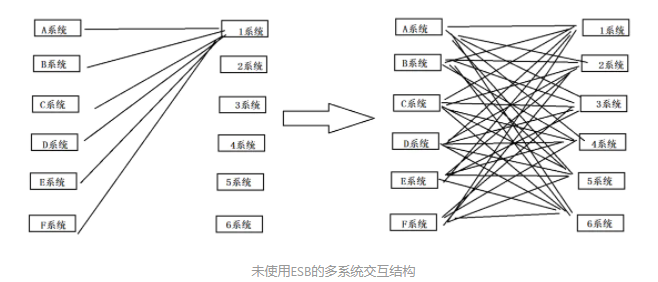
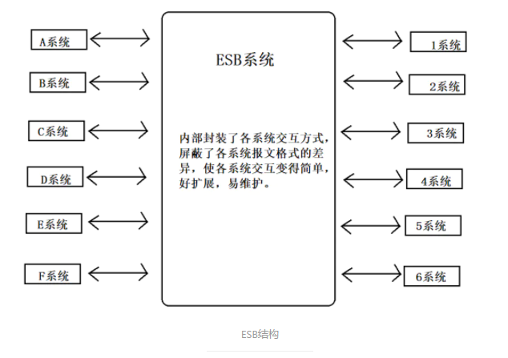
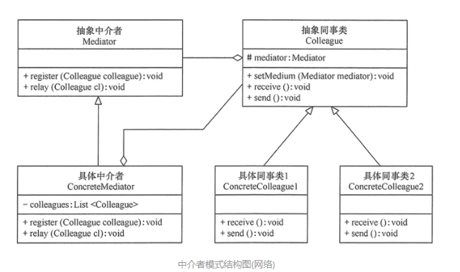
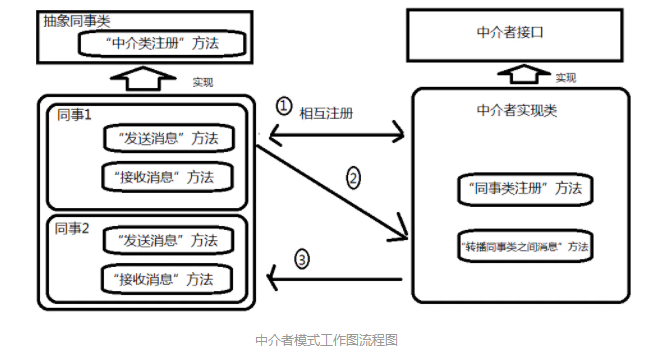

作者：Vic_is_new_Here

链接：https://www.jianshu.com/p/4409addf8ad1

来源：简书

著作权归作者所有。商业转载请联系作者获得授权，非商业转载请注明出处。

# 特性与定义

## 定义

定义一个中介对象来封装一系列对象之间的交互，使原有对象之间耦合松散，且可以独立地改变他们之间的交互。中介者模式又叫调停模式，它是迪米特法则的典型应用。

## 应用

1. 当对象之间存在复杂的网状结构关系而导致依赖关系混乱且难以复用时；
2. 当想创建一个运行于多个类之间的对象，又不想生成新的子类时。
3. 举例解释说明
    - a：大学生代课：今早起床，不想上课，本打算让室友帮答到，可惜室友醒都没醒；认识一个专门帮代课的同学，但是人家已经去帮别人代课去了，我这边资源少，只能乖乖去上课或者缺席。有一同学专门给人代课赚零花钱，但是他的客户今天去了，那他今天没外快赚，原因：资源少。这时候有一同学来做中介的事情，谁愿意帮代课，在他那登记一下；谁需要找人帮自己代课，在他那登记一下。等需要代课的同学向中介发布需求，中介同学就能帮他找到帮答到的同学。
    - b：房屋中介等：房地产开发商、房东有一堆房子要卖要出租，但是让他一个个去联系买家的话，他的成本太大，还收效甚微。我想租房买房，如果去一家家联系开发商和房东，也很不方便。开发商、房东和买家可以都在中介那里注册，要租售房子的将房子信息公布在中介那里。我找房子就直接去中介那里找，看中那个就可以直接看房再决定。
    - c： ESB(Enterprise Service Bus，企业服务总线)：银行业务较多，内部系统繁多，且许多系统之间要进行交互，一般情况下，他们需要按下图的样子来交互。一条线代表两个系统交互，系统一多，就会形成一个复杂的网关结构，开发成本高，且不易维护。


如果有了中介这一角色的参与，就会变成下图的样子。所以ESB系统是中介者模式的完美实践



## 优点：

- a. 降低了对象之间的耦合性，使得对象易于独立地被复用。
- b. 将对象之间的一对多关联转变为一对一的关联，提高系统的灵活性，使得系统易于维护和扩展。

## 缺点：

当同事类太多时，中介者职责将会很大，会变得庞大而复杂，以至于系统难以维护。

# 角色与实现

## 中介者模式中的角色
- a. 抽象中介者(Mediator)角色：它是中介者的接口，提供了同事对象注册与转发同事对象信息的抽象方法。
- b. 具体中介者(ConcreteMediator)角色：实现中介者接口，定义一个List来管理同事对象，协调各个同事角色之间的交互关系，因此它依赖于同事角色。
- c. 抽象同事(Colleague)类角色：定义同事类的接口，保存中介者对象，提供同事对象交互的抽象方法，实现所有相互影响的同事类的公共功能。
- d. 具体同事(Concrete Colleague)类角色：是抽象同事类的实现者，当需要与其它同事对象交互时，由中介者对象负责后续的交互。

角色之间的关系图



## 代码实现

1. 中介者抽象类

```java
public abstract class Mediator {
    public abstract void register(Colleague colleague);
    public abstract void relay(Colleague cl);
}
```

2. 具体中介者实现类

```java
public class ConcreteMediatorextends Mediator {
    private Listcolleagues=new ArrayList();
    public void register(Colleague colleague) {
        if (!colleagues.contains(colleague)) {
            colleagues.add(colleague);
            colleague.setMedium(this);
        }
    }

    public void relay(Colleague cl) {
        for (Colleague ob:colleagues) {
            if (!ob.equals(cl)) {
                ((Colleague)ob).receive();
            }
        }
    }
}
```

3. 抽象同事类

```java
abstract class Colleague {

    protected Mediatormediator;

    public void setMedium(Mediator mediator)  {

        this.mediator = mediator;

    }

    public abstract void receive();

    public abstract void send();

}
```

4. 具体同事类1

```java
public class ConcreteColleague1extends Colleague{

    public void receive() {

        System.out.println("具体同事类1收到请求。");

    }

    public void send() {

        System.out.println("具体同事类1发出请求。");

        mediator.relay(this);

    }

}
```

5.具体同事类2

```java
public class ConcreteColleague2extends Colleague{
    public void receive() {
        System.out.println("具体同事类2收到请求。");
      }
    public void send() {
        System.out.println("具体同事类2发出请求。");
        mediator.relay(this);
    }
}
```

6. main方法类

```java
public class MediatorPattern {
    public static void main(String[] args) {
        Mediator md =new ConcreteMediator();
        Colleague c1, c2;
        c1 =new ConcreteColleague1();
        c2 =new ConcreteColleague2();
        md.register(c1);
        md.register(c2);
        c1.send();
        System.out.println("--------");
        c2.send();
    }
}
```



# 模式的扩展

1. 不定义中介者接口，把具体中介者对象实现成为单例；

2. 同事对象不持有中介者，而是在需要的时候直接获取中介者对象并调用。
