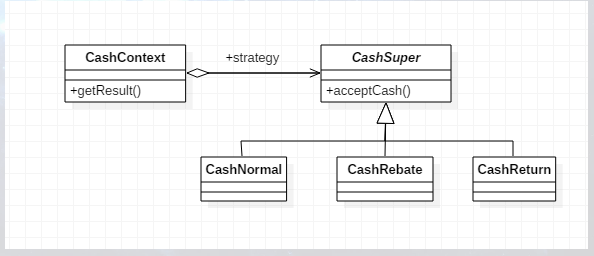
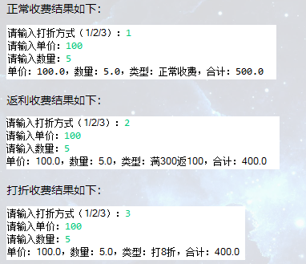

# 什么是策略模式

策略这个词应该怎么理解，打个比方说，我们出门的时候会选择不同的出行方式，比如骑自行车、坐公交、坐火车、坐飞机、坐火箭等等，这些出行方式，每一种都是一个策略。

再比如我们去逛商场，商场现在正在搞活动，有打折的、有满减的、有返利的等等，其实不管商场如何进行促销，说到底都是一些算法，这些算法本身只是一种策略，并且这些算法是随时都可能互相替换的，比如针对同一件商品，今天打八折、明天满100减30，这些策略间是可以互换的。

**策略模式（Strategy）**，定义了一组算法，将每个算法都封装起来，并且使它们之间可以互换。UML结构图如下：


其中，Context是上下文，用一个ConcreteStrategy来配置，维护一个对Strategy对象的引用；Strategy是策略类，用于定义所有支持算法的公共接口；ConcreteStrategy是具体策略类，封装了具体的算法或行为，继承于Strategy。

## Context上下文

Context上下文角色，也叫Context封装角色，起承上启下的作用，屏蔽高层模块对策略、算法的直接访问，封装可能存在的变化。

```java
public class Context {

    Strategy strategy;

    public Context(Strategy strategy) {
        this.strategy = strategy;
    }

    //上下文接口
    public void contextInterface() {
        strategy.algorithmInterface();
    }
}
```

## 策略角色

抽象策略角色，是对策略、算法家族的抽象，通常为接口，定义每个策略或算法必须具有的方法和属性。algorithm是“运算法则”的意思。

```java
public abstract class Strategy {
    //算法方法
    public abstract void algorithmInterface();
}
```

## 具体策略角色

用于实现抽象策略中的操作，即实现具体的算法，下方用print代替。测试类共3个ConcreteStrategy，其它两个类与ConcreteStrategyA同理，就不再赘述了。

```java
public class ConcreteStrategyA extends Strategy {

    @Override
    public void algorithmInterface() {
        System.out.println("算法A实现");
    }

}
```

## Client客户端

下面依次更换策略，测试一下策略模式。

```java
public class Client {

    public static void main(String[] args) {
        Context context;

        context = new Context(new ConcreteStrategyA());
        context.contextInterface();

        context = new Context(new ConcreteStrategyB());
        context.contextInterface();

        context = new Context(new ConcreteStrategyC());
        context.contextInterface();
    }

}
```

运行结果如下：


# 策略模式的应用

1. 何时使用
    - 一个系统有许多类，而区分它们的只是他们直接的行为时
2. 方法
    - 将这些算法封装成一个一个的类，任意的替换
3. 优点
    - 算法可以自由切换
    - 避免使用多重条件判断（如果不用策略模式我们可能会使用多重条件语句，不利于维护）
    - 扩展性良好，增加一个策略只需实现接口即可
4. 缺点
    - 策略类数量会增多，每个策略都是一个类，复用的可能性很小
    - 所有的策略类都需要对外暴露
5. 使用场景
    - 多个类只有算法或行为上稍有不同的场景
    - 算法需要自由切换的场景
    - 需要屏蔽算法规则的场景
6. 应用实例
    - 出行方式，自行车、汽车等，每一种出行方式都是一个策略
    - 商场促销方式，打折、满减等
    - Java AWT中的LayoutManager，即布局管理器
7. 注意事项
    - 如果一个系统的策略多于四个，就需要考虑使用混合模式来解决策略类膨胀的问题
    
# 策略模式的实现

下面就以商场促销为例使用策略模式实现商场促销算法。UML图如下：



## 上下文类

首先声明一个CashSuper对象，通过构造方法，传入具体的收费策略，getResult()方法的功能为根据收费策略的不同获得计算结果。

```java
public class CashContext {

    private CashSuper cashSuper;

    public CashContext(CashSuper cashSuper) {
        this.cashSuper = cashSuper;
    }

    public double getResult(double money) {
        return cashSuper.acceptCash(money);
    }

}
```

## 现金收费抽象类

策略类，为抽象类，抽象出收费的方法供子类实现。

```java
public abstract class CashSuper {
    public abstract double acceptCash(double money);
}
```

## 正常收费子类

没有任何活动的情况，正常收费，返回原价。

```java
public class CashNormal extends CashSuper {

    @Override
    public double acceptCash(double money) {
        return money;
    }

}
```

## 打折收费子类

打折活动，根据折扣返回打折后的价格。

```java
public class CashRebate extends CashSuper {

    private double moneyRebate = 1;    //折扣

    public CashRebate(double moneyRebate) {
        this.moneyRebate = moneyRebate;
    }

    @Override
    public double acceptCash(double money) {
        return money * moneyRebate;
    }

}
```

## 返利收费子类

返利活动，输入返利条件和返利值，比如满300返100，moneyCoditation为300，moneyReturn为100。

`result = money - Math.floor(money / moneyConditation) * moneyReturn;`的意思为，如果当前金额大于等于返利条件，则使用当前金额减去返利值。

```java
public class CashReturn extends CashSuper {

    private double moneyConditation = 0.0;    //返利条件
    private double moneyReturn = 0.0d;    //返利值

    public CashReturn(double moneyConditation, double moneyReturn) {
        this.moneyConditation = moneyConditation;
        this.moneyReturn = moneyReturn;
    }

    @Override
    public double acceptCash(double money) {
        double result = money;

        if (money >= moneyConditation) {
            result = money - Math.floor(money / moneyConditation) * moneyReturn;
        }

        return result;
    }

}
```

## Client客户端

下面写一个简单的程序测试一下上方编写的代码。

```java
public class Client {

    public static void main(String[] args) {
        CashContext cashContext = null;

        Scanner scanner = new Scanner(System.in);
        System.out.print("请输入打折方式（1/2/3）：");
        int in = scanner.nextInt();
        String type = "";

        switch (in) {
            case 1:
                cashContext = new CashContext(new CashNormal());
                type += "正常收费";
                break;

            case 2:
                cashContext = new CashContext(new CashReturn(300, 100));
                type += "满300返100";
                break;

            case 3:
                cashContext = new CashContext(new CashRebate(0.8));
                type += "打8折";
                break;

            default:
                System.out.println("请输入1/2/3");
                break;
        }

        double totalPrices = 0;

        System.out.print("请输入单价：");
        double price = scanner.nextDouble();
        System.out.print("请输入数量：");
        double num = scanner.nextDouble();
        totalPrices = cashContext.getResult(price * num);

        System.out.println("单价：" + price + "，数量：" + num + "，类型：" + type + "，合计：" + totalPrices);

        scanner.close();
    }

}
```


