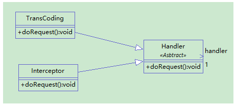

# 什么是链

1. 链是一系列节点的集合
2. 链的各个节点可灵活拆分在重组

# 职责链模式
- 使多个对象都有机会处理请求，从而避免请求的发送者和接受者之间的耦合关系，将这个对象连成一条链，并沿着这条链传递该请求，直到有一个对象处理他为止。
   
- 其实刚开始我觉得这个模式和装饰者模式有点像，但两个模式的应用场景是不一样的。装饰者模式是适用于动态添加功能的，而责任链模式则是倾向于处理一个流程操作，把每个操作单独封装，形成一条工作链。


# 代码实现



```java
public abstract class Handler {
	/** 
     * 持有后继的责任对象
     */
    protected Handler handler;
    /** 
     * 示意处理请求的方法，虽然这个示意方法是没有传入参数的 
     * 但实际是可以传入参数的，根据具体需要来选择是否传递参数 
     */
    public abstract void doRequest();
    /** 
     * 赋值方法，设置后继的责任对象 
     */  
    public void setSuccessor(Handler handler) {
        this.handler = handler;
    }
}
```

```java
public class Interceptor extends Handler {
 
	@Override
	public void doRequest() {
		// TODO Auto-generated method stub
		if(null!=handler) {
			System.out.println("拦截请求");
			handler.doRequest();
		}
		System.out.println("收尾操作");
	}
}
```

```java
public class TransCoding extends Handler {
 
	@Override
	public void doRequest() {
		// TODO Auto-generated method stub
		if(null!=handler) {
			handler.doRequest();
		}
		System.out.println("转码操作");
		System.out.println("转码成功");
	}
}
```

```java
public class Client {
	public static void main(String[] args) {
		// TODO Auto-generated method stub
		Handler interceptor=new Interceptor();
		Handler transCodingHandler=new TransCoding();
		interceptor.setSuccessor(transCodingHandler);//设置下一个处理者
		interceptor.doRequest();
	}
}
```


