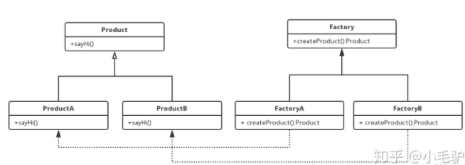

# 定义

工厂方法模式，又称工厂模式、多态工厂模式和虚拟构造器模式，通过工厂父类定义负责创建产品的公共接口，子类负责生产具体对象。

# 解决的问题

<font color="tomato">**解决简单工厂模式的弊端（创建新的产品的时候需要修改工厂类的弊端）**</font>，**实现父类定义公共实现接口，子类负责实现创建具体的对象**，这样就可以**实现增加产品类时，不需要修改工厂类，而只需要修改工厂子类**。

# 构成

- 抽象产品类：Product；描述具体产品的公共接口，在具体的产品类中实现
- 具体产品类：ProductA和ProductB；具体产品类，实现抽象产品类的接口，工厂类创建对象
- 抽象工厂类：Factory；描述具体工厂的公共接口
- 具体工厂类：FactoryA和FactoryB；描述具体工厂类，实现创建产品类对象，实现抽象工厂类的接口

# UML



# 代码实现

产品类：

```java
//抽象产品类
public abstract class Prodcut {
    //抽象产品方法
    public abstract sayHi();
}


//继承抽象类实现产品A类
public class ProductA extends Product {
    
    //实现抽象产品方法
    @Overide
    public abstract sayHi(){
        System.out.println("Hi, I'm ProductA");
    }
}


//继承抽象类实现产品B类
public class ProductB extends Product {
    
    //实现抽象产品方法
    @Overide
    public abstract sayHi(){
        System.out.println("Hi, I'm ProductB");
    }
}
```

工厂类：

```java
//工厂抽象类
public abstract class Factory {
    //抽象工厂方法
    public abstract Product createProduct();
}


//具体工厂类FactoryA
public class FactoryA extends Factory {
    
    @Overide
    public Product createProduct() {
        System.out.println("生产了一个A");
        return new ProductA();//生产产品A
    }
}


//具体工厂类FactoryB
public class FactoryB extends Factory {
    
    @Overide
    public Product createProduct() {
        System.out.println("生产了一个B");
        return new ProductB();//生产产品B
    }
}
```

# 优点与缺点

- 优点：更符合开闭原则，增加一个产品类，则只需要实现其他具体的产品类和具体的工厂类即可；符合单一职责原则，每个工厂只负责生产对应的产品
- 缺点：增加一个产品，就需要实现对应的具体工厂类和具体产品类；每个产品需要有对应的具体工厂和具体产品类