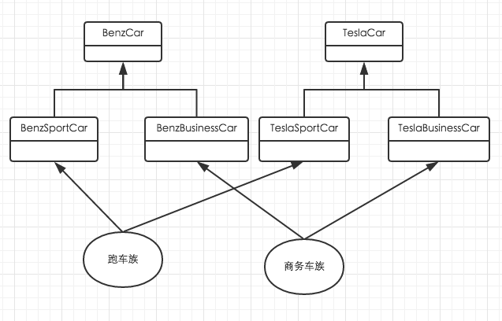
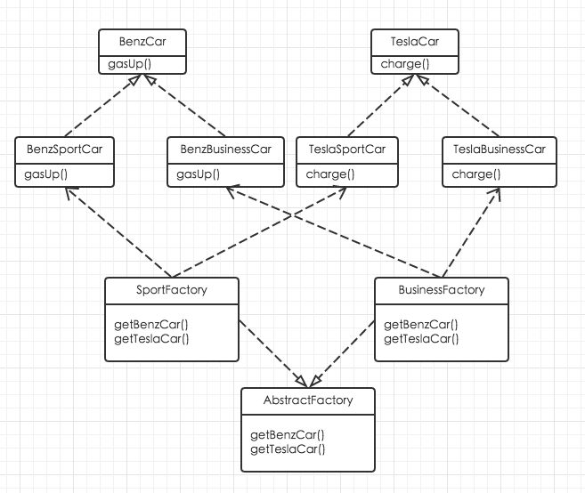
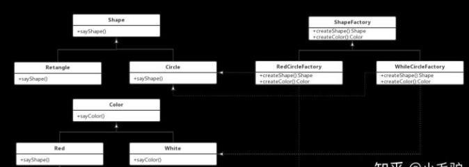

# 概念

抽象工厂模式(Abstract Factory Pattern)：提供一个创建一系列相关或相互依赖对象的接口，而无须指定它们具体的类。抽象工厂模式又称为Kit模式，属于对象创建型模式。

抽象工厂模式提供了一种方式，可以将同一产品族的单独的工厂封装起来。在正常使用中，客户端程序需要创建抽象工厂的具体实现，然后使用抽象工厂作为接口来创建这一主题的具体对象。客户端程序不需要知道（或关心）它从这些内部的工厂方法中获得对象的具体类型，因为客户端程序仅使用这些对象的通用接口。抽象工厂模式将一组对象的实现细节与他们的一般使用分离开来。

# 产品族

来认识下什么是产品族: 位于不同产品等级结构中,功能相关的产品组成的家族。如下面的例子，就有两个产品族：跑车族和商务车族。



# 用途

抽象工厂模式和工厂方法模式一样，都符合开放-封闭原则。但是不同的是，工厂方法模式在增加一个具体产品的时候，都要增加对应的工厂。但是抽象工厂模式只有在新增一个类型的具体产品时才需要新增工厂。也就是说，工厂方法模式的一个工厂只能创建一个具体产品。而抽象工厂模式的一个工厂可以创建属于一类类型的多种具体产品。工厂创建产品的个数介于简单工厂模式和工厂方法模式之间。

在以下情况下可以使用抽象工厂模式：

- 一个系统不应当依赖于产品类实例如何被创建、组合和表达的细节，这对于所有类型的工厂模式都是重要的。
- 系统中有多于一个的产品族，而每次只使用其中某一产品族。
- 属于同一个产品族的产品将在一起使用，这一约束必须在系统的设计中体现出来。
- 系统提供一个产品类的库，所有的产品以同样的接口出现，从而使客户端不依赖于具体实现。

# 实现方式

抽象工厂模式包含如下角色：

- AbstractFactory(抽象工厂)：用于声明生成抽象产品的方法
- ConcreteFactory(具体工厂)：实现了抽象工厂声明的生成抽象产品的方法，生成一组具体产品，这些产品构成了一个产品族，每一个产品都位于某个产品等级结构中；
- AbstractProduct(抽象产品)：为每种产品声明接口，在抽象产品中定义了产品的抽象业务方法；
- Product(具体产品)：定义具体工厂生产的具体产品对象，实现抽象产品接口中定义的业务方法。

假设我们是一家汽车代工厂商，我们负责给奔驰和特斯拉两家公司制造车子。我们简单的把奔驰车理解为需要加油的车，特斯拉为需要充电的车。其中奔驰车中包含跑车和商务车两种，特斯拉同样也包含奔驰车和商务车。



以上场景，我们就可以把跑车和商务车分别对待，对于跑车有单独的工厂创建，商务车也有单独的工厂。这样，以后无论是再帮任何其他厂商造车，只要是跑车或者商务车我们都不需要再引入工厂。同样，如果我们要增加一种其他类型的车，比如越野车，我们也不需要对跑车或者商务车的任何东西做修改。

下面是抽象产品，奔驰车和特斯拉车：

```java
public interface BenzCar {

    //加汽油
    public void gasUp();

}

public interface TeslaCar {

    //充电
    public void charge();
}
```

下面是具体产品，奔驰跑车、奔驰商务车、特斯拉跑车、特斯拉商务车：

```java
public class BenzSportCar implements BenzCar {
    public void gasUp() {
        System.out.println("给我的奔驰跑车加最好的汽油");
    }
}

public class BenzBusinessCar implements BenzCar{
    public void gasUp() {
        System.out.println("给我的奔驰商务车加一般的汽油");
    }
}

public class TeslaSportCar implements TeslaCar {
    public void charge() {
        System.out.println("给我特斯拉跑车冲满电");
    }
}

public class TeslaBusinessCar implements TeslaCar {
    public void charge() {
        System.out.println("不用给我特斯拉商务车冲满电");
    }
}
```

下面是抽象工厂：

```java
public interface CarFactory {

    public BenzCar getBenzCar();
    public TeslaCar getTeslaCar();
}
```

下面是具体工厂：

```java
public class SportCarFactory implements CarFactory {
    public BenzCar getBenzCar() {
        return new BenzSportCar();
    }

    public TeslaCar getTeslaCar() {
        return new TeslaSportCar();
    }
}

public class BusinessCarFactory implements CarFactory {
    public BenzCar getBenzCar() {
        return new BenzBusinessCar();
    }

    public TeslaCar getTeslaCar() {
        return new TeslaBusinessCar();
    }
}
```

# “开闭原则”的倾斜性

“开闭原则”要求系统对扩展开放，对修改封闭，通过扩展达到增强其功能的目的。对于涉及到多个产品族与多个产品等级结构的系统，其功能增强包括两方面：

- 增加产品族：对于增加新的产品族，工厂方法模式很好的支持了“开闭原则”，对于新增加的产品族，只需要对应增加一个新的具体工厂即可，对已有代码无须做任何修改。
- 增加新的产品等级结构：对于增加新的产品等级结构，需要修改所有的工厂角色，包括抽象工厂类，在所有的工厂类中都需要增加生产新产品的方法，不能很好地支持“开闭原则”。

抽象工厂模式的这种性质称为“开闭原则”的倾斜性，抽象工厂模式以一种倾斜的方式支持增加新的产品，它为新产品族的增加提供方便，但不能为新的产品等级结构的增加提供这样的方便。

# 三种工厂模式之间的关系

当抽象工厂模式中每一个具体工厂类只创建一个产品对象，也就是只存在一个产品等级结构时，抽象工厂模式退化成工厂方法模式；

抽象工厂模式与工厂方法模式最大的区别在于，工厂方法模式针对的是一个产品等级结构，而抽象工厂模式则需要面对多个产品等级结构。

当工厂方法模式中抽象工厂与具体工厂合并，提供一个统一的工厂来创建产品对象，并将创建对象的工厂方法设计为静态方法时，工厂方法模式退化成简单工厂模式。

# 总结

抽象工厂模式提供一个创建一系列相关或相互依赖对象的接口，而无须指定它们具体的类。抽象工厂模式又称为Kit模式，属于对象创建型模式。

抽象工厂模式是所有形式的工厂模式中最为抽象和最具一般性的一种形态。

抽象工厂模式的主要优点是隔离了具体类的生成，使得客户并不需要知道什么被创建，而且每次可以通过具体工厂类创建一个产品族中的多个对象，增加或者替换产品族比较方便，增加新的具体工厂和产品族很方便；主要缺点在于增加新的产品等级结构很复杂，需要修改抽象工厂和所有的具体工厂类，对“开闭原则”的支持呈现倾斜性。

------------------------------------------其他的博文--------------------------------------------

# 定义

抽象工厂模式是指当有多个抽象角色时，使用的一种工厂模式。这里的抽象角色就是产品族。后面我会单独讲解产品族的概念。抽象工厂，非常适合解决两个维度的组合产品的构造问题，取其中一个维度作为产品族，另外一个维度作为产品族中具体的多个产品。

# 产品族

产品族是具有相同属性的同类型产品；如宝马车，宝马1系，宝马2系，都属于宝马

# 解决的问题

**由于产品族可能会有很多产品，这样的话如果按照工厂方法模式的写法，那样就需要每次添加一个产品类和工厂类**；这样就会添加很多类文件，这里抽象工厂模式，其实就是将产品抽象成产品族，一个产品可能具有不同属性，这里工厂类只需要产品属性的共性抽象出来。不能说每个颜色的矩形、圆形、三角形等都要创建一个工厂类，这个时候把颜色抽离出去，与这些形状组合。

# 构成

- 抽象工厂角色：是具体工厂角色必须实现的接口或者必须继承的父类。
- 具体工厂角色：继承抽象工厂类，实现创建对应的具体产品的对象。
- 抽象产品角色：它是具体产品继承的父类或者是实现的接口。这里抽象产品至少2个维度；
- 具体产品角色：具体工厂角色所创建的对象就是此角色的实例。

# UML



# 代码实现

形状类：

```java
//抽象形状类
public abstract class Shape {
    public abstract void sayShape();
}


//矩形类
public class Retangle extends Shape {
    
    @Overide
    public void sayShape() {
        System.out.println("Hi, I'm Retangle!");
    }
}


//圆形类
public class Circle extends Shape {


    @Overide
    public void sayShape() {
        System.out.println("Hi, I'm Circle!");
    }
}
```

颜色类：

```java
//抽象颜色类
public abstract class Color {
    public abstract void sayColor();
}


//红色类
public class Red extends Color {
    @Overide
    public void sayColor() {
        System.out.println("Hi, I'm Red!");
    }
}


//白色类
public class White extends Color {
    @Overide
    public void sayColor() {
        System.out.println("Hi, I'm White!");
    }
}
```

工厂类：

```java
//抽象工厂类
public abstract class ShapeFactory {

    public abstract Shape createShape();
    
    public abstract Color createColor();
}


//红色的圆
public class RedCircleFactory extends ShapeFactory {

    @Overide
    public Shape createShape() {
        return new Circle();
    }
    
    @Overide
    public Color createColor() {
        return new Red();
    }
}


//白色的圆
public class WhiteCircleFactory extends ShapeFactory {

    @Overide
    public Shape createShape() {
        return new Circle();
    }
    
    @Overide
    public Color createColor() {
        return new White();
    }
}
```

# 的优点与缺点

- 优点：
  - 当一个产品族中的多个对象被设计成一起工作时，它能保证客户端始终只使用同一个产品族中的对象。
  - 保证减少工厂类和具体产品的类添加。
- 缺点：产品族扩展非常困难，要增加一个系列的某一产品，既要在抽象的 工厂和抽象产品里加代码，又要在具体的里面加代码。
