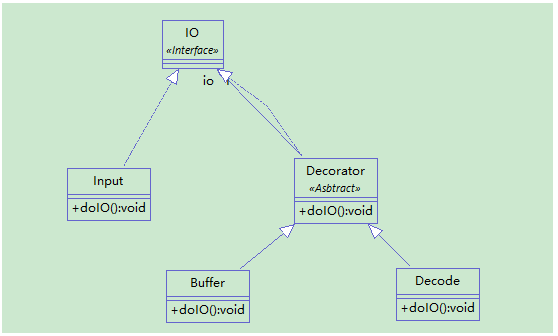

# 介绍

装饰者模式：动态地给一个对象添加一些额外的职责，就功能增加来说，装饰者模式比子类更为灵活。

扩展功能，可能很多初学者马上就想到用继承，但其实这种情况下继承并不是非常推荐使用。因为，我们有一个原则：职责单一原则。这很好理解，因为职责单一，这个类就容易被维护，而且容易被复用。这也是我们不提倡用继承的原因，继承有时候会使一个类变得臃肿。所以，我们有没有办法用组合而非继承来拓展功能呢？嗯，装饰者模式来了。

装饰者模式应用非常广泛，特别是在java的IO里。BufferedInputStream bufferedInputStream = new BufferedInputStream(new FileInputStream(srcFile));像这样在构造方法里设置其它类的，往往就是用了装饰者模式了。

我的理解：装饰者就是用组合的方式替代继承，因为继承的耦合性太高了。破坏了开闭原则和单一职责原则。

# 优缺点

**优点**：
1. 装饰者模式可以提供比继承更多的灵活性
2. 可以通过一种动态的方式来扩展一个对象的功能，在运行时选择不同的装饰器，从而实现不同的行为。
3. 通过使用不同的具体装饰类以及这些装饰类的排列组合，可以创造出很多不同行为的组合。可以使用多个具体装饰类来装饰同一对象，得到功能更为强大的对象。
4. 具体构件类与具体装饰类可以独立变化，用户可以根据需要增加新的具体构件类和具体装饰类，在使用时再对其进行组合，原有代码无须改变，符合“开闭原则”。
 
**缺点**：
1. 会产生很多的小对象，增加了系统的复杂性
2. 这种比继承更加灵活机动的特性，也同时意味着装饰模式比继承更加易于出错，排错也很困难，对于多次装饰的对象，调试时寻找错误可能需要逐级排查，较为烦琐。

# 使用场景

1. 在不影响其他对象的情况下，以动态、透明的方式给单个对象添加职责。
2. 需要动态地给一个对象增加功能，这些功能也可以动态地被撤销。当不能采用继承的方式对系统进行扩充或者采用继承不利于系统扩展和维护时。



## 举例对IO类进行装饰

```java
package decorator;
 
public interface IO {
	void doIO();
}
```

```java
package decorator;
 
//装饰者抽象类
public abstract class Decorator implements IO {
 
	private IO io;
	
	public Decorator(IO io) {
		this.io=io;
	}
	@Override
	public void doIO() {
		// TODO Auto-generated method stub
		io.doIO();
	}
}
```

```java
package decorator;
 
public class Input implements IO {//被装饰的类
 
	@Override
	public void doIO() {
		// TODO Auto-generated method stub
		System.out.println("读取数据");
	}
}
```

```java
package decorator;
 
public class Decode extends Decorator {//装饰类0
	public Decode(IO io) {
		super(io);
	}
	@Override
	public void doIO() {
		// TODO Auto-generated method stub
		super.doIO();//先执行父类的方法
		System.out.println("解码");
	}
}
```

```java
package decorator;
 
public class Buffer extends Decorator {//装饰类1
	public Buffer(IO io) {
		super(io);
	}
	@Override
	public void doIO() {
		// TODO Auto-generated method stub
		super.doIO();//先执行父类的方法
		System.out.println("缓冲区操作");
	}
}
```

```java
package decorator;
 
public class Client {
 
	public static void main(String[] args) {
		// TODO Auto-generated method stub
		Input input=new Input();
		Decode decode=new Decode(input);
		Buffer buffer=new Buffer(decode);
		buffer.doIO();
	}
}
```