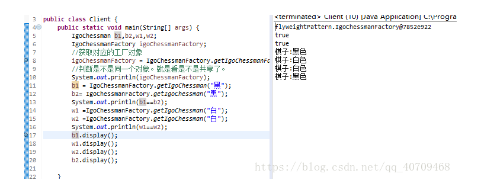

# 享元模式的概念

享元模式：运用共享技术有效地支持大量细粒度对象的复用。

JDBC连接池、线程池

在项目中出现很多相同或者类似的对象，享元模式会创建一个享元池将这些公共的实例保存在享元池中，可以针对的创建不同的对象，然后通过复用的方式进行分配。需要的时候就将对应的对象取出，不需要则放回。

享元模式能够实现共享技术！

String的常量池、Integer常量池等。

# 享元模式的UML图


1. Flyweight (享元抽象类)：一般是接口或者抽象类，定义了享元类的公共方法。这些方法可以分享内部状态的数据，也可以调用这些方法修改外部状态。

2. ConcreteFlyweight(具体享元类)：具体享元类实现了抽象享元类的方法，为享元对象开辟了内存空间来保存享元对象的内部数据，同时可以通过和单例模式结合只创建一个享元对象。

3. UnshareConcreteFlyweight(非共具体享元类):并不是所有的享元类都需要被共享的有的享元类就不要被共享，可以通过享元类来实例一个非共享享元对象。

4. Flyweight(享元工厂类)：享元工厂类创建并且管理享元类，享元工厂类针对享元类来进行编程，通过提供一个享元池来进行享元对象的管理。一般享元池设计成键值对，或者其他的存储结构来存储。当客户端进行享元对象的请求时，如果享元池中有对应的享元对象则直接返回对应的对象，否则工厂类创建对应的享元对象并保存到享元池。

# 享元模式的实现

IgoChessman (抽象享元类)将公共方法给抽象：

```java
package flyweightPattern;
/**
 * 
* <p>Title: IgoChessman</p>  
* <p>Description: 围棋享元抽象类</p>  
* @author HAND_WEILI  
* @date 2018年9月12日
 */
 
public abstract  class IgoChessman {
	//共享抽象方法棋子的颜色
	public abstract String chessColor();
	
	public void display() {
		System.out.println("棋子:"+this.chessColor());
	}
}
```

WhiteChessman ：白棋类，实现具体的方法：

```java
package flyweightPattern;
 
public class WhiteChessman extends IgoChessman {
 
	@Override
	public String chessColor() {
		// TODO Auto-generated method stub
		return "白色";
	}
}
```

BlackChessman :黑棋类，实现公共方法：

```java

package flyweightPattern;
 
public class BlackChessman extends IgoChessman {
 
	@Override
	public String chessColor() {
		// TODO Auto-generated method stub
		return "黑色";
	}
}
```

IgoChessmanFactory ：工厂类，使用的是单例模式创建，将享元对象唯一化：

```java
package flyweightPattern;
/**
 * 
* <p>Title: IgoChessmanFactory</p>  
* <p>Description:用单例模式来做这个工厂只提供一个对象 </p>  
* @author HAND_WEILI  
* @date 2018年9月12日
 */
 
import java.util.HashMap;
import java.util.Hashtable;
 
public class IgoChessmanFactory {
	//首先私有化自己的类
	private static IgoChessmanFactory igoChessmanFactory = new IgoChessmanFactory();
	//创建享元池
	private static  HashMap<String,IgoChessman > ht;
	
	//私有化构造函数自己创建自己 。
	private  IgoChessmanFactory() {
		//创建对应的棋子放进去.
		ht= new HashMap<String,IgoChessman >();
		IgoChessman white,black;
		white = new WhiteChessman();
		ht.put("白",white);
		black = new BlackChessman();
		//放入HASHTABLE
		ht.put("黑",black);
	   
	}
	
	//提供一个全局访问的方法。
	/**
	 * 
	 * <p>Title: getIgoChessmanFactory</p>  
	 * <p>Description: </p>  
	 * @return IgoChessmanFactory
	 */
	public static IgoChessmanFactory getIgoChessmanFactory() {
		return igoChessmanFactory;
	}
	
	//工厂方法创建对象 》
	public  static IgoChessman getIgoChessman(String name) {
		
		return(IgoChessman)ht.get(name);
		
	}
}
```

Client:客户端测试类：

```java
package flyweightPattern;
 
public class Client {
	public static void main(String[] args) {
		IgoChessman b1,b2,w1,w2;
		IgoChessmanFactory igoChessmanFactory;
		//获取对应的工厂对象 
		igoChessmanFactory = IgoChessmanFactory.getIgoChessmanFactory();
		//判断是不是同一个对象。就是看是不是共享了。
		System.out.println(igoChessmanFactory);
		b1 = IgoChessmanFactory.getIgoChessman("黑");
		b2= IgoChessmanFactory.getIgoChessman("黑");
		System.out.println(b1==b2);
		w1 =IgoChessmanFactory.getIgoChessman("白");
		w2 =IgoChessmanFactory.getIgoChessman("白");
		System.out.println(w1==w2);
		b1.display();
		w1.display();
		w2.display();
		b2.display();
	}
}
```



# 享有模式的优缺点及使用场景

## 优点：

- 节约系统的开销。保证一个常用的对象只有一个！
- 外部状态不会影响内部状态，可以在不同环境下进行共享哦。

## 缺点：

- 享元模式使逻辑变得更加复杂，需要将享元对象分出内部状态和外部状态。
- 并且为了使对象可以共享，外部状态在很多情况下是必须有的，比如围棋的位置。当读取外部状态时明显会增加运行时间。

## 使用场景：

- 一个系统有大量细粒度化的对象，占据大量的内存。
- 对象大部分属性可以外部化，并且能将外部的属性放入内部属性中来。
- 使用享元模式需要维护享元池，所以要用那种常用的经常调用的对象可以使用享元模式。