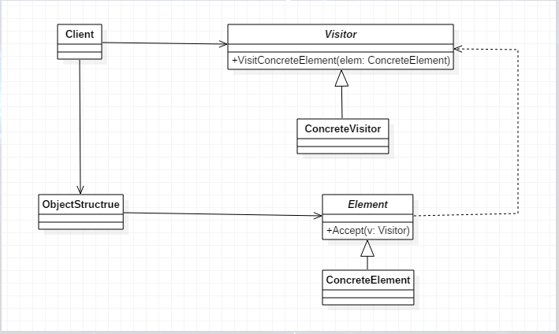
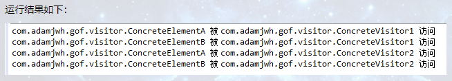
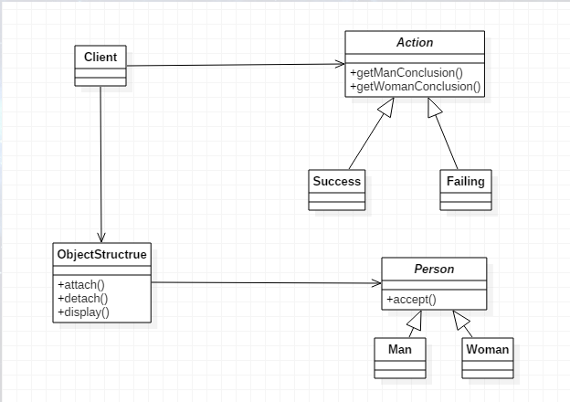
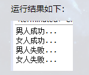

# 什么是访问者模式

访问者模式是一个相对比较简单，但结构又稍显复杂的模式，它讲的是表示一个作用于某对象结构中的各元素的操作，它使你可以在不改变各元素的类的前提下定义作用于这些元素的新操作。例如，你在朋友家做客，你是访问者，朋友接收你的访问，你通过朋友的描述，然后对朋友的描述做出一个判断，这就是访问者模式。
   
访问者模式（Visitor），封装一些作用于某种数据结构的各元素的操作，它可以在不改变数据结构的前提下定义作用于这些元素的新的操作。UML结构图如下：



其中，Visitor是抽象访问者，为该对象结构中ConcreteElement的每一个类声明一个Visit操作；ConcreteVisitor是具体访问者，实现每个由visitor声明的操作，是每个操作实现算法的一部分，而该算法片段是对应于结构中对象的类；ObjectStructure为能枚举它的元素，可以提供一个高层的接口以允许访问者访问它的元素；Element定义了一个Accept操作，它以一个访问者为参数；ConcreteElement为具体元素，实现Accept操作。

## 抽象访问者

此处可为抽象类或接口，用于声明访问者可以访问哪些元素，具体到程序中就是visit方法的参数定义哪些对象是可以被访问的。

```java
public abstract class Visitor {

    public abstract void visitConcreteElementA(ConcreteElementA concreteElementA);

    public abstract void visitConcreteElementB(ConcreteElementB concreteElementB);

}
```

## 具体访问者

标识访问者访问到一个类后该干什么、怎么干。这里以ConcreteVisitor1为例，ConcreteVisitor2就不再赘述了。

```java
public class ConcreteVisitor1 extends Visitor {

    @Override
    public void visitConcreteElementA(ConcreteElementA concreteElementA) {
        System.out.println(concreteElementA.getClass().getName() + " 被 " + this.getClass().getName() + " 访问");
    }

    @Override
    public void visitConcreteElementB(ConcreteElementB concreteElementB) {
        System.out.println(concreteElementB.getClass().getName() + " 被 " + this.getClass().getName() + " 访问");
    }

}
```

## 抽象元素

此处为接口后抽象类，用于声明接受哪一类访问者访问，程序上是通过accpet方法中的参数来定义的。

抽象元素有两类方法，一是本身的业务逻辑，也就是元素作为一个业务处理单元必须完成的职责；另外一个是允许哪一个访问者来访问。这里只声明的第二类即accept方法。

```java
public abstract class Element {
    public abstract void accept(Visitor visitor);
}
```

## 具体元素

实现accept方法，通常是visitor.visit(this)。这里以ConcreteElementA为例，ConcreteElementB就不再赘述了。

```java
public class ConcreteElementA extends Element {

    @Override
    public void accept(Visitor visitor) {
        visitor.visitConcreteElementA(this);
    }

    //其它方法
    public void operationA() {

    }

}
```

## 结构对象

元素生产者，一般容纳在多个不同类、不同接口的容器，如List、Set、Map等，在项目中，一般很少抽象出这个角色。

```java
public class ObjectStructure {

    private List<Element> elements = new LinkedList<>();

    public void attach(Element element) {
        elements.add(element);
    }

    public void detach(Element element) {
        elements.remove(element);
    }

    public void accept(Visitor visitor) {
        for (Element element : elements) {
            element.accept(visitor);
        }
    }
}
```

## Client客户端

我们通过以下场景模拟一下访问者模式。

```java
public class Client {

    public static void main(String[] args) {
        ObjectStructure objectStructure = new ObjectStructure();

        objectStructure.attach(new ConcreteElementA());
        objectStructure.attach(new ConcreteElementB());

        ConcreteVisitor1 visitor1 = new ConcreteVisitor1();
        ConcreteVisitor2 visitor2 = new ConcreteVisitor2();

        objectStructure.accept(visitor1);
        objectStructure.accept(visitor2);
    }
}
```



# 访问者模式的应用
1. 何时使用
    - 需要对一个对象结构中的对象进行很多不同的并且不相关的操作，而需要避免让这些操作“污染”这些对象的类时
2. 方法
    - 在被访问的类里面添加一个对外提供接待访问者的接口
3. 优点
    - 符合单一职责原则
    - 优秀的扩展性
    - 灵活性非常高
4. 缺点
    - 具体元素对访问者公布细节，也就是说访问者关注了其他类的内部细节，这是迪米特法则所不建议的
    - 具体元素变更比较困难
    - 违背了依赖倒转原则。访问者依赖的是具体元素，而不是抽象元素
5. 使用场景
    - 一个对象结构包含很多类对象，它们有不同的接口，而你想对这些对象实施一些依赖与其具体类的操作，也就是用迭代器模式已经不能胜任的情景
    - 需要对一个对结构中的对象进行很多不同并且不相关的操作，而你想避免让这些操作“污染”这些对象
6. 目的
    - 把处理从数据结构分离出来
7. 应用实例
    - 人类只分为男人和女人，这个性别分类是稳定的，可以在状态类中，增加“男人反应”和“女人反应”两个方法，方法个数是稳定的，不会很容易发生变化
    - 你在朋友家做客，你是访问者，朋友接受你的访问，你通过朋友的描述，然后对朋友的描述做出一个判断
8. 注意事项
    - 访问者可以对功能进行统一，可以做报表、UI、拦截器与过滤器
    - 访问者模式适用于数据结构相对稳定的系统
    
# 访问者模式的实现

下面就以上述应用实例中的人类分为男人和女人这个例子来实现访问者模式。UML图如下：



## Action

抽象的状态类，主要声明以下两个方法。

这里的关键在于人只分男人和女人，这个性别的分类是稳定的，所以可以在状态类中，增加“男人反应”和“女人反应”两个方法，方法个数是稳定的，不会容易发生变化。

```java
public abstract class Action {

    //得到男人的结论或反应
    public abstract void getManConclusion(Man man);

    //得到女人的结论或反应
    public abstract void getWomanConclusion(Woman woman);

}
```

## Person

人的抽象类。只有一个“接受”的抽象方法，它是用来获得“状态”对象的。

```java
public abstract class Person {
    //接受
    public abstract void accept(Action action);
}
```

## Action类的具体实现类

这里以成功类（Success）为例，失败类（Fail）同理。

```java
public class Success extends Action {

    @Override
    public void getManConclusion(Man man) {
        System.out.println("男人成功...");
    }

    @Override
    public void getWomanConclusion(Woman woman) {
        System.out.println("女人成功...");
    }

}
```

## Person类的具体实现类

这里以男人类（Man）为例，女人类（Woman）同理。

这里用到了双分派，即首先在客户程序中将具体状态作为参数传递给Man类完成了一次分派，然后Man类调用作为参数的“具体方法”中的方法getManConclusion()，同时将自己（this）作为参数传递进去，这便完成了第二次分派。accept方法就是一个双分派操作，它得到执行的操作不仅决定于Action类的具体状态，还决定于它访问的Person的类别。

```java
public class Man extends Person {

    @Override
    public void accept(Action action) {
        action.getManConclusion(this);
    }

}
```

## 结构对象

```java
public class ObjectStructure {

    private List<Person> elements = new LinkedList<>();

    //增加
    public void attach(Person person) {
        elements.add(person);
    }

    //移除
    public void detach(Person person) {
        elements.remove(person);
    }

    //查看显示
    public void display(Action action) {
        for (Person person : elements) {
            person.accept(action);
        }
    }

}
```

## Client客户端

```java
public class Client {

    public static void main(String[] args) {
        ObjectStructure objectStructure = new ObjectStructure();

        objectStructure.attach(new Man());
        objectStructure.attach(new Woman());

        //成功
        Success success = new Success();
        objectStructure.display(success);

        //失败
        Failing failing = new Failing();
        objectStructure.display(failing);
    }

}
```



# 双分派

上面提到了双分派，所谓双分派是指不管类怎么变化，我们都能找到期望的方法运行。双分派意味着得到执行的操作取决于请求的种类和两个接收者的类型。
   
以上述实例为例，假设我们要添加一个Marray的状态类来考察Man类和Woman类的反应，由于使用了双分派，只需增加一个Action子类即可在客户端调用来查看，不需要改动任何其他类的代码。

而单分派语言处理一个操作是根据请求者的名称和接收到的参数决定的，在Java中有静态绑定和动态绑定之说，它的实现是依据重载和重写实现的。值得一提的是，Java是一个支持双分派的单分派语言。