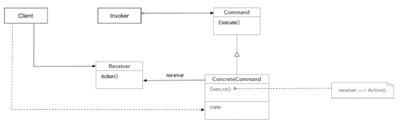
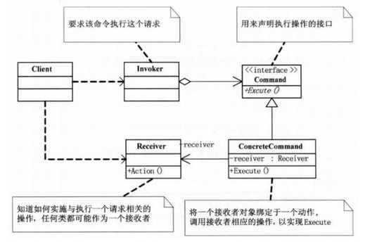
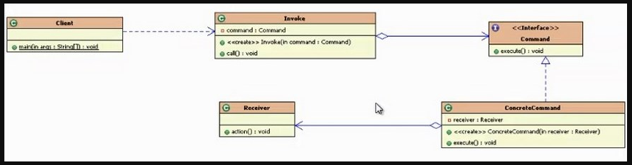

这篇博文只有说明，并没有实现任何代码

# 意图

简单的说，命令模式可将“动作的请求者”从“动作的执行者”对象中解耦。

将一个请求封装为一个对象，从而使你可用不同的请求对客户进行参数化(即，可以用不同的命令对象，去参数化配置客户的请求)；对请求排队或记录请求日志，以及支持可撤销的操作。

这一模式的关键是一个抽象的Command类，它定义了一个执行操作的接口。其最简单的形式是一个抽象的Execute操作。具体的Command子类将接收者作为其一个实例变量，并实现Execute操作，指定接收者采取的动作。而接收者有执行该请求所需的具体信息。
接收者：真正执行命令的对象。任何类都可能成为一个接收者，只要它能够实现命令要求实现的相应功能。

# 结构





- Command：
定义命令的接口，声明执行的方法。
- ConcreteCommand：
命令接口实现对象，是“虚”的实现;通常会持有接收者，并调用接收者的功能来完成命令要执行的操作。
- Receiver：
接收者，真正执行命令的对象。任何类都可能成为一个接收者，只要它能够实现命令要求实现的相应功能。
- Invoker：
要求命令对象执行请求，通常会持有命令对象，可以持有很多的命令对象。这个是客户端真正触发命令并要求命令执行相应操作的地方，也就是说相当于使用命令对象的入口。
- Client：
创建具体的命令对象，并且设置命令对象的接收者。注意这个不是我们常规意义上的客户端，而是在组装命令对象和接收者，或许，把这个Client称为装配者会更好理解，因为真正使用命令的客户端是从Invoker来触发执行。

# 流程

a) Client创建一个ConcreteCommand对象并指定它的Receiver对象。
b) 某Invoker对象存储该ConcreteCommand对象。
c) 该Invoker通过调用Command对象的Execute操作来提交一个请求。若该命令是可撤销的，CnocreteCommand就在执行Excute操作之前存储当前状态以用于取消该命令。
d) ConcreteCommand对象会调用它的Receiver的一些操作以执行该请求。

# 可撤销的操作

可撤销操作的意思就是：放弃该操作，回到未执行该操作前的状态。

有两种基本的思路来实现可撤销的操作：

① 一种是补偿式，又称反操作式
比如被撤销的操作是加的功能， 那撤消的实现就变成减的功能;同理被撤销的操作是打开的功能，那么撤销的实现就变成关闭的功能。

② 另外一种方式是存储恢复式
意思就是把操作前的状态记录下来，然后要撤销操作的时候就直接恢复回去就可以了。

# 认识命令模式

(1)命令模式的关键
命令模式的关键之处就是把请求封装成为对象，也就是命令对象，并定义了统一的执行操作的接口，这个命令对象可以被存储、转发、记录、处理、撤销等，整个命令模式都是围绕这个对象在进行。
(2)命令模式的组装和调用
在命令模式中经常会有一个命令的组装者，用它来维护命令的“虚”实现和真实实现之间的关系。如果是超级智能的命令，也就是说命令对象自己完全实现好了，不需要接收者，那就是命令模式的退化，不需要接收者，自然也不需要组装者了。
而真正的用户就是具体化请求的内容，然后提交请求进行触发就好了。真正的用户会通过invoker来触发命令。
在实际开发过程中，Client和Invoker可以融合在一起，由客户在使用命令模式的时候，先进行命令对象和接收者的组装，组装完成后，就可以调用命令执行请求。
(3)命令模式的接收者
接收者可以是任意的类，对它没有什么特殊要求，这个对象知道如何真正执行命令的操作，执行时是从command的实现类里面转调过来。
一个接收者对象可以处理多个命令，接收者和命令之间没有约定的对应关系。接收者提供的方法个数、名称、功能和命令中的可以不一样，只要能够通过调用接收者的方法来实现命令对应的功能就可以了。
(4)智能命令
在标准的命令模式里面，命令的实现类是没有真正实现命令要求的功能的，真正执行命令的功能的是接收者。
如果命令的实现对象比较智能，它自己就能真实地实现命令要求的功能，而不再需要调用接收者，那么这种情况就称为智能命令。
也可以有半智能的命令，命令对象知道部分实现，其它的还是需要调用接收者来完成，也就是说命令的功 能由命令对象和接收者共同来完成。
(5)发起请求的对象和真正实现的对象是解耦的
请求究竟由谁处理，如何处理，发起请求的对象是不知道的，也就是发起请求的对象和真正实现的对象是解耦的。发起请求的对象只管发出命令，其它的就不管了。

# 命令模式的更多用途
命令模式的关键之处就是把请求封装成为对象，也就是命令对象(一个接收者和一组动作)，然后将它传来传去，就像是一般的对象一样。现在，即使在命令对象被创建许久之后，运算依然可以被调用。事实上，它甚至可以在不同的线程中被调用。我们可以利用这样的特性衍生一些应用，例如：线程池、工作队列、日志请求等。

1. 队列请求
想象有一个工作队列：你在某一端添加命令，然后另一端则是线程。线程进行下面的动作：从队列中取出一个命令，调用它的execute()方法，等待这个调用完成，然后将此命令对象丢弃，再取出下一个命令......
请注意，工作队列和命令对象之间是完全解耦的。此刻线程可能在进行财务运算，下一刻却在读取网络数据。工作队列对象不在乎到底做些什么，它们只知道取出命令对象，然后调用其execute()方法。类似地，它们只要实现命令模式的对象，就可以放入队列里，当线程可用时，就调用此对象的execute()方法。
2. 日志请求
某些应用需要我们将所有的动作都记录在日志中，并能在系统死机之后，重新调用这些动作恢复到之前的状态。

# 命令模式的代码实现

首先定义一个命令的接收者，也就是到最后真正执行命令的那个人

```java
//接收者：真正执行命令的对象
public class Receiver {
    public void action(){
        System.out.println("命令执行了.......");
    }
}
```

然后定义抽象命令和抽象命令的具体实现，具体命令类中需要持有真正执行命令的那个对象。

```java
//抽象命令类：抽象的命令，可以根据不同类型的命令写出不同的实现
public interface Command {
    //调用命令
    void execute();
}
//具体命令类
class ConcreteCommand implements Command{
    private Receiver receiver;//持有真正执行命令对象的引用
    public ConcreteCommand(Receiver receiver) {
        super();
        this.receiver = receiver;
    }
    @Override
    public void execute() {
        //调用接收者执行命令的方法
        receiver.action();
    }
}
```

接下来就可以定义命令的发起者了，发起者需要持有一个命令对象。以便来发起命令。

```java
//请求者/调用者：发起执行命令请求的对象
public class Invoker {
    private Command command;//持有命令对象的引用
    public Invoker(Command command) {
        super();
        this.command = command;
    }
    public void call(){
        //请求者调用命令对象执行命令的那个execute方法
        command.execute();
    }
}
```

客户端测试：客户端

```java
public class Client{
    public static void main(String[] args) {
        //通过请求者（invoker）调用命令对象（command），命令对象中调用了命令具体执行者（Receiver）
        Command command = new ConcreteCommand(new Receiver());
        Invoker invoker = new Invoker(command);
        invoker.call();
    }
}
```

代码的UML图如下：



# 应用场景

- Struts2中action中的调用过程中存在命令模式

- 数据库中的事务机制的底层实现

- 命令的撤销和恢复：增加相应的撤销和恢复命令的方法（比如数据库中的事务回滚）


