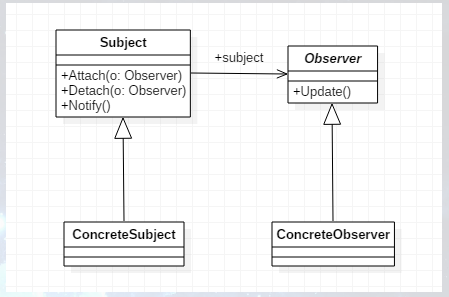
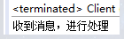
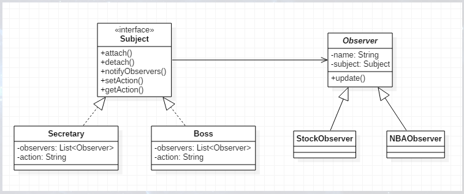

# 介绍

观察者一般可以看做是第三者，比如在学校上自习的时候，大家肯定都有过交头接耳、各种玩耍的经历，这时总会有一个“放风”的小伙伴，当老师即将出现时及时“通知”大家老师来了。再比如，拍卖会的时候，大家相互叫价，拍卖师会观察最高标价，然后通知给其它竞价者竞价，这就是一个观察者模式。

对于观察者模式而言，肯定有观察者和被观察者之分。比如在一个目录下建立一个文件，这时系统会通知目录管理器增加目录，并通知磁盘减少空间，在这里，文件就是观察者，目录管理器和磁盘就是被观察者。

观察者模式（Observer），又叫发布-订阅模式（Publish/Subscribe），定义对象间一种一对多的依赖关系，使得每当一个对象改变状态，则所有依赖于它的对象都会得到通知并自动更新。UML结构图如下：



其中，Subject类是主题，它把所有对观察者对象的引用文件存在了一个聚集里，每个主题都可以有任何数量的观察者。抽象主题提供了一个接口，可以增加和删除观察者对象；Observer类是抽象观察者，为所有的具体观察者定义一个接口，在得到主题的通知时更新自己；ConcreteSubject类是具体主题，将有关状态存入具体观察者对象，在具体主题内部状态改变时，给所有登记过的观察者发出通知；ConcreteObserver是具体观察者，实现抽象观察者角色所要求的更新接口，以便使本身的状态与主题的状态相协同。

## 主题Subject

首先定义一个观察者数组，并实现增、删及通知操作。它的职责很简单，就是定义谁能观察，谁不能观察，用Vector是线程同步的，比较安全，也可以使用ArrayList，是线程异步的，但不安全。

```java
public class Subject {

    //观察者数组
    private Vector<Observer> oVector = new Vector<>();

    //增加一个观察者
    public void addObserver(Observer observer) {
        this.oVector.add(observer);
    }

    //删除一个观察者
    public void deleteObserver(Observer observer) {
        this.oVector.remove(observer);
    }

    //通知所有观察者
    public void notifyObserver() {
        for(Observer observer : this.oVector) {
            observer.update();
        }
    }
}
```

## 抽象观察者Observer

观察者一般是一个接口，每一个实现该接口的实现类都是具体观察者。

```java
public interface Observer {
    //更新
    public void update();
}
```

## 具体主题

继承Subject类，在这里实现具体业务，在具体项目中，该类会有很多变种。

```java
public class ConcreteSubject extends Subject {

    //具体业务
    public void doSomething() {
        //...
        super.notifyObserver();
    }

}
```

## 具体观察者

实现Observer接口。

```java
public class ConcreteObserver implements Observer {

    @Override
    public void update() {
        System.out.println("收到消息，进行处理");
    }
}
```

## Client客户端

首先创建一个被观察者，然后定义一个观察者，将该被观察者添加到该观察者的观察者数组中，进行测试。

```java
public class Client {

    public static void main(String[] args) {
        //创建一个主题
        ConcreteSubject subject = new ConcreteSubject();
        //定义一个观察者
        Observer observer = new ConcreteObserver();
        //观察
        subject.addObserver(observer);
        //开始活动
        subject.doSomething();
    }
}
```

运行结果如下：



# 观察者模式的应用
1. 何时使用
   - 一个对象状态改变，所有的依赖对象都将得到通知
2. 方法
   - 使用面向对象技术
3. 优点
   - 观察者和被观察者是抽象耦合的
   - 建立了一套触发机制
4. 缺点
   - 如果一个被观察者对象有很多的直接和间接的观察者的话，将所有的观察者都通知到会花费很多时间
   - 如果观察者和观察目标间有循环依赖，可能导致系统崩溃
   - 没有相应的机制让观察者知道所观察的目标对象是怎么发生变化的
5. 使用场景
   - 关联行为场景
   - 事件多级触发场景
   - 跨系统的消息变换场景，如消息队列的处理机制
6. 应用实例
   - 手机丢了，委托别人给其他人发消息通知
   - 通知老师/老板来了
   - 拍卖，拍卖师观察最高标价，然后通知给其它竞价者竞价
   - 在一个目录下建立一个文件，会同时通知目录管理器增加目录，并通知磁盘减少空间，文件是被观察者，目录管理器和磁盘管理器是观察者
   - 猫叫了一声，吓着了老鼠，也惊到了主人，猫是被观察者，老鼠和人是观察者
7. 注意事项
   - 避免循环引用
   - 如果顺序执行，某一观察者错误会导致系统卡壳，一般采用异步方式
   
# 观察者模式的实现

下面举一个具体实例，假设上班时间有一部分同事在看股票，一部分同事在看NBA，这时老板回来了，前台通知了部分同事老板回来了，这些同事及时关闭了网页没被发现，而没被通知到的同事被抓了个现行，被老板亲自“通知”关闭网页，UML图如下：



## 通知者接口

```java
public interface Subject {

    //增加
    public void attach(Observer observer);
    //删除
    public void detach(Observer observer);
    //通知
    public void notifyObservers();

    //状态
    public void setAction(String action);
    public String getAction();

}
```

## 观察者

```java
public abstract class Observer {

    protected String name;
    protected Subject subject;

    public Observer(String name, Subject subject) {
        this.name = name;
        this.subject = subject;
    }

    public abstract void update();

}
```

## 具体通知者

前台Secretary和老板Boss作为具体通知者，实现Subject接口。这里只给出Secretary类的代码，Boss类与之类似。

```java
public class Secretary implements Subject {

    //同事列表
    private List<Observer> observers = new LinkedList<>();
    private String action;

    //添加
    @Override
    public void attach(Observer observer) {
        observers.add(observer);
    }

    //删除
    @Override
    public void detach(Observer observer) {
        observers.remove(observer);
    }

    //通知
    @Override
    public void notifyObservers() {
        for(Observer observer : observers) {
            observer.update();
        }
    }

    //前台状态
    @Override
    public String getAction() {
        return action;
    }

    @Override
    public void setAction(String action) {
        this.action = action;
    }

}
```

## 具体观察者

StockObserver是看股票的同事，NBAObserver是看NBA的同事，作为具体观察者，继承Observer类。这里只给出StockObserver类的代码，NBAObserver类与之类似。

```java
public class StockObserver extends Observer {

    public StockObserver(String name, Subject subject) {
        super(name, subject);
    }

    @Override
    public void update() {
        System.out.println(subject.getAction() + "\n" + name + "关闭股票行情，继续工作");
    }

}
```

## 前台作为通知者进行通知（Client）

前台作为通知者，通知观察者。这里添加adam和tom到通知列表，并从通知列表中删除了adam，测试没在通知列表中的对象不会收到通知。

```java
public class Client {

    public static void main(String[] args) {
        //前台为通知者
        Secretary secretary = new Secretary();

        StockObserver observer = new StockObserver("adam", secretary);
        NBAObserver observer2 = new NBAObserver("tom", secretary);

        //前台通知
        secretary.attach(observer);
        secretary.attach(observer2);

        //adam没被前台通知到，所以被老板抓了个现行
        secretary.detach(observer);

        //老板回来了
        secretary.setAction("小心！Boss回来了！");
        //发通知
        secretary.notifyObservers();
    }

}
```

运行结果如下，只有tom接收到了通知：


当一个对象的改变需要同时改变其它对象，并且它不知道具体有多少对象有待改变的时候，应该考虑使用观察者模式。

而使用观察者模式的动机在于：将一个系统分割成一系列相互协作的类有一个很不好的副作用，就是需要维护相关对象间的一致性，我们不希望为了维持一致性而使各类紧密耦合，这样会给维护、扩展和重用都带来不便，而观察者模式所做的工作就是在解除耦合。