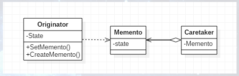

# 什么是备忘录模式

备忘录这个词汇大家应该都不陌生，我就经常使用备忘录来记录一些比较重要的或者容易遗忘的信息，与之相关的最常见的应用有许多，比如游戏存档，我们玩游戏的时候肯定有存档功能，旨在下一次登录游戏时可以从上次退出的地方继续游戏，或者对复活点进行存档，如果挂掉了则可以读取复活点的存档信息重新开始。与之相类似的就是数据库的事务回滚，或者重做日志redo log等。

备忘录模式（Memento），在不破坏封装性的前提下，捕获一个对象的内部状态，并在该对象之外保存着这个状态。这样以后就可将该对象恢复到原先保存的状态。UML结构图如下：



其中，Originator是发起人，负责创建一个备忘录Memento，用以记录当前时刻它的内部状态，并可使用备忘录恢复内部状态；Memento是备忘录，负责存储Originator对象的内部状态，并可防止Originator以外的其他对象访问备忘录Memento；Caretaker是管理者，负责保存好备忘录的Memento，不能对备忘录的内容进行操作或检查。

## 发起人角色

记录当前时刻的内部状态，并负责创建和恢复备忘录数据，允许访问返回到先前状态所需的所有数据。

```java
public class Originator {

    private String state;

    public String getState() {
        return state;
    }

    public void setState(String state) {
        this.state = state;
    }

    public Memento createMemento() {
        return (new Memento(state));
    }

    public void setMemento(Memento memento) {
        state = memento.getState();
    }

    public void show() {
        System.out.println("state = " + state);
    }

}
```

## 备忘录角色

负责存储Originator发起人对象的内部状态，在需要的时候提供发起人需要的内部状态。

```java
public class Memento {

    private String state;

    public Memento(String state) {
        this.state = state;
    }

    public String getState() {
        return state;
    }

}
```

## 备忘录管理员角色

对备忘录进行管理、保存和提供备忘录，只能将备忘录传递给其他角色。

```java
public class Caretaker {

    private Memento memento;

    public Memento getMemento() {
        return memento;
    }

    public void setMemento(Memento memento) {
        this.memento = memento;
    }

}
```

## Client客户端

下面编写一小段代码测试一下，即先将状态置为On，保存后再将状态置为Off，然后通过备忘录管理员角色恢复初始状态。

```java
public class Client {

    public static void main(String[] args) {
        Originator originator = new Originator();
        originator.setState("On");    //Originator初始状态
        originator.show();

        Caretaker caretaker = new Caretaker();
        caretaker.setMemento(originator.createMento());

        originator.setState("Off");    //Originator状态变为Off
        originator.show();

        originator.setMemento(caretaker.getMemento());    //回复初始状态
        originator.show();
    }

}
```

运行结果如下：


# 备忘录模式的应用

1. 何时使用
    - 需要记录一个对象的内部状态时，为了允许用户取消不确定或者错误的操作，能够恢复到原先的状态
2. 方法
    - 通过一个备忘录类专门存储对象状态
3. 优点
    - 给用户提供了一种可以恢复状态的机制，可以使用能够比较方便地回到某个历史的状态
    - 实现了信息的封装，使得用户不需要关心状态的保存细节
4. 缺点
    - 消耗资源
5. 使用场景
    - 需要保存和恢复数据的相关场景
    - 提供一个可回滚的操作，如ctrl+z、浏览器回退按钮、Backspace键等
    - 需要监控的副本场景
6. 应用实例
    - 游戏存档
    - ctrl+z键、浏览器回退键等（撤销/还原）
    - 棋盘类游戏的悔棋
    - 数据库事务的回滚
7. 注意事项
    - 为了符合迪米特法则，需要有一个管理备忘录的类
    - 不要在频繁建立备份的场景中使用备忘录模式。为了节约内存，可使用原型模式+备忘录模式
    
    
# 备忘录模式的实现


## 游戏角色

简单记录了游戏角色的生命力、攻击力、防御力，通过saveState()方法来保存当前状态，通过recoveryState()方法来恢复角色状态。

```java
public class GameRole {

    private int vit;    //生命力
    private int atk;    //攻击力
    private int def;    //防御力

    public int getVit() {
        return vit;
    }
    public void setVit(int vit) {
        this.vit = vit;
    }
    public int getAtk() {
        return atk;
    }
    public void setAtk(int atk) {
        this.atk = atk;
    }
    public int getDef() {
        return def;
    }
    public void setDef(int def) {
        this.def = def;
    }

    //状态显示
    public void stateDisplay() {
        System.out.println("角色当前状态：");
        System.out.println("体力：" + this.vit);
        System.out.println("攻击力：" + this.atk);
        System.out.println("防御力： " + this.def);
        System.out.println("-----------------");
    }

    //获得初始状态
    public void getInitState() {
        this.vit = 100;
        this.atk = 100;
        this.def = 100;
    }

    //战斗后
    public void fight() {
        this.vit = 0;
        this.atk = 0;
        this.def = 0;
    }

    //保存角色状态
    public RoleStateMemento saveState() {
        return (new RoleStateMemento(vit, atk, def));
    }

    //恢复角色状态
    public void recoveryState(RoleStateMemento memento) {
        this.vit = memento.getVit();
        this.atk = memento.getAtk();
        this.def = memento.getDef();
    }

}
```

## 角色状态存储箱

备忘录类，用于存储角色状态。

```java
public class RoleStateMemento {

    private int vit;    //生命力
    private int atk;    //攻击力
    private int def;    //防御力

    public RoleStateMemento(int vit, int atk, int def) {
        this.vit = vit;
        this.atk = atk;
        this.def = def;
    }

    public int getVit() {
        return vit;
    }

    public void setVit(int vit) {
        this.vit = vit;
    }

    public int getAtk() {
        return atk;
    }

    public void setAtk(int atk) {
        this.atk = atk;
    }

    public int getDef() {
        return def;
    }

    public void setDef(int def) {
        this.def = def;
    }

}
```

## 角色状态管理者

备忘录管理者。

```java
public class RoleStateCaretaker {

    private RoleStateMemento memento;

    public RoleStateMemento getMemento() {
        return memento;
    }

    public void setMemento(RoleStateMemento memento) {
        this.memento = memento;
    }

}
```

## Client客户端

下面编写一个简单的程序测试一下，编写逻辑大致为打boss前存档，打boss失败了，读档。

```java
public class Client {

    public static void main(String[] args) {
        //打boss前
        GameRole gameRole = new GameRole();
        gameRole.getInitState();
        gameRole.stateDisplay();

        //保存进度
        RoleStateCaretaker caretaker = new RoleStateCaretaker();
        caretaker.setMemento(gameRole.saveState());

        //打boss失败
        gameRole.fight();
        gameRole.stateDisplay();

        //恢复状态
        gameRole.recoveryState(caretaker.getMemento());
        gameRole.stateDisplay();
    }
}
```