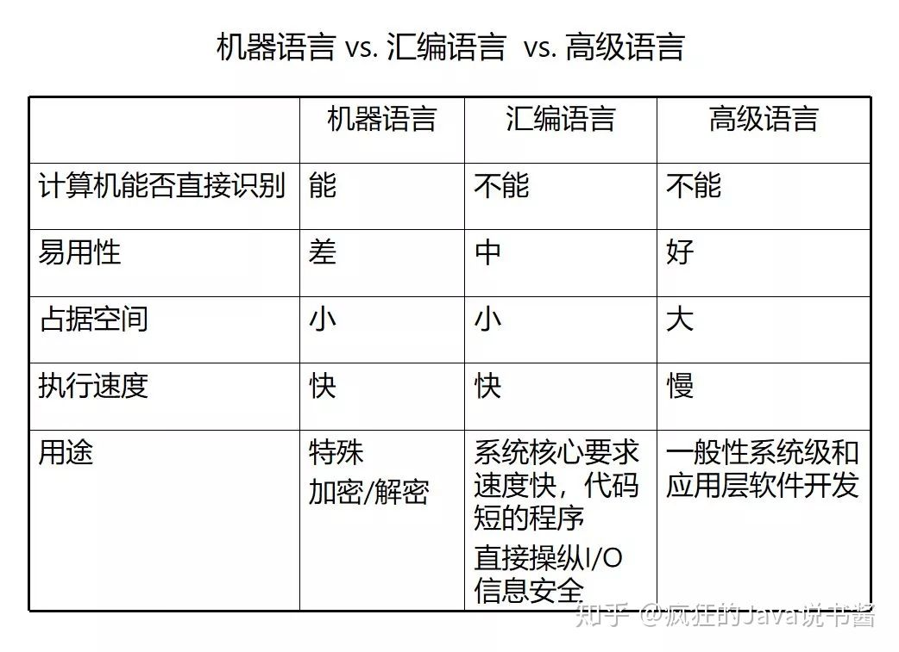
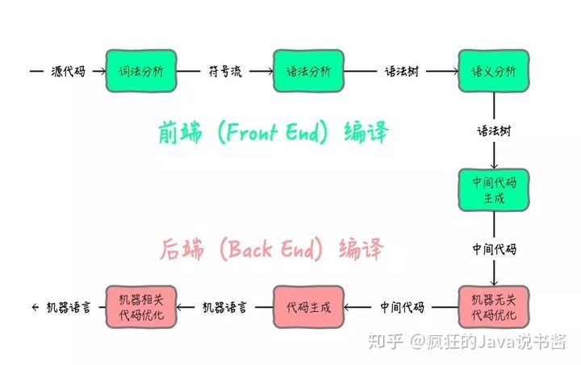

转载：https://zhuanlan.zhihu.com/p/67492482

# 计算机语言

计算机语言（Computer Language）指用于人与计算机之间通讯的语言。计算机语言是人与计算机之间传递信息的媒介。

计算机系统最大特征是指令通过一种语言传达给机器。为了使电子计算机进行各种工作，就需要有一套用以编写计算机程序的数字、字符和语法规划，由这些字符和语法规则组成计算机各种指令（或各种语句）。这些就是计算机能接受的语言。

计算机语言包括机器语言、汇编语言和高级语言三种。

## 机器语言

机器语言是用二进制代码表示的计算机能直接识别和执行的一种机器指令的集合。机器语言具有灵活、直接执行和速度快等特点。但是不同型号的计算机其机器语言是不相通的，按着一种计算机的机器指令编制的程序，不能在另一种计算机上执行。

因为机器语言是使用二进制表示的，所以编出的程序全是些0和1的指令代码。

 机器语言的优点就是可以直接被计算机识别和执行，比较高效，但是同时也有很多缺点，如：

- 机器只认识0和1，程序员很难记住每个指令转成0和1的组合是什么，需要查大量的表格来确定每个数字表示什么意思
- 因为它的书面形式全是"密"码，所以可读性差，不便于交流与合作。
- 因为它严重地依赖于具体的计算机，所以可移植性差，重用性差。

由于机器语言有这么多的弊端，于是有了汇编语言。

## 汇编语言

汇编语言使用助记符（Mnemonics）来代替和表示特定低级机器语言的操作。

助记符（mnemonic）是便于人们记忆、并能描述指令功能和指令操作数的符号，助记符是表明指令功能的英语单词或其缩写。如用ADD表示加法、MOV表示传送、SUB表示减法等。

但是，汇编语言只是让使用者，即程序员们更加容易记住和使用，计算机并不认识汇编语言，所以，想要让计算机执行汇编代码，需要先将汇编程序将它们转换成可执行的机器语言代码。这一过程被称为汇编过程。

由于汇编更接近机器语言，能够直接对硬件进行操作，生成的程序与其他的语言相比具有更高的运行速度，占用更小的内存，因此在一些对于时效性要求很高的程序、许多大型程序的核心模块以及工业控制方面大量应用。

机器语言和汇编语言，二者是几乎很少或者完全没有做任何语法抽象的，这种语言我们通常称之为低级语言，这种更加接近硬件，而且是不可以在不同硬件间移植的。

但是随着现代软件系统越来越庞大复杂，大量经过了封装的高级语言如C/C++，Pascal/Object Pascal也应运而生。这些新的语言使得程序员在开发过程中能够更简单，更有效率，使软件开发人员得以应付快速的软件开发的要求。

## 高级语言

高级语言是高度封装了的编程语言，与低级语言相对。

它是以人类的日常语言为基础的一种编程语言，使用一般人易于接受的文字来表示（例如汉字、不规则英文或其他外语），从而使程序编写员编写更容易，亦有较高的可读性，以方便对电脑认知较浅的人亦可以大概明白其内容。

如流行的java，c，c++，C#，pascal，python，lisp，prolog，FoxPro，易语言，中文版的C语言习语言等等，这些语言的语法、命令格式都不相同。

同汇编语言一样，高级语言离机器语言更加远了，计算机无法直接识别高级语言。所以，想要让计算机执行高级语言，就需要将其转化为机器语言。

程序设计语言从机器语言到高级语言的抽象，带来的主要好处主要有以下几个方面：

- 高级语言接近算法语言，易学、易掌握，一般工程技术人员只要几周时间的培训就可以胜任程序员的工作；
- 高级语言为程序员提供了结构化程序设计的环境和工具，使得设计出来的程序可读性好，可维护性强，可靠性高；
- 高级语言远离机器语言，与具体的计算机硬件关系不大，因而所写出来的程序可移植性好，重用率高；
- 由于把繁杂琐碎的事务交给了编译程序去做，所以自动化程度高，开发周期短，且程序员得到解脱，可以集中时间和精力去从事对于他们来说更为重要的创造性劳动，以提高程序的质量。

# 编译

上面提到语言有两种，一种低级语言，一种高级语言。可以这样简单的理解：低级语言是计算机认识的语言、高级语言是程序员认识的语言。

那么，怎么把程序员写出来的**高级语言转换成计算机认识的低级语言**然后让计算机执行呢？

这个过程其实就是编译！

编译的主要的目的是将便于人编写、阅读、维护的高级语言所写作的源代码程序，翻译为计算机能解读、运行的低级语言的程序，也就是可执行文件。

## Java语言的编译

Java语言作为一种高级语言，想要被执行，就需要通过编译的手段将其转换为机器语言。

Java语言的源文件是一个java文件，要将一个java文件，转换为二进制文件一共要经过两个步骤。

首先经过前端编译器，将java文件编译成中间代码，这种中间代码就是class文件，即字节码文件。

然后，在经过后端编译器，将class字节码文件，编译成机器语言。

- **Java的前端编译器主要是javac， Eclipse JDT 中的增量式编译器 ECJ 等**。
- **Java的后端编译器主要是各大虚拟机实现的，如HotSpot中的JIT编译器**。

# 反编译

前面讲过，我们可以通过编译器，把高级语言的源代码编译成低级语言，那么反之，我们亦可以通过低级语言进行反向工程，获取其源代码。这个过程，就叫做反编译。

**我们虽然很难将机器语言反编译成源代码，但是，我们还是可以把中间代码进行反编译的。就像我们虽然不能把经过虚拟机编译后的机器语言进行反编译，但是我们把javac编译得到的class进行反编译还是可行的。**

所以，我们说Java的反编译，一般是将class文件转换成java文件。

## 反编译的作用

首先，反编译对于学习Java来说是一个很好的手段。

因为Java作为一种编程语言，提供了很多语法糖，如泛型、自动装箱与拆箱等，而这些语法糖Java虚拟机是不认识的，所以在javac编译的时候，就会进行解糖，而得到的class文件中就是解糖后的代码，这时候**我们把这种解糖后的class文件进行反编译，就可以得到一份java文件，从这份java文件中，我们就可以学习到这些语法糖到底是如何实现的**。

其次，有了反编译的工具，我们就可以把别人的代码进行反编译，然后学习别人的代码是怎么实现的。或者可以通过源代码查找bug，制作外挂等。

## 反编译的工具

Java中有很多反编译工具，这里简单介绍几种

### javap

javap是jdk自带的一个工具，可以对代码反编译，也可以查看java编译器生成的字节码。javap生成的文件并不是java文件，而是程序员可以看得懂的class字节码文件。

### jad

jad是一个比较不错的反编译工具，只要下载一个执行工具，就可以实现对class文件的反编译了。

jad是可以把class文件反编译成java文件的。

但是，jad已经很久不更新了，在对Java7生成的字节码进行反编译时，偶尔会出现不支持的问题，在对Java 8的lambda表达式反编译时就彻底失败。

地址：http://www.javadecompilers.com/jad

### CFR

jad很好用，但是很久没更新了，所以只能用一款新的工具替代他，CFR是一个不错的选择，相比jad来说，他的语法可能会稍微复杂一些，但是好在他可以work。

地址：http://www.benf.org/other/cfr/index.html

### JD-GUI

JD-GUI是一个独立的图形实用程序，显示“.class”文件的Java源代码。您可以使用JD-GUI浏览重建的源代码，以便立即访问方法和字段。

## 如何防止反编译

由于我们有工具可以对Class文件进行反编译，所以，对开发人员来说，如何保护Java程序就变成了一个非常重要的挑战。

但是，魔高一尺、道高一丈。当然有对应的技术可以应对反编译。

但是，这里还是要说明一点，和网络安全的防护一样，无论做出多少努力，其实都只是提高攻击者的成本而已。无法彻底防治。

典型的应对策略有以下几种：

- 隔离Java程序，让用户接触不到你的Class文件
- 对Class文件进行加密，提到破解难度
- 代码混淆，虽然能反编译成功，但是难于阅读和理解
