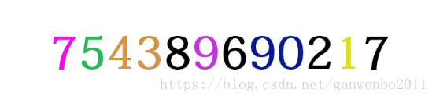
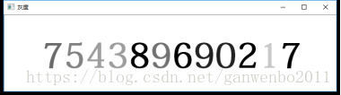
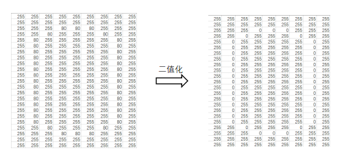
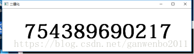
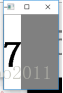
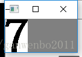
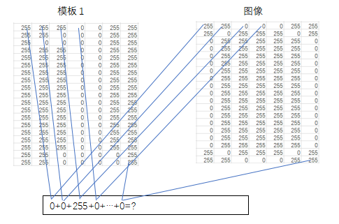
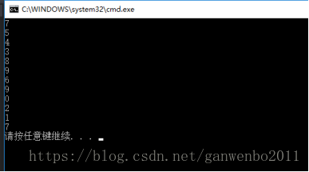

转载：https://blog.csdn.net/ganwenbo2011/article/details/80005288

# 说明

本文简单介绍图片字符识别的原理，主要识别图片中的数字，其他字符识别原理类似。

大家应该知道，对于人类来说，可以很容易理解一张图片所表达的信息，这是人类视觉系统数万年演变进化的结果。但对于计算机这个诞生进化不到百年的 “新星”，要让它理解一张图像上的信息是一个复杂的过程。计算机理解图像是一个数字计算比较的过程。

如图，我们一目了然的识别的图像中的数字，如何让计算机识别下图中的数字呢？



# 环境

VS2019+opencv 3.4

# 处理过程

要识别图像字符，首先需要模版库。对于识别简单字符，可自己训练，也可网上下载数据集。

笔者这里就直接用提前做好的（用photoshop制作，字体和字大小尽量和待识别字符相近，不然影响识别率），为便于识别，模版名就以数字命名。

##  图片预处理

首先读取待识别图像，灰度化、二值化。

```c++
Mat srcImg = imread("H:\\test.jpg",CV_LOAD_IMAGE_GRAYSCALE);//打开图片
```

灰度后图像：



```c++
threshold(srcImg, srcImg, threshVal, 255, CV_THRESH_BINARY);//二值化
```

我们知道图像本身就以数字进行存储的，二值化后图像就只有两个值0和255

例数字0：



注意二值化的阈值根据图像实际情况进行调整。

二值化图像后：



## 图像分割

我们需要将图像中的字符分割开。整个过程分两部，左右分割和上下分割。

基本思想是，从图像的左上角第一列开始，从左往右逐列扫描扫描，当遇到像素值为0时，记录该列号sCol，继续扫描再遇到整列像素值为255时，记录列号eCol，sCol与eCol之间即为字符所在区间。

复制二值图该区域，这样完成了左右分割



将左右分割后，在此基础上再对图像进行上下分割，同理，从图像左上角第一行，向下逐行扫描，当遇到像素值为255时，记录该列号sRow，继续扫描再遇到整列像素值为0时，记录列号eRow，sRow与eRow之间即为字符所在区间。

复制该区域，这样完成了上下左右分割。



## 识别

把切割后的数字图片大小调整到和模板一样的大小（一般以模版中最大尺寸），然后让需要匹配的图分别和10个模板相减（让两个图片对应坐标像素点值相减），将所有差的绝对值求和。



最后与哪个模板匹配时绝对值和最小，则就可以得到图像与该模版最匹配，进而识别该字符。

## 结果

