转载：https://segmentfault.com/a/1190000017439005

识别交通标志位置的方法步骤如下：

1. 提取特征颜色 — 对图片去噪 — 提取边缘信息
2. Canny边缘检测 — Hough变换找出圆形区域

交通标志牌通常规定为红、蓝、黄三种颜色，其含义为：

1. 红色：表示禁止、停止
2. 蓝色：表示指令、必须遵守的规定
3. 黄色：表示警告、注意

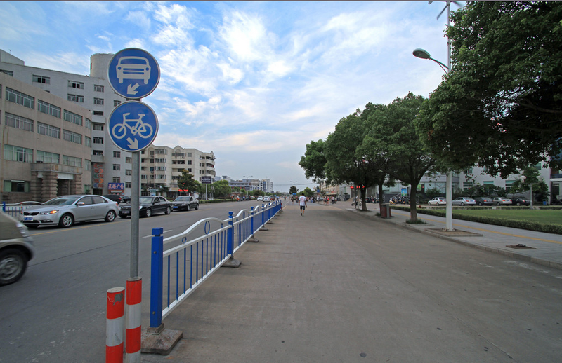

# 提取特征颜色

根据这三种交通标志牌的颜色，初步确定待识别图片所要提取图片信息的颜色范围，代码中使用的是RGB颜色模型。RGB颜色模型是位于空间中的一个立体模型，如下图所示为RGB的色度坐标示意图

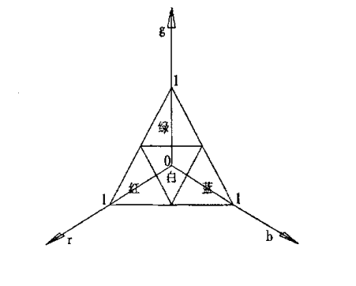

在特征颜色提取中，确定颜色的阈值是其中最重要的一点（HSV颜色模型可以避免光照不同的影响，此处不讨论），经过查询资料，得到红、蓝、黄对应的阈值如下：

在这种情况下， G分量的值比R分量和B分量大50则判定绿色，：B分量的值比G分量和R分量大50则判定蓝色， R分量的值比G分量和B分量大50则判定为红色，找到满足条件的区域后在原图中标出，不满足条件的部分标为黑色。

首先读取图片文件代码如下：

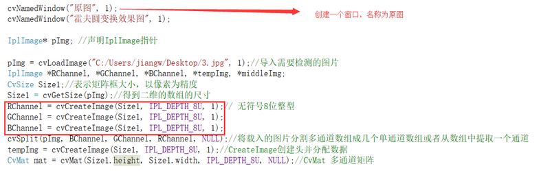

提取颜色区域代码：

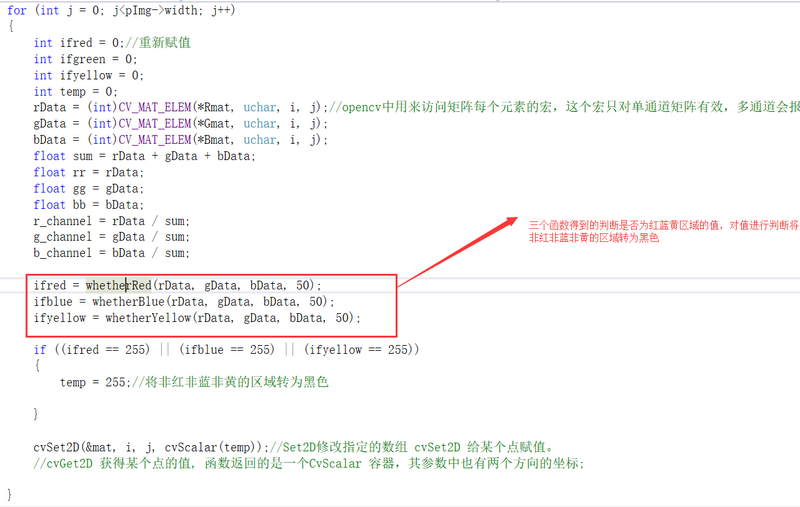

上述三个被调用的函数，作用是根据我们查得的阀值进行判断并返回值，如果在阀值范围内，则返回255：

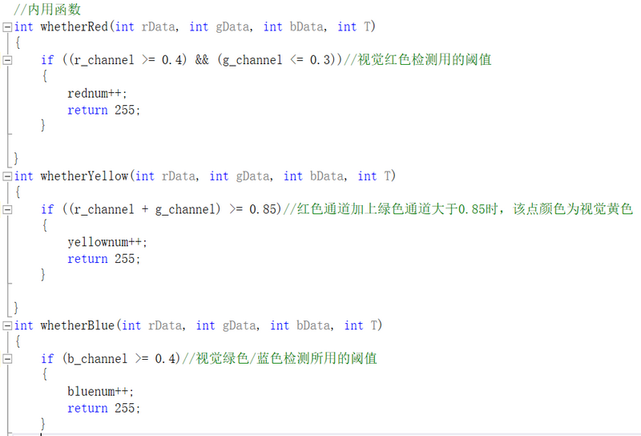

在这种由阀值提取颜色区域的情况下，绿色极有可能混入被提取的颜色中，在背景绿叶过多的情况下，检测会比较困难。

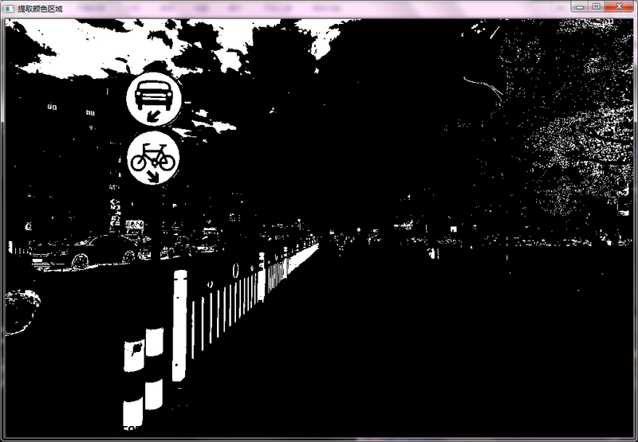

如图所示，代码中所要实现的提取红蓝黄区域已经实现，而不足之处在于，无关的区域也被提取了进来，例如蓝色的天空，红色的交通柱，以及少部分绿叶和车辆轮廓，但对于识别交通标志颜色而言是没有影响的。

# 图片去噪

经过上一步的提取后，留下的区域则为感兴趣的区域，由于阈值范围的问题，留下的区域并不一定都是我们所需要的区域。在现实情况中，经常会有一部分我们不需要，极容易使实验结果出错的图片部分混入颜色提取范围。这种不应该，也最好不要出现在被提取区域上的像素点，称为噪点。

前人在去噪方面也有着杰出的作为，方框滤波、中值滤波以及高斯滤波，都能或多或少地起到去噪作用。为了接下来的边缘检测，我们一般采用能得到较好图像边缘的高斯滤波来对图片进行去噪，对图片信号进行平滑处理。

对于图像处理来说，常用二维零均值离散高斯函数作平滑滤波器。

二维高斯函数为：

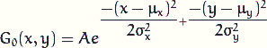

使用去噪函数的代码如下：

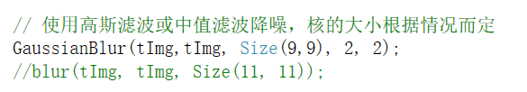

该函数是OpenCV库中自带的滤波函数，可以直接调用

# 提取边缘信息

Canny边缘检测算子是John F.Canny于 1986 年开发出来的一个多级边缘检测算法。Canny边缘检测算法以Canny的名字命名，被很多人推崇为当今最优的边缘检测的算法。

Canny边缘检测的步骤一般分为下列4步：

- 消除噪声（一般情况下，使用高斯平滑滤波器卷积降噪）
- 计算梯度幅值和方向（略复杂不做详述）
- 非极大值抑制（这一步排除非边缘像素，仅仅保留了一些细线条，做为候选边缘）
- 滞后阈值（滞后阈值需要两个阈值(高阈值和低阈值)）:
  - 如果某一像素位置的幅值超过高阈值, 该像素被保留为边缘像素。
  - 如果某一像素位置的幅值小于低阈值, 该像素被排除。
  - 如果某一像素位置的幅值在两个阈值之间,该像素仅仅在连接到一个高于高阈值的像素时被保留。

对于Canny函数的使用，推荐的高低阈值比在2:1到3:1之间

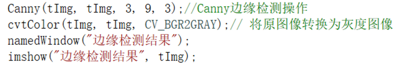

该图是对提取颜色区域后的图进行了边缘检测，清晰地把交通标志牌和其它的一些图片轮廓给勾勒出来。这近一步地方便了下一步进行圆变换的操作：

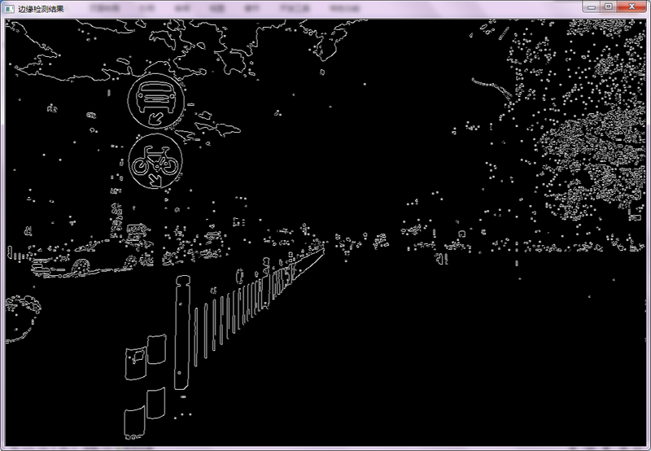

# Hough圆变换

霍夫圆变换的基本原理和上面讲的霍夫线变化大体上是很类似的，只是点对应的二维极径极角空间被三维的圆心点x, y还有半径r空间取代。

对直线来说, 一条直线能由参数极径极角表示. 而对圆来说, 我们需要三个参数来表示一个圆, 也就是：

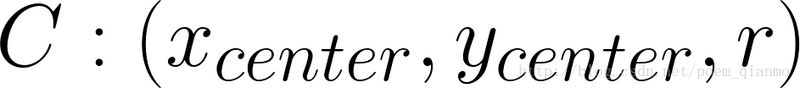

在open_cv中一般通过霍夫梯度法来解决圆变换问题，原理如下：

- 首先对图像应用边缘检测，用canny边缘检测。
- 然后，对边缘图像中的每一个非零点，考虑其局部梯度，即用Sobel（）函数计算x和y方向的Sobel一阶导数得到梯度
- 利用得到的梯度，由斜率指定的直线上的每一个点都在累加器中被累加，这里的斜率是从一个指定的最小值到指定的最大值的距离
- 标记边缘图像中每一个非0像素的位置
- 从二维累加器中这些点中选择候选的中心，这些中心都大于给定阈值并且大于其所有近邻。这些候选的中心按照累加值降序排列，以便于最支持像素的中心首先出现
- 对每一个中心，考虑所有的非0像素
- 这些像素按照其与中心的距离排序，从到最大半径的最小距离算起，选择非0像素最支持的一条半径
- 如果一个中心收到边缘图像非0像素最充分的支持，并且到前期被选择的中心有足够的距离，那么它就会被保留下来

这个实现可以使算法执行起来更高效，或许更加重要的是，能够帮助解决三维累加器中会产生许多噪声并且使得结果不稳定的稀疏分布问题，但该算法同样不完美。

在程序中使用的函数为HoughCircles(),使用此函数可以很容易地检测出圆的圆心，但是它可能找不到合适的圆半径：

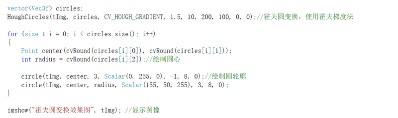

在对边缘检测后的图进行了高斯滤波去噪之后，对图片进行了HoughCircles()的操作，可以看出，交通标志的位置被很准确地勾勒出来：

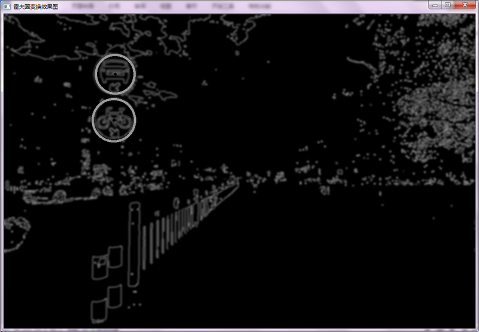

