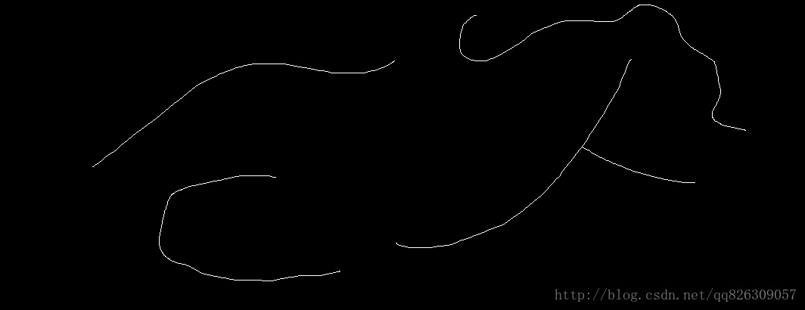

转载：https://blog.csdn.net/qq826309057/article/details/71328831

# 简单介绍

# 代码

## 原文代码

```c++
//寻找图像曲线上某个点的下一个点
bool findNextPoint(vector<Point> &_neighbor_points, Mat &_image, Point _inpoint, int flag, Point& _outpoint, int &_outflag)
{
    int i = flag;
    int count = 1;
    bool success = false;

    while (count <= 7)
    {
        Point tmppoint = _inpoint + _neighbor_points[i];
        if (tmppoint.x > 0 && tmppoint.y > 0 && tmppoint.x < _image.cols&&tmppoint.y < _image.rows)
        {
            if (_image.at<uchar>(tmppoint) == 255)
            {
                _outpoint = tmppoint;
                _outflag = i;
                success = true;
                _image.at<uchar>(tmppoint) = 0;
                break;
            }
        }
        if (count % 2)
        {
            i += count;
            if (i > 7)
            {
                i -= 8;
            }
        }
        else
        {
            i += -count;
            if (i < 0)
            {
                i += 8;
            }
        }
        count++;
    }
    return success;
}
//寻找图像上的第一个点
bool findFirstPoint(Mat &_inputimg, Point &_outputpoint)
{
    bool success = false;
    for (int i = 0; i < _inputimg.rows; i++)
    {
        uchar* data = _inputimg.ptr<uchar>(i);
        for (int j = 0; j < _inputimg.cols; j++)
        {
            if (data[j] == 255)
            {
                success = true;
                _outputpoint.x = j;
                _outputpoint.y = i;
                data[j] = 0;
                break;
            }
        }
        if (success)
            break;
    }
    return success;
}
//寻找曲线 
void findLines(Mat &_inputimg, vector<deque<Point>> &_outputlines)
{
    vector<Point> neighbor_points = { Point(-1,-1),Point(0,-1),Point(1,-1),Point(1,0),Point(1,1),Point(0,1),Point(-1,1),Point(-1,0) };
    Point first_point;
    while (findFirstPoint(_inputimg, first_point))
    {
        deque<Point> line;
        line.push_back(first_point);
        //由于第一个点不一定是线段的起始位置，双向找
        Point this_point = first_point;
        int this_flag = 0;
        Point next_point;
        int next_flag;
        while (findNextPoint(neighbor_points, _inputimg, this_point, this_flag, next_point, next_flag))
        {
            line.push_back(next_point);
            this_point = next_point;
            this_flag = next_flag;
        }
        //找另一边
        this_point = first_point;
        this_flag = 0;
        //cout << "flag:" << this_flag << endl;
        while (findNextPoint(neighbor_points, _inputimg, this_point, this_flag, next_point, next_flag))
        {
            line.push_front(next_point);
            this_point = next_point;
            this_flag = next_flag;
        }
        if (line.size() > 10)
        {
            _outputlines.push_back(line);
        }
    }
}
//随机取色 用于画线的时候
Scalar random_color(RNG& _rng)
{
    int icolor = (unsigned)_rng;
    return Scalar(icolor & 0xFF, (icolor >> 8) & 0xFF, (icolor >> 16) & 0xFF);
}
int main()
{
    Mat image = imread("images\\2.bmp");
    Mat gray;
    cvtColor(image, gray, CV_BGR2GRAY);
    vector<deque<Point>> lines;
    findLines(gray, lines);
    cout << lines.size() << endl;
    //draw lines
    Mat draw_img = image.clone();
    RNG rng(123);
    Scalar color;
    for (int i = 0; i < lines.size(); i++)
    {
        color = random_color(rng);
        for (int j = 0; j < lines[i].size(); j++)
        {
            draw_img.at<Vec3b>(lines[i][j]) = Vec3b(color[0], color[1], color[2]);
        }
    }
    imshow("draw_img", draw_img);
    imwrite("images\\draw_img.bmp", draw_img);
    waitKey(0);
    system("pause");
    return 0;
}
```

## 修改的c#+opencvsharp代码

```c#
/// <summary>
/// 寻找图像曲线上某个点的下一个点
/// </summary>
/// <param name=""></param>
/// <param name=""></param>
/// <param name=""></param>
/// <param name=""></param>
/// <param name="_inpoint"></param>
/// <param name="flag"></param>
/// <param name=""></param>
/// <param name=""></param>
/// <param name=""></param>
/// <param name=""></param>
/// <returns></returns>
private static bool FindNextPoint(List<Point> _neighbor_points, Mat _image, Point _inpoint, int flag, out Point _outpoint, out int _outflag)
{
    int i = flag;
    int count = 1;
    bool success = false;

    _outpoint = new Point();
    _outflag = int.MinValue;

    while (count <= 7)
    {
        Point tmppoint = _inpoint + _neighbor_points[i];
        if (tmppoint.X > 0 && tmppoint.Y > 0 && tmppoint.X < _image.Cols && tmppoint.Y < _image.Rows)
        {
            if (_image.At<byte>(tmppoint.Y, tmppoint.X) == 255)
            {
                _outpoint = tmppoint;
                _outflag = i;
                success = true;
                _image.Set<byte>(tmppoint.Y, tmppoint.X, 0);
                break;
            }
        }
        if (count % 2 == 1)
        {
            i += count;
            if (i > 7)
            {
                i -= 8;
            }
        }
        else
        {
            i += -count;
            if (i < 0)
            {
                i += 8;
            }
        }
        count++;
    }

    return success;
}

/// <summary>
/// 寻找图像上的第一个点
/// </summary>
/// <param name="_inputimg"></param>
/// <param name="_outputpoint"></param>
/// <returns></returns>
private static bool FindFirstPoint(Mat _inputimg, out Point _outputpoint)
{
    bool success = false;
    _outputpoint = new Point();
    for (int i = 0; i < _inputimg.Rows; i++)
    {
        for (int j = 0; j < _inputimg.Cols; j++)
        {
            var data = _inputimg.At<byte>(i, j);

            if (data == 255)
            {
                success = true;
                _outputpoint.X = j;
                _outputpoint.Y = i;
                _inputimg.Set<byte>(i, j, 0);
                //data = 0;
                break;
            }
        }
        if (success)
            break;
    }
    return success;
}

/// <summary>
/// 寻找曲线
/// </summary>
/// <param name="_inputimg"></param>
/// <returns></returns>
private static List<List<Point>> FindLines(Mat red)
{
    var _inputimg = red.Clone();

    var _outputlines = new List<List<Point>>();
    var neighbor_points = new List<Point>() { new Point(-1, -1), new Point(0, -1), new Point(1, -1), new Point(1, 0), new Point(1, 1), new Point(0, 1), new Point(-1, 1), new Point(-1, 0) };

    while (FindFirstPoint(_inputimg, out Point first_point))
    {
        var line = new List<Point>();
        line.Add(first_point);

        //由于第一个点不一定是线段的起始位置，双向找
        var this_point = first_point;
        int this_flag = 0;
        while (FindNextPoint(neighbor_points, _inputimg, this_point, this_flag, out Point next_point, out int next_flag))
        {
            line.Add(next_point);
            this_point = next_point;
            this_flag = next_flag;
        }

        //找另一边
        this_point = first_point;
        this_flag = 0;
        while (FindNextPoint(neighbor_points, _inputimg, this_point, this_flag, out Point next_point, out int next_flag))
        {
            line.Add(next_point);
            this_point = next_point;
            this_flag = next_flag;
        }

        if (line.Count > 10)
        {
            _outputlines.Add(line);
        }
    }

    return _outputlines;
}
```

# 结果

输入图像



结果

