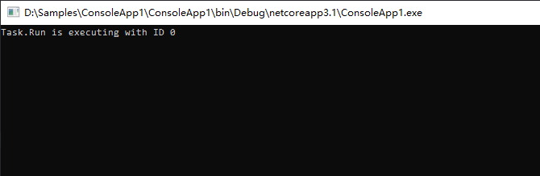
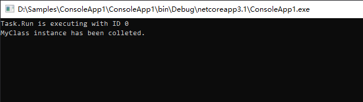

转载：https://www.cnblogs.com/willick/p/14100973.html

关于前两天发布的文章：为什么要小心使用 `Task.Run`，对文中演示的示例到底会不会导致内存泄露，给很多人带来了疑惑。这点我必须向大家道歉，是我对导致内存泄漏的原因没描述和解释清楚，也没用实际的示例证实，是我的错。

但是，文中示例演示的 `Task.Run` 捕获类成员的情况，确实会有内存泄漏的风险，我将在本文演示给大家看。

如果一个对象（或数据）不需要再使用了，但依然还一直占据内存空间，则视为内存泄漏。这一点大家观点是一致的吧，那如何来检测对象有没有被回收呢？

我们知道，在 C# 中，实例对象被释放回收，必然会执行析构函数。所以我们可以对一个类重写其析构函数，如果该类的实例对象使用完后，强制执行 GC 回收，其析构函数依然不被执行，则说明 GC 没有回收该对象。若 GC 后面一直不回收这个对象，则说明存在内存泄漏。

手动强制执行 GC 回收的代码如下：

```c#
GC.Collect();
GC.WaitForPendingFinalizers();
GC.Collect();
```

这三句代码可以确保 GC 把所有能搜索到的可回收对象清理干净。注意：不推荐在生产环境这样写。

我们还是用 为什么要小心使用 Task.Run 这篇文章用到的示例，只是为了测试稍加修改了一下：

```c#
class Program
{
    static void Main(string[] args)
    {
        Test();

        // 对不需要再使用的资源强制回收
        GC.Collect();
        GC.WaitForPendingFinalizers();
        GC.Collect();

        // 程序保活
        while (true)
        {
            Thread.Sleep(100);
        }
    }

    static void Test()
    {
        var myClass = new MyClass();
        myClass.Foo();
        // 到这，myClass对象不需要再使用了
    }
}

public class MyClass
{
    private int _id;

    public Task Foo()
    {
        return Task.Run(() =>
        {
            Console.WriteLine($"Task.Run is executing with ID {_id}");
            Thread.Sleep(100); // 模拟耗时操作
        });
    }

    ~MyClass()
    {
        Console.WriteLine("MyClass instance has been colleted.");
    }
}
```

我们在 myClass 对象使用完后，手动强制执行 GC 回收，运行结果如下：



我们看到 MyClass 的析构函数一直没有执行，也就意味着它的实例一直没有被回收。

现在我们修改 MyClass 类的 Foo 方法，改用本地（局部）变量试一试：

```c#
...
public Task Foo()
{
    var localId = _id;
    return Task.Run(() =>
    {
        Console.WriteLine($"Task.Run is executing with ID {localId}");
    });
}
...
```

再运行看看效果：



这次我们可以看到，MyClass 的析构函数执行了，说明实例对象被回收了。

前后唯一区别是，前者在 Task.Run 的匿名方法中捕获了类的成员，而后者使用了本地变量。前者出现了内存泄漏，后者避免了内存泄漏。

所以，在 Task.Run 的匿名方法中捕获类的成员，确实有可能导致内存泄漏（注意是有可能而不是一定）。

那背后的原因是什么呢？我在上一篇文章是这样解释的：

> 私有成员 _id 被 Task.Run 的匿名方法捕获使用，进而导致 MyClass 实例被引用。当外部使用完 MyClass 实例时，本该由 GC 回收的时候却发现它还被其它资源引用着，所以 GC 认为该实例不应该被回收，也就可能永远失去了被回收的机会。

1. 由于值类型是拷贝的方式赋值，所以捕获的本地变量和类成员指向的是各自的值，对本地变量的捕获不会影响到整个类。但如果把 _id 改为引用类型（如 String），那两者指向的就是同一个对象值，那是不是意味着即便使用本地变量也还是无法避免内存泄漏的问题？

2. GC 第一次回收时发现 myClass 实例存在被捕获的成员，则认为它不应该被回收。那当 Task.Run 执行完后， 被捕获的成员也使用完了，GC 再次搜索时不就可以回收 myClass 对象吗？只是晚了一些时间回收而已嘛。

感谢善于思考提出疑惑的读者们，为你们点赞。

这两大疑惑该如何解释？后半部分我还没写完，大家可以先思考一下，我将在下一篇给大家解惑，望见谅。当然，我的解释也不一定会是对的，希望大家带着怀疑的态度和批判性思维来看我的文章，也请大家分享自己的理解和观点。