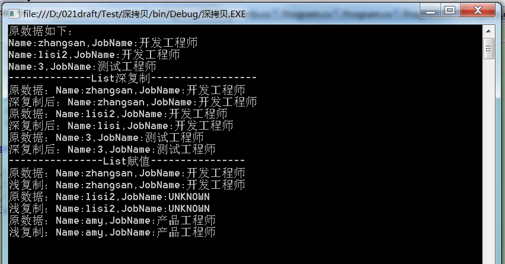

转载：https://www.cnblogs.com/lsgsanxiao/p/9046080.html

# 关于深拷贝和浅拷贝

**C#支持两种类型：值类型和引用类型**

- 值类型（Value Type）：如 char, int, float,枚举类型和结构类型
- 引用类型（Reference Type）：如Class类型、接口类型、委托类型、数组类型。

**如何来划分它们？**

以它们在计算机内存中如何分配来划分。

- 堆栈（Stack）是一种先进先出的数据结构，在内存中，变量会被分配在堆栈上来进行操作。
- 堆（Heap）是用于为类型实例（对象）分配空间的内存区域，在堆上创建一个对象，会将对象的地址传递给堆栈上的变量（反过来叫变量指向此对象，或者变量引用此对象）。

**值类型与引用类型的区别？**

- 值类型的变量直接包含其数据
- 引用类型的变量则存储对象引用

- 对于引用类型，两个变量可能引用同一个对象，因此对一个变量的操作可能影响到另一个变量所引用的对象。
- 对于值类型，每个变量都有自己的数据副本，对于一个变量的操作不可能影响到另一个变量。值类型隐式继承自System.ValueType,所以不能显示让一个结构继承一个类，C#不支持多继承。　

**关于对象克隆的所设计到知识点**

1. 浅拷贝：是指将对象中的所有字段逐字复制到一个新对象

对值类型字段只是简单的拷贝一个副本到目标对象，改变目标对象中值类型字段的值不会反映到原始对象中，因为拷贝的是副本。实现浅拷贝需要使用Object类的MemberwiseClose方法用于创建一个浅表副本。

对引用类型字段则是指拷贝他的一个引用到目标对象，改变目标对象中引用类型字段的值会将它反映到原始对象中，因为拷贝的是指向堆是上的一个地址。

2. 深拷贝：深拷贝与浅拷贝不同的是对于引用字段的处理，深拷贝会将在新对象中创建一个新的对象和原始对象字段相同（内容相同）的字段，也就是说这个引用和原始对象引用是不同，我们改变新对象这中这个字段的时候是不会影响到原始对象中对应字段的内容。须实现ICloneable接口中的Clone方法，且需要将被克隆对象加上[Serializable]特性。

**引用类型的赋值、浅拷贝和深拷贝的区别**

1. 赋值：就是将原来对象的地址给新的对象拷贝一下即可。

2. 浅拷贝：需要继承ICloneable接口（支持克隆，即用现有实例相同的值创建类的新实例），然后用MemberwiseClone方法（创建当前System.Object的浅表对象）。但是需要注意的是MemberwiseClone拷贝方式，首先它是浅拷贝，方法是将所有的值类型字段拷贝一个副本，但是引用类型不会创建副本，仅仅是传递一个相同的地址给新对象，并且新对象和原对象指向的地址是一致的，这里有个问题就是string类型，但是实际上却是和值类型表现一致。

3. 深拷贝：深拷贝与浅拷贝不同的是对于引用字段的处理，深拷贝会将在新对象中创建一个新的对象和原始对象字段相同（内容相同）的字段，也就是说这个引用和原始对象引用是不同，我们改变新对象这中这个字段的时候是不会影响到原始对象中对应字段的内容。须实现ICloneable接口中的Clone方法，且需要将被克隆对象加上[Serializable]特性。

# List 的深拷贝

代码如下：

```c#
/// <summary>
/// Class Program
/// </summary>
class Program
{
    /// <summary>
    /// Defines the entry point of the application.
    /// </summary>
    /// <param name="args">The args.</param>
    static void Main(string[] args)
    {
        List<Person> originalList = new List<Person>();
        Person person = new Person();
        person.Name = "zhangsan";
        person.Age = 90;
        Job job = new Job();
        job.JobName = "开发工程师";
        person.PersonJob = job;
        originalList.Add(person);

        person = new Person();
        person.Name = "lisi2";
        job = new Job();
        job.JobName = "开发工程师";
        person.PersonJob = job;
        originalList.Add(person);

        person = new Person();
        person.Name = "3";
        job = new Job();
        job.JobName = "测试工程师";
        person.PersonJob = job;
        originalList.Add(person);

        Console.WriteLine("原数据如下：");
        for (int i = 0; i < originalList.Count; i++)
        {
            Console.WriteLine("Name:" + originalList[i].Name + ",JobName:" + originalList[i].PersonJob.JobName);
        }

        Console.WriteLine("--------------List深复制------------------");
        List<Person> deepCopyList = Clone<Person>(originalList);
        deepCopyList[1].Name = "lisi";
        for (int i = 0; i < originalList.Count; i++)
        {
            Console.WriteLine("原数据：Name:" + originalList[i].Name + ",JobName:" + originalList[i].PersonJob.JobName);
            Console.WriteLine("深复制后：Name:" + deepCopyList[i].Name + ",JobName:" + deepCopyList[i].PersonJob.JobName);
        }

        Console.WriteLine("----------------List赋值----------------");
        List<Person> shallowCopyList = originalList;
        shallowCopyList[2].Name = "amy";
        shallowCopyList[2].PersonJob.JobName = "产品工程师";
        Job modifyJob = new Job();
        modifyJob.JobName = "UNKNOWN";
        shallowCopyList[1].PersonJob = modifyJob;
        for (int i = 0; i < originalList.Count; i++)
        {
            Console.WriteLine("原数据：Name:" + originalList[i].Name + ",JobName:" + originalList[i].PersonJob.JobName);
            Console.WriteLine("浅复制：Name:" + shallowCopyList[i].Name + ",JobName:" + shallowCopyList[i].PersonJob.JobName);
        }

        Console.Read();
    }

    /// <summary>
    /// Clones the specified list.
    /// </summary>
    /// <typeparam name="T"></typeparam>
    /// <param name="List">The list.</param>
    /// <returns>List{``0}.</returns>
    public static List<T> Clone<T>(object List)
    {
        using (Stream objectStream = new MemoryStream())
        {
            IFormatter formatter = new BinaryFormatter();
            formatter.Serialize(objectStream, List);
            objectStream.Seek(0, SeekOrigin.Begin);
            return formatter.Deserialize(objectStream) as List<T>;
        }
    }
}
```

两个测试类代码如下：

```c#
/// <summary>
/// Class Person
/// </summary>
[Serializable]
public class Person 
{
    /// <summary>
    /// Gets or sets the person job.
    /// </summary>
    /// <value>The person job.</value>
    public Job PersonJob
    {
        get;
        set;
    }

    /// <summary>
    /// Gets or sets the name.
    /// </summary>
    /// <value>The name.</value>
    public string Name
    {
        get;
        set;
    }

    /// <summary>
    /// Gets or sets the age.
    /// </summary>
    /// <value>The age.</value>
    public int Age
    {
        get;
        set;
    }

    /// <summary>
    /// Clones this instance.
    /// </summary>
    /// <returns>System.Object.</returns>
    public object Clone()
    {
        BinaryFormatter formatter = new BinaryFormatter(null, new System.Runtime.Serialization.StreamingContext(System.Runtime.Serialization.StreamingContextStates.Clone));
        MemoryStream stream = new MemoryStream();
        formatter.Serialize(stream, this);
        stream.Position = 0;
        object clonedObj = formatter.Deserialize(stream);
        stream.Close();
        return clonedObj;
    }
}

/// <summary>
/// Class Job
/// </summary>
[Serializable]
public class Job
{
    /// <summary>
    /// Gets or sets the name of the job.
    /// </summary>
    /// <value>The name of the job.</value>
    public string JobName
    {
        get;
        set;
    }
}
```

结果如下：



# 不用加Serializable的深复制方法

```c#
public static T DeepCopy<T>(T obj)
{
    object retval;
    using (MemoryStream ms = new MemoryStream())
    {
        XmlSerializer xml = new XmlSerializer(typeof(T));
        xml.Serialize(ms, obj);
        ms.Seek(0, SeekOrigin.Begin);
        retval = xml.Deserialize(ms);
        ms.Close();
    }
    return (T)retval;
}
```