转载：https://www.jianshu.com/p/638708bda00e

# 环境搭建

## Choice 1

- PyCharm x64
- Python 3.7.x
- tensorflow-2.0.0
- numpy-1.19.4
- pandas-1.1.4
- pytz-2020.4

## Choice 2

- PyCharm x64
- Python 3.6.x
- tensorflow-1.4.0
- numpy-1.19.4
- pandas-1.1.4
- pytz-2020.4

# 卷积神经网络

> 卷积神经网络（Convolutional Neural Network，简称 CNN）是神经网络近年来最重要的研究成果之一，也是深度学习理论和方法中的重要组成部分。它在最近几年大放异彩。
> 
> 几乎所有图像、语音识别领域的重要突破都是卷积神经网络取得的，比如谷歌的 GoogleNet、微软的 ResNet 等，打败李世石的 AlphaGo 也用到了这种网络。

1. 卷积神经网络最主要的特征是在多层神经网络中引入了一种全新的隐藏层 —— 卷积层（Convolutional Layer）。卷积层与全连接层不同，每层中各个节点与上层的各个节点并非全连接关系，而是仅与一部分节点连接

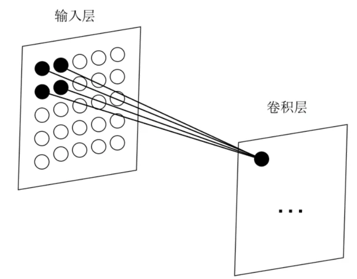

2. 卷积层的每一个节点，能够出现上层中多个节点的特征，这就是深度学习理论中概念 ”特征提取“ 的由来。
- 特征提取适合空间位置上存在一定关联的数据。
- 特征提取是实现高质量图像识别的基础，被广泛应用于指纹识别、人脸识别、智能监控等领域

## 数字图片在计算机中的色彩分类与表达形式

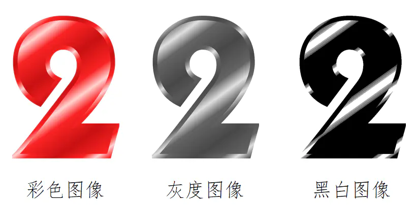

1. 黑白图像

数值只有 0 和 1

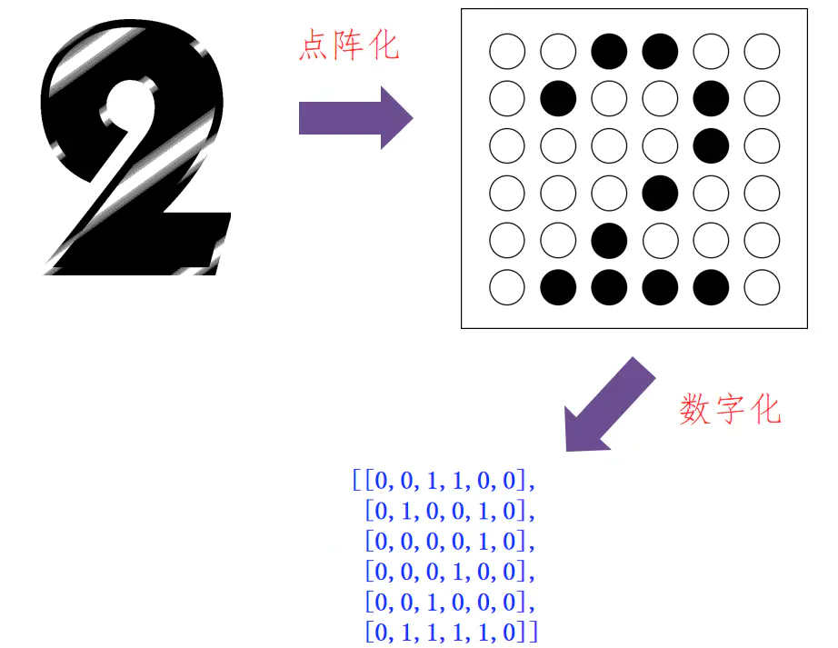

1. 灰度图像

每个点的数值代表色彩深度，范围可以为 0~255

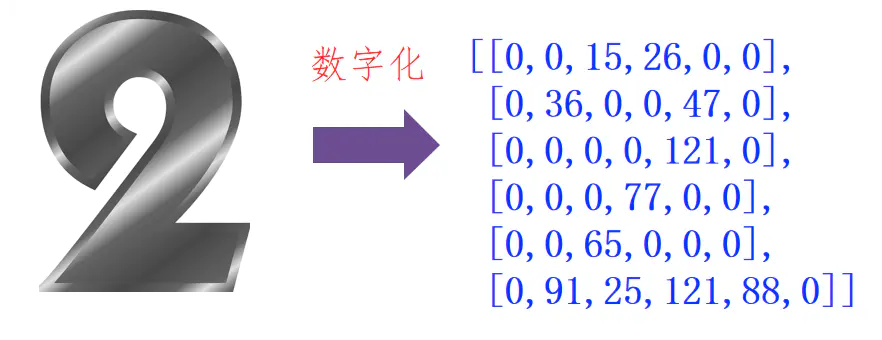

3. 彩色图像

每个点使用一维数组来表示，每个数值代表一个通道。常用 RGBA 体系，即红、绿、蓝、透明度四个通道组成，而黑白图像、灰度图像相当于只有一个通道的彩色图像。

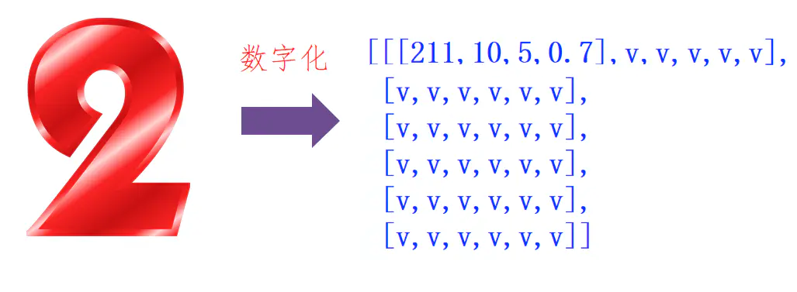

## 卷积的计算过程

1. 第一个点的计算：输入层中的子矩阵（大小与卷积核相同）与卷积核点乘求和得到输出矩阵中的第一个点。卷积核中的数值，就是 CNN 需要调节的可变参数

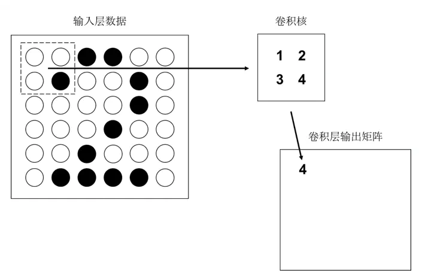

2. 第二个点的计算：子集右移，如法炮制计算第二个点。到达最右侧后，再从下一行最左端开始右移，计算其余点


3. 补充空白点：如果不补充 0 点进行卷积，结果会少一行一列

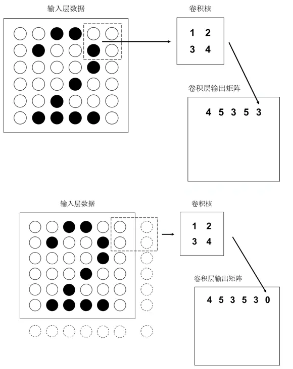

4. 多卷积核的情况：输出矩阵也会变 “厚”

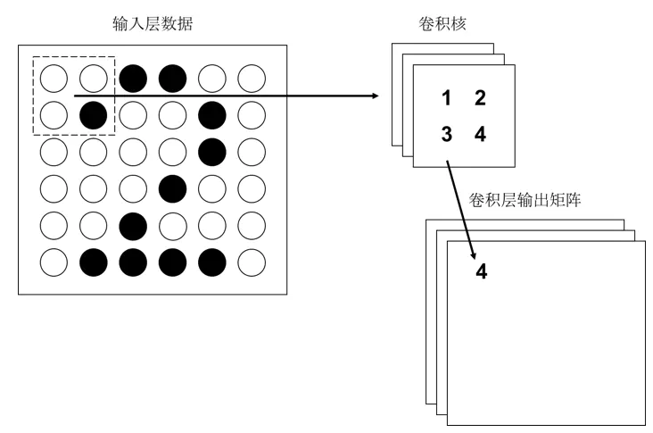

## 卷积的作用：提取特征

1. 输出矩阵中的数值 5 代表了 “2” 起笔转折的笔画特征

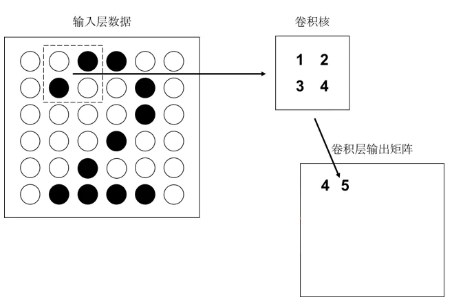

2. 多级特征提取：通过增加卷积层做更高级的特征提取

3. 典型的 CNN 结构：先由多个卷积层进行特征提取，然后增加全连接层做最后的神经元计算

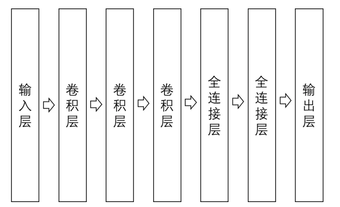

# 简单的图像识别

## 勾叉图形的点阵化

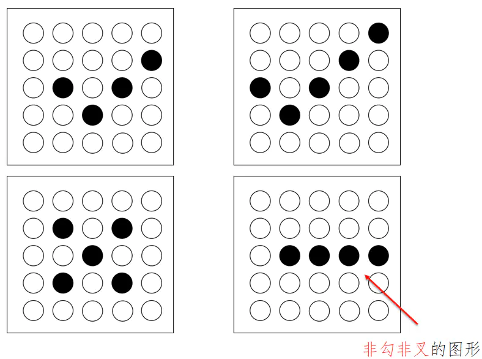

转换为二维数组：

```
[[0,0,0,0,0],[0,0,0,0,1],[0,1,0,1,0],[0,0,1,0,0],[0,0,0,0,0]]
[[0,0,0,0,1],[0,0,0,1,0],[1,0,1,0,0],[0,1,0,0,0],[0,0,0,0,0]]
[[0,0,0,0,0],[0,1,0,1,0],[0,0,1,0,0],[0,1,0,1,0],[0,0,0,0,0]]
[[0,0,0,0,0],[0,0,0,0,0],[0,1,1,1,1],[0,0,0,0,0],[0,0,0,0,0]]
```

采用 CSV 格式：

```
0,0,0,0,0,0,0,0,0,1,0,1,0,1,0,0,0,1,0,0,0,0,0,0,0,1,0,0
0,0,0,0,1,0,0,0,1,0,1,0,1,0,0,0,1,0,0,0,0,0,0,0,0,1,0,0
0,0,0,0,0,0,1,0,1,0,0,0,1,0,0,0,1,0,1,0,0,0,0,0,0,0,1,0
0,0,0,0,0,0,0,0,0,0,0,1,1,1,1,0,0,0,0,0,0,0,0,0,0,0,0,1
```

## 卷积层主要代码

```python
filter1T = tf.Variable(tf.ones([2, 2, 1, 1]), dtype=tf.float32)
n1 = tf.nn.conv2d(input=tf.reshape(x, [1, 5, 5, 1]),
filters=filter1T, strides=[1, 1, 1, 1], padding='SAME')
filter2T = tf.Variable(tf.ones([2, 2, 1, 1]), dtype=tf.float32)
n2 = tf.nn.conv2d(input=tf.reshape(n1, [1, 5, 5, 1]),
filters=filter2T, strides=[1, 1, 1, 1], padding='VALID')

// 这段代码定义了两个相连的卷积层，分别使用不同的卷积核
// 卷积层 n1 使用 filter1T 作为卷积核，输入数据 x 为形态为 [25] 的一维数组
// 输入数据也要求为4维（第1维是图片数量，第2、3维是高度、宽度，第4维是通道数）
// reshape 函数对原有数据进行重组以满足输入要求
// strides 参数定义卷积核移动步长，这里是一格一格移动
// padding 参数定义边缘是否要补上0点，SAME 表示不补，VALID 表示要补
```

# 代码实现

## conv1.py

```python
import numpy as np

x1 = np.array([[0, 0], [0, 1]], dtype=np.float32)
x2 = np.array([[0, 1], [1, 0]], dtype=np.float32)

filterT = np.array([[1, 2], [3, 4]], dtype=np.float32)

print(np.sum(x1 * filterT))  # 0*1+0*2+0*3+1*4 = 4.0
print(np.sum(x2 * filterT))  # 0*1+1*2+1*3+0*4 = 5.0
```

## conv2_python37.py

```python
import tensorflow as tf

tf.compat.v1.disable_eager_execution()  # 保证sess.run()能够正常运行
x = tf.constant([[[0], [0], [1], [1], [0], [0]],
                 [[0], [1], [0], [0], [1], [0]],
                 [[0], [0], [0], [0], [1], [0]],
                 [[0], [0], [0], [1], [0], [0]],
                 [[0], [0], [1], [0], [0], [0]],
                 [[0], [1], [1], [1], [1], [0]]], dtype=tf.float32)

filterT = tf.constant([[1, 2], [3, 4]], dtype=tf.float32)
y = tf.nn.conv2d(input=tf.reshape(x, [1, 6, 6, 1]),
                 filters=tf.reshape(filterT, [2, 2, 1, 1]),
                 strides=[1, 1, 1, 1],
                 padding='VALID')

sess = tf.compat.v1.Session()  # 版本2.0的函数
print(sess.run(y))
```

## conv2_python36.py

```python
import tensorflow as tf

x = tf.constant([[[0], [0], [1], [1], [0], [0]],
                 [[0], [1], [0], [0], [1], [0]],
                 [[0], [0], [0], [0], [1], [0]],
                 [[0], [0], [0], [1], [0], [0]],
                 [[0], [0], [1], [0], [0], [0]],
                 [[0], [1], [1], [1], [1], [0]]], dtype=tf.float32)

filterT = tf.constant([[1, 2], [3, 4]], dtype=tf.float32)
y = tf.nn.conv2d(input=tf.reshape(x, [1, 6, 6, 1]),
                 filter=tf.reshape(filterT, [2, 2, 1, 1]),
                 strides=[1, 1, 1, 1],
                 padding='VALID')

sess = tf.Session()
print(sess.run(y))
```

## conv3_python36.py

```python
import tensorflow.compat.v1 as tf
import numpy as np
import pandas as pd
import sys
tf.disable_v2_behavior()

roundCount = 100  # 训练轮数
learnRate = 0.01  # 学习率

#  输入 python XXXX.py  -round=XXX -learnrate=XXX
#  XXXX.py 为你的py文件名  round为训练轮数（默认为100）  learnrate 为学习率（默认为0.01）
argt = sys.argv[1:]

for v in argt:
    if v.startswith('-round='):
        roundCount = int(v[len('-round='):])
    if v.startswith('-learnrate='):
        learnRate = float(v[len('-learnrate='):])

# 读取文件数据
fileData = pd.read_csv('checkData.txt', dtype=np.float32, header=None)
# 数据一行28个数字
# 前25个数据组成5x5矩阵  后3个数据为目标值
# 100表示勾  010表示叉  001表示无法识别
wholeData = fileData.values  # 矩阵数据数据
rowCount = wholeData.shape[0]  # 有效数据条数
print('wholeData=%s' % wholeData)
print('rowCount=%s' % rowCount)


# x 输入层节点  yTrain为目标值
x = tf.placeholder(shape=[25], dtype=tf.float32)  # 25 = 5X5 矩阵
yTrain = tf.placeholder(shape=[3], dtype=tf.float32)   # 目标值为[3]的数据


# filter1T，filter2T，filter3T 定义了三个卷积核
# n1，n2，n3 前三层卷积层   可能要修改 reshape(x, [1, 5, 5, 1])
filter1T = tf.Variable(tf.ones([2, 2, 1, 1]), dtype=tf.float32)
n1 = tf.nn.conv2d(input=tf.reshape(x, [1, 5, 5, 1]), filter=filter1T, strides=[1, 1, 1, 1], padding='SAME')
# padding 参数 SAME 为填充数据 VALID为不填充（导致输出越来越小）
# 文件数据5x5 经过填充卷积层 输出 n1 5x5

filter2T = tf.Variable(tf.ones([2, 2, 1, 1]), dtype=tf.float32)
n2 = tf.nn.conv2d(input=tf.reshape(n1, [1, 5, 5, 1]), filter=filter2T, strides=[1, 1, 1, 1], padding='VALID')
# 输入n1 5x5 经过不填充卷积 输出 n2 4x4

filter3T = tf.Variable(tf.ones([2, 2, 1, 1]), dtype=tf.float32)
n3 = tf.nn.conv2d(input=tf.reshape(n2, [1, 4, 4, 1]), filter=filter3T, strides=[1, 1, 1, 1], padding='VALID')
# 输入n2 4x4 经过不填充卷积 输出 n3 3x3

n3f = tf.reshape(n3, [1, 9])  # 拉平 n3 操作 变为 一维[9]数组

# n4 n5 为两个全连接层
w4 = tf.Variable(tf.random_normal([9, 16]), dtype=tf.float32)  # 9代表 9个数据， 16 代表16个神经元节点
b4 = tf.Variable(0, dtype=tf.float32)  

n4 = tf.nn.tanh(tf.matmul(n3f, w4) + b4)  # n3f 即为数据    
# 输出的n4 为4x4 16个数据 

w5 = tf.Variable(tf.random_normal([16, 3]), dtype=tf.float32)  # 16代表 16个数据， 3 代表3个神经元节点
b5 = tf.Variable(0, dtype=tf.float32) 

n5 = tf.reshape(tf.matmul(n4, w5) + b5, [-1])  # 将n4 拉平成一维[16]数据并读入

y = tf.nn.softmax(n5)  # 计算结果 


loss = -tf.reduce_mean(yTrain * tf.log(tf.clip_by_value(y, 1e-10, 1.0)))  # 将结果值y 限定在 [1e-10, 1.0]之间

optimizer = tf.train.RMSPropOptimizer(learnRate)
train = optimizer.minimize(loss)

sess = tf.Session()
sess.run(tf.global_variables_initializer())

# i为学习轮数 lossT为输出误差 lossSum / (rowCount + 1)为平均误差
for i in range(roundCount):
    lossSum = 0.0

    for j in range(rowCount):
        result = sess.run([train, x, yTrain, y, loss], feed_dict={x: wholeData[j][0:25], yTrain: wholeData[j][25:28]})
        lossT = float(result[len(result) - 1])
        lossSum = lossSum + lossT
        if j == (rowCount - 1):  # 实现每轮训练最后才输出数据
            print('i: %d, loss: %10.10f, avgLoss: %10.10f' % (i, lossT, lossSum / (rowCount + 1)))

# 打印 某输入数据（feed_dict）  对应的预测结果（是一个概率）
print(sess.run([y, loss], feed_dict={x: [1, 0, 0, 0, 1, 0, 1, 0, 1, 0, 0, 0, 1, 0, 0, 0, 0, 0, 0, 0, 0, 0, 0, 0, 0],
                                     yTrain: [1, 0, 0]}))
print(sess.run([y, loss], feed_dict={x: [1, 0, 0, 0, 1, 0, 1, 0, 1, 0, 0, 0, 1, 0, 0, 0, 1, 0, 1, 0, 1, 0, 0, 0, 1],
                                     yTrain: [0, 1, 0]}))
print(sess.run([y, loss], feed_dict={x: [0, 0, 0, 0, 0, 0, 0, 0, 0, 0, 0, 0, 0, 0, 0, 1, 1, 1, 1, 1, 0, 0, 0, 0, 0],
                                     yTrain: [0, 0, 1]}))
```