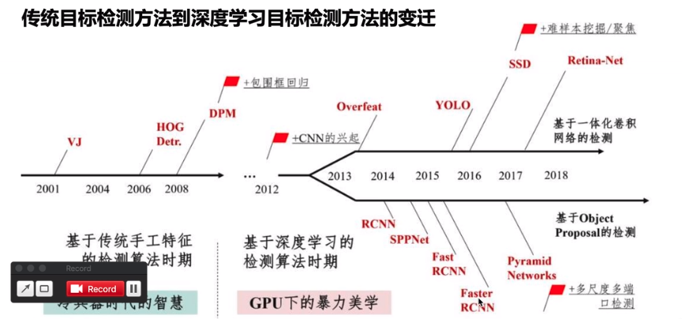
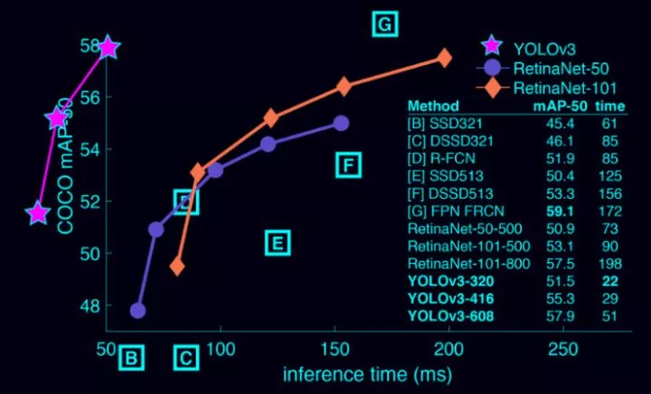
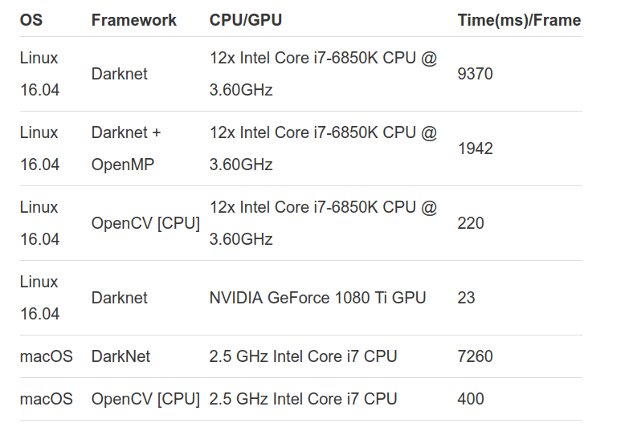

转载：https://www.cnblogs.com/hesse-summer/p/11335865.html

# 目标检测概况

## 目标检测是？

目标检测，粗略来说就是：输入图片/视频，经过处理

得到：目标的位置信息（比如左上角和右下角的坐标）、目标的预测类别、目标的预测置信度（confidence）

拿Faster R-CNN这个算法举例：输入一个batch（batch size也可以为1）的图片或者视频，网络直接的outputs是这样的：
`[batchId, classId, confidence, left, top, right, bottom]`，`batchId`，`classId`，`confidence`，`left`，`top`，`right`，`bottom`都是标量。

batchId表示这一个batch中，这张图片的id（也即index），后四个标量即目标的位置信息：左上角像素点和右下角像素点的坐标。

## 目标检测算法？

**按照历史脉络来谈：**

1. 手工特征提取算法，如VJ、HOG、DPM

2. R-CNN算法（2014），最早的基于深度学习的目标检测器之一，其结构是两级网络：1）首先需要诸如选择性搜索之类的算法来提出可能包含对象的候选边界框；2）然后将这些区域传递到CNN算法进行分类；

R-CNN算法存在的问题是其仿真很慢，并且不是完整的端到端的目标检测器。

3. Fast R-CNN算法（2014末），对原始R-CNN进行了相当大的改进：提高准确度，并减少执行正向传递所花费的时间。

但是，该模型仍然依赖于外部区域搜索算法。

4. faster R-CNN算法（2015），真正的端到端深度学习目标检测器。删除了选择性搜索的要求，而是依赖于
（1）完全卷积的区域提议网络（RPN, Region Purpose Network），可以预测对象边界框和“对象”分数（量化它是一个区域的可能性的分数）。
（2）然后将RPN的输出传递到R-CNN组件以进行最终分类和标记。

5. R-CNN系列算法，都采取了two-stage策略。特点是：虽然检测结果一般都非常准确，但仿真速度非常慢，即使是在GPU上也仅获得5 FPS。

6. one-stage方法有：yolo（2015）、SSD（2015末），以及在这两个算法基础上改进的各论文提出的算法。这些算法的基本思路是：均匀地在图片的不同位置进行密集抽样，抽样时可以采用不同尺度和长宽比，然后利用CNN提取特征后直接进行分类与回归。
整个过程只需要一步，所以其优势是速度快，但是训练比较困难。

7. yolov3（2018）是yolo作者提出的第三个版本（之前还提过yolov2和它们的tinny版本，tinny版本经过压缩更快但是也降低了准确率）。yolov3支持80类物体的目标检测，完整列表[戳这里]: https://github.com/pjreddie/darknet/blob/master/data/coco.names

**时间线：**



# yolov3模型简介

## 性能介绍

首先，套路，yolov3很强大（不强大我用它干啥呢）。速度上，它比 R-CNN 快 1000 倍，比 Fast R-CNN 快 100 倍。检测准确率上，它不是最准的：YOLOv3-608比 DSSD 更高，接近 FPN。但是它的速度不到后二者的1/3。

从下图也可以看出：




## 架构介绍


可以看出，他是一系列卷积、残差、上采样组成的。特点在于，它将预测分在三个尺度（Scale）进行（见图中三个彩色框），也在三个scale分别输出。


# opencv-python实现

## why opencv?

opencv（3.4.2+版本）的dnn（Deep Neural Network-DNN）模块封装了Darknet框架，这个框架是自己写的，它由封装了yolo算法。因为这么一层关系，我们可以使用opencv方便地使用yolo的各个版本，而且有数据（见下）证明OpenCV的DNN模块在 CPU的实现速度比使用 OpenML 的 Darknet 快9倍。



# 正文

我会先结合脚本片段讲解，再给出该脚本的完整代码，讲解。

## 先

1. 引库

```py
import numpy as np
import cv2 as cv
import os
import time
```

2. 参数

```py
yolo_dir = '/home/hessesummer/github/NTS-Net-my/yolov3'  # YOLO文件路径
weightsPath = os.path.join(yolo_dir, 'yolov3.weights')  # 权重文件
configPath = os.path.join(yolo_dir, 'yolov3.cfg')  # 配置文件
labelsPath = os.path.join(yolo_dir, 'coco.names')  # label名称
imgPath = os.path.join(yolo_dir, 'test.jpg')  # 测试图像
CONFIDENCE = 0.5  # 过滤弱检测的最小概率
THRESHOLD = 0.4  # 非最大值抑制阈值
```

3. 权重文件、配置文件、label名称的下载地址

```
wget https://pjreddie.com/media/files/yolov3.weights
wget https://github.com/pjreddie/darknet/blob/master/cfg/yolov3.cfg
wget https://github.com/pjreddie/darknet/blob/master/data/coco.names
```

简单来说：

- 过滤弱检测的最小概率：置信度小于这个值的输出都不要了；
- 非最大值抑制阈值：允许框框重叠的程度（多框框检测同一个物体），供下面的NMS算法使用，该算法会根据该值将有重叠的框框合并。值为0时，不允许框框重叠。默认值是0.3。

4. 重头戏1

```py
# 加载网络、配置权重
net = cv.dnn.readNetFromDarknet(configPath, weightsPath)  ## 利用下载的文件
# print("[INFO] loading YOLO from disk...") ## 可以打印下信息

# 加载图片、转为blob格式、送入网络输入层
img = cv.imread(imgPath)
blobImg = cv.dnn.blobFromImage(img, 1.0/255.0, (416, 416), None, True, False)  ## net需要的输入是blob格式的，用blobFromImage这个函数来转格式
net.setInput(blobImg)  ## 调用setInput函数将图片送入输入层

# 获取网络输出层信息（所有输出层的名字），设定并前向传播
outInfo = net.getUnconnectedOutLayersNames()  ## 前面的yolov3架构也讲了，yolo在每个scale都有输出，outInfo是每个scale的名字信息，供net.forward使用
# start = time.time()
layerOutputs = net.forward(outInfo)  # 得到各个输出层的、各个检测框等信息，是二维结构。
# end = time.time()
# print("[INFO] YOLO took {:.6f} seconds".format(end - start)) ## 可以打印下信息
```

`layerOutputs`是二维结构，第0维代表哪个输出层，第1维代表各个检测框。

5. 重头戏2

```py
# 拿到图片尺寸
(H, W) = img.shape[:2]
```

供下面使用

```py
# 过滤layerOutputs
# layerOutputs的第1维的元素内容: [center_x, center_y, width, height, objectness, N-class score data]
# 过滤后的结果放入：
boxes = [] # 所有边界框（各层结果放一起）
confidences = [] # 所有置信度
classIDs = [] # 所有分类ID

# # 1）过滤掉置信度低的框框
for out in layerOutputs:  # 各个输出层
    for detection in out:  # 各个框框
        # 拿到置信度
        scores = detection[5:]  # 各个类别的置信度
        classID = np.argmax(scores)  # 最高置信度的id即为分类id
        confidence = scores[classID]  # 拿到置信度

        # 根据置信度筛查
        if confidence > CONFIDENCE:
            box = detection[0:4] * np.array([W, H, W, H])  # 将边界框放会图片尺寸
            (centerX, centerY, width, height) = box.astype("int")
            x = int(centerX - (width / 2))
            y = int(centerY - (height / 2))
            boxes.append([x, y, int(width), int(height)])
            confidences.append(float(confidence))
            classIDs.append(classID)

# # 2）应用非最大值抑制(non-maxima suppression，nms)进一步筛掉
idxs = cv.dnn.NMSBoxes(boxes, confidences, CONFIDENCE, THRESHOLD) # boxes中，保留的box的索引index存入idxs
```

这里的NMS算法就是前面提到的NMS算法。

6. 应用检测结果，这里是画出框框

```py
# 得到labels列表
with open(labelsPath, 'rt') as f:
    labels = f.read().rstrip('\n').split('\n')
```

供下面使用

```py
# 应用检测结果
np.random.seed(42)
COLORS = np.random.randint(0, 255, size=(len(labels), 3), dtype="uint8")  # 框框显示颜色，每一类有不同的颜色，每种颜色都是由RGB三个值组成的，所以size为(len(labels), 3)
if len(idxs) > 0:
    for i in idxs.flatten(): # indxs是二维的，第0维是输出层，所以这里把它展平成1维
        (x, y) = (boxes[i][0], boxes[i][1])
        (w, h) = (boxes[i][2], boxes[i][3])

        color = [int(c) for c in COLORS[classIDs[i]]]
        cv.rectangle(img, (x, y), (x+w, y+h), color, 2)  # 线条粗细为2px
        text = "{}: {:.4f}".format(labels[classIDs[i]], confidences[i])
        cv.putText(img, text, (x, y-5), cv.FONT_HERSHEY_SIMPLEX, 0.5, color, 2)  # cv.FONT_HERSHEY_SIMPLEX字体风格、0.5字体大小、粗细2px
cv.imshow('目标检测结果', img)
cv.waitKey(0)
```

第一部分讲解结束，下面放完整代码。

## 再

```py
import numpy as np
import cv2 as cv
import os
import time

yolo_dir = '/home/hessesummer/github/NTS-Net-my/yolov3'  # YOLO文件路径
weightsPath = os.path.join(yolo_dir, 'yolov3.weights')  # 权重文件
configPath = os.path.join(yolo_dir, 'yolov3.cfg')  # 配置文件
labelsPath = os.path.join(yolo_dir, 'coco.names')  # label名称
imgPath = os.path.join(yolo_dir, 'test.jpg')  # 测试图像
CONFIDENCE = 0.5  # 过滤弱检测的最小概率
THRESHOLD = 0.4  # 非最大值抑制阈值

# 加载网络、配置权重
net = cv.dnn.readNetFromDarknet(configPath, weightsPath)  # #  利用下载的文件
print("[INFO] loading YOLO from disk...")  # # 可以打印下信息

# 加载图片、转为blob格式、送入网络输入层
img = cv.imread(imgPath)
blobImg = cv.dnn.blobFromImage(img, 1.0/255.0, (416, 416), None, True, False)   # # net需要的输入是blob格式的，用blobFromImage这个函数来转格式
net.setInput(blobImg)  # # 调用setInput函数将图片送入输入层

# 获取网络输出层信息（所有输出层的名字），设定并前向传播
outInfo = net.getUnconnectedOutLayersNames()  # # 前面的yolov3架构也讲了，yolo在每个scale都有输出，outInfo是每个scale的名字信息，供net.forward使用
start = time.time()
layerOutputs = net.forward(outInfo)  # 得到各个输出层的、各个检测框等信息，是二维结构。
end = time.time()
print("[INFO] YOLO took {:.6f} seconds".format(end - start))  # # 可以打印下信息

# 拿到图片尺寸
(H, W) = img.shape[:2]
# 过滤layerOutputs
# layerOutputs的第1维的元素内容: [center_x, center_y, width, height, objectness, N-class score data]
# 过滤后的结果放入：
boxes = [] # 所有边界框（各层结果放一起）
confidences = [] # 所有置信度
classIDs = [] # 所有分类ID

# # 1）过滤掉置信度低的框框
for out in layerOutputs:  # 各个输出层
    for detection in out:  # 各个框框
        # 拿到置信度
        scores = detection[5:]  # 各个类别的置信度
        classID = np.argmax(scores)  # 最高置信度的id即为分类id
        confidence = scores[classID]  # 拿到置信度

        # 根据置信度筛查
        if confidence > CONFIDENCE:
            box = detection[0:4] * np.array([W, H, W, H])  # 将边界框放会图片尺寸
            (centerX, centerY, width, height) = box.astype("int")
            x = int(centerX - (width / 2))
            y = int(centerY - (height / 2))
            boxes.append([x, y, int(width), int(height)])
            confidences.append(float(confidence))
            classIDs.append(classID)

# # 2）应用非最大值抑制(non-maxima suppression，nms)进一步筛掉
idxs = cv.dnn.NMSBoxes(boxes, confidences, CONFIDENCE, THRESHOLD) # boxes中，保留的box的索引index存入idxs
# 得到labels列表
with open(labelsPath, 'rt') as f:
    labels = f.read().rstrip('\n').split('\n')
# 应用检测结果
np.random.seed(42)
COLORS = np.random.randint(0, 255, size=(len(labels), 3), dtype="uint8")  # 框框显示颜色，每一类有不同的颜色，每种颜色都是由RGB三个值组成的，所以size为(len(labels), 3)
if len(idxs) > 0:
    for i in idxs.flatten():  # indxs是二维的，第0维是输出层，所以这里把它展平成1维
        (x, y) = (boxes[i][0], boxes[i][1])
        (w, h) = (boxes[i][2], boxes[i][3])

        color = [int(c) for c in COLORS[classIDs[i]]]
        cv.rectangle(img, (x, y), (x+w, y+h), color, 2)  # 线条粗细为2px
        text = "{}: {:.4f}".format(labels[classIDs[i]], confidences[i])
        cv.putText(img, text, (x, y-5), cv.FONT_HERSHEY_SIMPLEX, 0.5, color, 2)  # cv.FONT_HERSHEY_SIMPLEX字体风格、0.5字体大小、粗细2px
cv.imshow('detected image', img)
cv.waitKey(0)
```

