转载：https://xugaoxiang.com/2019/12/18/windows-10-cuda-cudnn/

# 软硬件环境

- windows 10 64bit
- GTX 1660
- CUDA 10.2
- cuDNN 7.6.5
- visual studio 2019

# 安装CUDA

首先到https://developer.nvidia.com/cuda-downloads?下载目前的最新版10.2，双击exe文件开始安装

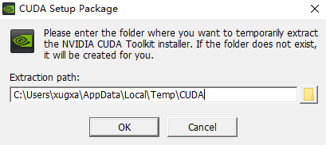

这是一个临时目录，随意选取一个即可

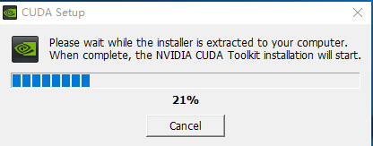

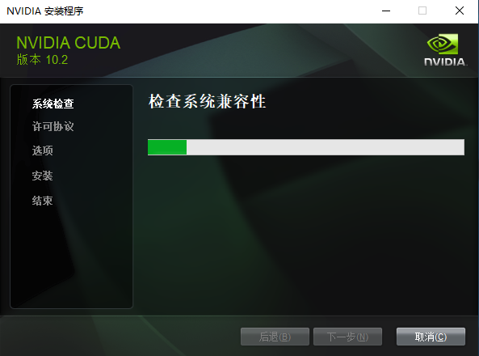

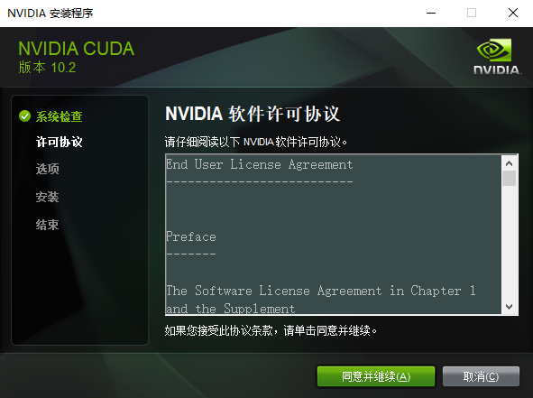

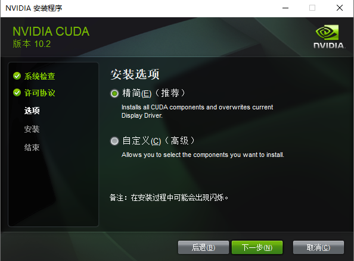

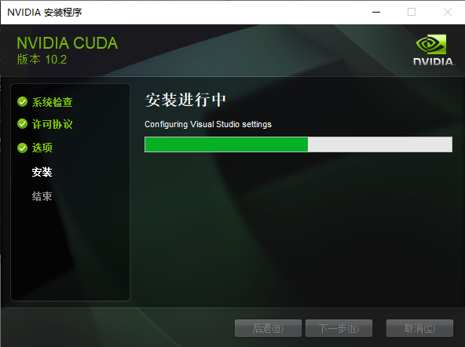

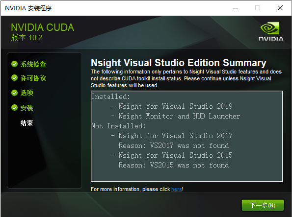

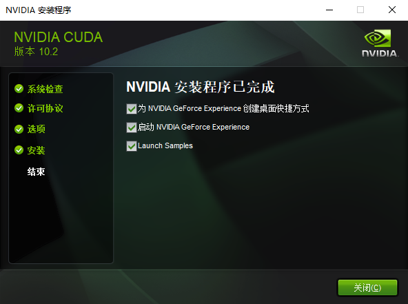

到此cuda就安装好了，接下来我们打开sample目录，通过执行其中的deviceQuery来检查下安装结果

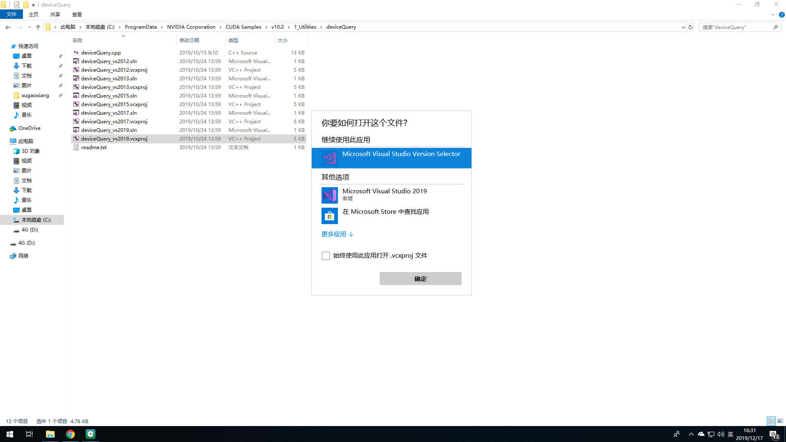

我们选择用visual studio 2019版本打开这个工程，直接编译运行

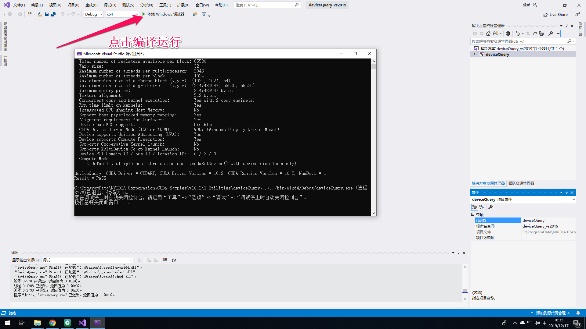

从结果中可以看出，cuda已经安装成功了

# 安装cuDNN

cuDNN是nvidia公司开发的一套用于DNN也就是深度神经网络的加速库，下面我们就来安装它。进入[官网](https://developer.nvidia.com/rdp/cudnn-download)下载安装包，这里需要登录，如果没有账号的话就去注册一个。

下载下来的文件是一个压缩包，解压后有三个文件夹bin、include和lib，依次将三个文件夹中的内容拷贝到cuda的安装目录(默认情况下是C:\Program Files\NVIDIA GPU Computing Toolkit\CUDA\v10.2)下的bin、include和lib下，这个要一一对应，如下图所示。

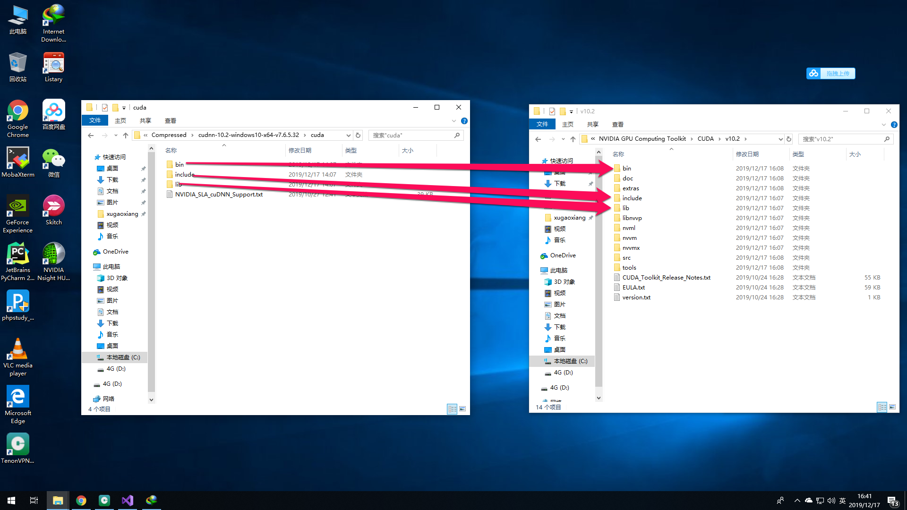

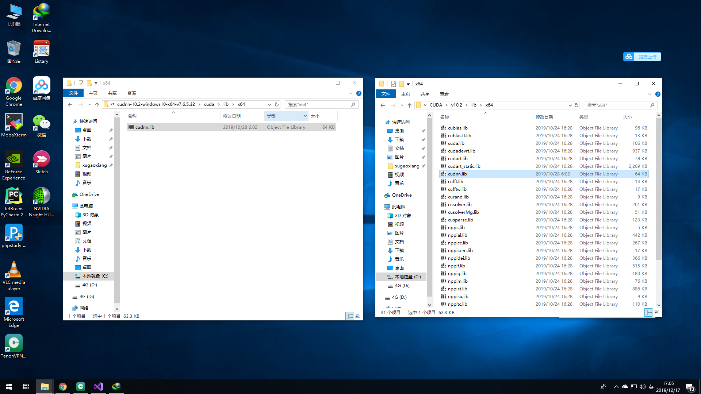

# 参考资料

- https://developer.nvidia.com/cuda-downloads?
- https://developer.nvidia.com/rdp/cudnn-download