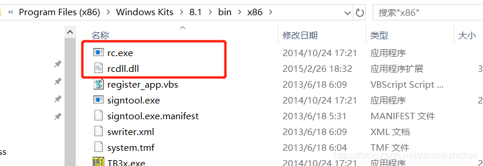
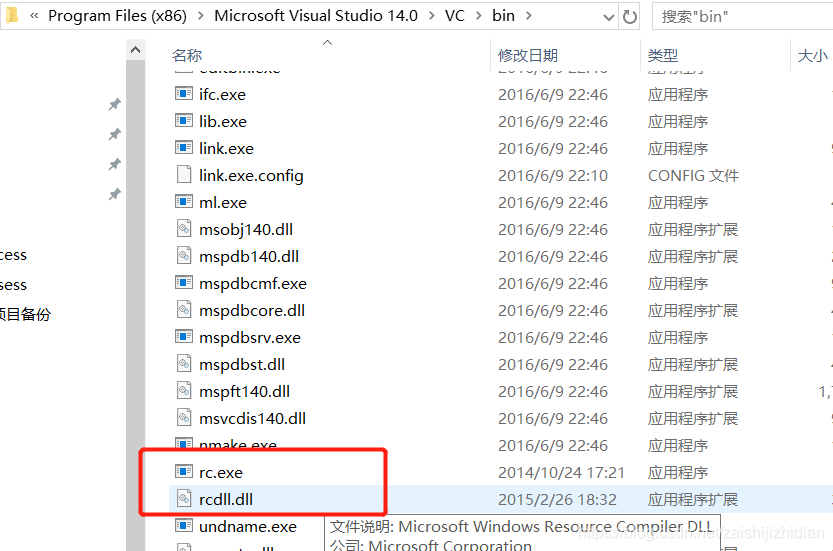

在安装scrapy时出现如下错误：

```shell
Finished generating code
LINK : fatal error LNK1158: cannot run 'rc.exe'
error: command 'C:\\Program Files (x86)\\Microsoft Visual Studio 14.0\\VC\\BIN\\x86_amd64\\link.exe' failed with exit status 1158

----------------------------------------
Command "d:\laipai_code\laipai_webcrawler_v7.0\djangostart\django_py3\scripts\python.exe -u -c "import setuptools, tokenize;__file__='C:\\Users\
\jackfull\\AppData\\Local\\Temp\\pip-install-ot3c65ym\\Twisted\\setup.py';f=getattr(tokenize, 'open', open)(__file__);code=f.read().replace('\r\
n', '\n');f.close();exec(compile(code, __file__, 'exec'))" install --record C:\Users\jackfull\AppData\Local\Temp\pip-record-whqb0p6c\install-rec
ord.txt --single-version-externally-managed --compile --install-headers d:\laipai_code\laipai_webcrawler_v7.0\djangostart\django_py3\include\sit
e\python3.6\Twisted" failed with error code 1 in C:\Users\jackfull\AppData\Local\Temp\pip-install-ot3c65ym\Twisted\
```

解决办法：

从此路径`C:\Program Files (x86)\Windows Kits\8.1\bin\x86`复制

```
rc.exe
rcdll.dll
```

两个文件

到另一个路径下`C:\Program Files (x86)\Microsoft Visual Studio 14.0\VC\bin`。

示意图如下：



