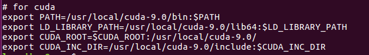
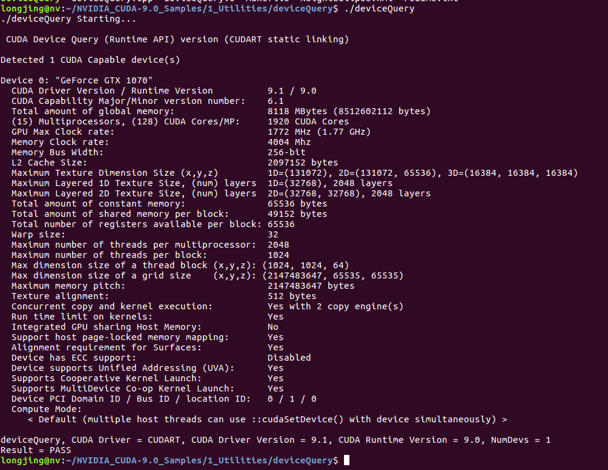
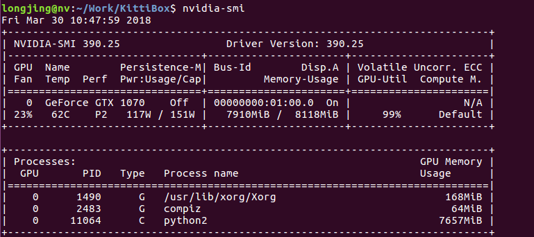

转载：https://xugaoxiang.com/2019/12/13/ubuntu-cuda/#google_vignette

# 软硬件环境

- ubuntu 18.04 64bit
- NVidia GTX 1070
- CUDA 10.1
- cudnn 7.6.3

# 安装nvidia驱动

进入没有安装驱动的ubuntu系统，屏幕显示是不正常的，分辨率偏小。从官网下载RUN文件, 比如我这里的NVIDIA-Linux-x86_64-435.21.run,这里尽量选择较新的版本

```shell
sudo apt install build-essential 
chmod a+x NVIDIA-Linux-x86_64-435.21.run
sudo ./NVIDIA-Linux-x86_64-435.21.run
```

安装过程基本上就是选中yes或者no,装完后重启系统，就会发现屏幕显示正常了，分辨率也变高了。这时候，我们可以通过nvidia提供的一些命令来查看系统中显卡的信息。如非常有用的nvidia-smi。

# 安装CUDA

接下来安装cuda

```shell
sudo ./cuda_10.1.243_418.87.00_linux.run
```

然后配置下,编辑~/.bashrc，添加相应的环境变量

```shell
export PATH=/usr/local/cuda-10.1/bin:$PATH
export LD_LIBRARY_PATH=/usr/local/cuda-10.1/lib64:$LD_LIBRARY_PATH
```



最后，刷新刚才的配置

```shell
source ~/.bashrc
```

这样几个重要的环境变量就立马生效了。

# 安装cudnn

到[官网](https://developer.nvidia.com/cudnn)去下载,这里需要注册,有点麻烦

将几个文件复制到对应的位置：

```shell
tar xvf cudnn-10.1-linux-x64-v7.6.3.36.tgz
cd cuda
sudo cp cuda/include/cudnn.h /usr/local/cuda-10.1/include
sudo cp -a cuda/lib64/libcudnn*  /usr/local/cuda-10.1/lib64
sudo chmod a+r /usr/local/cuda-10.1/lib64/libcudnn*
```

# 测试

安装完毕,我们来测试下环境是否都ok





# 参考资料

- http://www.nvidia.com/Download/index.aspx?lang=en-us
- https://developer.nvidia.com/cuda-toolkit
- https://blog.csdn.net/hanging_gardens/article/details/64439344


