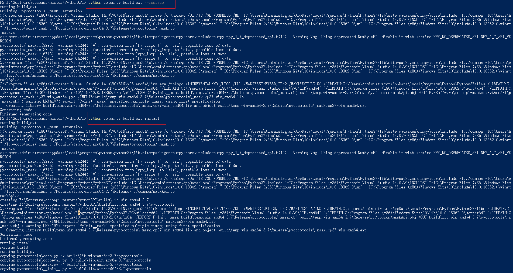

转载：https://blog.csdn.net/qq_37705280/article/details/111053515

在做视觉任务（如目标检测、目标跟踪等）的时候，有时会用到Pycocotools，一般情况下，我们只需要在python环境中或者Anaconda下进行install指令进行包安装即可。

但这个包安不上，无论是pip命令还是conda命令都会报各种错。接下来说下解决办法。

首先在网上查阅时候有一种说法，直接在python/conda命令环境下输入：install git+https://github.com/philferriere/cocoapi.git#subdirectory=PythonAPI。笔者尝试了一下，失败了。

还有一种说法，要在安装cython情况下使用上面的命令语句，笔者试了也不行。

然后说一下，笔者尝试成功的做法（在anaconda环境下）：

1、安装Visual环境，如下图，点击here下载安装即可，（地址：https://github.com/philferriere/cocoapi）


2、下载工具包

下载地址：https://github.com/cocodataset/cocoapi

3、解压缩压缩包后，打开anaconda命令窗口，使用cd命令：cd coco/PythonAPI。转到coco/PythonAPI文件夹下以后，继续在命令窗口中输入命令：

```shell
python setup.py build_ext --inplace
```

执行完该命令之后，继续在命令窗口中再输入命令：

```shell
python setup.py build_ext install
```

结束，安装成功。

