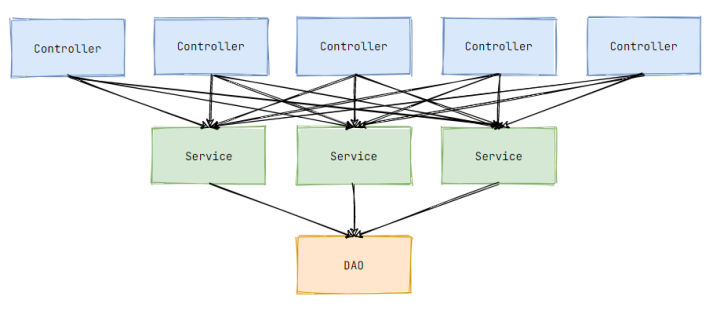

转载：https://zhuanlan.zhihu.com/p/349386138

作为一名 Java 开发，对 Spring 框架是再熟悉不过的了。Spring 支持的控制反转（Inversion of Control，缩写为IoC）和面向切面编程（Aspect-oriented programming，缩写为AOP）早已成为我们的开发习惯，仿佛 Java 开发天生就该如此。人总是会忽略习以为常的事物，所有人都熟练使用 IoC 和 AOP，却鲜有人说得清楚到底为什么要用 IoC 和 AOP。

技术肯定是为了解决某个问题而诞生，要弄清楚为什么使用 IoC 和 AOP，就得先弄清楚不用它们会碰到什么问题。

# IoC

我们现在假设回到了没有 IoC 的时代，用传统的 Servlet 进行开发。

## 传统开发模式的弊端

三层架构是经典的开发模式，我们一般将视图控制、业务逻辑和数据库操作分别抽离出来单独形成一个类，这样各个职责就非常清晰且易于复用和维护。大致代码如下：

```java
@WebServlet("/user")
public class UserServlet extends HttpServlet {
    // 用于执行业务逻辑的对象
    private UserService userService = new UserServiceImpl();
    
    @Override
    protected void doPost(HttpServletRequest req, HttpServletResponse resp) throws ServletException, IOException {
        // ...省略其他代码
            
        // 执行业务逻辑
        userService.doService();
        
        // ...返回页面视图
    }
}
```

```java
public class UserServiceImpl implements UserService{
    // 用于操作数据库的对象
    private UserDao userDao = new UserDaoImpl();
    
    @Override
    public void doService() {
        // ...省略业务逻辑代码
            
        // 执行数据库操作
        userDao.doUpdate();
        
        // ...省略业务逻辑代码
    }
}
```

```java
public class UserDaoImpl implements UserDao{
    @Override
    public void doUpdate() {
        // ...省略JDBC代码
    }
}
```

上层依赖下层的抽象，代码就分为了三层：


业界普遍按这种分层方式组织代码，其核心思想是职责分离。层次越低复用程度越高，比如一个 DAO 对象往往会被多个 Service 对象使用，一个 Service 对象往往也会被多个 Controller 对象使用：



条理分明，井然有序。这些被复用的对象就像一个个的组件，供多方使用。

虽然这个倒三角看上去非常漂亮，然而我们目前的代码有一个比较大的问题，那就是我们只做到了逻辑复用，并没有做到资源复用。

上层调用下一层时，必然会持有下一层的对象引用，即成员变量。目前我们每一个成员变量都会实例化一个对象，如下图所示：


每一个链路都创建了同样的对象，造成了极大的资源浪费。本应多个 Controller 复用同一个 Service，多个 Service 复用同一个 DAO。现在变成了一个 Controller创建多个重复的 Service，多个 Service 又创建了多个重复的 DAO，从倒三角变成了正三角。

许多组件只需要实例化一个对象就够了，创建多个没有任何意义。针对对象重复创建的问题，我们自然而然想到了单例模式。只要编写类时都将其写为单例，这样就避免了资源浪费。但是，引入设计模式必然会带来复杂性，况且还是每一个类都为单例，每一个类都会有相似的代码，其弊端不言自明。

有人可能会说，那我不在意“这点”资源浪费了，我服务器内存大无所谓，我只求开发便捷痛快不想写额外的代码。

确实，三层架构达到逻辑复用已经非常方便了，还奢求其他的干什么呢。但就算不管资源问题，目前代码还有一个致命缺陷，那就是变化的代价太大。

假设有 10 个 Controller 依赖了 UserService，最开始实例化的是 UserServiceImpl，后面需要换一个实现类 OtherUserServiceImpl，我就得逐个修改那 10 个 Controller，非常麻烦。更换实现类的需求可能不会太多，没多大说服力。那咱们看另一个情况。

之前咱们演示的组件创建过程非常简单，new 一下就完了，可很多时候创建一个组件没那么容易。比如 DAO 对象要依赖一个这样的数据源组件：

```java
public class UserDaoImpl implements UserDao{
    private MyDataSource dataSource;

    public UserDaoImpl() {
        // 构造数据源
        dataSource = new MyDataSource("jdbc:mysql://localhost:3306/test", "root", "password");
        // 进行一些其他配置
        dataSource.setInitiaSize(10);
        dataSource.setMaxActive(100);
        // ...省略更多配置项
    }
}
```

该数据源组件要想真正生效需要对其进行许多配置，这个创建和配置过程是非常麻烦的。而且配置可能会随着业务需求的变化经常更改，这时候你就需要修改每一个依赖该组件的地方，牵一发而动全身。这还只是演示了一个数据源的创建配置过程，真实开发中可有太多组件和太多配置需要编码了，其麻烦程度堪称恐怖。

当然，这些问题都可以引入设计模式来解决，不过这样一来又绕回去了：设计模式本身也会带来复杂性。这就像一种死循环：传统开发模式编码复杂，要想解决这种复杂却得陷入另一种复杂。难道没有办法解决了吗？当然不是的，在讲优秀解决方案前，我们先来梳理一下目前出现的问题：

- 创建了许多重复对象，造成大量资源浪费；
- 更换实现类需要改动多个地方；
- 创建和配置组件工作繁杂，给组件调用方带来极大不便。

透过现象看本质，这些问题的出现都是同一个原因：**组件的调用方参与了组件的创建和配置工作**。

其实调用方只需关注组件如何调用，至于这个组件如何创建和配置又与调用方有什么关系呢？就好比我去餐馆只需点菜，饭菜并不需要我亲自去做，餐馆自然会做好给我送过来。如果我们编码时，有一个「东西」能帮助我们创建和配置好那些组件，我们只负责调用该多好。这个「东西」就是容器。

容器这一概念我们已接触过，Tomcat 就是 Servlet 的容器，它帮我们创建并配置好 Servlet，我们只需编写业务逻辑即可。试想一下，如果 Servlet 要我们自己创建，HttpRequest、HttpResponse 对象也需要我们自己配置，那代码量得有多恐怖。

Tomcat 是 Servlet 容器，只负责管理 Servlet。我们平常使用的组件则需要另一种容器来管理，这种容器我们称之为 IoC 容器。

## 控制反转和依赖注入

控制反转，是指对象的创建和配置的控制权从调用方转移给容器。好比在家自己做菜，菜的味道全部由自己控制；去餐馆吃饭，菜的味道则是交由餐馆控制。IoC 容器就担任了餐馆的角色。

有了 IoC 容器，我们可以将对象交由容器管理，交由容器管理后的对象称之为 Bean。调用方不再负责组件的创建，要使用组件时直接获取 Bean 即可：

```java
@Component
public class UserServiceImpl implements UserService{
    @Autowired // 获取 Bean
    private UserDao userDao;
}
```

调用方只需按照约定声明依赖项，所需要的 Bean 就自动配置完毕了，就好像在调用方外部注入了一个依赖项给其使用，所以这种方式称之为 依赖注入（Dependency Injection，缩写为 DI）。**控制反转和依赖注入是一体两面，都是同一种开发模式的表现形式**。

IoC 轻而易举地解决了我们刚刚总结的问题：

对象交由容器管理后，默认是单例的，这就解决了资源浪费问题。

若要更换实现类，只需更改 Bean 的声明配置，即可达到无感知更换：

```java
public class UserServiceImpl implements UserService{
    ...
}

// 将该实现类声明为 Bean
@Component
public class OtherUserServiceImpl implements UserService{
    ...
}
```

现在组件的使用和组件的创建与配置完全分离开来。调用方只需调用组件而无需关心其他工作，这极大提高了我们的开发效率，也让整个应用充满了灵活性、扩展性。

这样看来，我们如此中意 IoC 不是没有道理的。

# AOP

我们再来假设没有 AOP 会怎样。

## 面向对象的局限性

面向对象编程（Object-oriented programming，缩写：OOP）的三大特性：封装、继承、多态，我们早已用得炉火纯青。OOP 的好处已无需赘言，相信大家都有体会。这里咱们来看一下 OOP 的局限性。

当有重复代码出现时，可以就将其封装出来然后复用。我们通过分层、分包、分类来规划不同的逻辑和职责，就像之前讲解的三层架构。但这里的复用的都是核心业务逻辑，并不能复用一些辅助逻辑，比如：日志记录、性能统计、安全校验、事务管理，等等。这些边缘逻辑往往贯穿你整个核心业务，传统 OOP 很难将其封装：

```java
public class UserServiceImpl implements UserService {
    @Override
    public void doService() {
        System.out.println("---安全校验---");
        System.out.println("---性能统计 Start---");
        System.out.println("---日志打印 Start---");
        System.out.println("---事务管理 Start---");

        System.out.println("业务逻辑");

        System.out.println("---事务管理 End---");
        System.out.println("---日志打印 End---");
        System.out.println("---性能统计 End---");
    }
}
```

为了方便演示，这里只用了打印语句，就算如此这代码看着也很难受，而且这些逻辑是所有业务方法都要加上，想想都恐怖。

OOP 是至上而下的编程方式，犹如一个树状图，A调用B、B调用C，或者A继承B、B继承C。这种方式对于业务逻辑来说是合适的，通过调用或继承以复用。而辅助逻辑就像一把闸刀横向贯穿所有方法，如图2-4所示：


这一条条横线仿佛切开了 OOP 的树状结构，犹如一个大蛋糕被切开多层，每一层都会执行相同的辅助逻辑，所以大家将这些辅助逻辑称为层面或者切面。

代理模式用来增加或增强原有功能再适合不过了，但切面逻辑的难点不是不修改原有业务，而是对所有业务生效。对一个业务类增强就得新建一个代理类，对所有业务增强，每个类都要新建代理类，这无疑是一场灾难。而且这里只是演示了一个日志打印的切面逻辑，如果我再加一个性能统计切面，就得新建一个切面代理类来代理日志打印的代理类，一旦切面多起来这个代理类嵌套就会非常深。

面向切面编程（Aspect-oriented programming，缩写为 AOP）正是为了解决这一问题而诞生的技术。

## 面向切面编程

AOP 不是 OOP 的对立面，它是对 OOP 的一种补充。OOP 是纵向的，AOP 是横向的，两者相结合方能构建出良好的程序结构。AOP 技术，让我们能够不修改原有代码，便能让切面逻辑在所有业务逻辑中生效。

我们只需声明一个切面，写上切面逻辑：

```java
@Aspect // 声明一个切面
@Component
public class MyAspect {
    // 原业务方法执行前
    @Before("execution(public void com.rudecrab.test.service.*.doService())")
    public void methodBefore() {
        System.out.println("===AspectJ 方法执行前===");
    }

    // 原业务方法执行后
    @AfterReturning("execution(* com.rudecrab.test.service..doService(..))")
    public void methodAddAfterReturning() {
        System.out.println("===AspectJ 方法执行后===");
    }
}
```

无论你有一个业务方法，还是一万个业务方法，对我们开发者来说只需编写一次切面逻辑，就能让所有业务方法生效，极大提高了我们的开发效率。

# 总结

IoC 解决了以下问题：

- 创建了许多重复对象，造成大量资源浪费；
- 更换实现类需要改动多个地方；
- 创建和配置组件工作繁杂，给组件调用方带来极大不便。

AOP 解决了以下问题：

- 切面逻辑编写繁琐，有多少个业务方法就需要编写多少次。

