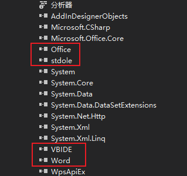

# 引用dll

创建一个C#项目，控制台还是带界面的项目都行。

需要先安装WPS Office 专业增强版。

安装完成之后再目录`D:\Program Files (x86)\WPS Office\11.1.0.10314\office6`下（安装目录）找到`wpsapi.dll`，复制到项目下新建的Libs目录。

在vs的引用上右击->添加引用->浏览，选择刚才在Libs目录下的`wpsapi.dll`。

最后引入会多出下面的引用：



# 编写WordHelper

```c#
public class WpsHelper
{
    /// <summary>
    /// 是否杀死全部WPS程序
    /// </summary>
    public bool IsKillAllWps = false;

    dynamic wps;

    #region 构造函数
    public WpsHelper()
    {
        //这里创建wps实例本机安装的是wps2016
        Type type = Type.GetTypeFromProgID("KWps.Application");
        wps = Activator.CreateInstance(type);
    }
    #endregion

    #region 在WPS2016中打开指定路径的文档
    /// <summary>
    /// 在WPS2016中打开指定路径的文档
    /// </summary>
    /// <param name="strFilePath">文件路径</param>
    public void OpenWpsFile(string strFilePath)
    {
        try
        {
            Word.Application wordApp = new Word.Application();//应用对象 
            wordApp.NormalTemplate.Saved = true;
            object fileName = strFilePath;
            object confirmConversions = Type.Missing;
            object readOnly = false;
            object addToRecentFiles = Type.Missing;
            object passwordDoc = Type.Missing;
            object passwordTemplate = Type.Missing;
            object revert = Type.Missing;
            object writepwdoc = Type.Missing;
            object writepwTemplate = Type.Missing;
            object format = Type.Missing;
            object encoding = Type.Missing;
            object visible = Type.Missing;
            object openRepair = Type.Missing;
            object docDirection = Type.Missing;
            object notEncoding = Type.Missing;
            object xmlTransform = Type.Missing;
            Word.Document doc = wordApp.Documents.Open(
                ref fileName, ref confirmConversions, ref readOnly, ref addToRecentFiles,
                ref passwordDoc, ref passwordTemplate, ref revert, ref writepwdoc,
                ref writepwTemplate, ref format, ref encoding, ref visible, ref openRepair,
                ref docDirection, ref notEncoding, ref xmlTransform);

            wordApp.Visible = true;
            wordApp.Activate();//激活文档使文档为当前处理  
        }
        catch (Exception ex)
        {
            Console.WriteLine("打开文件时出错：" + ex);
        }
        finally
        {
            Dispose();
        }
    }

    /// <summary>
    /// 在WPS2016中创建指定路径的文档
    /// </summary>
    /// <param name="strFilePath">文件路径</param>
    public void CreateWpsFile(string strFilePath)
    {
        try
        {
            Word.Application wordApp = new Word.Application();//应用对象 
            wordApp.NormalTemplate.Saved = true;
            //ref object Template, ref object NewTemplate, ref object DocumentType, ref object Visible
            object missingValue = Type.Missing;

            Word.Document doc = wordApp.Documents.Add(ref missingValue, false, 0, true);

            wordApp.Visible = true;
            wordApp.Activate();//激活文档使文档为当前处理

            doc.Save();
        }
        catch (Exception ex)
        {
            Console.WriteLine("打开文件时出错：" + ex);
        }
        finally
        {
            Dispose();
        }
    }

    /// <summary>
    /// 在WPS2016中创建指定路径的文档并添加图片
    /// </summary>
    /// <param name="strFilePath">文件路径</param>
    public void CreateWpsFileAddImages(string strFilePath, List<string> imagePaths)
    {
        try
        {
            Word.Application wordApp = new Word.Application();//应用对象 
            wordApp.NormalTemplate.Saved = true;
            //ref object Template, ref object NewTemplate, ref object DocumentType, ref object Visible
            object missingValue = Type.Missing;

            Word.Document doc = wordApp.Documents.Add(ref missingValue, false, 0, true);

            doc.PageSetup.TopMargin = 3;
            doc.PageSetup.BottomMargin = 3;
            doc.PageSetup.LeftMargin = 3;
            doc.PageSetup.RightMargin = 3;

            wordApp.Visible = false;
            wordApp.Activate();//激活文档使文档为当前处理

            foreach (var imagePath in imagePaths)
            {
                //doc.Shapes.AddPicture(imagePath);
                Word.Selection selection = wordApp.Selection;
                selection.InlineShapes.AddPicture(imagePath);
            }

            doc.SaveAs(strFilePath);
            doc.Close(ref missingValue, ref missingValue, ref missingValue);
            wps.Quit(ref missingValue, ref missingValue, ref missingValue);
        }
        catch (Exception ex)
        {
            Console.WriteLine("打开文件时出错：" + ex);
        }
        finally
        {
            Dispose();
        }
    }

    /// <summary>
    /// 在WPS2016中创建指定路径的文档并添加图片另存为PDF
    /// </summary>
    /// <param name="strFilePath">文件路径</param>
    public void CreateWpsFileAddImagesToPdf(string strFilePath, List<string> imagePaths)
    {
        Word.Application wordApp = new Word.Application();//应用对象 
        wordApp.NormalTemplate.Saved = true;
        //ref object Template, ref object NewTemplate, ref object DocumentType, ref object Visible
        object missingValue = Type.Missing;

        Word.Document doc = wordApp.Documents.Add(ref missingValue, false, 0, true);

        doc.PageSetup.TopMargin = 3;
        doc.PageSetup.BottomMargin = 3;
        doc.PageSetup.LeftMargin = 3;
        doc.PageSetup.RightMargin = 3;

        wordApp.Visible = false;
        wordApp.Activate();//激活文档使文档为当前处理

        foreach (var imagePath in imagePaths)
        {
            //doc.Shapes.AddPicture(imagePath);
            Word.Selection selection = wordApp.Selection;
            selection.InlineShapes.AddPicture(imagePath);
        }

        doc.SaveAs(strFilePath.Replace(".pdf", ".docx"));
        doc.ExportAsFixedFormat(strFilePath, Word.WdExportFormat.wdExportFormatPDF, false);
        doc.Close(ref missingValue, ref missingValue, ref missingValue);
        //wps.Quit(ref missingValue, ref missingValue, ref missingValue);

        Dispose();
    }
    #endregion

    private void Dispose()
    {
        try
        {
            object missingValue = Type.Missing;
            object bsave = false;
            wps.Quit(ref bsave, ref missingValue, ref missingValue);
            //wps.Quit(ref missingValue, ref missingValue, ref missingValue);
            //释放掉wps对象
            wps = null;

            #region 强制关闭所有wps的功能慎用,尤其是带并发的
            //强制关闭所有wps进程,解决文件占用的问题
            if (this.IsKillAllWps)
            {
                System.Diagnostics.Process[] process = System.Diagnostics.Process.GetProcessesByName("wps");
                foreach (System.Diagnostics.Process prtemp in process)
                {
                    prtemp.Kill();
                }
            }
            #endregion
        }
        catch (Exception ex)
        {
            Console.WriteLine(ex.Message + "：\r\n" + ex.StackTrace);
        }
    }
}
```

# 调用

```c#
/// <summary>
/// 通过wps，将图片转换成pdf
/// </summary>
/// <param name="files"></param>
/// <param name="pdfPath"></param>
public static BaseResponseResult ImagesToPdfByWps(List<string> imagePaths, string pdfPath)
{
    try
    {
        var wpsHelper = new Helpers.WpsHelper();
        wpsHelper.CreateWpsFileAddImagesToPdf(pdfPath, imagePaths);
        return BaseResponseResult.Success(null);
    }
    catch (Exception ex)
    {
        return BaseResponseResult.Failed($"{ex.Message}：\r\n{ex.StackTrace}");
    }
}
```
