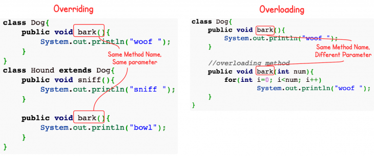

# 什么是多态

就是同一操作作用于不同的对象，可以用不同解释，产生不同的结果

那么多态应该是一种**运行时的状态**

## 多态的必要条件

为了实现运行时的多态，或者说是动态绑定，需要满足三个条件，即**有类继承或者接口实现**、**子类要重写父类的方法**、**父类的引用指向子类对象**

示例代码

```java
public class Parent{

    public void call(){
        sout("im Parent");
    }
}

public class Son extends Parent{// 1.有类继承或者接口实现
    public void call(){// 2.子类要重写父类的方法
        sout("im Son");
    }
}

public class Daughter extends Parent{// 1.有类继承或者接口实现
    public void call(){// 2.子类要重写父类的方法
        sout("im Daughter");
    }
}

public class Test{

    public static void main(String[] args){
        Parent p = new Son(); //3.父类的引用指向子类的对象
        Parent p1 = new Daughter(); //3.父类的引用指向子类的对象
    }
}
```

比如在spring的Ioc出来的对象，你在使用的时候不知道他是谁，或者可以说你不用关心他是谁，根据具体的情况而定

另外还有一种说法：

- 静态多态：一般认为，Java中的函数重载是一种静态多态，因为他需要在编译期间决定要调用哪一个方法，编译期间就知道了要调用的是什么对象或者方法
  
- 动态多态：上面提到的那种动态绑定可以认为是动态多态，因为只有在运行期才知道真正正调用的是那个类的方法，只有在运行的时候才知道当前调用的这个父类指向的对象是哪一个，才知道调用这个子类中的对应方法

# 方法重写与重载

## 定义

重载和重写是Java中两个比较重要的概念



### 重载

简单的说就是函数或者方法有同样的名称，但是参数的列表不相同的情形

这样同名不同参数的函数或者方法之间，互相称之为重载函数或者方法

**重载是在一个类或者父子类中的同名不同参的方法**

**在已经可以区分了重载的基础上（就是已经是重载了），对返回值没有要求，可以相同，也可以不同**

**方法签名相同，参数列表不同（与返回值无关）**

```java
private int test(int i){
    return i;
}

private double test(double i){
    return i;
}
```

### 重写

重写指的是在Java的子类与父类中有两个名称、参数列表都相同的方法的情况。

由于他们具有相同的方法签名，所以子类中的新方法将覆盖父类中原有的方法。

**重写是父子类之间的同名方法**

## 重载和重写

重载是一个编译期概念，重写是一个运行期概念

重载遵循的所谓编译期绑定，即**在编译期时根据参数变量的类型判断应该调用那个方法**

重写遵循所谓运行期绑定，即在运行期，根据引用变量所指向的那个实际对象的类型来调用方法

因为在编译期已经确定调用那个方法，所以**重载并不是多态，而重写是多态**，重载只是一个语言特性，是一种语法规则，与多态无关，与面向对象也无关（注：严格来说，**重载是编译时多态，即静态多态。但是，Java中提到的多态，在不特别说明的情况下都指动态多态**）

## 重写

### 重写的例子

例子

```java
class Dog{
    public void bark(){
        System.out.println("woof ");
    }
}
class Hound extends Dog{
    public void sniff(){
        System.out.println("sniff ");
    }

    public void bark(){
        System.out.println("bowl");
    }
}

public class OverridingTest{
    public static void main(String [] args){
        Dog dog = new Hound();
        dog.bark();
    }
}

```

输出结果

```java
bowl
```

上面的例子中，dog对象被定义为Dog类型。在编译期，编译器会检查Dog类中是否有可访问的bark()方法，只要其中包含bark()方法，那么就可以编译通过。在运行期，Hound对象被new出来，并赋值给dog变量，这时，JVM是明确的知道dog变量指向的其实是Hound对象的引用。所以，当dog调用bark()方法的时候，就会调用Hound类中定义的bark()方法。这就是所谓的动态多态性。

### 重写的条件

重写的条件：

- 参数列表必须完全与被重写方法相同
- 返回类型必须完全与被重写方法的返回类型相同
- 访问级别的限制性不能比被重写的方法强，就是父类是default的，那么子类就不能是public的
- 访问级别的限制性可以比被重写的方法弱，就是父类是default(包访问)的，子类可以是protected(当前类和子类)
- 重写方法一定不能抛出新的检查异常或比被重写的方法声明的检查异常更广泛的检查异常（就是父类中的方法抛出NullPointerException，子类不能抛出Exception）
- 重写的方法能够抛出更少或更有限的异常（也就是说，被重写的方法声明了异常，但重写的方法可以什么也不声明，直接内部消化掉这个异常）
- 不能重写被标示为final的方法
- 如果不能继承一个方法，则不能重写这个方法

## 重载

### 重载的例子

例子

```java
class Dog{
    public void bark(){
        System.out.println("woof ");
    }

    //overloading method
    public void bark(int num){
        for(int i=0; i<num; i++)
            System.out.println("woof ");
    }
}
```

### 重载的条件

重载的条件：

- 被重载的方法必须改变参数列表
- 被重载的方法可以改变返回类型
- 被重载的方法可以改变访问修饰符
- 被重载的方法可以声明新的或更广的检查异常
- **方法可以在同一个类中或者在一个子类中被重载**

# 继承与实现

面向对象有三个特征：封装、继承、多态

其中继承和实现都体现了传递性

## 继承

如果多个类的某部分的功能相同，那么可以抽象出一个类来，把他们的相同方法都放到父类中，让他们继承这个父类

## 实现

如果多个类处理的目标是一样的，但是处理的方法方式不同，那么就定义一个接口，也就是定义一个标准，让他们实现这个接口，各自实现自己具体的处理方法来处理那个目标

## 总结

所以继承的根本原因就是因为复用，而实现的根本原因是需要定义一个标准

在Java中，继承使用extend，实现使用implements关键字

# 继承与组合

面向对象的复用技术

复用性

## 继承

继承是一种联类与类的层次模型，指的是一个类（称为子类、子接口）继承另外一个类（称为父类、父接口）的功能，并可以增加它自己的新功能的能力，继承是类与类或者接口之间最常见的关系，继承是一种is-a关系


## 组合

组合体现的是整体与部分、拥有的关系，即has-a关系


## 组合和继承的区别和联系

- 在继承结构中，**父类的内部细节对于子类是可见的**，所以我们通常也是可以说通过继承实现的代码复用是一种**白盒式代码复用**（如果基类的实现发生改变，那么派生类的实现也将随之改变，这样就导致了子类行为的不可知性）
- 组合是对现有对象进行拼装（组合）产生新的、更复杂的功能，因为在对象之间，各自内部细节是不可见的，所以我们也说这种方式是**黑盒式代码复用**（因为组合中一般都是定义一个类型，所以在编译期根本不知道具体会调用那个方法）
- 继承在写代码的时候就要指明具体继承那个类，所以，在编译期就确定了关系，（从基类继承的实现是无法在运行期动态改变的，因此降低了应用的灵活性）
- 组合在写代码时可以采用**面向接口编程**，所以，**类的组合关系一般在运行期确定**

## 优缺点对比


## 如何选择

建议在同样的情况下，优先使用组合而不是继承

因为组合简单，更简单，更灵活，更高效

# 构造函数与默认构造函数

如果在编写一个可实例化的类时没有专门编写构造函数，多数编程语言会自动生成缺省构造器（默认构造函数）。默认构造函数一般会把成员变量的值初始化为默认值，如int -> 0，Integer -> null。

# 类变量、成员变量和局部变量

例子

```java
/**
* @author Hollis，这个才是这篇文章的作者
*/
public class Variables {

/**
    * 类变量
    */
private static int a;

/**
    * 成员变量
    */
private int b;

/**
    * 局部变量
    * @param c
    */
public void test(int c){
    int d;
}
}
```

# 成员变量和方法作用域

- public : 表明该成员变量或者方法是对所有类或者对象都是可见的,所有类或者对象都可以直接访问
- private : 表明该成员变量或者方法是私有的,只有当前类对其具有访问权限,除此之外其他类或者对象都没有访问权限.子类也没有访问权限.
- protected : 表明成员变量或者方法对类自身,与同在一个包中的其他类可见,其他包下的类不可访问,除非是他的子类
- default : 表明该成员变量或者方法只有自己和其位于同一个包的内可见,其他包内的类不能访问,即便是它的子类