转载：https://www.cnblogs.com/chenpi/p/5559349.html

https://www.cnblogs.com/chenpi/p/5565618.html

https://blog.csdn.net/jiuqiyuliang/article/details/46701559

https://xiaoliang.blog.csdn.net/article/details/47160259

# 什么是Java消息服务

Java消息服务指的是两个应用程序之间进行异步通信的API，它为标准消息协议和消息服务提供了一组通用接口，包括创建、发送、读取消息等，用于支持JAVA应用程序开发。

在J2EE中，当两个应用程序使用JMS进行通信时，它们之间并不是直接相连的，而是通过一个共同的消息收发服务连接起来，可以达到解耦的效果，我们将会在接下来的教程中详细介绍。

## 为什么需要JMS

在JAVA中，如果两个应用程序之间对各自都不了解，甚至这两个程序可能部署在不同的大洲上，那么它们之间如何发送消息呢？举个例子，一个应用程序A部署在印度，另一个应用程序部署在美国，然后每当A触发某件事后，B想从A获取一些更新信息。当然，也有可能不止一个B对A的更新信息感兴趣，可能会有N个类似B的应用程序想从A中获取更新的信息。

在这种情况下，JAVA提供了最佳的解决方案-JMS，完美解决了上面讨论的问题。

JMS同样适用于基于事件的应用程序，如聊天服务，它需要一种发布事件机制向所有与服务器连接的客户端发送消息。JMS与RMI不同，发送消息的时候，接收者不需要在线。服务器发送了消息，然后就不管了；等到客户端上线的时候，能保证接收到服务器发送的消息。这是一个很强大的解决方案，能处理当今世界很多普遍问题。

## JMS的优势

- 异步：JMS天生就是异步的，客户端获取消息的时候，不需要主动发送请求，消息会自动发送给可用的客户端。
- 可靠：JMS保证消息只会递送一次。大家都遇到过重复创建消息问题，而JMS能帮你避免该问题。

# JMS消息传送模型

在JMS API出现之前，大部分产品使用“点对点”和“发布/订阅”中的任一方式来进行消息通讯。

JMS定义了这两种消息发送模型的规范，它们相互独立。任何JMS的提供者可以实现其中的一种或两种模型，这是它们自己的选择。

JMS规范提供了通用接口保证我们基于JMS API编写的程序适用于任何一种模型。

让我们更加详细的看下这两种消息传送模型：

## 点对点消息传送模型

在点对点消息传送模型中，应用程序由消息队列，发送者，接收者组成。每一个消息发送给一个特殊的消息队列，该队列保存了所有发送给它的消息(除了被接收者消费掉的和过期的消息)。点对点消息模型有一些特性，如下：

- 每个消息只有一个接收者；
- 消息发送者和接收者并没有时间依赖性；
- 当消息发送者发送消息的时候，无论接收者程序在不在运行，都能获取到消息；
- 当接收者收到消息的时候，会发送确认收到通知（acknowledgement）。

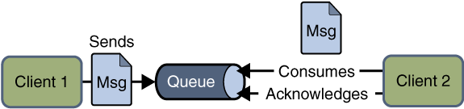

1. 涉及到的概念
- 消息队列（Queue）
- 发送者(Sender)
- 接收者(Receiver)
- 每个消息都被发送到一个特定的队列，接收者从队列中获取消息。队列保留着消息，直到他们被消费或超时。

2. P2P的特点

- 每个消息只有一个消费者（Consumer）(即一旦被消费，消息就不再在消息队列中)
- 发送者和接收者之间在时间上没有依赖性，也就是说当发送者发送了消息之后，不管接收者有没有正在运行，它不会影响到消息被发送到队列
- 接收者在成功接收消息之后需向队列应答成功

**如果你希望发送的每个消息都应该被成功处理的话，那么你需要P2P模式**。

## 发布/订阅消息传递模型

在发布/订阅消息模型中，发布者发布一个消息，该消息通过topic传递给所有的客户端。

在这种模型中，发布者和订阅者彼此不知道对方，是匿名的且可以动态发布和订阅topic。

topic主要用于保存和传递消息，且会一直保存消息直到消息被传递给客户端。

发布/订阅消息模型特性如下：

- 一个消息可以传递给多个订阅者
- 发布者和订阅者有时间依赖性，只有当客户端创建订阅后才能接受消息，且订阅者需一直保持活动状态以接收消息。
- 为了缓和这样严格的时间相关性，JMS允许订阅者创建一个可持久化的订阅。这样，即使订阅者没有被激活（运行），它也能接收到发布者的消息。


1. 涉及到的概念
- 主题（Topic）
- 发布者（Publisher）
- 订阅者（Subscriber）
- 客户端将消息发送到主题。多个发布者将消息发送到Topic,系统将这些消息传递给多个订阅者。

2. Pub/Sub的特点

- 每个消息可以有多个消费者
- 发布者和订阅者之间有时间上的依赖性。针对某个主题（Topic）的订阅者，它必须创建一个订阅者之后，才能消费发布者的消息，而且为了消费消息，订阅者必须保持运行的状态。
- 为了缓和这样严格的时间相关性，JMS允许订阅者创建一个可持久化的订阅。这样，即使订阅者没有被激活（运行），它也能接收到发布者的消息。

**如果你希望发送的消息可以不被做任何处理、或者被一个消息者处理、或者可以被多个消费者处理的话，那么可以采用Pub/Sub模型**。

# 接收消息

在JMS中，消息的接收可以使用以下两种方式：

- 同步：使用同步方式接收消息的话，消息订阅者调用receive()方法。在receive()中，消息未到达或在到达指定时间之前，方法会阻塞，直到消息可用。
- 异步：使用异步方式接收消息的话，消息订阅者需注册一个消息监听者，类似于事件监听器，只要消息到达，JMS服务提供者会通过调用监听器的onMessage()递送消息。

# JMS编程接口

JMS应用程序由如下基本模块组成：

- 管理对象（Administered objects）-连接工厂（Connection Factories）和目的地（Destination）
- 连接对象（Connections）
- 会话（Sessions）
- 消息生产者（Message Producers）
- 消息消费者（Message Consumers）
- 消息监听者（Message Listeners）


## JMS管理对象

管理对象（Administered objects）是预先配置的JMS对象，由系统管理员为使用JMS的客户端创建，主要有两个被管理的对象：

- 连接工厂（ConnectionFactory）
- 目的地（Destination）

这两个管理对象由JMS系统管理员通过使用Application Server管理控制台创建，存储在应用程序服务器的JNDI名字空间或JNDI注册表。

## 连接工厂（ConnectionFactory）

客户端使用一个连接工厂对象连接到JMS服务提供者，它创建了JMS服务提供者和客户端之间的连接。JMS客户端（如发送者或接受者）会在JNDI名字空间中搜索并获取该连接。使用该连接，客户端能够与目的地通讯，往队列或话题发送/接收消息。让我们用一个例子来理解如何发送消息：

```java
QueueConnectionFactory queueConnFactory = (QueueConnectionFactory) initialCtx.lookup ("primaryQCF");
Queue purchaseQueue = (Queue) initialCtx.lookup ("Purchase_Queue");
Queue returnQueue = (Queue) initialCtx.lookup ("Return_Queue");
```

## 目的地（Destination）

目的地指明消息被发送的目的地以及客户端接收消息的来源。JMS使用两种目的地，队列和话题。如下代码指定了一个队列和话题。

创建一个队列Session

```java
QueueSession ses = con.createQueueSession (false, Session.AUTO_ACKNOWLEDGE);  //get the Queue object  
Queue t = (Queue) ctx.lookup ("myQueue");  //create QueueReceiver  
QueueReceiver receiver = ses.createReceiver(t); 
```

创建一个话题Session

```java
TopicSession ses = con.createTopicSession (false, Session.AUTO_ACKNOWLEDGE); // get the Topic object  
Topic t = (Topic) ctx.lookup ("myTopic");  //create TopicSubscriber  
TopicSubscriber receiver = ses.createSubscriber(t);  
```

## JMS连接

连接对象封装了与JMS提供者之间的虚拟连接，如果我们有一个ConnectionFactory对象，可以使用它来创建一个连接。

```java
Connection connection = connectionFactory.createConnection();
```

创建完连接后，需要在程序使用结束后关闭它：

```java
connection.close();
```

## JMS 会话（Session）

Session是一个单线程上下文，用于生产和消费消息，可以创建出消息生产者和消息消费者。

Session对象实现了Session接口，在创建完连接后，我们可以使用它创建Session。

```java
Session session = connection.createSession(false, Session.AUTO_ACKNOWLEDGE);
```

## JMS消息生产者
消息生产者由Session创建，用于往目的地发送消息。生产者实现MessageProducer接口，我们可以为目的地、队列或话题创建生产者；

```java
MessageProducer producer = session.createProducer(dest);
MessageProducer producer = session.createProducer(queue);
MessageProducer producer = session.createProducer(topic);
```

创建完消息生产者后，可以使用send方法发送消息：

```java
producer.send(message);
```

## JMS消息消费者

消息消费者由Session创建，用于接受目的地发送的消息。消费者实现MessageConsumer接口，，我们可以为目的地、队列或话题创建消费者；

```java
MessageConsumer consumer = session.createConsumer(dest);
MessageConsumer consumer = session.createConsumer(queue);
MessageConsumer consumer = session.createConsumer(topic);
```

## JMS消息监听器

JMS消息监听器是消息的默认事件处理者，他实现了MessageListener接口，该接口包含一个onMessage方法，在该方法中需要定义消息达到后的具体动作。通过调用setMessageListener方法我们给指定消费者定义了消息监听器

```java
Listener myListener = new Listener();
consumer.setMessageListener(myListener);
```

# JMS消息结构

JMS客户端使用JMS消息与系统通讯，JMS消息虽然格式简单但是非常灵活， JMS消息由三部分组成：

## 消息头

JMS消息头预定义了若干字段用于客户端与JMS提供者之间识别和发送消息，预编译头如下：

- JMSDestination
- JMSDeliveryMode
- JMSMessageID
- JMSTimestamp
- JMSCorrelationID
- JMSReplyTo
- JMSRedelivered
- JMSType
- JMSExpiration
- JMSPriority

## 消息属性
我们可以给消息设置自定义属性，这些属性主要是提供给应用程序的。对于实现消息过滤功能，消息属性非常有用，JMS API定义了一些标准属性，JMS服务提供者可以选择性的提供部分标准属性。

## 消息体
在消息体中，JMS API定义了五种类型的消息格式，让我们可以以不同的形式发送和接受消息，并提供了对已有消息格式的兼容。不同的消息类型如下：

- Text message : javax.jms.TextMessage，表示一个文本对象。
- Object message : javax.jms.ObjectMessage，表示一个JAVA对象。
- Bytes message : javax.jms.BytesMessage，表示字节数据。
- Stream message :javax.jms.StreamMessage，表示java原始值数据流。
- Map message : javax.jms.MapMessage，表示键值对。

最后补充一下，常见的开源JMS服务的提供者，如下：

- JBoss 社区所研发的 HornetQ
- Joram
- Coridan的MantaRay
- The OpenJMS Group的OpenJMS

# ActiveMQ简单介绍以及安装

开源的JMS具体实现——ActiveMQ。ActiveMQ是一个易于使用的消息中间件

## 消息中间件

我们简单的介绍一下消息中间件，对它有一个基本认识就好，消息中间件（MOM：Message Orient middleware）。

消息中间件有很多的用途和优点：

- 将数据从一个应用程序传送到另一个应用程序，或者从软件的一个模块传送到另外一个模块；
- 负责建立网络通信的通道，进行数据的可靠传送。
- 保证数据不重发，不丢失
- 能够实现跨平台操作，能够为不同操作系统上的软件集成技工数据传送服务

## MQ

## ActiveMQ

### 简要概述ActiveMQ

ActiveMQ是由Apache出品的，一款最流行的，能力强劲的开源消息总线。ActiveMQ是一个完全支持JMS1.1和J2EE 1.4规范的 JMS Provider实现，它非常快速，支持多种语言的客户端和协议，而且可以非常容易的嵌入到企业的应用环境中，并有许多高级功能。

官方网站：http://activemq.apache.org/

### 运行ActiveMQ服务

1. 下载，解压缩
大家现在好之后，将apache-activemq-5.11.1-bin.zip解压缩，我们可以看到它的整体目录结构：

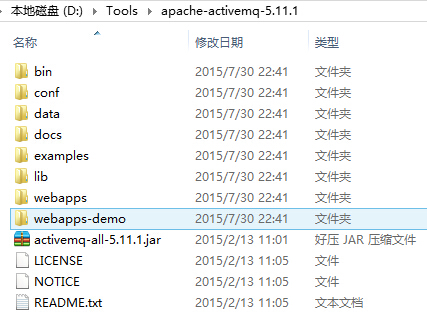

从它的目录来说，还是很简单的：
- bin存放的是脚本文件
- conf存放的是基本配置文件
- data存放的是日志文件
- docs存放的是说明文档
- examples存放的是简单的实例
- lib存放的是activemq所需jar包
- webapps用于存放项目的目录

2. 启动ActiveMQ

我们了解activemq的基本目录，下面我们运行一下activemq服务，双击bin目录下的activemq.bat脚本文件或运行自己电脑版本下的activemq.bat，就可以看下图的效果。

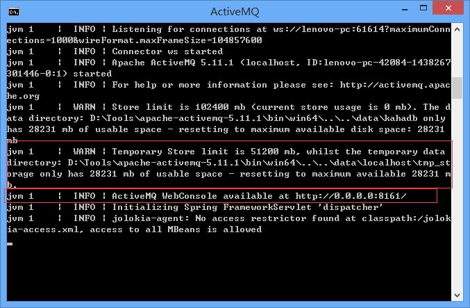

从上图我们可以看到activemq的存放地址，以及浏览器要访问的地址。

3. 测试

ActiveMQ默认使用的TCP连接端口是61616, 通过查看该端口的信息可以测试ActiveMQ是否成功启动 `netstat -an|find "61616"`。

```shell
C:\Documents and Settings\Administrator>netstat -an|find "61616" 
TCP     0.0.0.0:61616     0.0.0.0:0       LISTENING
```

4. 监控
ActiveMQ默认启动时，启动了内置的jetty服务器，提供一个用于监控ActiveMQ的admin应用。

admin：http://127.0.0.1:8161/admin/

用户名和密码都是admin

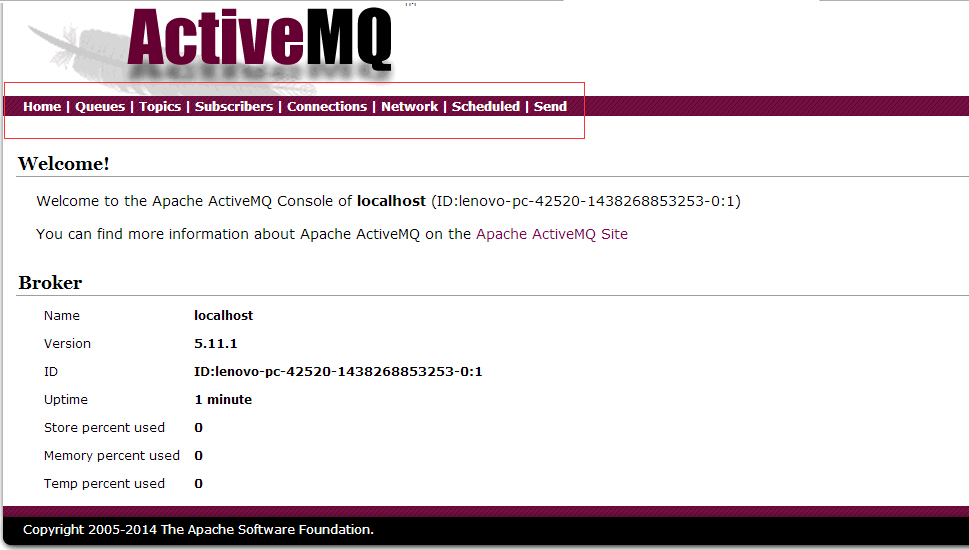

5. 至此，服务端启动完毕

停止服务器，只需要按着Ctrl+Shift+C，之后输入y即可。

### ActiveMQ特性列表

- 多种语言和协议编写客户端。语言: Java, C, C++, C#, Ruby, Perl, Python, PHP。应用协议: OpenWire,Stomp REST,WS Notification,XMPP,AMQP
- 完全支持JMS1.1和J2EE 1.4规范 (持久化,XA消息,事务)
- 对Spring的支持,ActiveMQ可以很容易内嵌到使用Spring的系统里面去,而且也支持Spring2.0的特性
- 通过了常见J2EE服务器(如 Geronimo,JBoss 4, GlassFish,WebLogic)的测试,其中通过JCA 1.5 resource adaptors的配置,可以让ActiveMQ可以自动的部署到任何兼容J2EE 1.4 商业服务器上
- 支持多种传送协议:in-VM,TCP,SSL,NIO,UDP,JGroups,JXTA
- 支持通过JDBC和journal提供高速的消息持久化
- 从设计上保证了高性能的集群,客户端-服务器,点对点
- 支持Ajax
- 支持与Axis的整合
- 可以很容易得调用内嵌JMS provider,进行测试

### 什么情况下使用ActiveMQ?

- 多个项目之间集成
(1) 跨平台
(2) 多语言
(3) 多项目
- 降低系统间模块的耦合度，解耦
(1) 软件扩展性
- 系统前后端隔离
(1) 前后端隔离，屏蔽高安全区

# ActiveMQ简单的HelloWorld实例

转载：https://xiaoliang.blog.csdn.net/article/details/48608237

使用ActiveMQ为大家实现一种点对点的消息模型。如果你对点对点模型的认识较浅，可以看一下第一篇博文的介绍。

JMS其实并没有想象的那么高大上，看完这篇博文之后，你就知道什么叫简单，下面直接进入主题。

## 开发环境

我们使用的是ActiveMQ 5.11.1 Release的Windows版，官网最新版是ActiveMQ 5.12.0 Release，大家可以自行下载，[下载地址](http://activemq.apache.org/download-archives.html)。

需要注意的是，开发时候，要将apache-activemq-5.11.1-bin.zip解压缩后里面的activemq-all-5.11.1.jar包加入到classpath下面，这个包包含了所有jms接口api的实现。

1. 建立项目
我们只需要建立一个java项目就可以了，导入jar包，项目截图：

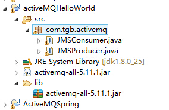

点对点的消息模型，只需要一个消息生成者和消息消费者，下面我们编写代码。

2. 编写生产者

```java

package com.tgb.activemq;

import javax.jms.Connection;
import javax.jms.ConnectionFactory;
import javax.jms.Destination;
import javax.jms.JMSException;
import javax.jms.MessageProducer;
import javax.jms.Session;
import javax.jms.TextMessage;

import org.apache.activemq.ActiveMQConnection;
import org.apache.activemq.ActiveMQConnectionFactory;
/**
 * 消息的生产者（发送者） 
 * @author liang
 *
 */
public class JMSProducer {

    //默认连接用户名
    private static final String USERNAME = ActiveMQConnection.DEFAULT_USER;
    //默认连接密码
    private static final String PASSWORD = ActiveMQConnection.DEFAULT_PASSWORD;
    //默认连接地址
    private static final String BROKEURL = ActiveMQConnection.DEFAULT_BROKER_URL;
    //发送的消息数量
    private static final int SENDNUM = 10;

    public static void main(String[] args) {
        //连接工厂
        ConnectionFactory connectionFactory;
        //连接
        Connection connection = null;
        //会话 接受或者发送消息的线程
        Session session;
        //消息的目的地
        Destination destination;
        //消息生产者
        MessageProducer messageProducer;
        //实例化连接工厂
        connectionFactory = new ActiveMQConnectionFactory(JMSProducer.USERNAME, JMSProducer.PASSWORD, JMSProducer.BROKEURL);

        try {
            //通过连接工厂获取连接
            connection = connectionFactory.createConnection();
            //启动连接
            connection.start();
            //创建session
            session = connection.createSession(true, Session.AUTO_ACKNOWLEDGE);
            //创建一个名称为HelloWorld的消息队列
            destination = session.createQueue("HelloWorld");
            //创建消息生产者
            messageProducer = session.createProducer(destination);
            //发送消息
            sendMessage(session, messageProducer);

            session.commit();

        } catch (Exception e) {
            e.printStackTrace();
        }finally{
            if(connection != null){
                try {
                    connection.close();
                } catch (JMSException e) {
                    e.printStackTrace();
                }
            }
        }
    }
    
    /**
     * 发送消息
     * @param session
     * @param messageProducer  消息生产者
     * @throws Exception
     */
    public static void sendMessage(Session session,MessageProducer messageProducer) throws Exception{
        for (int i = 0; i < JMSProducer.SENDNUM; i++) {
            //创建一条文本消息 
            TextMessage message = session.createTextMessage("ActiveMQ 发送消息" +i);
            System.out.println("发送消息：Activemq 发送消息" + i);
            //通过消息生产者发出消息 
            messageProducer.send(message);
        }

    }
}
```

3. 编写消费者

```java

package com.tgb.activemq;

import javax.jms.Connection;
import javax.jms.ConnectionFactory;
import javax.jms.Destination;
import javax.jms.JMSException;
import javax.jms.MessageConsumer;
import javax.jms.Session;
import javax.jms.TextMessage;

import org.apache.activemq.ActiveMQConnection;
import org.apache.activemq.ActiveMQConnectionFactory;
/**
 * 消息的消费者（接受者）
 * @author liang
 *
 */
public class JMSConsumer {

    private static final String USERNAME = ActiveMQConnection.DEFAULT_USER;//默认连接用户名
    private static final String PASSWORD = ActiveMQConnection.DEFAULT_PASSWORD;//默认连接密码
    private static final String BROKEURL = ActiveMQConnection.DEFAULT_BROKER_URL;//默认连接地址

    public static void main(String[] args) {
        ConnectionFactory connectionFactory;//连接工厂
        Connection connection = null;//连接

        Session session;//会话 接受或者发送消息的线程
        Destination destination;//消息的目的地

        MessageConsumer messageConsumer;//消息的消费者

        //实例化连接工厂
        connectionFactory = new ActiveMQConnectionFactory(JMSConsumer.USERNAME, JMSConsumer.PASSWORD, JMSConsumer.BROKEURL);

        try {
            //通过连接工厂获取连接
            connection = connectionFactory.createConnection();
            //启动连接
            connection.start();
            //创建session
            session = connection.createSession(false, Session.AUTO_ACKNOWLEDGE);
            //创建一个连接HelloWorld的消息队列
            destination = session.createQueue("HelloWorld");
            //创建消息消费者
            messageConsumer = session.createConsumer(destination);

            while (true) {
                TextMessage textMessage = (TextMessage) messageConsumer.receive(100000);
                if(textMessage != null){
                    System.out.println("收到的消息:" + textMessage.getText());
                }else {
                    break;
                }
            }

        } catch (JMSException e) {
            e.printStackTrace();
        }

    }
}
```

## 运行

1. 首先，启动ActiveMQ，如何启动ActiveMQ如何启动，请看第二篇博文。在浏览器中输入：http://localhost:8161/admin/，然后开始执行。

2. 运行发送者，eclipse控制台输出，如下图：

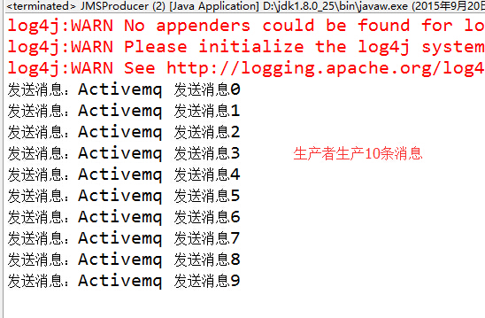

此时，我们先看一下ActiveMQ服务器，Queues内容如下：

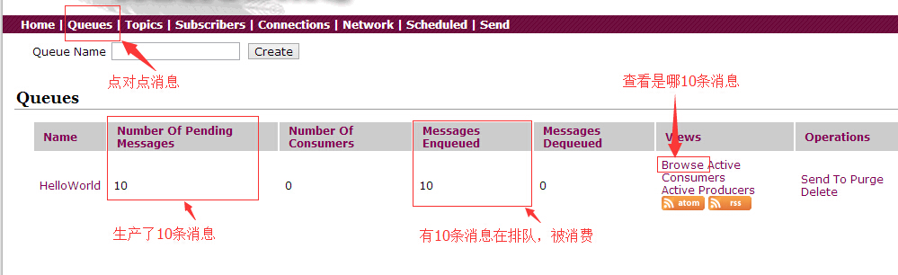

我们可以看到创建了一个名称为HelloWorld的消息队列，队列中有10条消息未被消费，我们也可以通过Browse查看是哪些消息，如下图：

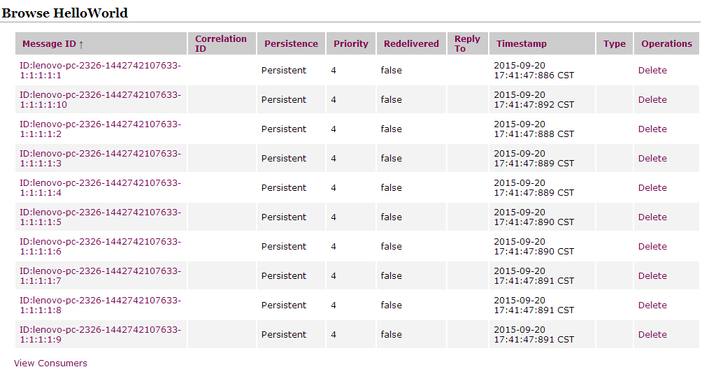

如果这些队列中的消息，被删除，消费者则无法消费。

3. 我们继续运行一下消费者，eclipse控制台打印消息，如下：

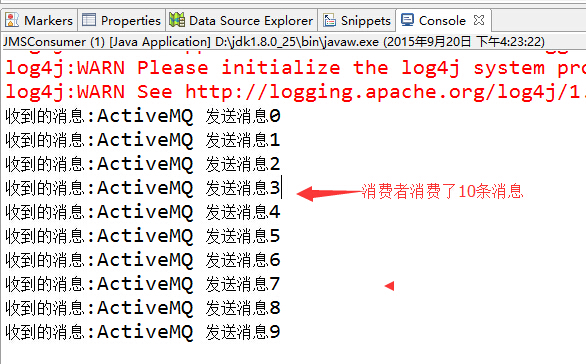

此时，我们先看一下ActiveMQ服务器，Queues内容如下：

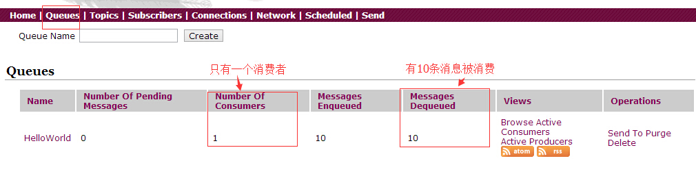

我们可以看到HelloWorld的消息队列发生变化，多一个消息者，队列中的10条消息被消费了，点击Browse查看，已经为空了。

点击Active Consumers，我们可以看到这个消费者的详细信息：

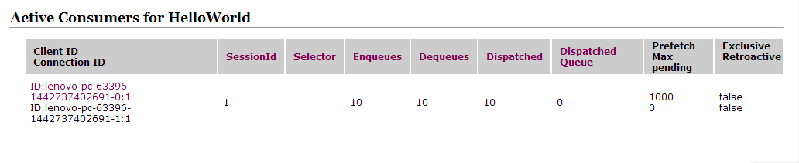

# Spring和ActiveMQ整合的完整实例

转载：https://xiaoliang.blog.csdn.net/article/details/48758203

这篇博文,我们基于Spring+JMS+ActiveMQ+Tomcat，做一个Spring4.1.0和ActiveMQ5.11.1整合实例，实现了Point-To-Point的异步队列消息和PUB/SUB（发布/订阅）模型，简单实例，不包含任何业务。

## 环境准备

### 工具

- JDK1.6或1.7
- Spring4.1.0
- ActiveMQ5.11.1
- Tomcat7.x

### 目录结构

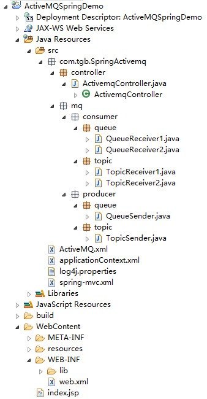

### 所需jar包

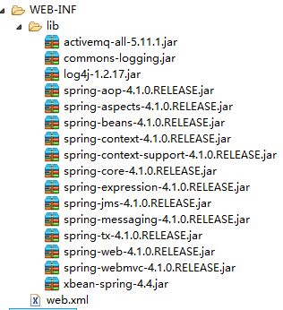

## 项目的配置

### 配置ConnectionFactory

ConnectionFactory是Spring用于创建到JMS服务器链接的，Spring提供了多种connectionFactory，我们介绍两个SingleConnectionFactory和CachingConnectionFactory。

SingleConnectionFactory：对于建立JMS服务器链接的请求会一直返回同一个链接，并且会忽略Connection的close方法调用。

CachingConnectionFactory：继承了SingleConnectionFactory，所以它拥有SingleConnectionFactory的所有功能，同时它还新增了缓存功能，它可以缓存Session、MessageProducer和MessageConsumer。我们使用CachingConnectionFactory来作为示例。

```xml
<bean id="connectionFactory" class="org.springframework.jms.connection.CachingConnectionFactory">
</bean>
```

Spring提供的ConnectionFactory只是Spring用于管理ConnectionFactory的，真正产生到JMS服务器链接的ConnectionFactory还得是由JMS服务厂商提供，并且需要把它注入到Spring提供的ConnectionFactory中。

我们这里使用的是ActiveMQ实现的JMS，所以在我们这里真正的可以产生Connection的就应该是由ActiveMQ提供的ConnectionFactory。所以定义一个ConnectionFactory的完整代码应该如下所示：

```xml
<!-- ActiveMQ 连接工厂 -->
<!-- 真正可以产生Connection的ConnectionFactory，由对应的 JMS服务厂商提供-->
<!-- 如果连接网络：tcp://ip:61616；未连接网络：tcp://localhost:61616 以及用户名，密码-->
<amq:connectionFactory id="amqConnectionFactory"
    brokerURL="tcp://192.168.3.3:61616" userName="admin" password="admin"  />

<!-- Spring Caching连接工厂 -->
<!-- Spring用于管理真正的ConnectionFactory的ConnectionFactory -->  
<bean id="connectionFactory" class="org.springframework.jms.connection.CachingConnectionFactory">
    <!-- 目标ConnectionFactory对应真实的可以产生JMS Connection的ConnectionFactory -->  
    <property name="targetConnectionFactory" ref="amqConnectionFactory"></property>
    <!-- 同上，同理 -->
    <!-- <constructor-arg ref="amqConnectionFactory" /> -->
    <!-- Session缓存数量 -->
    <property name="sessionCacheSize" value="100" />
</bean>
```

### 配置生产者

配置好ConnectionFactory之后我们就需要配置生产者。生产者负责产生消息并发送到JMS服务器。但是我们要怎么进行消息发送呢？通常是利用Spring为我们提供的JmsTemplate类来实现的，所以配置生产者其实最核心的就是配置消息发送的JmsTemplate。对于消息发送者而言，它在发送消息的时候要知道自己该往哪里发，为此，我们在定义JmsTemplate的时候需要注入一个Spring提供的ConnectionFactory对象。

在利用JmsTemplate进行消息发送的时候，我们需要知道发送哪种消息类型：一个是点对点的ActiveMQQueue，另一个就是支持订阅/发布模式的ActiveMQTopic。如下所示：

```xml
<!-- Spring JmsTemplate 的消息生产者 start-->

<!-- 定义JmsTemplate的Queue类型 -->
<bean id="jmsQueueTemplate" class="org.springframework.jms.core.JmsTemplate">
    <!-- 这个connectionFactory对应的是我们定义的Spring提供的那个ConnectionFactory对象 -->  
    <constructor-arg ref="connectionFactory" />
    <!-- 非pub/sub模型（发布/订阅），即队列模式 -->
    <property name="pubSubDomain" value="false" />
</bean>

<!-- 定义JmsTemplate的Topic类型 -->
<bean id="jmsTopicTemplate" class="org.springframework.jms.core.JmsTemplate">
        <!-- 这个connectionFactory对应的是我们定义的Spring提供的那个ConnectionFactory对象 -->  
    <constructor-arg ref="connectionFactory" />
    <!-- pub/sub模型（发布/订阅） -->
    <property name="pubSubDomain" value="true" />
</bean>

<!--Spring JmsTemplate 的消息生产者 end-->
```

### 配置消费者

生产者往指定目的地Destination发送消息后，接下来就是消费者对指定目的地的消息进行消费了。那么消费者是如何知道有生产者发送消息到指定目的地Destination了呢？每个消费者对应每个目的地都需要有对应的MessageListenerContainer。对于消息监听容器而言，除了要知道监听哪个目的地之外，还需要知道到哪里去监听，也就是说它还需要知道去监听哪个JMS服务器，通过配置MessageListenerContainer的时候往里面注入一个ConnectionFactory来实现的。所以我们在配置一个MessageListenerContainer的时候有三个属性必须指定：一个是表示从哪里监听的ConnectionFactory；一个是表示监听什么的Destination；一个是接收到消息以后进行消息处理的MessageListener。

```xml
<!-- 消息消费者 start-->

<!-- 定义Queue监听器 -->
<jms:listener-container destination-type="queue" container-type="default" connection-factory="connectionFactory" acknowledge="auto">
    <jms:listener destination="test.queue" ref="queueReceiver1"/>
    <jms:listener destination="test.queue" ref="queueReceiver2"/>
</jms:listener-container>

<!-- 定义Topic监听器 -->
<jms:listener-container destination-type="topic" container-type="default" connection-factory="connectionFactory" acknowledge="auto">
    <jms:listener destination="test.topic" ref="topicReceiver1"/>
    <jms:listener destination="test.topic" ref="topicReceiver2"/>
</jms:listener-container>

<!-- 消息消费者 end -->
```

### ActiveMQ.xml

此时，Spring和JMS，ActiveMQ整合的ActiveMQ.xml已经完成，下面展示所有的xml

```xml
<?xml version="1.0" encoding="UTF-8"?>
<beans xmlns="http://www.springframework.org/schema/beans"
    xmlns:context="http://www.springframework.org/schema/context"
    xmlns:xsi="http://www.w3.org/2001/XMLSchema-instance" xmlns:amq="http://activemq.apache.org/schema/core"
    xmlns:jms="http://www.springframework.org/schema/jms"
    xsi:schemaLocation="http://www.springframework.org/schema/beans   
        http://www.springframework.org/schema/beans/spring-beans-4.0.xsd   
        http://www.springframework.org/schema/context   
        http://www.springframework.org/schema/context/spring-context-4.0.xsd
        http://www.springframework.org/schema/jms
        http://www.springframework.org/schema/jms/spring-jms-4.0.xsd
        http://activemq.apache.org/schema/core
        http://activemq.apache.org/schema/core/activemq-core-5.8.0.xsd">

    <!-- ActiveMQ 连接工厂 -->
    <!-- 真正可以产生Connection的ConnectionFactory，由对应的 JMS服务厂商提供-->
    <!-- 如果连接网络：tcp://ip:61616；未连接网络：tcp://localhost:61616 以及用户名，密码-->
    <amq:connectionFactory id="amqConnectionFactory"
        brokerURL="tcp://192.168.3.3:61616" userName="admin" password="admin"  />

    <!-- Spring Caching连接工厂 -->
    <!-- Spring用于管理真正的ConnectionFactory的ConnectionFactory -->  
    <bean id="connectionFactory" class="org.springframework.jms.connection.CachingConnectionFactory">
        <!-- 目标ConnectionFactory对应真实的可以产生JMS Connection的ConnectionFactory -->  
        <property name="targetConnectionFactory" ref="amqConnectionFactory"></property>
        <!-- 同上，同理 -->
        <!-- <constructor-arg ref="amqConnectionFactory" /> -->
        <!-- Session缓存数量 -->
        <property name="sessionCacheSize" value="100" />
    </bean>

    <!-- Spring JmsTemplate 的消息生产者 start-->

    <!-- 定义JmsTemplate的Queue类型 -->
    <bean id="jmsQueueTemplate" class="org.springframework.jms.core.JmsTemplate">
        <!-- 这个connectionFactory对应的是我们定义的Spring提供的那个ConnectionFactory对象 -->  
        <constructor-arg ref="connectionFactory" />
        <!-- 非pub/sub模型（发布/订阅），即队列模式 -->
        <property name="pubSubDomain" value="false" />
    </bean>

    <!-- 定义JmsTemplate的Topic类型 -->
    <bean id="jmsTopicTemplate" class="org.springframework.jms.core.JmsTemplate">
         <!-- 这个connectionFactory对应的是我们定义的Spring提供的那个ConnectionFactory对象 -->  
        <constructor-arg ref="connectionFactory" />
        <!-- pub/sub模型（发布/订阅） -->
        <property name="pubSubDomain" value="true" />
    </bean>

    <!--Spring JmsTemplate 的消息生产者 end-->


    <!-- 消息消费者 start-->

    <!-- 定义Queue监听器 -->
    <jms:listener-container destination-type="queue" container-type="default" connection-factory="connectionFactory" acknowledge="auto">
        <jms:listener destination="test.queue" ref="queueReceiver1"/>
        <jms:listener destination="test.queue" ref="queueReceiver2"/>
    </jms:listener-container>

    <!-- 定义Topic监听器 -->
    <jms:listener-container destination-type="topic" container-type="default" connection-factory="connectionFactory" acknowledge="auto">
        <jms:listener destination="test.topic" ref="topicReceiver1"/>
        <jms:listener destination="test.topic" ref="topicReceiver2"/>
    </jms:listener-container>

    <!-- 消息消费者 end -->
</beans>
```

### web.xml

```xml
<?xml version="1.0" encoding="UTF-8"?>
<web-app xmlns:xsi="http://www.w3.org/2001/XMLSchema-instance"
    xmlns="http://java.sun.com/xml/ns/javaee" xmlns:web="http://java.sun.com/xml/ns/javaee/web-app_3_0.xsd"
    xsi:schemaLocation="http://java.sun.com/xml/ns/javaee http://java.sun.com/xml/ns/javaee/web-app_3_0.xsd"
    version="3.0">
    <display-name>ActiveMQSpringDemo</display-name>

    <!-- Log4J Start -->
    <context-param>
        <param-name>log4jConfigLocation</param-name>
        <param-value>classpath:log4j.properties</param-value>
    </context-param>
    <context-param>
        <param-name>log4jRefreshInterval</param-name>
        <param-value>6000</param-value>
    </context-param>
    <!-- Spring Log4J config -->
    <listener>
        <listener-class>org.springframework.web.util.Log4jConfigListener</listener-class>
    </listener>
    <!-- Log4J End -->

    <!-- Spring 编码过滤器 start -->
    <filter>
        <filter-name>characterEncoding</filter-name>
        <filter-class>org.springframework.web.filter.CharacterEncodingFilter</filter-class>
        <init-param>
            <param-name>encoding</param-name>
            <param-value>UTF-8</param-value>
        </init-param>
        <init-param>
            <param-name>forceEncoding</param-name>
            <param-value>true</param-value>
        </init-param>
    </filter>
    <filter-mapping>
        <filter-name>characterEncoding</filter-name>
        <url-pattern>/*</url-pattern>
    </filter-mapping>
    <!-- Spring 编码过滤器 End -->

    <!-- Spring Application Context Listener Start -->
    <context-param>
        <param-name>contextConfigLocation</param-name>
        <param-value>classpath*:applicationContext.xml,classpath*:ActiveMQ.xml</param-value>
    </context-param>
    <listener>
        <listener-class>org.springframework.web.context.ContextLoaderListener</listener-class>
    </listener>
    <!-- Spring Application Context Listener End -->


    <!-- Spring MVC Config Start -->
    <servlet>
        <servlet-name>SpringMVC</servlet-name>
        <servlet-class>org.springframework.web.servlet.DispatcherServlet</servlet-class>

        <init-param>
            <param-name>contextConfigLocation</param-name>
            <param-value>classpath:spring-mvc.xml</param-value>
        </init-param>
        <load-on-startup>1</load-on-startup>
    </servlet>
    <servlet-mapping>
        <servlet-name>SpringMVC</servlet-name>
        <!-- Filter all resources -->
        <url-pattern>/</url-pattern>
    </servlet-mapping>
    <!-- Spring MVC Config End -->

</web-app>
```

## 运行效果

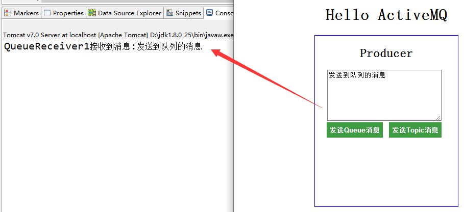

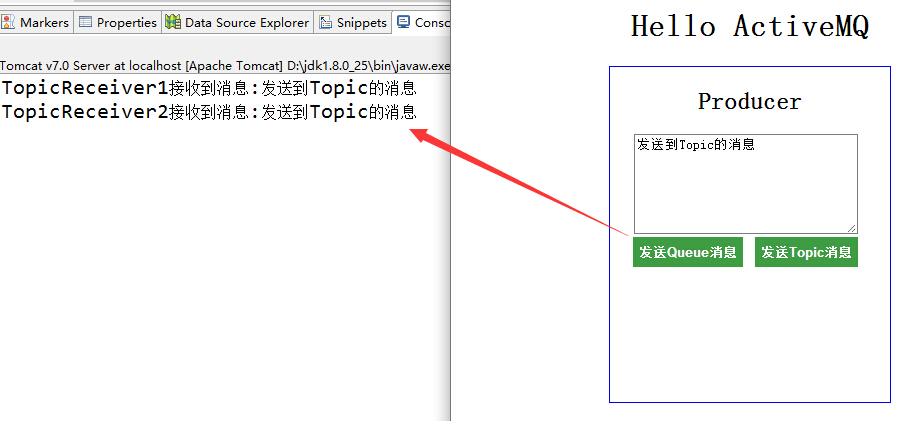

从上图可以看出队列模型和PUB/SUB模型的区别，Queue只能由一个消费者接收，其他Queue中的成员无法接受到被已消费的信息，而Topic则可以，只要是订阅了Topic的消费者，全部可以获取到生产者发布的信息。

## 总结

源码下载地址：https://download.csdn.net/detail/jiuqiyuliang/9141139