# Collection和Collections区别

- Collection 是一个集合接口。 它提供了对集合对象进行基本操作的通用接口方法。Collection接口在Java 类库中有很多具体的实现。是list，set等的父接口
- Collections 是一个包装类。 它包含有各种有关集合操作的静态多态方法。此类不能实例化，就像一个工具类，服务于Java的Collection框架

# 常用集合类的使用

## Set和List区别？

List,Set都是继承自Collection接口。都是用来存储一组相同类型的元素的。

- List特点：元素有放入顺序，元素可重复 
  - 有顺序，即先放入的元素排在前面
- Set特点：元素无放入顺序，元素不可重复
  - 无顺序，即先放入的元素不一定排在前面。 不可重复，即相同元素在set中只会保留一份。所以，有些场景下，set可以用来去重。 不过需要注意的是，set在元素插入时是要有一定的方法来判断元素是否重复的。这个方法很重要，决定了set中可以保存哪些元素。

## ArrayList和LinkedList和Vector的区别

List主要有ArrayList、LinkedList与Vector几种实现

这三者都实现了List 接口，使用方式也很相似,主要区别在于因为实现方式的不同,所以对不同的操作具有不同的效率

- ArrayList 是一个可改变大小的数组.当更多的元素加入到ArrayList中时,其大小将会动态地增长.内部的元素可以直接通过get与set方法进行访问,因为ArrayList本质上就是一个数组
- LinkedList 是一个双链表,在添加和删除元素时具有比ArrayList更好的性能.但在get与set方面弱于ArrayList

当然,这些对比都是指数据量很大或者操作很频繁的情况下的对比,如果数据和运算量很小,那么对比将失去意义

Vector 和ArrayList类似,但属于强同步类。如果你的程序本身是线程安全的(thread-safe,没有在多个线程之间共享同一个集合/对象),那么使用ArrayList是更好的选择

**Vector和ArrayList在更多元素添加进来时会请求更大的空间。Vector每次请求其大小的双倍空间，而ArrayList每次对size增长50%**

而 LinkedList 还实现了 Queue 接口,该接口比List提供了更多的方法,包括 offer(),peek(),poll()等

**注意: 默认情况下ArrayList的初始容量非常小,所以如果可以预估数据量的话,分配一个较大的初始值属于最佳实践,这样可以减少调整大小的开销**

## ArrayList使用了transient关键字进行存储优化，而Vector没有，为什么？

### ArrayList

源码

```java
/** 
* Save the state of the <tt>ArrayList</tt> instance to a stream (that 
* is, serialize it). 
* 
* @serialData The length of the array backing the <tt>ArrayList</tt> 
*             instance is emitted (int), followed by all of its elements 
*             (each an <tt>Object</tt>) in the proper order. 
*/
private void writeObject(java.io.ObjectOutputStream s)  
    throws java.io.IOException{  
    // Write out element count, and any hidden stuff  
    int expectedModCount = modCount;  
    s.defaultWriteObject();  

    // Write out array length  
    s.writeInt(elementData.length);  

    // Write out all elements in the proper order.  
    for (int i=0; i<size; i++)  
        s.writeObject(elementData[i]);  

    if (modCount != expectedModCount) {  
        throw new ConcurrentModificationException();  
    }  
}  
```

ArrayList实现了writeObject方法，可以看到只保存了非null的数组位置上的数据。即list的size个数的elementData。需要额外注意的一点是，ArrayList的实现，提供了fast-fail机制，可以提供弱一致性。

### Vector

源码

```java
/**
* Save the state of the {@code Vector} instance to a stream (that
* is, serialize it).
* This method performs synchronization to ensure the consistency
* of the serialized data.
*/
private void writeObject(java.io.ObjectOutputStream s)
        throws java.io.IOException {
    final java.io.ObjectOutputStream.PutField fields = s.putFields();
    final Object[] data;
    synchronized (this) {
        fields.put("capacityIncrement", capacityIncrement);
        fields.put("elementCount", elementCount);
        data = elementData.clone();
    }
    fields.put("elementData", data);
    s.writeFields();
}
```

Vector也实现了writeObject方法，但方法并没有像ArrayList一样进行优化存储，实现语句是

```java
data = elementData.clone();
```

clone()的时候会把null值也拷贝。所以保存相同内容的Vector与ArrayList，Vector的占用的字节比ArrayList要多

### 分析

- ArrayList是非同步实现的一个单线程下较为高效的数据结构（相比Vector来说）。 ArrayList只通过一个修改记录字段提供弱一致性，主要用在迭代器里。没有同步方法。 即上面提到的fast-fail机制。ArrayList的存储结构定义为transient，重写writeObject来实现自定义的序列化，优化了存储。
- Vector是多线程环境下更为可靠的数据结构，所有方法都实现了同步。

### 区别

- 同步处理：Vector同步，ArrayList非同步
- Vector缺省情况下增长原来一倍的数组长度，ArrayList是0.5倍。
- ArrayList: int newCapacity = oldCapacity + (oldCapacity >> 1); 
  - ArrayList自动扩大容量为原来的1.5倍（实现的时候，方法会传入一个期望的最小容量，若扩容后容量仍然小于最小容量，那么容量就为传入的最小容量。扩容的时候使用的Arrays.copyOf方法最终调用native方法进行新数组创建和数据拷贝）
- Vector: int newCapacity = oldCapacity + ((capacityIncrement > 0) ? capacityIncrement : oldCapacity);
  - Vector指定了initialCapacity，capacityIncrement来初始化的时候，每次增长capacityIncrement

## SynchronizedList和Vector的区别

Vector是java.util包中的一个类。 SynchronizedList是java.util.Collections中的一个静态内部类

在多线程的场景中可以直接使用Vector类，也可以使用Collections.synchronizedList(List list)方法来返回一个线程安全的List

Vector和Arraylist都是List的子类，他们底层的实现都是一样的。所以这里比较如下两个list1和list2的区别

```java
List<String> list = new ArrayList<String>();
List list2 =  Collections.synchronizedList(list);//将非线程安全转成一个线程安全的List
Vector<String> list1 = new Vector<String>();
```

### 比较几个重要的方法

#### add方法

Vector的实现：

```java
public void add(int index, E element) {
    insertElementAt(element, index);
}

public synchronized void insertElementAt(E obj, int index) {
    modCount++;
    if (index > elementCount) {
        throw new ArrayIndexOutOfBoundsException(index + " > " + elementCount);
    }
    ensureCapacityHelper(elementCount + 1);
    System.arraycopy(elementData, index, elementData, index + 1, elementCount - index);
    elementData[index] = obj;
    elementCount++;
}

private void ensureCapacityHelper(int minCapacity) {
    // overflow-conscious code
    if (minCapacity - elementData.length > 0)
        grow(minCapacity);
}
```

synchronizedList的实现：

```java
public void add(int index, E element) {
   synchronized (mutex) {
       list.add(index, element);
   }
}
```

使用同步代码块的方式调用ArrayList的add()方法。ArrayList的add方法内容如下：

```java
public void add(int index, E element) {
    rangeCheckForAdd(index);
    ensureCapacityInternal(size + 1);  // Increments modCount!!
    System.arraycopy(elementData, index, elementData, index + 1,
                     size - index);
    elementData[index] = element;
    size++;
}
private void rangeCheckForAdd(int index) {
    if (index > size || index < 0)
        throw new IndexOutOfBoundsException(outOfBoundsMsg(index));
}
private void ensureCapacityInternal(int minCapacity) {
    if (elementData == DEFAULTCAPACITY_EMPTY_ELEMENTDATA) {
        minCapacity = Math.max(DEFAULT_CAPACITY, minCapacity);
    }
    ensureExplicitCapacity(minCapacity);
}
```

#### remove方法

synchronizedList的实现：

```java
public E remove(int index) {
    synchronized (mutex) {return list.remove(index);}
}
```

ArrayList类的remove方法内容如下

```java
public E remove(int index) {
    rangeCheck(index);

    modCount++;
    E oldValue = elementData(index);

    int numMoved = size - index - 1;
    if (numMoved > 0)
        System.arraycopy(elementData, index+1, elementData, index,
                         numMoved);
    elementData[--size] = null; // clear to let GC do its work

    return oldValue;
}
```

Vector的实现：

```java
public synchronized E remove(int index) {
    modCount++;
    if (index >= elementCount)
        throw new ArrayIndexOutOfBoundsException(index);
    E oldValue = elementData(index);

    int numMoved = elementCount - index - 1;
    if (numMoved > 0)
        System.arraycopy(elementData, index+1, elementData, index,
                            numMoved);
    elementData[--elementCount] = null; // Let gc do its work

    return oldValue;
}
```

从remove方法中我们发现除了一个使用同步方法，一个使用同步代码块之外几乎无任何区别

通过比较其他方法，我们发现，SynchronizedList里面实现的方法几乎都是使用**同步代码块包上List的方法**。如果该List是ArrayList,那么，**SynchronizedList和Vector的一个比较明显区别就是一个使用了同步代码块，一个使用了同步方法**。

### 区别分析

数据增长区别：

从内部实现机制来讲ArrayList和Vector都是使用数组(Array)来控制集合中的对象。当你向这两种类型中增加元素的时候，如果元素的数目超出了内部数组目前的长度它们都需要扩展内部数组的长度，Vector缺省情况下自动增长原来一倍的数组长度，ArrayList是原来的50%，所以最后你获得的这个集合所占的空间总是比你实际需要的要大。所以如果你要在集合中保存大量的数据那么使用Vector有一些优势，因为你可以通过设置集合的初始化大小来避免不必要的资源开销。

同步代码块和同步方法的区别：

1. 同步代码块在锁定的范围上可能比同步方法要小，一般来说锁的范围大小和性能是成反比的。
2. 同步块可以更加精确的控制锁的作用域（锁的作用域就是从锁被获取到其被释放的时间），同步方法的锁的作用域就是整个方法。
3. 同步代码块可以选择对哪个对象加锁，但是静态方法只能给this对象加锁。

因为SynchronizedList只是使用同步代码块包裹了ArrayList的方法，而ArrayList和Vector中同名方法的方法体内容并无太大差异，所以在锁定范围和锁的作用域上两者并无却别。 在锁定的对象区别上，**SynchronizedList的同步代码块锁定的是mutex对象，Vector锁定的是this对象**。那么mutex对象又是什么呢？ **其实SynchronizedList有一个构造函数可以传入一个Object,如果在调用的时候显式的传入一个对象，那么锁定的就是用户传入的对象。如果没有指定，那么锁定的也是this对象。**

SynchronizedList和Vector的区别目前为止有两点： 
1. 如果使用add方法，那么他们的扩容机制不一样。 
2. SynchronizedList可以指定锁定的对象。

凡事都有但是。 SynchronizedList中实现的类并没有都使用synchronized同步代码块。其中有listIterator和listIterator(int index)并没有做同步处理。但是Vector却对该方法加了方法锁。 所以说，在使用SynchronizedList进行遍历的时候要手动加锁。

之前的比较都是基于我们将ArrayList转成SynchronizedList。那么如果我们想把LinkedList变成线程安全的，或者说我想要方便在中间插入和删除的同步的链表，那么我可以将已有的**LinkedList直接转成 SynchronizedList，而不用改变他的底层数据结构**。而这一点是**Vector无法做到的，因为他的底层结构就是使用数组实现的，这个是无法更改的**。

SynchronizedList和Vector最主要的区别：
1. SynchronizedList有很好的扩展和兼容功能。他可以将所有的List的子类转成线程安全类。 
2. 使用SynchronizedList的时候，进行遍历时要手动进行同步处理。
3. SynchronizedList可以指定锁定的对象。

## Set如何保证元素不重复?

在Java的Set体分为两系中，根据实现方式不同主要大类。HashSet和TreeSet

TreeSet 是二叉树实现的,Treeset中的数据是自动排好序的，**不允许放入null值**

HashSet 是哈希表实现的,HashSet中的数据是无序的，**可以放入null**，但只能放入一个null，两者中的值都不能重复，就如数据库中唯一约束

在HashSet中，基本的操作都是有HashMap底层实现的，因为HashSet底层是用HashMap存储数据的。当向HashSet中添加元素的时候，首先计算元素的hashcode值，然后通过**扰动计算**和**按位与**的方式计算出这个元素的存储位置，**如果这个位置位空，就将元素添加进去**；**如果不为空，则用equals方法比较元素是否相等，相等就不添加，否则找一个空位添加**。

TreeSet的底层是TreeMap的keySet()，而TreeMap是基于红黑树实现的，红黑树是一种平衡二叉查找树，它能保证任何一个节点的左右子树的高度差不会超过较矮的那棵的一倍。

TreeMap是按key排序的，元素在插入TreeSet时**compareTo()方法要被调用**，所以TreeSet中的元素要实现Comparable接口。TreeSet作为一种Set，它不允许出现重复元素。TreeSet是用compareTo()来判断重复元素的。

## HashMap、HashTable、ConcurrentHashMap区别

### HashMap和HashTable有何不同？

- 线程安全：HashTable 中的方法是同步的，而HashMap中的方法在默认情况下是非同步的。在多线程并发的环境下，可以直接使用HashTable，但是要使用HashMap的话就要自己增加同步处理了
- 继承关系：HashTable是基于陈旧的Dictionary类继承来的。 HashMap继承的抽象类AbstractMap实现了Map接口
- 允不允许null值：HashTable中，key和value都不允许出现null值，否则会抛出NullPointerException异常。 HashMap中，null可以作为键，这样的键只有一个；可以有一个或多个键所对应的值为null
- 默认初始容量和扩容机制：HashTable中的hash数组初始大小是11，增加的方式是 old*2+1。HashMap中hash数组的默认大小是16，而且一定是2的指数
- 哈希值的使用不同：HashTable直接使用对象的hashCode。 HashMap重新计算hash值
- 遍历方式的内部实现上不同：Hashtable、HashMap都使用了 Iterator。而由于历史原因，Hashtable还使用了Enumeration的方式 。 HashMap 实现 Iterator，支持fast-fail，Hashtable的 Iterator 遍历支持fast-fail，用 Enumeration 不支持 fast-fail

### HashMap 和 ConcurrentHashMap 的区别？

ConcurrentHashMap和HashMap的实现方式不一样，虽然都是使用桶数组实现的，但是还是有区别，ConcurrentHashMap对桶数组进行了分段，而HashMap并没有

ConcurrentHashMap在每一个分段上都用锁进行了保护。HashMap没有锁机制。所以，**前者线程安全的，后者不是线程安全的**

PS：以上区别基于jdk1.8以前的版本

# Java 8中Map相关的红黑树的引用背景、原理等

## HashMap的容量、扩容

### 概述

先来看一下，HashMap中都定义了哪些成员变量

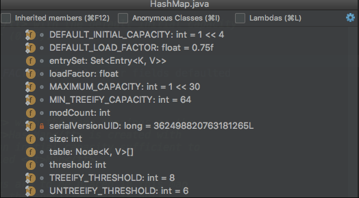

上面是一张HashMap中主要的成员变量的图，其中有一个是我们本文主要关注的： size、loadFactor、threshold、DEFAULT_LOAD_FACTOR和DEFAULT_INITIAL_CAPACITY。

HashMap类中有以下主要成员变量：
- transient int size：记录了Map中KV对的个数
- loadFactor：装载因子，用来衡量HashMap满的程度。loadFactor的默认值为0.75f（`static final float DEFAULT_LOAD_FACTOR = 0.75f;`）
- int threshold：临界值，当实际KV个数超过threshold时，HashMap会将容量扩容，threshold＝容量*装载因子
- capacity：容量，如果不指定，默认容量是16(`static final int DEFAULT_INITIAL_CAPACITY = 1 << 4;`)

### size 和 capacity

HashMap中的size和capacity之间的区别其实解释起来也挺简单的。我们知道，HashMap就像一个“桶”，那么capacity就是这个桶“当前”最多可以装多少元素，而size表示这个桶已经装了多少元素

来看下以下代码

```java
Map<String, String> map = new HashMap<String, String>();
map.put("hollis", "hollischuang");

Class<?> mapType = map.getClass();
Method capacity = mapType.getDeclaredMethod("capacity");
capacity.setAccessible(true);
System.out.println("capacity : " + capacity.invoke(map));

Field size = mapType.getDeclaredField("size");
size.setAccessible(true);
System.out.println("size : " + size.get(map));
```

我们定义了一个新的HashMap，并想其中put了一个元素，然后通过反射的方式打印capacity和size。输出结果为：capacity : 16、size : 1

默认情况下，一个HashMap的容量（capacity）是16，主要是可以使用按位与替代取模来提升hash的效率

HashMap是具有扩容机制的。在一个HashMap第一次初始化的时候，默认情况下他的容量是16，当达到扩容条件的时候，就需要进行扩容了，会从16扩容成32

HashMap的重载的构造函数中，有一个是支持传入initialCapacity的

```java
Map<String, String> map = new HashMap<String, String>(1);

Class<?> mapType = map.getClass();
Method capacity = mapType.getDeclaredMethod("capacity");
capacity.setAccessible(true);
System.out.println("capacity : " + capacity.invoke(map));

Map<String, String> map = new HashMap<String, String>(7);

Class<?> mapType = map.getClass();
Method capacity = mapType.getDeclaredMethod("capacity");
capacity.setAccessible(true);
System.out.println("capacity : " + capacity.invoke(map));


Map<String, String> map = new HashMap<String, String>(9);

Class<?> mapType = map.getClass();
Method capacity = mapType.getDeclaredMethod("capacity");
capacity.setAccessible(true);
System.out.println("capacity : " + capacity.invoke(map));
```

分别执行以上3段代码，分别输出：capacity : 2、capacity : 8、capacity : 16。

**也就是说，默认情况下HashMap的容量是16，但是，如果用户通过构造函数指定了一个数字作为容量，那么<font color="red">Hash会选择大于该数字的第一个2的幂作为容量</font>。(1->1、7->8、9->16)**。

这里有一个小建议：在初始化HashMap的时候，应该尽量指定其大小。尤其是当你已知map中存放的元素个数时。

### loadFactor 和 threshold

HashMap的扩容条件就是当HashMap中的元素个数（size）超过临界值（threshold）时就会自动扩容

在HashMap中，`threshold = loadFactor * capacity`。

loadFactor是装载因子，表示HashMap满的程度，默认值为0.75f，设置成0.75有一个好处，那就是0.75正好是3/4，而capacity又是2的幂。所以，两个数的乘积都是整数。

对于一个默认的HashMap来说，默认情况下，当其size大于12(16*0.75)时就会触发扩容

HashMap中还提供了一个支持传入initialCapacity,loadFactor两个参数的方法，来初始化容量和装载因子。不过，**一般不建议修改loadFactor的值**。

### 总结

<font color="red">HashMap中size表示当前共有多少个KV对，capacity表示当前HashMap的容量是多少，默认值是16，每次扩容都是成倍的。loadFactor是装载因子，当Map中元素个数超过loadFactor* capacity的值时，会触发扩容。loadFactor* capacity可以用threshold表示</font>

## HashMap中hash方法的原理

### 哈希

Hash，一般翻译做“散列”，也有直接音译为“哈希”的，**就是把任意长度的输入，通过散列算法，变换成固定长度的输出，该输出就是散列值**。这种转换是一种压缩映射，也就是，散列值的空间通常远小于输入的空间，不同的输入可能会散列成相同的输出，所以不可能从散列值来唯一的确定输入值。简单的说就是一种将任意长度的消息压缩到某一固定长度的消息摘要的函数

所有散列函数都有如下一个基本特性：**根据同一散列函数计算出的散列值如果不同，那么输入值肯定也不同**。但是，**根据同一散列函数计算出的散列值如果相同，输入值不一定相同**。

<font color="red">**两个不同的输入值，根据同一散列函数计算出的散列值相同的现象叫做碰撞**</font>

常见的Hash函数有以下几个：
- 直接定址法：直接以关键字k或者k加上某个常数（k+c）作为哈希地址。
- 数字分析法：提取关键字中取值比较均匀的数字作为哈希地址。
- 除留余数法：用关键字k除以某个不大于哈希表长度m的数p，将所得余数作为哈希表地址。
- 分段叠加法：按照哈希表地址位数将关键字分成位数相等的几部分，其中最后一部分可以比较短。然后将这几部分相加，舍弃最高进位后的结果就是该关键字的哈希地址。
- 平方取中法：如果关键字各个部分分布都不均匀的话，可以先求出它的平方值，然后按照需求取中间的几位作为哈希地址。
- 伪随机数法：采用一个伪随机数当作哈希函数。

上面介绍过碰撞。衡量一个哈希函数的好坏的重要指标就是发生碰撞的概率以及发生碰撞的解决方案。任何哈希函数基本都无法彻底避免碰撞，常见的解决碰撞的方法有以下几种：

- 开放定址法：开放定址法就是一旦发生了冲突，就去寻找下一个空的散列地址，只要散列表足够大，空的散列地址总能找到，并将记录存入
- 链地址法：将哈希表的每个单元作为链表的头结点，所有哈希地址为i的元素构成一个同义词链表。即发生冲突时就把该关键字链在以该单元为头结点的链表的尾部
- 再哈希法：当哈希地址发生冲突用其他的函数计算另一个哈希函数地址，直到冲突不再产生为止
- 建立公共溢出区：将哈希表分为基本表和溢出表两部分，发生冲突的元素都放入溢出表中

### HashMap 的数据结构

在Java中，保存数据有两种比较简单的数据结构：数组和链表。数组的特点是：寻址容易，插入和删除困难；而链表的特点是：寻址困难，插入和删除容易。上面我们提到过，常用的哈希函数的冲突解决办法中有一种方法叫做链地址法，其实就是将数组和链表组合在一起，发挥了两者的优势，我们可以将其理解为链表的数组

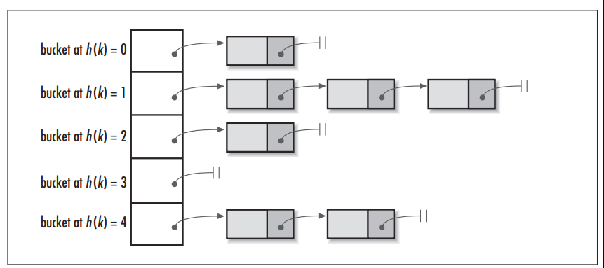

左边很明显是个数组，数组的每个成员是一个链表。该数据结构所容纳的所有元素均包含一个指针，用于元素间的链接。我们根据元素的自身特征把元素分配到不同的链表中去，反过来我们也正是通过这些特征找到正确的链表，再从链表中找出正确的元素。其中，根据元素特征计算元素数组下标的方法就是哈希算法，即本文的主角hash()函数（当然，还包括indexOf()函数）。

### hash方法

我们拿JDK 1.7的HashMap为例，其中定义了一个final int hash(Object k) 方法，其主要被以下方法引用：

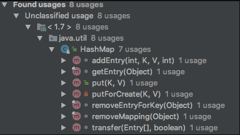

上面的方法主要都是增加和删除方法，这不难理解，当我们要对一个链表数组中的某个元素进行增删的时候，首先要知道他应该保存在这个链表数组中的哪个位置，即他在这个数组中的下标。而hash()方法的功能就是根据Key来定位其在HashMap中的位置。HashTable、ConcurrentHashMap同理

### 源码解析

在同一个版本的Jdk中，HashMap、HashTable以及ConcurrentHashMap里面的hash方法的实现是不同的。再不同的版本的JDK中（Java7 和 Java8）中也是有区别的

hash方法的功能**是根据Key来定位这个K-V在链表数组中的位置的**。也就是hash方法的输入应该是个Object类型的Key，输出应该是个int类型的数组下标

我们只要<font color="red">调用Object对象的hashCode()方法，该方法会返回一个整数，然后用这个数对HashMap或者HashTable的容量进行取模</font>就行了。没错，其实基本原理就是这个，只不过，在具体实现上，由两个方法int hash(Object k)和int indexFor(int h, int length)来实现。但是考虑到效率等问题，HashMap的实现会稍微复杂一点

- hash ：该方法主要是将Object转换成一个整型
- indexFor ：该方法主要是将hash生成的整型转换成链表数组中的下标

### HashMap In Java 7

源码

```java
final int hash(Object k) {
    int h = hashSeed;
    if (0 != h && k instanceof String) {
        return sun.misc.Hashing.stringHash32((String) k);
    }

    h ^= k.hashCode();
    h ^= (h >>> 20) ^ (h >>> 12);
    return h ^ (h >>> 7) ^ (h >>> 4);
}

static int indexFor(int h, int length) {
    return h & (length-1);
}
```

indexFor方法其实主要是将hash生成的整型转换成链表数组中的下标。那么`return h & (length-1);`是什么意思呢？其实，他就是**取模**。Java之所有使用位运算(&)来代替取模运算(%)，最主要的考虑就是效率。位运算(&)效率要比代替取模运算(%)高很多，主要原因是位运算直接对内存数据进行操作，不需要转成十进制，因此处理速度非常快。

那么，为什么可以使用位运算(&)来实现取模运算(%)呢？这实现的原理如下：

```java
X % 2^n = X & (2^n - 1)
```

2^n表示2的n次方，也就是说，**一个数对2^n取模 == 一个数和(2^n - 1)做按位与运算** 。
假设n为3，则2^3 = 8，表示成2进制就是1000。2^3 -1 = 7 ，即0111。
此时X & (2^3 - 1) 就相当于取X的2进制的最后三位数。
从2进制角度来看，X / 8相当于 X >> 3，即把X右移3位，此时得到了X / 8的商，而被移掉的部分(后三位)，则是X % 8，也就是余数。

所以，return h & (length-1);只要保证length的长度是2^n的话，就可以实现取模运算了。而**HashMap中的length也确实是2的倍数，初始值是16，之后每次扩充为原来的2倍**。

两个不同的键值，在对数组长度进行按位与运算后得到的结果相同，这不就发生了冲突吗。那么如何解决这种冲突呢，来看下Java是如何做的。

其中的主要代码部分如下：

```java
h ^= k.hashCode();
h ^= (h >>> 20) ^ (h >>> 12);
return h ^ (h >>> 7) ^ (h >>> 4);
```

这段代码是为了对key的hashCode进行扰动计算，防止不同hashCode的高位不同但低位相同导致的hash冲突。简单点说，<font color="red">**就是为了把高位的特征和低位的特征组合起来，降低哈希冲突的概率，也就是说，尽量做到任何一位的变化都能对最终得到的结果产生影响**</font>。

举个例子来说，我们现在想向一个HashMap中put一个K-V对，Key的值为“hollischuang”，经过简单的获取hashcode后，得到的值为“1011000110101110011111010011011”，如果当前HashTable的大小为16，即在不进行扰动计算的情况下，他最终得到的index结果值为11。由于15的二进制扩展到32位为“00000000000000000000000000001111”，所以，一个数字在和他进行按位与操作的时候，前28位无论是什么，计算结果都一样（因为0和任何数做与，结果都为0）。如下图所示：

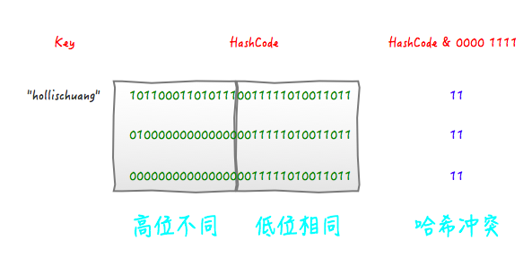

可以看到，后面的两个hashcode经过位运算之后得到的值也是11 ，虽然我们不知道哪个key的hashcode是上面例子中的那两个，但是肯定存在这样的key，这就产生了冲突。

那么，接下来，我看看一下经过扰动的算法最终的计算结果会如何

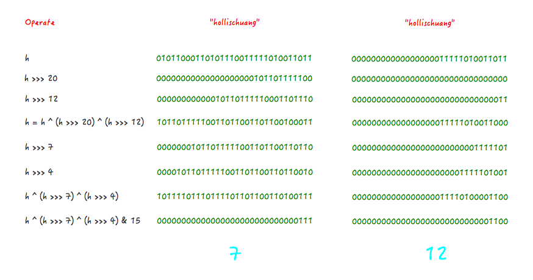

从上面图中可以看到，之前会产生冲突的两个hashcode，经过扰动计算之后，最终得到的index的值不一样了，这就很好的避免了冲突。

其实，使用位运算代替取模运算，除了性能之外，还有一个好处就是可以很好的解决负数的问题。因为我们知道，hashcode的结果是int类型，而int的取值范围是-2^31 ~ 2^31 - 1，即[ -2147483648, 2147483647]；这里面是包含负数的，我们知道，对于一个负数取模还是有些麻烦的。如果使用二进制的位运算的话就可以很好的避免这个问题。首先，不管hashcode的值是正数还是负数。length-1这个值一定是个正数。那么，他的二进制的第一位一定是0（有符号数用最高位作为符号位，“0”代表“+”，“1”代表“-”），这样里两个数做按位与运算之后，第一位一定是个0，也就是，得到的结果一定是个正数。

<font color="red">**也就是说：这个扰动算法就是把高位加入到计算下标的运算中**</font>

### HashTable In Java 7

以下是Java 7中HashTable的hash方法的实现

```java
private int hash(Object k) {
    // hashSeed will be zero if alternative hashing is disabled.
    return hashSeed ^ k.hashCode();
}
```

我们可以发现，很简单，相当于只是对k做了个简单的hash，取了一下其hashCode。而HashTable中也没有indexOf方法，取而代之的是这段代码：`int index = (hash & 0x7FFFFFFF) % tab.length;`。也就是说，HashMap和HashTable对于计算数组下标这件事，采用了两种方法。HashMap采用的是位运算，而HashTable采用的是直接取模。

**为啥要把hash值和0x7FFFFFFF做一次按位与操作呢，主要是为了保证得到的index的第一位为0，也就是为了得到一个正数。因为有符号数第一位0代表正数，1代表负数。**

我们前面说过，HashMap之所以不用取模的原因是为了提高效率。有人认为，因为HashTable是个线程安全的类，本来就慢，所以Java并没有考虑效率问题，就直接使用取模算法了呢？但是其实并不完全是，Java这样设计还是有一定的考虑在的，虽然这样效率确实是会比HashMap慢一些。

其实，HashTable采用简单的取模是有一定的考虑在的。这就要涉及到HashTable的构造函数和扩容函数了。由于篇幅有限，这里就不贴代码了，直接给出结论：

HashTable默认的初始大小为11，之后每次扩充为原来的2n+1。也就是说，HashTable的链表数组的默认大小是一个素数、奇数。之后的每次扩充结果也都是奇数。**由于HashTable会尽量使用素数、奇数作为容量的大小。当哈希表的大小为素数时，简单的取模哈希的结果会更加均匀**。

我们看完了Java 7中HashMap和HashTable中对于hash的实现，我们来做个简单的总结：

- HashMap默认的初始化大小为16，之后每次扩充为原来的2倍。
- HashTable默认的初始大小为11，之后每次扩充为原来的2n+1。
- 当哈希表的大小为素数时，简单的取模哈希的结果会更加均匀，所以单从这一点上看，HashTable的哈希表大小选择，似乎更高明些。因为hash结果越分散效果越好。
- 在取模计算时，如果模数是2的幂，那么我们可以直接使用位运算来得到结果，效率要大大高于做除法。所以从hash计算的效率上，又是HashMap更胜一筹。
- 但是，HashMap为了提高效率使用位运算代替哈希，这又引入了哈希分布不均匀的问题，所以HashMap为解决这问题，又对hash算法做了一些改进，进行了扰动计算。

### ConcurrentHashMap In Java 7

hash方法

```java
private int hash(Object k) {
    int h = hashSeed;

    if ((0 != h) && (k instanceof String)) {
        return sun.misc.Hashing.stringHash32((String) k);
    }

    h ^= k.hashCode();

    // Spread bits to regularize both segment and index locations,
    // using variant of single-word Wang/enkins hash.
    h += (h <<  15) ^ 0xffffcd7d;
    h ^= (h >>> 10);
    h += (h <<   3);
    h ^= (h >>>  6);
    h += (h <<   2) + (h << 14);
    return h ^ (h >>> 16);
}

int j = (hash >>> segmentShift) & segmentMask;
```

上面这段关于ConcurrentHashMap的hash实现其实和HashMap如出一辙。都是通过位运算代替取模，然后再对hashcode进行扰动。区别在于，ConcurrentHashMap 使用了一种变种的Wang/Jenkins 哈希算法，其主要目的也是为了把高位和低位组合在一起，避免发生冲突。至于为啥不和HashMap采用同样的算法进行扰动，我猜这只是程序员自由意志的选择吧。至少我目前没有办法证明哪个更优。

### HashMap In Java 8

在Java 8 之前，HashMap和其他基于map的类都是通过链地址法解决冲突，它们使用单向链表来存储相同索引值的元素。在最坏的情况下，这种方式会将HashMap的get方法的性能从O(1)降低到O(n)。为了解决在频繁冲突时hashmap性能降低的问题，Java 8中使用平衡树来替代链表存储冲突的元素。这意味着我们可以将最坏情况下的性能从O(n)提高到O(logn)

如果恶意程序知道我们用的是Hash算法，则在纯链表情况下，它能够发送大量请求导致哈希碰撞，然后不停访问这些key导致HashMap忙于进行线性查找，最终陷入瘫痪，即形成了拒绝服务攻击（DoS）

关于Java 8中的hash函数，原理和Java 7中基本类似。Java 8中这一步做了优化，只做一次16位右位移异或混合，而不是四次，但原理是不变

```java
static final int hash(Object key) {
    int h;
    return (key == null) ? 0 : (h = key.hashCode()) ^ (h >>> 16);
}
```

在JDK1.8的实现中，优化了高位运算的算法，通过hashCode()的高16位异或低16位实现的：`(h = k.hashCode()) ^ (h >>> 16)`，主要是从速度、功效、质量来考虑的。以上方法得到的int的hash值，然后再通过`h & (table.length -1)`来得到该对象在数据中保存的位置。

### HashTable In Java 8

在Java 8的HashTable中，已经不在有hash方法了。但是哈希的操作还是在的，比如在put方法中就有如下实现：

```java
int hash = key.hashCode();
int index = (hash & 0x7FFFFFFF) % tab.length;
```

### ConcurrentHashMap In Java 8

Java 8 里面的求hash的方法从hash改为了spread。实现方式如下

```java
static final int spread(int h) {
    return (h ^ (h >>> 16)) & HASH_BITS;
}
```

Java 8的ConcurrentHashMap同样是通过Key的哈希值与数组长度取模确定该Key在数组中的索引。同样为了避免不太好的Key的hashCode设计，它通过如下方法计算得到Key的最终哈希值。不同的是，Java 8的ConcurrentHashMap作者认为引入红黑树后，即使哈希冲突比较严重，寻址效率也足够高，所以作者并未在哈希值的计算上做过多设计，只是将Key的hashCode值与其高16位作异或并保证最高位为0（从而保证最终结果为正整数）。

### 总结

## 为什么HashMap的默认容量设置成16

```java
Map<String, String> map = new HashMap<String, String>();
```

### 什么是容量

在Java中，保存数据有两种比较简单的数据结构：数组和链表。数组的特点是：寻址容易，插入和删除困难；而链表的特点是：寻址困难，插入和删除容易。HashMap就是将数组和链表组合在一起，发挥了两者的优势，我们可以将其理解为链表的数组。

在HashMap中，有两个比较容易混淆的关键字段：size和capacity ，这其中capacity就是Map的容量，而size我们称之为Map中的元素个数。

简单打个比方你就更容易理解了：HashMap就是一个“桶”，那么容量（capacity）就是这个桶当前最多可以装多少元素，而元素个数（size）表示这个桶已经装了多少元素。

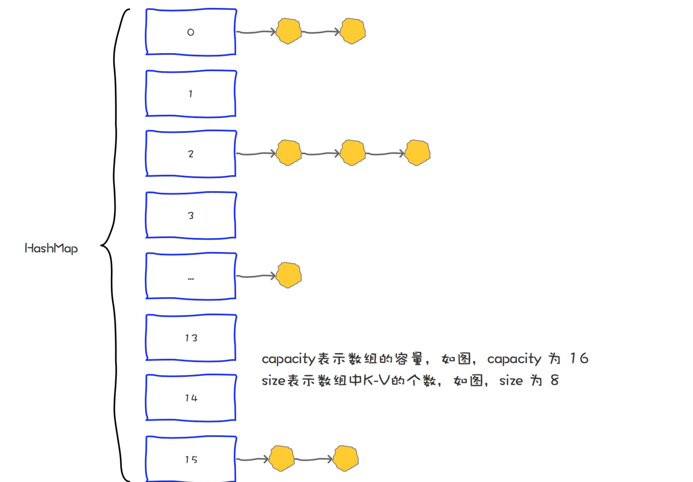

### 容量与哈希

我们知道，容量就是一个HashMap中"桶"的个数，那么，当我们想要往一个HashMap中put一个元素的时候，需要通过一定的算法计算出应该把他放到哪个桶中，这个过程就叫做哈希（hash），对应的就是HashMap中的hash方法。

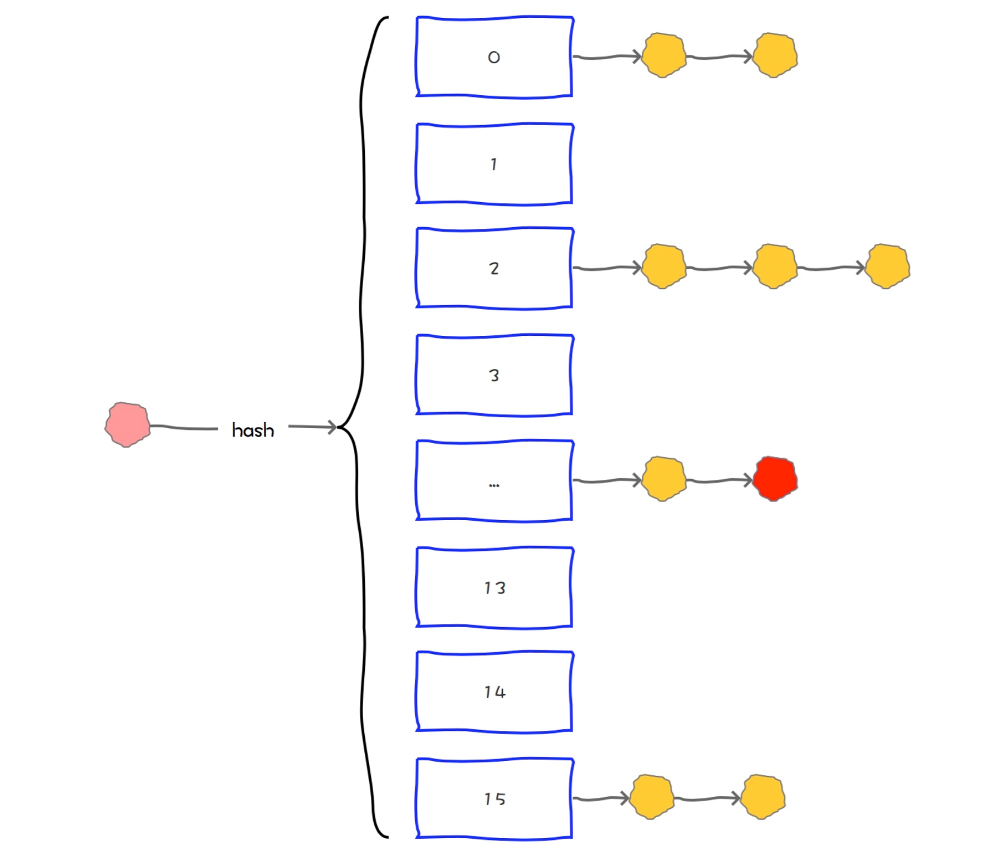

### hash的实现

在前面已经说到了，不重复。

### 指定容量初始化

当我们通过HashMap(int initialCapacity)设置初始容量的时候，HashMap并不一定会直接采用我们传入的数值，而是经过计算，得到一个新值，目的是提高hash的效率。(1->1、3->4、7->8、9->16)

在JDK 1.7和JDK 1.8中，HashMap初始化这个容量的时机不同。JDK 1.8中，在调用HashMap的构造函数定义HashMap的时候，就会进行容量的设定。而在JDK 1.7中，要等到第一次put操作时才进行这一操作。

### 扩容

HashMap有扩容机制，就是当达到扩容条件时会进行扩容。HashMap的扩容条件就是当HashMap中的元素个数（size）超过临界值（threshold）时就会自动扩容。

在HashMap中，`threshold = loadFactor * capacity`

loadFactor是装载因子，表示HashMap满的程度，默认值为0.75f，设置成0.75有一个好处，那就是0.75正好是3/4，而capacity又是2的幂。所以，两个数的乘积都是整数。

对于一个默认的HashMap来说，默认情况下，当其size大于12(16*0.75)时就会触发扩容

### 总结

HashMap作为一种数据结构，元素在put的过程中需要进行hash运算，目的是计算出该元素存放在hashMap中的具体位置。

hash运算的过程其实就是对目标元素的Key进行hashcode，再对Map的容量进行取模，而JDK 的工程师为了提升取模的效率，使用位运算代替了取模运算，这就要求Map的容量一定得是2的幂。

而作为默认容量，太大和太小都不合适，所以16就作为一个比较合适的经验值被采用了。

为了保证任何情况下Map的容量都是2的幂，HashMap在两个地方都做了限制。

首先是，如果用户制定了初始容量，那么HashMap会计算出比该数大的第一个2的幂作为初始容量。
另外，在扩容的时候，也是进行成倍的扩容，即4变成8，8变成16。

## 为什么HashMap的默认负载因子设置成0.75

### 什么是loadFactory

首先我们来介绍下什么是负载因子（loadFactory）

```java
void addEntry(int hash, K key, V value, int bucketIndex) {
    if ((size >= threshold) && (null != table[bucketIndex])) {
        resize(2 * table.length);
        hash = (null != key) ? hash(key) : 0;
        bucketIndex = indexFor(hash, table.length);        }
    createEntry(hash, key, value, bucketIndex);
}
```

从代码中我们可以看到，在向HashMap中添加元素过程中，如果 元素个数（size）超过临界值（threshold） 的时候，就会进行自动扩容（resize），并且，在扩容之后，还需要对HashMap中原有元素进行rehash，即将原来通中的元素重新分配到新的桶中。

在HashMap中，临界值（threshold） = 负载因子（loadFactor） * 容量（capacity）。

loadFactor是装载因子，表示HashMap满的程度，默认值为0.75f，也就是说默认情况下，当HashMap中元素个数达到了容量的3/4的时候就会进行自动扩容。

### 哈希碰撞

我们知道，HashMap其实是底层基于哈希函数实现的，但是哈希函数都有如下一个基本特性：根据同一哈希函数计算出的散列值如果不同，那么输入值肯定也不同。但是，根据同一散列函数计算出的散列值如果相同，输入值不一定相同。

两个不同的输入值，根据同一散列函数计算出的散列值相同的现象叫做碰撞。

衡量一个哈希函数的好坏的重要指标就是发生碰撞的概率以及发生碰撞的解决方案。

### 扩容避免哈希碰撞

1、容量太小。容量小，碰撞的概率就高了。狼多肉少，就会发生争强。

2、hash算法不够好。算法不合理，就可能都分到同一个或几个桶中。分配不均，也会发生争强。

### 为什么默认loadFactory是0.75

一般来说，默认的负载因子(0.75)在时间和空间成本之间提供了很好的权衡。更高的值减少了空间开销，但增加了查找成本(反映在HashMap类的大多数操作中，包括get和put)。

试想一下，如果我们把负载因子设置成1，容量使用默认初始值16，那么表示一个HashMap需要在"满了"之后才会进行扩容。

那么在HashMap中，最好的情况是这16个元素通过hash算法之后分别落到了16个不同的桶中，否则就必然发生哈希碰撞。而且随着元素越多，哈希碰撞的概率越大，查找速度也会越低。

理论上我们认为负载因子不能太大，不然会导致大量的哈希冲突，也不能太小，那样会浪费空间。

通过一个数学推理，测算出这个数值在0.7左右是比较合理的。

那么，为什么最终选定了0.75呢？

还记得前面我们提到过一个公式吗，就是临界值（threshold） = 负载因子（loadFactor） * 容量（capacity）。

根据HashMap的扩容机制，他会保证capacity的值永远都是2的幂。

那么，为了保证负载因子（loadFactor） * 容量（capacity）的结果是一个整数，这个值是0.75(3/4)比较合理，因为**这个数和任何2的幂乘积结果都是整数**。

### 总结

HashMap是一种K-V结构，为了提升其查询及插入的速度，底层采用了链表的数组这种数据结构实现的。

但是因为在计算元素所在的位置的时候，需要使用hash算法，而HashMap采用的hash算法就是链地址法。这种方法有两个极端。

如果HashMap中哈希冲突概率高，那么HashMap就会退化成链表（不是真的退化，而是操作上像是直接操作链表），而我们知道，链表最大的缺点就是查询速度比较慢，他需要从表头开始逐一遍历。

所以，为了避免HashMap发生大量的哈希冲突，所以需要在适当的时候对其进行扩容。

而扩容的条件是元素个数达到临界值时。HashMap中临界值的计算方法：

临界值（threshold） = 负载因子（loadFactor） * 容量（capacity）

其中负载因子表示一个数组可以达到的最大的满的程度。这个值不宜太大，也不宜太小。

loadFactory太大，比如等于1，那么就会有很高的哈希冲突的概率，会大大降低查询速度。

loadFactory太小，比如等于0.5，那么频繁扩容没，就会大大浪费空间。

另外，为了提升扩容效率，HashMap的容量（capacity）有一个固定的要求，那就是一定是2的幂。

所以，如果loadFactory是3/4的话，那么和capacity的乘积结果就可以是一个整数。

所以，一般情况下，我们不建议修改loadFactory的值，除非特殊原因。

比如我明确的知道我的Map只存5个kv，并且永远不会改变，那么可以考虑指定loadFactory。

但是其实我也不建议这样用。我们完全可以通过指定capacity达到这样的目的

## 为什么建议设置HashMap的初始容量，设置多少合适

### 要设置HashMap的初始化容量

HashMap有扩容机制，就是当达到扩容条件时会进行扩容。HashMap的扩容条件就是当HashMap中的元素个数（size）超过临界值（threshold）时就会自动扩容。在HashMap中，threshold = loadFactor * capacity。

所以，如果我们没有设置初始容量大小，随着元素的不断增加，HashMap会发生多次扩容，而HashMap中的扩容机制决定了每次扩容都需要重建hash表，是非常影响性能的。

### HashMap初始化容量设置多少合适

当我们使用HashMap(int initialCapacity)来初始化容量的时候，HashMap并不会使用我们传进来的initialCapacity直接作为初识容量。

JDK会默认帮我们计算一个相对合理的值当做初始容量。所谓合理值，其实是找到第一个比用户传入的值大的2的幂。

也就是说，当我们new HashMap(7)创建HashMap的时候，JDK会通过计算，帮我们创建一个容量为8的Map；当我们new HashMap(9)创建HashMap的时候，JDK会通过计算，帮我们创建一个容量为16的Map。

但是，这个值看似合理，实际上并不尽然。因为HashMap在根据用户传入的capacity计算得到的默认容量，并没有考虑到loadFactory这个因素，只是简单机械的计算出第一个大约这个数字的2的幂。

loadFactory是负载因子，当HashMap中的元素个数（size）超过 `threshold = loadFactory * capacity`时，就会进行扩容。

也就是说，如果我们设置的默认值是7，经过JDK处理之后，HashMap的容量会被设置成8，但是，这个HashMap在元素个数达到 8*0.75 = 6的时候就会进行一次扩容，这明显是我们不希望见到的。

那么，到底设置成什么值比较合理呢？

这里我们可以参考JDK8中putAll方法中的实现的，这个实现在guava（21.0版本）也被采用。

这个值的计算方法就是：

```java
return (int) ((float) expectedSize / 0.75F + 1.0F);
```

比如我们计划向HashMap中放入7个元素的时候，我们通过expectedSize / 0.75F + 1.0F计算，7/0.75 + 1 = 10 ,10经过JDK处理之后，会被设置成16，这就大大的减少了扩容的几率。

当HashMap内部维护的哈希表的容量达到75%时（默认情况下），会触发rehash，而rehash的过程是比较耗费时间的。所以初始化容量要设置成expectedSize/0.75 + 1的话，可以有效的减少冲突也可以减小误差。（大家结合这个公式，好好理解下这句话）

所以，我们可以认为，当我们明确知道HashMap中元素的个数的时候，把默认容量设置成expectedSize / 0.75F + 1.0F 是一个在性能上相对好的选择，但是，同时也会牺牲些内存。

这个算法在guava中有实现，开发的时候，可以直接通过Maps类创建一个HashMap：

```java
Map<String, String> map = Maps.newHashMapWithExpectedSize(7);
```

其代码实现如下：

```java
public static <K, V> HashMap<K, V> newHashMapWithExpectedSize(int expectedSize) {
    return new HashMap(capacity(expectedSize));
}

static int capacity(int expectedSize) {
    if (expectedSize < 3) {
        CollectPreconditions.checkNonnegative(expectedSize, "expectedSize");
        return expectedSize + 1;
    } else {
        return expectedSize < 1073741824 ? (int)((float)expectedSize / 0.75F + 1.0F) : 2147483647;
    }
}
```

以上的操作是一种用内存换性能的做法，真正使用的时候，要考虑到内存的影响。但是，大多数情况下，我们还是认为内存是一种比较富裕的资源。

但是话又说回来了，有些时候，我们到底要不要设置HashMap的初识值，这个值又设置成多少，真的有那么大影响吗？其实也不见得！

可是，大的性能优化，不就是一个一个的优化细节堆叠出来的吗？

再不济，以后你写代码的时候，使用`Maps.newHashMapWithExpectedSize(7);`的写法，也可以让同事和老板眼前一亮。

## Java 8中stream相关用法

### 概述

在Java中，集合和数组是我们经常会用到的数据结构，需要经常对他们做增、删、改、查、聚合、统计、过滤等操作。相比之下，关系型数据库中也同样有这些操作，但是在Java 8之前，集合和数组的处理并不是很便捷。

不过，这一问题在Java 8中得到了改善，Java 8 API添加了一个新的抽象称为流Stream，可以让你以一种声明的方式处理数据。

### Stream介绍

Stream 使用一种类似用 SQL 语句从数据库查询数据的直观方式来提供一种对 Java 集合运算和表达的高阶抽象。

Stream API可以极大提高Java程序员的生产力，让程序员写出高效率、干净、简洁的代码。

这种风格将要处理的元素集合看作一种流，流在管道中传输，并且可以在管道的节点上进行处理，比如筛选，排序，聚合等。

Stream有以下特性及优点：

- 无存储。Stream不是一种数据结构，它只是某种数据源的一个视图，数据源可以是一个数组，Java容器或I/O channel等。
- 为函数式编程而生。对Stream的任何修改都不会修改背后的数据源，比如对Stream执行过滤操作并不会删除被过滤的元素，而是会产生一个不包含被过滤元素的新Stream。
- 惰式执行。Stream上的操作并不会立即执行，只有等到用户真正需要结果的时候才会执行。
- 可消费性。Stream只能被“消费”一次，一旦遍历过就会失效，就像容器的迭代器那样，想要再次遍历必须重新生成。

我们举一个例子，来看一下到底Stream可以做什么事情：

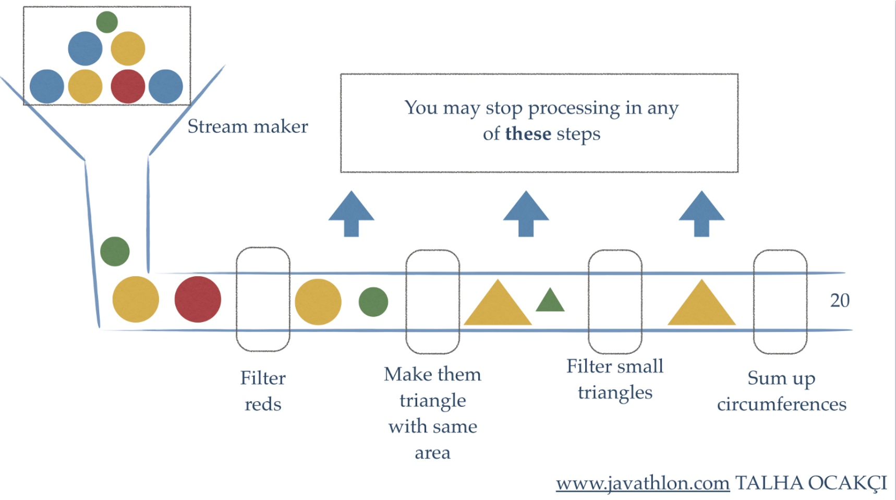

上面的例子中，获取一些带颜色塑料球作为数据源，首先过滤掉红色的、把它们融化成随机的三角形。再过滤器并删除小的三角形。最后计算出剩余图形的周长。

如上图，对于流的处理，主要有三种关键性操作：分别是流的创建、中间操作（intermediate operation）以及最终操作(terminal operation)。

### Stream的创建

在Java 8中，可以有多种方法来创建流。

#### 通过已有的集合来创建流

在Java 8中，除了增加了很多Stream相关的类以外，还对集合类自身做了增强，在其中增加了stream方法，可以将一个集合类转换成流。

```java
List<String> strings = Arrays.asList("Hollis", "HollisChuang", "hollis", "Hello", "HelloWorld", "Hollis");
Stream<String> stream = strings.stream();
```

以上，通过一个已有的List创建一个流。除此以外，还有一个parallelStream方法，可以为集合创建一个并行流。

这种通过集合创建出一个Stream的方式也是比较常用的一种方式。

#### 通过Stream创建流

可以使用Stream类提供的方法，直接返回一个由指定元素组成的流。

```java
Stream<String> stream = Stream.of("Hollis", "HollisChuang", "hollis", "Hello", "HelloWorld", "Hollis");
```

如以上代码，直接通过of方法，创建并返回一个Stream。

### Stream中间操作

Stream有很多中间操作，多个中间操作可以连接起来形成一个流水线，每一个中间操作就像流水线上的一个工人，每人工人都可以对流进行加工，加工后得到的结果还是一个流。

以下是常用的中间操作列表:

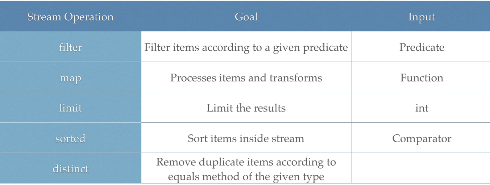

#### filter

filter 方法用于通过设置的条件过滤出元素。以下代码片段使用 filter 方法过滤掉空字符串：

```java
List<String> strings = Arrays.asList("Hollis", "", "HollisChuang", "H", "hollis");
strings.stream().filter(string -> !string.isEmpty()).forEach(System.out::println);
//Hollis, , HollisChuang, H, hollis
```

#### map

map 方法用于映射每个元素到对应的结果，以下代码片段使用 map 输出了元素对应的平方数：

```java
List<Integer> numbers = Arrays.asList(3, 2, 2, 3, 7, 3, 5);
numbers.stream().map( i -> i*i).forEach(System.out::println);
//9,4,4,9,49,9,25
```

#### limit/skip

limit 返回 Stream 的前面 n 个元素；skip 则是扔掉前 n 个元素。以下代码片段使用 limit 方法保理4个元素：

```java
List<Integer> numbers = Arrays.asList(3, 2, 2, 3, 7, 3, 5);
numbers.stream().limit(4).forEach(System.out::println);
//3,2,2,3
```

#### sorted

sorted 方法用于对流进行排序。以下代码片段使用 sorted 方法进行排序：

```java
List<Integer> numbers = Arrays.asList(3, 2, 2, 3, 7, 3, 5);
numbers.stream().sorted().forEach(System.out::println);
//2,2,3,3,3,5,7
```

#### distinct

distinct主要用来去重，以下代码片段使用 distinct 对元素进行去重：

```java
List<Integer> numbers = Arrays.asList(3, 2, 2, 3, 7, 3, 5);
numbers.stream().distinct().forEach(System.out::println);
//3,2,7,5
```

### Stream最终操作

Stream的中间操作得到的结果还是一个Stream，那么如何把一个Stream转换成我们需要的类型呢？比如计算出流中元素的个数、将流装换成集合等。这就需要最终操作（terminal operation）

最终操作会消耗流，产生一个最终结果。也就是说，在最终操作之后，不能再次使用流，也不能在使用任何中间操作，否则将抛出异常：

```java
java.lang.IllegalStateException: stream has already been operated upon or closed
```

常用的最终操作如下图：

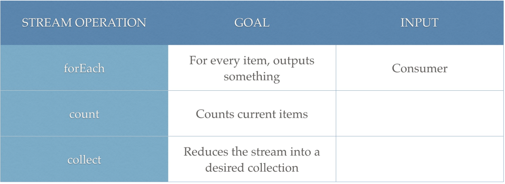

#### forEach

Stream 提供了方法 'forEach' 来迭代流中的每个数据。以下代码片段使用 forEach 输出了10个随机数：

```java
Random random = new Random();
random.ints().limit(10).forEach(System.out::println);
```

#### count

count用来统计流中的元素个数。

```java
List<String> strings = Arrays.asList("Hollis", "HollisChuang", "hollis","Hollis666", "Hello", "HelloWorld", "Hollis");
System.out.println(strings.stream().count());
//7
```

#### collect

collect就是一个归约操作，可以接受各种做法作为参数，将流中的元素累积成一个汇总结果：

```java
List<String> strings = Arrays.asList("Hollis", "HollisChuang", "hollis","Hollis666", "Hello", "HelloWorld", "Hollis");
strings  = strings.stream().filter(string -> string.startsWith("Hollis")).collect(Collectors.toList());
System.out.println(strings);
//Hollis, HollisChuang, Hollis666, Hollis
```

接下来，我们还是使用一张图，来演示下，前文的例子中，当一个Stream先后通过filter、map、sort、limit以及distinct处理后会，在分别使用不同的最终操作可以得到怎样的结果：

下图，展示了文中介绍的所有操作的位置、输入、输出以及使用一个案例展示了其结果。

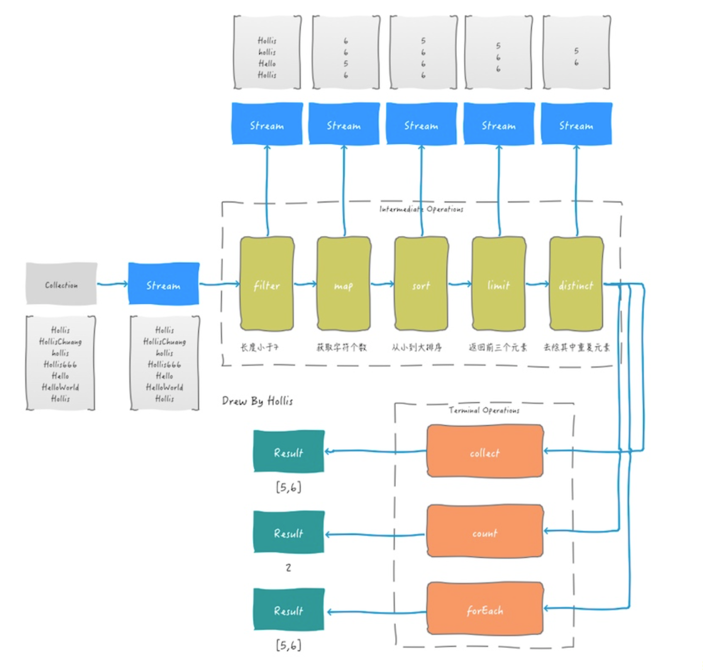

### 总结

Stream的创建有两种方式，分别是通过集合类的stream方法、通过Stream的of方法。

Stream的中间操作可以用来处理Stream，中间操作的输入和输出都是Stream，中间操作可以是过滤、转换、排序等。

Stream的最终操作可以将Stream转成其他形式，如计算出流中元素的个数、将流装换成集合、以及元素的遍历等。

## Apache集合处理工具类的使用

Commons Collections增强了Java Collections Framework。 它提供了几个功能，使收集处理变得容易。 它提供了许多新的接口，实现和实用程序。 Commons Collections的主要功能如下

- Bag - Bag界面简化了每个对象具有多个副本的集合。

- BidiMap - BidiMap接口提供双向映射，可用于使用值使用键或键查找值。

- MapIterator - MapIterator接口提供简单而容易的迭代迭代。

- Transforming Decorators - 转换装饰器可以在将集合添加到集合时更改集合的每个对象。

- Composite Collections - 在需要统一处理多个集合的情况下使用复合集合。

- Ordered Map - 有序地图保留添加元素的顺序。

- Ordered Set - 有序集保留了添加元素的顺序。

- Reference map - 参考图允许在密切控制下对键/值进行垃圾收集。

- Comparator implementations - 可以使用许多Comparator实现。

- Iterator implementations - 许多Iterator实现都可用。

- Adapter Classes - 适配器类可用于将数组和枚举转换为集合。

- Utilities - 实用程序可用于测试测试或创建集合的典型集合论属性，例如union，intersection。 支持关闭。

### Commons Collections - Bag

Bag定义了一个集合，用于计算对象在集合中出现的次数。 例如，如果Bag包含{a，a，b，c}，则getCount（“a”）将返回2，而uniqueSet（）将返回唯一值。

```java

import org.apache.commons.collections4.Bag;
import org.apache.commons.collections4.bag.HashBag;
public class BagTester {
   public static void main(String[] args) {
      Bag<String> bag = new HashBag<>();
      //add "a" two times to the bag.
      bag.add("a" , 2);
      //add "b" one time to the bag.
      bag.add("b");
      //add "c" one time to the bag.
      bag.add("c");
      //add "d" three times to the bag.
      bag.add("d",3);
      //get the count of "d" present in bag.
      System.out.println("d is present " + bag.getCount("d") + " times.");
      System.out.println("bag: " +bag);
      //get the set of unique values from the bag
      System.out.println("Unique Set: " +bag.uniqueSet());
      //remove 2 occurrences of "d" from the bag
      bag.remove("d",2);
      System.out.println("2 occurences of d removed from bag: " +bag);
      System.out.println("d is present " + bag.getCount("d") + " times.");
      System.out.println("bag: " +bag);
      System.out.println("Unique Set: " +bag.uniqueSet());
   }
}
```

它将打印以下结果:

```java

d is present 3 times.
bag: [2:a,1:b,1:c,3:d]
Unique Set: [a, b, c, d]
2 occurences of d removed from bag: [2:a,1:b,1:c,1:d]
d is present 1 times.
bag: [2:a,1:b,1:c,1:d]
Unique Set: [a, b, c, d]
```

### Commons Collections - BidiMap

使用双向映射，可以使用值查找键，并且可以使用键轻松查找值。

```java

import org.apache.commons.collections4.BidiMap;
import org.apache.commons.collections4.bidimap.TreeBidiMap;
public class BidiMapTester {
   public static void main(String[] args) {
      BidiMap<String, String> bidi = new TreeBidiMap<>();
      bidi.put("One", "1");
      bidi.put("Two", "2");
      bidi.put("Three", "3");
      System.out.println(bidi.get("One")); 
      System.out.println(bidi.getKey("1"));
      System.out.println("Original Map: " + bidi);
      bidi.removeValue("1"); 
      System.out.println("Modified Map: " + bidi);
      BidiMap<String, String> inversedMap = bidi.inverseBidiMap();  
      System.out.println("Inversed Map: " + inversedMap);
   }
}
```

它将打印以下结果：

```java
1
One
Original Map: {One=1, Three=3, Two=2}
Modified Map: {Three=3, Two=2}
Inversed Map: {2=Two, 3=Three}
```

### Commons Collections - MapIterator

JDK Map接口很难迭代，因为迭代要在EntrySet或KeySet对象上完成。 MapIterator提供了对Map的简单迭代。

```java

import org.apache.commons.collections4.IterableMap;
import org.apache.commons.collections4.MapIterator;
import org.apache.commons.collections4.map.HashedMap;
public class MapIteratorTester {
   public static void main(String[] args) {
      IterableMap<String, String> map = new HashedMap<>();
      map.put("1", "One");
      map.put("2", "Two");
      map.put("3", "Three");
      map.put("4", "Four");
      map.put("5", "Five");
      MapIterator<String, String> iterator = map.mapIterator();
      while (iterator.hasNext()) {
         Object key = iterator.next();
         Object value = iterator.getValue();
         System.out.println("key: " + key);
         System.out.println("Value: " + value);
         iterator.setValue(value + "_");
      }
      System.out.println(map);
   }
}
```

它将打印以下结果

```java
key: 3
Value: Three
key: 5
Value: Five
key: 2
Value: Two
key: 4
Value: Four
key: 1
Value: One
{3=Three_, 5=Five_, 2=Two_, 4=Four_, 1=One_}
```

### Commons Collections - OrderedMap

OrderedMap是地图的新接口，用于保留添加元素的顺序。 LinkedMap和ListOrderedMap是两个可用的实现。 此接口支持Map的迭代器，并允许在Map中向前或向后迭代两个方向

```java
import org.apache.commons.collections4.OrderedMap;
import org.apache.commons.collections4.map.LinkedMap;
public class OrderedMapTester {
   public static void main(String[] args) {
      OrderedMap<String, String> map = new LinkedMap<String, String>();
      map.put("One", "1");
      map.put("Two", "2");
      map.put("Three", "3");
      System.out.println(map.firstKey());
      System.out.println(map.nextKey("One"));
      System.out.println(map.nextKey("Two"));  
   }
}
```

它将打印以下结果

```java
One
Two
Three
```

### Commons Collections - Ignore NULL

Apache Commons Collections库的CollectionUtils类为常见操作提供了各种实用方法，涵盖了广泛的用例。 它有助于避免编写样板代码。 这个库在jdk 8之前非常有用，因为Java 8的Stream API现在提供了类似的功能。

```java
import java.util.LinkedList;
import java.util.List;
import org.apache.commons.collections4.CollectionUtils;
public class CollectionUtilsTester {
   public static void main(String[] args) {
      List<String> list = new LinkedList<String>();
      CollectionUtils.addIgnoreNull(list, null);
      CollectionUtils.addIgnoreNull(list, "a");
      System.out.println(list);
      if(list.contains(null)) {
         System.out.println("Null value is present");
      } else {
         System.out.println("Null value is not present");
      }
   }
}
```

它将打印以下结果

```java
[a]
Null value is not present
```

### Merge & Sort

```java

import java.util.Arrays;
import java.util.List;
import org.apache.commons.collections4.CollectionUtils;
public class CollectionUtilsTester {
   public static void main(String[] args) {
      List<String> sortedList1 = Arrays.asList("A","C","E");
      List<String> sortedList2 = Arrays.asList("B","D","F");
      List<String> mergedList = CollectionUtils.collate(sortedList1, sortedList2);
      System.out.println(mergedList); 
   }
}
```

它将打印以下结果

```java
[A, B, C, D, E, F]
```

### 安全空检查(Safe Empty Checks)


```java
import java.util.List;
import org.apache.commons.collections4.CollectionUtils;
public class CollectionUtilsTester {
   public static void main(String[] args) {
      List<String> list = getList();
      System.out.println("Non-Empty List Check: " + checkNotEmpty1(list));
      System.out.println("Non-Empty List Check: " + checkNotEmpty1(list));
   }
   static List<String> getList() {
      return null;
   } 
   static boolean checkNotEmpty1(List<String> list) {
      return !(list == null || list.isEmpty());
   }
   static boolean checkNotEmpty2(List<String> list) {
      return CollectionUtils.isNotEmpty(list);
   } 
}
```

它将打印以下结果

```java
Non-Empty List Check: false
Non-Empty List Check: false
```

### Commons Collections - Inclusion

检查列表是否是另一个列表的一部分

```java
import java.util.Arrays;
import java.util.List;
import org.apache.commons.collections4.CollectionUtils;
public class CollectionUtilsTester {
   public static void main(String[] args) {
      //checking inclusion
      List<String> list1 = Arrays.asList("A","A","A","C","B","B");
      List<String> list2 = Arrays.asList("A","A","B","B");
      System.out.println("List 1: " + list1);
      System.out.println("List 2: " + list2);
      System.out.println("Is List 2 contained in List 1: " 
         + CollectionUtils.isSubCollection(list2, list1));
   }
}
```

它将打印以下结果

```java
List 1: [A, A, A, C, B, B]
List 2: [A, A, B, B]
Is List 2 contained in List 1: true
```

### Commons Collections - Intersection

用于获取两个集合（交集）之间的公共对象

```java
import java.util.Arrays;
import java.util.List;
import org.apache.commons.collections4.CollectionUtils;
public class CollectionUtilsTester {
   public static void main(String[] args) {
      //checking inclusion
      List<String> list1 = Arrays.asList("A","A","A","C","B","B");
      List<String> list2 = Arrays.asList("A","A","B","B");
      System.out.println("List 1: " + list1);
      System.out.println("List 2: " + list2);
      System.out.println("Commons Objects of List 1 and List 2: " 
         + CollectionUtils.intersection(list1, list2));
   }
}
```

它将打印以下结果

```java
List 1: [A, A, A, C, B, B]
List 2: [A, A, B, B]
Commons Objects of List 1 and List 2: [A, A, B, B]
```

### Commons Collections - Subtraction

通过从其他集合中减去一个集合的对象来获取新集合

```java
import java.util.Arrays;
import java.util.List;
import org.apache.commons.collections4.CollectionUtils;
public class CollectionUtilsTester {
   public static void main(String[] args) {
      //checking inclusion
      List<String> list1 = Arrays.asList("A","A","A","C","B","B");
      List<String> list2 = Arrays.asList("A","A","B","B");
      System.out.println("List 1: " + list1);
      System.out.println("List 2: " + list2);
      System.out.println("List 1 - List 2: " 
         + CollectionUtils.subtract(list1, list2));
   }
}
```

它将打印以下结果

```java
List 1: [A, A, A, C, B, B]
List 2: [A, A, B, B]
List 1 - List 2: [A, C]
```

### Commons Collections - Union

用于获取两个集合的并集

```java
import java.util.Arrays;
import java.util.List;
import org.apache.commons.collections4.CollectionUtils;
public class CollectionUtilsTester {
   public static void main(String[] args) {
      //checking inclusion
      List<String> list1 = Arrays.asList("A","A","A","C","B","B");
      List<String> list2 = Arrays.asList("A","A","B","B");
      System.out.println("List 1: " + list1);
      System.out.println("List 2: " + list2);
      System.out.println("Union of List 1 and List 2: " 
         + CollectionUtils.union(list1, list2));
   }
}
```

它将打印以下结果

```java
List 1: [A, A, A, C, B, B]
List 2: [A, A, B, B]
Union of List 1 and List 2: [A, A, A, B, B, C]
```

# 不同版本的JDK中HashMap的实现的区别以及原因

## Arrays.asList获得的List使用时需要注意什么

asList 得到的只是一个 Arrays 的内部类，一个原来数组的视图 List，因此如果对它进行增删操作会报错

用 ArrayList 的构造器可以将其转变成真正的 ArrayList

## Collection如何迭代

Collection的迭代有很多种方式：

- 1、通过普通for循环迭代
- 2、通过增强for循环迭代
- 3、使用Iterator迭代
- 4、使用Stream迭代

```java
List<String> list = ImmutableList.of("Hollis", "hollischuang");

// 普通for循环遍历
for (int i = 0; i < list.size(); i++) {
    System.out.println(list.get(i));
}

//增强for循环遍历
for (String s : list) {
    System.out.println(s);
}

//Iterator遍历
Iterator it = list.iterator();
while (it.hasNext()) {
    System.out.println(it.next());
}

//Stream 遍历
list.forEach(System.out::println);

list.stream().forEach(System.out::println);
```

## Enumeration和Iterator区别

### 函数接口不同

Enumeration只有2个函数接口。通过Enumeration，我们只能读取集合的数据，而不能对数据进行修改。

Iterator只有3个函数接口。Iterator除了能读取集合的数据之外，也能数据进行删除操作。

### Iterator支持fail-fast机制，而Enumeration不支持

Enumeration 是JDK 1.0添加的接口。使用到它的函数包括Vector、Hashtable等类，这些类都是JDK 1.0中加入的，Enumeration存在的目的就是为它们提供遍历接口。Enumeration本身并没有支持同步，而在Vector、Hashtable实现Enumeration时，添加了同步。

而Iterator 是JDK 1.2才添加的接口，它也是为了HashMap、ArrayList等集合提供遍历接口。Iterator是支持fail-fast机制的：**当多个线程对同一个集合的内容进行操作时，就可能会产生fail-fast事件**。

注意：Enumeration迭代器只能遍历Vector、Hashtable这种古老的集合，因此通常不要使用它，除非在某些极端情况下，不得不使用Enumeration，否则都应该选择Iterator迭代器。

## fail-fast 和 fail-safe

### 什么是fail-fast

在系统设计中，快速失效系统一种可以立即报告任何可能表明故障的情况的系统。快速失效系统通常设计用于停止正常操作，而不是试图继续可能存在缺陷的过程。这种设计通常会在操作中的多个点检查系统的状态，因此可以及早检测到任何故障。快速失败模块的职责是检测错误，然后让系统的下一个最高级别处理错误。

其实，这是一种理念，说白了就是在做系统设计的时候先考虑异常情况，一旦发生异常，直接停止并上报。

举一个最简单的fail-fast的例子：

```java
public int divide(int divisor,int dividend){
    if(dividend == 0){
        throw new RuntimeException("dividend can't be null");
    }
    return divisor/dividend;
}
```

上面的代码是一个对两个整数做除法的方法，在divide方法中，我们对被除数做了个简单的检查，如果其值为0，那么就直接抛出一个异常，并明确提示异常原因。这其实就是fail-fast理念的实际应用。

这样做的好处就是可以预先识别出一些错误情况，一方面可以避免执行复杂的其他代码，另外一方面，这种异常情况被识别之后也可以针对性的做一些单独处理。

既然，fail-fast是一种比较好的机制，为什么文章标题说fail-fast会有坑呢？

原因是Java的集合类中运用了fail-fast机制进行设计，一旦使用不当，触发fail-fast机制设计的代码，就会发生非预期情况。

### 集合类中的fail-fast

我们通常说的Java中的fail-fast机制，默认指的是Java集合的一种错误检测机制。当多个线程对部分集合进行结构上的改变的操作时，有可能会产生fail-fast机制，这个时候就会抛出ConcurrentModificationException（后文用CME代替）。

CMException，当方法检测到对象的并发修改，但不允许这种修改时就抛出该异常。

很多时候正是因为代码中抛出了CMException，很多程序员就会很困惑，明明自己的代码并没有在多线程环境中执行，为什么会抛出这种并发有关的异常呢？这种情况在什么情况下才会抛出呢？我们就来深入分析一下。

### 异常复现

在Java中， 如果在foreach 循环里对某些集合元素进行元素的 remove/add 操作的时候，就会触发fail-fast机制，进而抛出CMException。

```java
List<String> userNames = new ArrayList<String>() {{
    add("Hollis");
    add("hollis");
    add("HollisChuang");
    add("H");
}};

for (String userName : userNames) {
    if (userName.equals("Hollis")) {
        userNames.remove(userName);
    }
}

System.out.println(userNames);
```

以上代码，使用增强for循环遍历元素，并尝试删除其中的Hollis字符串元素。运行以上代码，会抛出以下异常：

```java
Exception in thread "main" java.util.ConcurrentModificationException
at java.util.ArrayList$Itr.checkForComodification(ArrayList.java:909)
at java.util.ArrayList$Itr.next(ArrayList.java:859)
at com.hollis.ForEach.main(ForEach.java:22)
```

同样的，读者可以尝试下在增强for循环中使用add方法添加元素，结果也会同样抛出该异常。

在深入原理之前，我们先尝试把foreach进行解语法糖，看一下foreach具体如何实现的。

使用jad工具，对编译后的class进行反编译，得到以下代码：

```java
public static void main(String[] args) {
    // 使用ImmutableList初始化一个List
    List<String> userNames = new ArrayList<String>() {{
        add("Hollis");
        add("hollis");
        add("HollisChuang");
        add("H");
    }};

    Iterator iterator = userNames.iterator();
    do
    {
        if(!iterator.hasNext())
            break;
        String userName = (String)iterator.next();
        if(userName.equals("Hollis"))
            userNames.remove(userName);
    } while(true);
    System.out.println(userNames);
}
```

可以发现，foreach其实是依赖了while循环和Iterator实现的。

### 异常原理

通过以上代码的异常堆栈，我们可以跟踪到真正抛出异常的代码是：

```java
java.util.ArrayList$Itr.checkForComodification(ArrayList.java:909)
```

该方法是在iterator.next()方法中调用的。我们看下该方法的实现：

```java
final void checkForComodification() {
    if (modCount != expectedModCount)
        throw new ConcurrentModificationException();
}
```

如上，在该方法中对modCount和expectedModCount进行了比较，如果二者不想等，则抛出CMException。

那么，modCount和expectedModCount是什么？是什么原因导致他们的值不想等的呢？

modCount是ArrayList中的一个成员变量。它表示该集合实际被修改的次数。

```java
List<String> userNames = new ArrayList<String>() {{
    add("Hollis");
    add("hollis");
    add("HollisChuang");
    add("H");
}};
```

当使用以上代码初始化集合之后该变量就有了。初始值为0。

expectedModCount 是 ArrayList中的一个内部类——Itr中的成员变量。

```java
Iterator iterator = userNames.iterator();
```

以上代码，即可得到一个 Itr类，该类实现了Iterator接口。

expectedModCount表示这个迭代器预期该集合被修改的次数。其值随着Itr被创建而初始化。只有通过迭代器对集合进行操作，该值才会改变。

那么，接着我们看下userNames.remove(userName);方法里面做了什么事情，为什么会导致expectedModCount和modCount的值不一样。

通过翻阅代码，我们也可以发现，remove方法核心逻辑如下：

```java
private void fastRemove(int index) {
    modCount++;
    int numMoved = size - index - 1;
    if (numMoved > 0)
        System.arraycopy(elementData, index+1, elementData, index,
                         numMoved);
    elementData[--size] = null; // clear to let GC do its work
}
```

可以看到，它只修改了modCount，并没有对expectedModCount做任何操作。

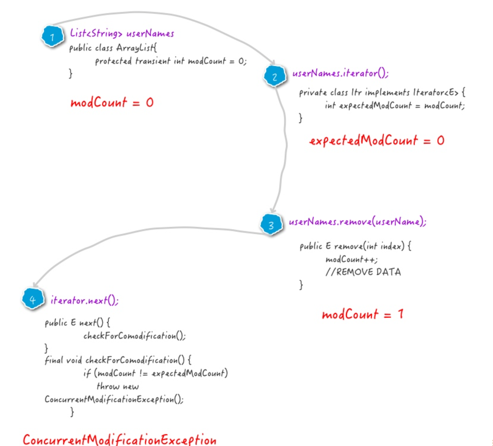

简单总结一下，之所以会抛出CMException异常，是因为我们的代码中使用了增强for循环，而在增强for循环中，集合遍历是通过iterator进行的，但是元素的add/remove却是直接使用的集合类自己的方法。这就导致iterator在遍历的时候，会发现有一个元素在自己不知不觉的情况下就被删除/添加了，就会抛出一个异常，用来提示用户，可能发生了并发修改！

所以，在使用Java的集合类的时候，如果发生CMException，优先考虑fail-fast有关的情况，实际上这里并没有真的发生并发，只是Iterator使用了fail-fast的保护机制，只要他发现有某一次修改是未经过自己进行的，那么就会抛出异常。

### fail-safe

为了避免触发fail-fast机制，导致异常，我们可以使用Java中提供的一些采用了fail-safe机制的集合类。

这样的集合容器在遍历时不是直接在集合内容上访问的，而是先复制原有集合内容，在拷贝的集合上进行遍历。

java.util.concurrent包下的容器都是fail-safe的，可以在多线程下并发使用，并发修改。同时也可以在foreach中进行add/remove 。

我们拿CopyOnWriteArrayList这个fail-safe的集合类来简单分析一下。

```java
public static void main(String[] args) {
    List<String> userNames = new CopyOnWriteArrayList<String>() {{
        add("Hollis");
        add("hollis");
        add("HollisChuang");
        add("H");
    }};

    userNames.iterator();

    for (String userName : userNames) {
        if (userName.equals("Hollis")) {
            userNames.remove(userName);
        }
    }

    System.out.println(userNames);
}
```

以上代码，使用CopyOnWriteArrayList代替了ArrayList，就不会发生异常。

fail-safe集合的所有对集合的修改都是先拷贝一份副本，然后在副本集合上进行的，并不是直接对原集合进行修改。并且这些修改方法，如add/remove都是通过加锁来控制并发的。

所以，CopyOnWriteArrayList中的迭代器在迭代的过程中不需要做fail-fast的并发检测。（因为fail-fast的主要目的就是识别并发，然后通过异常的方式通知用户）

但是，虽然基于拷贝内容的优点是避免了ConcurrentModificationException，但同样地，迭代器并不能访问到修改后的内容。如以下代码：

```java
public static void main(String[] args) {
    List<String> userNames = new CopyOnWriteArrayList<String>() {{
        add("Hollis");
        add("hollis");
        add("HollisChuang");
        add("H");
    }};

    Iterator it = userNames.iterator();

    for (String userName : userNames) {
        if (userName.equals("Hollis")) {
            userNames.remove(userName);
        }
    }

    System.out.println(userNames);

    while(it.hasNext()){
        System.out.println(it.next());
    }
}
```

我们得到CopyOnWriteArrayList的Iterator之后，通过for循环直接删除原数组中的值，最后在结尾处输出Iterator，结果发现内容如下：

```java
[hollis, HollisChuang, H]
Hollis
hollis
HollisChuang
H
```

迭代器遍历的是开始遍历那一刻拿到的集合拷贝，在遍历期间原集合发生的修改迭代器是不知道的。

### Copy-On-Write

在了解了CopyOnWriteArrayList之后，不知道大家会不会有这样的疑问：他的add/remove等方法都已经加锁了，还要copy一份再修改干嘛？多此一举？同样是线程安全的集合，这玩意和Vector有啥区别呢？

Copy-On-Write简称COW，是一种用于程序设计中的优化策略。其基本思路是，从一开始大家都在共享同一个内容，当某个人想要修改这个内容的时候，才会真正把内容Copy出去形成一个新的内容然后再改，这是一种延时懒惰策略。

CopyOnWrite容器即写时复制的容器。通俗的理解是当我们往一个容器添加元素的时候，不直接往当前容器添加，而是先将当前容器进行Copy，复制出一个新的容器，然后新的容器里添加元素，添加完元素之后，再将原容器的引用指向新的容器。

CopyOnWriteArrayList中add/remove等写方法是需要加锁的，目的是为了避免Copy出N个副本出来，导致并发写。

但是，CopyOnWriteArrayList中的读方法是没有加锁的。

```java
public E get(int index) {
    return get(getArray(), index);
}
```

这样做的好处是我们可以对CopyOnWrite容器进行并发的读，当然，这里读到的数据可能不是最新的。因为写时复制的思想是通过延时更新的策略来实现数据的最终一致性的，并非强一致性。

所以CopyOnWrite容器是一种读写分离的思想，读和写不同的容器。而Vector在读写的时候使用同一个容器，读写互斥，同时只能做一件事儿。

## 如何在遍历的同时删除ArrayList中的元素

### 1、直接使用普通for循环进行操作

我们说不能在foreach中进行，但是使用普通的for循环还是可以的，因为普通for循环并没有用到Iterator的遍历，所以压根就没有进行fail-fast的检验。

```java
List<String> userNames = new ArrayList<String>() {{
    add("Hollis");
    add("hollis");
    add("HollisChuang");
    add("H");
}};

for (int i = 0; i < 1; i++) {
    if (userNames.get(i).equals("Hollis")) {
        userNames.remove(i);
    }
}
System.out.println(userNames);
```

这种方案其实存在一个问题，那就是remove操作会改变List中元素的下标，可能存在漏删的情况。

### 2、直接使用Iterator进行操作

除了直接使用普通for循环以外，我们还可以直接使用Iterator提供的remove方法。

```java
List<String> userNames = new ArrayList<String>() {{
    add("Hollis");
    add("hollis");
    add("HollisChuang");
    add("H");
}};

Iterator iterator = userNames.iterator();

while (iterator.hasNext()) {
    if (iterator.next().equals("Hollis")) {
        iterator.remove();
    }
}
System.out.println(userNames);
```

如果直接使用Iterator提供的remove方法，那么就可以修改到expectedModCount的值。那么就不会再抛出异常了。

### 3、使用Java 8中提供的filter过滤

Java 8中可以把集合转换成流，对于流有一种filter操作， 可以对原始 Stream 进行某项测试，通过测试的元素被留下来生成一个新 Stream。

```java
List<String> userNames = new ArrayList<String>() {{
    add("Hollis");
    add("hollis");
    add("HollisChuang");
    add("H");
}};

userNames = userNames.stream().filter(userName -> !userName.equals("Hollis")).collect(Collectors.toList());
System.out.println(userNames);
```

### 4、使用增强for循环其实也可以

如果，我们非常确定在一个集合中，某个即将删除的元素只包含一个的话， 比如对Set进行操作，那么其实也是可以使用增强for循环的，**只要在删除之后，立刻结束循环体，不要再继续进行遍历就可以了，也就是说不让代码执行到下一次的next方法**。

```java
List<String> userNames = new ArrayList<String>() {{
    add("Hollis");
    add("hollis");
    add("HollisChuang");
    add("H");
}};

for (String userName : userNames) {
    if (userName.equals("Hollis")) {
        userNames.remove(userName);
        break;
    }
}
System.out.println(userNames);
```

### 5、直接使用fail-safe的集合类

在Java中，除了一些普通的集合类以外，还有一些采用了fail-safe机制的集合类。这样的集合容器在遍历时不是直接在集合内容上访问的，而是先复制原有集合内容，在拷贝的集合上进行遍历。

由于迭代时是对原集合的拷贝进行遍历，所以在遍历过程中对原集合所作的修改并不能被迭代器检测到，所以不会触发ConcurrentModificationException。

```java
ConcurrentLinkedDeque<String> userNames = new ConcurrentLinkedDeque<String>() {{
    add("Hollis");
    add("hollis");
    add("HollisChuang");
    add("H");
}};

for (String userName : userNames) {
    if (userName.equals("Hollis")) {
        userNames.remove();
    }
}
```

基于拷贝内容的优点是避免了ConcurrentModificationException，但同样地，迭代器并不能访问到修改后的内容，即：迭代器遍历的是开始遍历那一刻拿到的集合拷贝，在遍历期间原集合发生的修改迭代器是不知道的。

java.util.concurrent包下的容器都是安全失败，可以在多线程下并发使用，并发修改。

## CopyOnWriteArrayList

Copy-On-Write简称COW，是一种用于程序设计中的优化策略。其基本思路是，从一开始大家都在共享同一个内容，当某个人想要修改这个内容的时候，才会真正把内容Copy出去形成一个新的内容然后再改，这是一种延时懒惰策略。从JDK1.5开始Java并发包里提供了两个使用CopyOnWrite机制实现的并发容器,它们是CopyOnWriteArrayList和CopyOnWriteArraySet。CopyOnWrite容器非常有用，可以在非常多的并发场景中使用到。

CopyOnWriteArrayList相当于线程安全的ArrayList，CopyOnWriteArrayList使用了一种叫写时复制的方法，当有新元素add到CopyOnWriteArrayList时，先从原有的数组中拷贝一份出来，然后在新的数组做写操作，写完之后，再将原来的数组引用指向到新数组。

这样做的好处是我们可以对CopyOnWrite容器进行并发的读，而不需要加锁，因为当前容器不会添加任何元素。所以CopyOnWrite容器也是一种读写分离的思想，读和写不同的容器。

注意：CopyOnWriteArrayList的整个add操作都是在锁的保护下进行的。也就是说add方法是线程安全的。

CopyOnWrite并发容器用于读多写少的并发场景。比如白名单，黑名单，商品类目的访问和更新场景。

和ArrayList不同的是，它具有以下特性：

支持高效率并发且是线程安全的 因为通常需要复制整个基础数组，所以可变操作（add()、set() 和 remove() 等等）的开销很大 迭代器支持hasNext(), next()等不可变操作，但不支持可变 remove()等操作 使用迭代器进行遍历的速度很快，并且不会与其他线程发生冲突。在构造迭代器时，迭代器依赖于不变的数组快照

## ConcurrentSkipListMap

ConcurrentSkipListMap是一个内部使用跳表，并且支持排序和并发的一个Map，是线程安全的。一般很少会被用到，也是一个比较偏门的数据结构。

简单介绍下跳表

跳表是一种允许在一个**有顺序的序列中进行快速查询的数据结构**。

在普通的顺序链表中查询一个元素，需要从链表头部开始一个一个节点进行遍历，然后找到节点。

跳表可以解决这种查询时间过长，跳表是一种使用”空间换时间”的概念用来提高查询效率的链表。

ConcurrentSkipListMap 和 ConcurrentHashMap 的主要区别： 
1. 底层实现方式不同。ConcurrentSkipListMap底层基于跳表。ConcurrentHashMap底层基于Hash桶和红黑树。 
2. ConcurrentHashMap不支持排序。ConcurrentSkipListMap支持排序。

