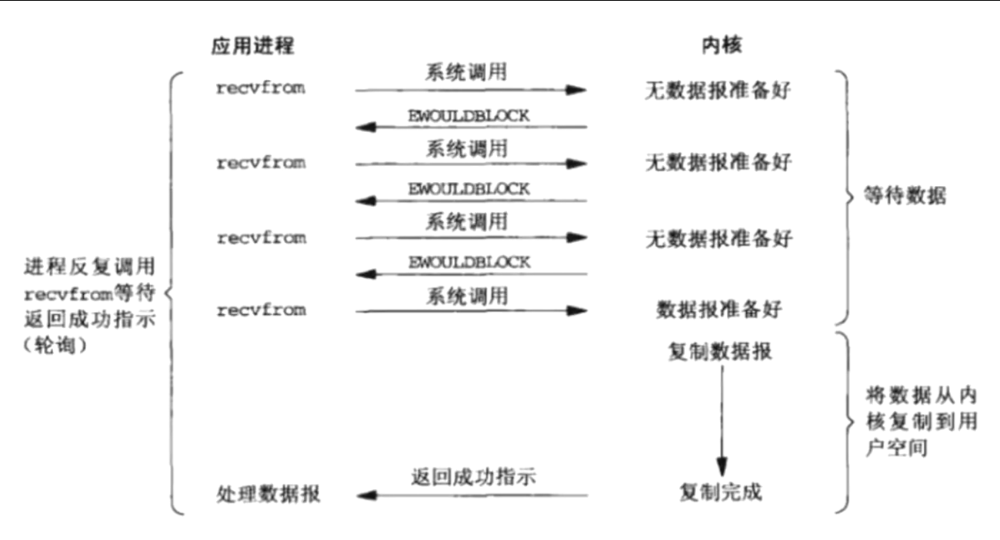
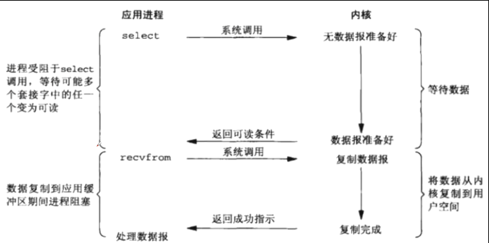
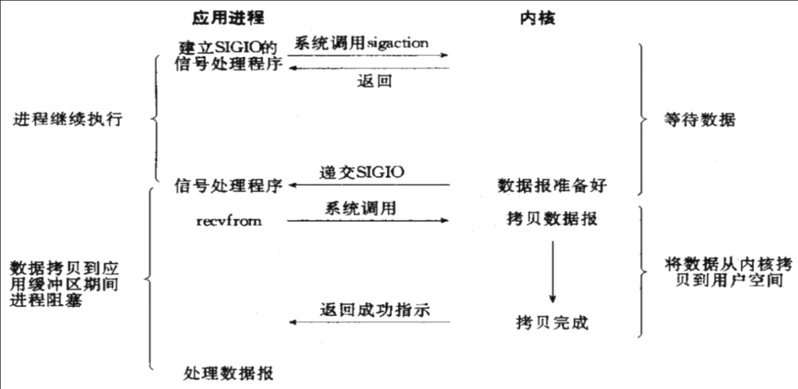
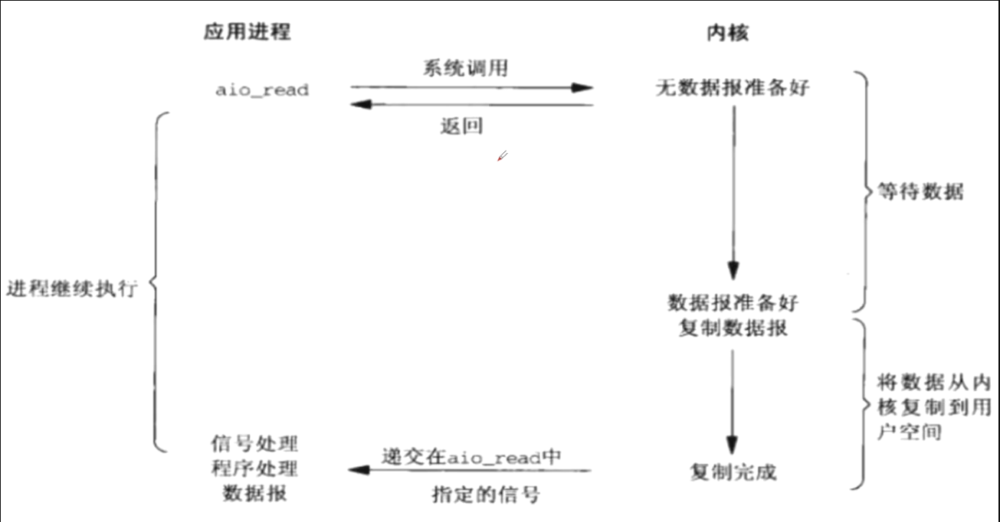

# 字符流、字节流

## 字节与字符

Bit最小的二进制单位 ，是计算机的操作部分。取值0或者1

Byte（字节）是计算机操作数据的最小单位由8位bit组成 取值（-128-127）

Char（字符）是用户的可读写的最小单位，在Java里面由16位bit组成 取值（0-65535）

## 字节流

操作byte类型数据，主要操作类是OutputStream、InputStream的子类；不用缓冲区，直接对文件本身操作。

## 字符流

操作字符类型数据，主要操作类是Reader、Writer的子类；使用缓冲区缓冲字符，不关闭流就不会输出任何内容。

## 互相转换

整个IO包实际上分为字节流和字符流，但是除了这两个流之外，还存在一组字节流-字符流的转换类。

OutputStreamWriter：是Writer的子类，将输出的字符流变为字节流，即将一个字符流的输出对象变为字节流输出对象。

InputStreamReader：是Reader的子类，将输入的字节流变为字符流，即将一个字节流的输入对象变为字符流的输入对象。

# 输入流、输出流

输入、输出，有一个参照物，参照物就是存储数据的介质。如果是把对象读入到介质中，这就是输入。从介质中向外读数据，这就是输出。

所以，输入流是把数据写入存储介质的。输出流是从存储介质中把数据读取出来。

# 字节流和字符流之间的相互转换

想要实现字符流和字节流之间的相互转换需要用到两个类：

- OutputStreamWriter 是字符流通向字节流的桥梁
- InputStreamReader 是字节流通向字符流的桥梁

## 字符流转成字节流

```java

public static void main(String[] args) throws IOException {
    File f = new File("test.txt");

    // OutputStreamWriter 是字符流通向字节流的桥梁,创建了一个字符流通向字节流的对象
    OutputStreamWriter osw = new OutputStreamWriter(new FileOutputStream(f),"UTF-8");

    osw.write("我是字符流转换成字节流输出的");
    osw.close();
}
```

## 字节流转成字符流

```java
public static void main(String[] args) throws IOException {

    File f = new File("test.txt");

    InputStreamReader inr = new InputStreamReader(new FileInputStream(f),"UTF-8");

    char[] buf = new char[1024];

    int len = inr.read(buf);
    System.out.println(new String(buf,0,len));

    inr.close();
}
```

# 同步、异步

同步与异步描述的是被调用者的。

如A调用B：

如果是同步，B在接到A的调用后，会立即执行要做的事。A的本次调用可以得到结果。

如果是异步，B在接到A的调用后，不保证会立即执行要做的事，但是保证会去做，B在做好了之后会通知A。A的本次调用得不到结果，但是B执行完之后会通知A。

# 阻塞、非阻塞

阻塞与非阻塞描述的是调用者的

如A调用B：

如果是阻塞，A在发出调用后，要一直等待，等着B返回结果。

如果是非阻塞，A在发出调用后，不需要等待，可以去做自己的事情。

# 同步，异步 和 阻塞，非阻塞之间的区别

同步，异步，是描述被调用方的。就是上面AB中的B，如果B在接到A的请求之后马上去做，就是同步，如果还未去做，但是保证会做，做完之后通知A就是异步。

阻塞、非阻塞，是描述调用方的。就是上面AB中的A，如果A在发出请求之后一直在等着B返回的结果，就是阻塞，如果A发出请求之后，不等B的结果了，转身去做其他的事，就是非阻塞。

同步不一定阻塞，异步也不一定非阻塞。没有必然关系。

举个简单的例子，老张烧水。 1 老张把水壶放到火上，一直在水壶旁等着水开。（同步阻塞） 2 老张把水壶放到火上，去客厅看电视，时不时去厨房看看水开没有。（同步非阻塞） 3 老张把响水壶放到火上，一直在水壶旁等着水开。（异步阻塞） 4 老张把响水壶放到火上，去客厅看电视，水壶响之前不再去看它了，响了再去拿壶。（异步非阻塞）

# Linux 5种IO模型

对于一次IO访问，数据会先被拷贝到内核的缓冲区中，然后才会从内核的缓冲区拷贝到应用程序的地址空间。需要经历两个阶段：

- 准备数据
- 将数据从内核缓冲区拷贝到进程地址空间


由于存在这两个阶段，Linux产生了下面五种IO模型（以socket为例）

## 阻塞式IO模型

最传统的一种IO模型，即在读写数据过程中会发生阻塞现象。

当用户线程发出IO请求之后，内核会去查看数据是否就绪，如果没有就绪就会等待数据就绪，而用户线程就会处于阻塞状态，用户线程交出CPU。当数据就绪之后，内核会将数据拷贝到用户线程，并返回结果给用户线程，用户线程才解除block状态。

典型的阻塞IO模型的例子为：

```java
data = socket.read();
```

如果数据没有就绪，就会一直阻塞在read方法。这里的阻塞就是调用方，表示用户线程，被调用者就是内核。

以Socket为例：

- 当用户进程调用了recvfrom等阻塞方法时，内核进入IO的第1个阶段：准备数据（内核需要等待足够的数据再拷贝）这个过程需要等待，用户进程会被阻塞，等内核将数据准备好，然后拷贝到用户地址空间，内核返回结果，用户进程才从阻塞态进入就绪态
- Linux中默认情况下所有的socket都是阻塞的



## 非阻塞IO模型

当用户线程发起一个read操作后，并不需要等待，而是马上就得到了一个结果。如果结果是一个error时，它就知道数据还没有准备好，于是它可以再次发送read操作。一旦内核中的数据准备好了，并且又再次收到了用户线程的请求，那么它马上就将数据拷贝到了用户线程，然后返回。

所以事实上，在非阻塞IO模型中，用户线程需要不断地询问内核数据是否就绪，也就说非阻塞IO不会交出CPU，而会一直占用CPU。**为什么叫非阻塞，就是因为它此时还占用的CPU，然后一直轮询内核是不是已经把需要数据准备好了**。

典型的非阻塞IO模型一般如下：

```java
while(true){
    data = socket.read();
    if(data!= error){
        处理数据
        break;
    }
}
```

但是对于非阻塞IO就有一个非常严重的问题，**在while循环中需要不断地去询问内核数据是否就绪，这样会导致CPU占用率非常高，因此一般情况下很少使用while循环这种方式来读取数据**。

- 当用户进程发出read操作时，如果kernel中的数据还没有准备好，那么它并不会block用户进程，而是立刻返回一个error。
- 用户进程判断结果是一个error时，它就知道数据还没有准备好，于是它可以再次发送read操作
- 一旦kernel中的数据准备好了，并且又再次收到了用户进程的system call，那么它马上就将数据拷贝到了用户内存，然后返回
- 非阻塞IO模式下用户进程需要不断地询问内核的数据准备好了没有



## IO复用模型

多路复用IO模型是目前使用得比较多的模型。Java NIO实际上就是多路复用IO。

在多路复用IO模型中，会有一个线程不断去轮询多个socket的状态，只有当socket真正有读写事件时，才真正调用实际的IO读写操作。因为在多路复用IO模型中，**只需要使用一个线程就可以管理多个socket，系统不需要建立新的进程或者线程，也不必维护这些线程和进程，并且只有在真正有socket读写事件进行时，才会使用IO资源，所以它大大减少了资源占用**。

在Java NIO中，是通过selector.select()去查询每个通道是否有到达事件，如果没有事件，则一直阻塞在那里，因此这种方式会导致用户线程的阻塞。

也许有朋友会说，我可以采用 多线程+ 阻塞IO 达到类似的效果，但是由于在多线程 + 阻塞IO 中，每个socket对应一个线程，这样会造成很大的资源占用，并且尤其是对于长连接来说，线程的资源一直不会释放，如果后面陆续有很多连接的话，就会造成性能上的瓶颈。

而多路复用IO模式，通过一个线程就可以管理多个socket，只有当socket真正有读写事件发生才会占用资源来进行实际的读写操作。因此，多路复用IO比较适合连接数比较多的情况。

另外多路复用IO为何比非阻塞IO模型的效率高是因为在非阻塞IO中，不断地询问socket状态时通过用户线程去进行的，而在多路复用IO中，轮询每个socket状态是内核在进行的，这个效率要比用户线程要高的多。

不过要注意的是，**多路复用IO模型是通过轮询的方式来检测是否有事件到达，并且对到达的事件逐一进行响应。因此对于多路复用IO模型来说，一旦事件响应体很大，那么就会导致后续的事件迟迟得不到处理，并且会影响新的事件轮询**。

- 通过一种机制，一个进程可以监视多个文件描述符（套接字描述符）一旦某个文件描述符就绪（一般是读就绪或者写就绪），能够通知程序进行相应的读写操作（这样就不需要每个用户进程不断的询问内核数据准备好了没）
- 常用的IO多路复用方式有select、poll和epoll

## 信号驱动IO模型

在信号驱动IO模型中，当用户线程发起一个IO请求操作，会给对应的socket注册一个信号函数，然后用户线程会继续执行，当内核数据就绪时会发送一个信号给用户线程，用户线程接收到信号之后，便在信号函数中调用IO读写操作来进行实际的IO请求操作。



## 异步IO模型

异步IO模型是比较理想的IO模型，在异步IO模型中，当用户线程发起read操作之后，立刻就可以开始去做其它的事。而另一方面，从内核的角度，当它受到一个asynchronous read之后，它会立刻返回，说明read请求已经成功发起了，因此不会对用户线程产生任何block。然后，内核会等待数据准备完成，**然后将数据拷贝到用户线程**，当这一切都完成之后，内核会给用户线程发送一个信号，告诉它read操作完成了。也就说用户线程完全不需要实际的整个IO操作是如何进行的，只需要先发起一个请求，当接收内核返回的成功信号时表示IO操作已经完成，可以直接去使用数据了。

也就说在异步IO模型中，IO操作的两个阶段都不会阻塞用户线程，**这两个阶段都是由内核自动完成（发起申请和数据复制）**，然后发送一个信号告知用户线程操作已完成。用户线程中不需要再次调用IO函数进行具体的读写。这点是和信号驱动模型有所不同的，在信号驱动模型中，当用户线程接收到信号表示数据已经就绪，然后需要用户线程调用IO函数进行实际的读写操作；而在异步IO模型中，收到信号表示IO操作已经完成，不需要再在用户线程中调用iO函数进行实际的读写操作。

注意，异步IO是需要操作系统的底层支持，在Java 7中，提供了Asynchronous IO。



前面四种IO模型实际上都属于同步IO，只有最后一种是真正的异步IO，因为无论是多路复用IO还是信号驱动模型，IO操作的第2个阶段都会引起用户线程阻塞（数据复制的阶段），也就是内核进行数据拷贝的过程都会让用户线程阻塞。

# BIO、NIO和AIO的区别、三种IO的用法与原理

## IO

什么是IO? 它是指计算机与外部世界或者一个程序与计算机的其余部分的之间的接口。它对于任何计算机系统都非常关键，因而所有 I/O 的主体实际上是内置在操作系统中的。单独的程序一般是让系统为它们完成大部分的工作。

在 Java 编程中，直到最近一直使用 流 的方式完成 I/O。所有 I/O 都被视为单个的字节的移动，通过一个称为 Stream 的对象一次移动一个字节。流 I/O 用于与外部世界接触。它也在内部使用，用于将对象转换为字节，然后再转换回对象。

## BIO

Java BIO即Block I/O ， 同步并阻塞的IO。

BIO就是传统的java.io包下面的代码实现。

## NIO

什么是NIO? NIO 与原来的 I/O 有同样的作用和目的, 他们之间最重要的区别是数据打包和传输的方式。原来的 I/O 以流的方式处理数据，而 NIO 以块的方式处理数据。

面向流 的 I/O 系统一次一个字节地处理数据。一个输入流产生一个字节的数据，一个输出流消费一个字节的数据。为流式数据创建过滤器非常容易。链接几个过滤器，以便每个过滤器只负责单个复杂处理机制的一部分，这样也是相对简单的。不利的一面是，面向流的 I/O 通常相当慢。

一个 面向块 的 I/O 系统以块的形式处理数据。每一个操作都在一步中产生或者消费一个数据块。按块处理数据比按(流式的)字节处理数据要快得多。但是面向块的 I/O 缺少一些面向流的 I/O 所具有的优雅性和简单性。

## AIO

Java AIO即Async非阻塞，是异步非阻塞的IO。

## 区别及联系

- BIO （Blocking I/O）：同步阻塞I/O模式，数据的读取写入必须阻塞在一个线程内等待其完成。这里假设一个烧开水的场景，有一排水壶在烧开水，BIO的工作模式就是， 叫一个线程停留在一个水壶那，直到这个水壶烧开，才去处理下一个水壶。但是实际上线程在等待水壶烧开的时间段什么都没有做。
- NIO （New I/O）：同时支持阻塞与非阻塞模式，但这里我们以其同步非阻塞I/O模式来说明，那么什么叫做同步非阻塞？如果还拿烧开水来说，NIO的做法是叫一个线程不断的轮询每个水壶的状态，看看是否有水壶的状态发生了改变，从而进行下一步的操作。
- AIO （ Asynchronous I/O）：异步非阻塞I/O模型。异步非阻塞与同步非阻塞的区别在哪里？异步非阻塞无需一个线程去轮询所有IO操作的状态改变，在相应的状态改变后，系统会通知对应的线程来处理。对应到烧开水中就是，为每个水壶上面装了一个开关，水烧开之后，水壶会自动通知我水烧开了。

## 各自适用场景

## 使用方式

### 使用BIO实现文件的读取和写入

```java
//Initializes The Object
User1 user = new User1();
user.setName("hollis");
user.setAge(23);
System.out.println(user);

//Write Obj to File
ObjectOutputStream oos = null;
try {
    oos = new ObjectOutputStream(new FileOutputStream("tempFile"));
    oos.writeObject(user);
} catch (IOException e) {
    e.printStackTrace();
} finally {
    IOUtils.closeQuietly(oos);
}

//Read Obj from File
File file = new File("tempFile");
ObjectInputStream ois = null;
try {
    ois = new ObjectInputStream(new FileInputStream(file));
    User1 newUser = (User1) ois.readObject();
    System.out.println(newUser);
} catch (IOException e) {
    e.printStackTrace();
} catch (ClassNotFoundException e) {
    e.printStackTrace();
} finally {
    IOUtils.closeQuietly(ois);
    try {
        FileUtils.forceDelete(file);
    } catch (IOException e) {
        e.printStackTrace();
    }
}
```

### 使用NIO实现文件的读取和写入

```java
static void readNIO() {
    String pathname = "C:\\Users\\adew\\Desktop\\jd-gui.cfg";
    FileInputStream fin = null;
    try {
        fin = new FileInputStream(new File(pathname));
        FileChannel channel = fin.getChannel();

        int capacity = 100;// 字节
        ByteBuffer bf = ByteBuffer.allocate(capacity);
        System.out.println("限制是：" + bf.limit() + "容量是：" + bf.capacity()
                + "位置是：" + bf.position());
        int length = -1;

        while ((length = channel.read(bf)) != -1) {

            /*
                * 注意，读取后，将位置置为0，将limit置为容量, 以备下次读入到字节缓冲中，从0开始存储
                */
            bf.clear();
            byte[] bytes = bf.array();
            System.out.write(bytes, 0, length);
            System.out.println();

            System.out.println("限制是：" + bf.limit() + "容量是：" + bf.capacity()
                    + "位置是：" + bf.position());

        }

        channel.close();

    } catch (FileNotFoundException e) {
        e.printStackTrace();
    } catch (IOException e) {
        e.printStackTrace();
    } finally {
        if (fin != null) {
            try {
                fin.close();
            } catch (IOException e) {
                e.printStackTrace();
            }
        }
    }
}

static void writeNIO() {
    String filename = "out.txt";
    FileOutputStream fos = null;
    try {

        fos = new FileOutputStream(new File(filename));
        FileChannel channel = fos.getChannel();
        ByteBuffer src = Charset.forName("utf8").encode("你好你好你好你好你好");
        // 字节缓冲的容量和limit会随着数据长度变化，不是固定不变的
        System.out.println("初始化容量和limit：" + src.capacity() + ","
                + src.limit());
        int length = 0;

        while ((length = channel.write(src)) != 0) {
            /*
                * 注意，这里不需要clear，将缓冲中的数据写入到通道中后 第二次接着上一次的顺序往下读
                */
            System.out.println("写入长度:" + length);
        }

    } catch (FileNotFoundException e) {
        e.printStackTrace();
    } catch (IOException e) {
        e.printStackTrace();
    } finally {
        if (fos != null) {
            try {
                fos.close();
            } catch (IOException e) {
                e.printStackTrace();
            }
        }
    }
}
```

### 使用AIO实现文件的读取和写入

```java
public class ReadFromFile {
  public static void main(String[] args) throws Exception {
    Path file = Paths.get("/usr/a.txt");
    AsynchronousFileChannel channel = AsynchronousFileChannel.open(file);

    ByteBuffer buffer = ByteBuffer.allocate(100_000);
    Future<Integer> result = channel.read(buffer, 0);

    while (!result.isDone()) {
      ProfitCalculator.calculateTax();
    }
    Integer bytesRead = result.get();
    System.out.println("Bytes read [" + bytesRead + "]");
  }
}
class ProfitCalculator {
  public ProfitCalculator() {
  }
  public static void calculateTax() {
  }
}

public class WriteToFile {

  public static void main(String[] args) throws Exception {
    AsynchronousFileChannel fileChannel = AsynchronousFileChannel.open(
        Paths.get("/asynchronous.txt"), StandardOpenOption.READ,
        StandardOpenOption.WRITE, StandardOpenOption.CREATE);
    CompletionHandler<Integer, Object> handler = new CompletionHandler<Integer, Object>() {

      @Override
      public void completed(Integer result, Object attachment) {
        System.out.println("Attachment: " + attachment + " " + result
            + " bytes written");
        System.out.println("CompletionHandler Thread ID: "
            + Thread.currentThread().getId());
      }

      @Override
      public void failed(Throwable e, Object attachment) {
        System.err.println("Attachment: " + attachment + " failed with:");
        e.printStackTrace();
      }
    };

    System.out.println("Main Thread ID: " + Thread.currentThread().getId());
    fileChannel.write(ByteBuffer.wrap("Sample".getBytes()), 0, "First Write",
        handler);
    fileChannel.write(ByteBuffer.wrap("Box".getBytes()), 0, "Second Write",
        handler);

  }
}
```

# netty

Netty是一个非阻塞I/O客户端-服务器框架，主要用于开发Java网络应用程序，如协议服务器和客户端。异步事件驱动的网络应用程序框架和工具用于简化网络编程，例如TCP和UDP套接字服务器。Netty包括了反应器编程模式的实现。Netty最初由JBoss开发，现在由Netty项目社区开发和维护。

除了作为异步网络应用程序框架，Netty还包括了对HTTP、HTTP2、DNS及其他协议的支持，涵盖了在Servlet容器内运行的能力、对WebSockets的支持、与Google Protocol Buffers的集成、对SSL/TLS的支持以及对用于SPDY协议和消息压缩的支持。自2004年以来，Netty一直在被积极开发

从版本4.0.0开始，Netty在支持NIO和阻塞Java套接字的同时，还支持使用NIO.2作为后端。

- 本质：JBoss做的一个Jar包

- 目的：快速开发高性能、高可靠性的网络服务器和客户端程序

- 优点：提供异步的、事件驱动的网络应用程序框架和工具