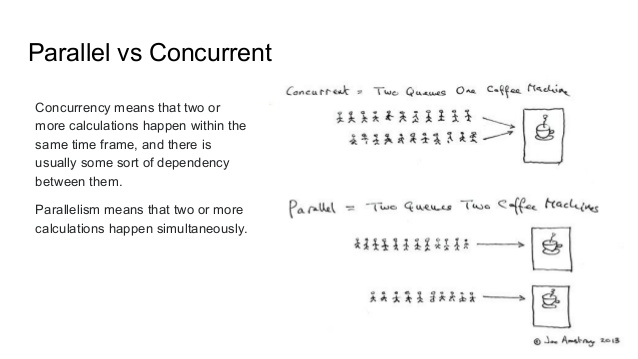

# 什么是并发

并发（Concurrent），在操作系统中，是指一个时间段中有几个程序都处于已启动运行到运行完毕之间，且这几个程序都是在同一个处理机上运行。

那么，操作系统视如何实现这种并发的呢？

现在我们用到操作系统，无论是Windows、Linux还是MacOS等其实都是多用户多任务分时操作系统。使用这些操作系统的用户是可以“同时”干多件事的。

但是实际上，对于单CPU的计算机来说，在CPU中，同一时间是只能干一件事儿的。为了看起来像是“同时干多件事”，分时操作系统是把CPU的时间划分成长短基本相同的时间区间,即”时间片”，通过操作系统的管理，把这些时间片依次轮流地分配给各个用户使用。

如果某个作业在时间片结束之前,整个任务还没有完成，那么该作业就被暂停下来,放弃CPU，等待下一轮循环再继续做.此时CPU又分配给另一个作业去使用。

由于计算机的处理速度很快，只要时间片的间隔取得适当,那么一个用户作业从用完分配给它的一个时间片到获得下一个CPU时间片，中间有所”停顿”，但用户察觉不出来,好像整个系统全由它”独占”似的。

所以，在单CPU的计算机中，我们看起来“同时干多件事”，其实是通过CPU时间片技术，并发完成的。

# 什么是并行

并行（Parallel），当系统有一个以上CPU时，当一个CPU执行一个进程时，另一个CPU可以执行另一个进程，两个进程互不抢占CPU资源，可以同时进行，这种方式我们称之为并行(Parallel)。

# 并发与并行的区别

Erlang 之父 Joe Armstrong 用一张比较形象的图解释了并发与并行的区别：

并发是两个队伍交替使用一台咖啡机。并行是两个队伍同时使用两台咖啡机。

映射到计算机系统中，上图中的咖啡机就是CPU，两个队伍指的就是两个进程。