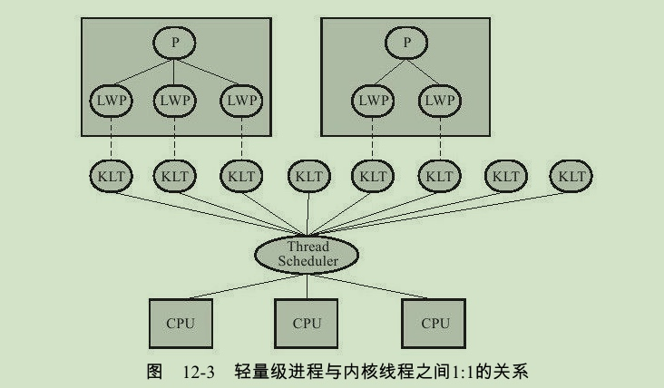
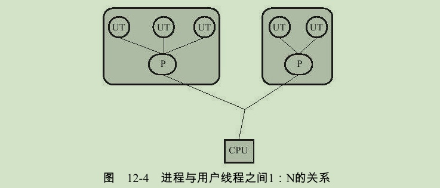
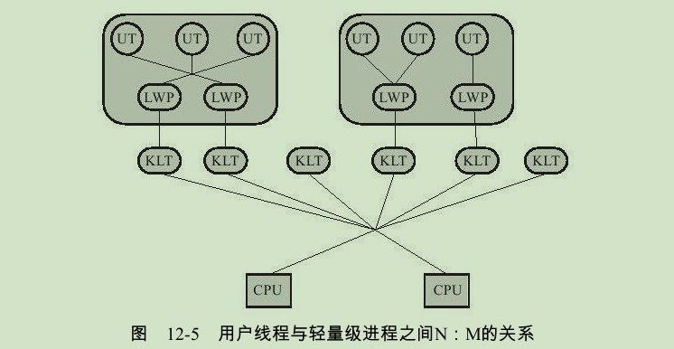
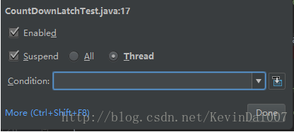
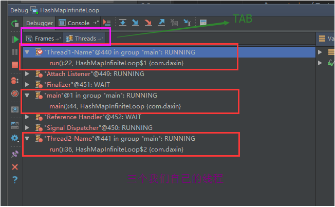
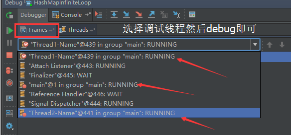

# 线程与进程的区别

为了看起来像是“同时干多件事”，**分时操作系统**是把CPU的时间划分成长短基本相同的”时间片”，通过操作系统的管理，**把这些时间片依次轮流地分配给各个用户的各个任务使用**。

在多任务处理系统中，CPU需要处理所有程序的操作，当用户来回切换它们时，需要记录这些程序执行到哪里。在操作系统中，CPU切换到另一个进程需要保存当前进程的状态并恢复另一个进程的状态：当前运行任务转为就绪（或者挂起、删除）状态，另一个被选定的就绪任务成为当前任务。**上下文切换就是这样一个过程**，他允许CPU记录并恢复各种正在运行程序的状态，使它能够完成切换操作。

在上下文切换过程中，CPU会停止处理当前运行的程序，并保存当前程序运行的具体位置以便之后继续运行。从这个角度来看，上下文切换有点像我们同时阅读几本书，在来回切换书本的同时我们需要记住每本书当前读到的页码。在程序中，**上下文切换过程中的“页码”信息是保存在进程控制块（PCB）中的。PCB还经常被称作“切换帧”（switchframe）。“页码”信息会一直保存到CPU的内存中，直到他们被再次使用**。

对于操作系统来说，一个任务就是一个进程（Process），比如打开一个浏览器就是启动一个浏览器进程，打开一个记事本就启动了一个记事本进程，打开两个记事本就启动了两个记事本进程，打开一个Word就启动了一个Word进程。

而在多个进程之间切换的时候，需要进行上下文切换。但是上下文切换势必会耗费一些资源。于是人们考虑，能不能在一个进程中增加一些“子任务”，这样减少上下文切换的成本。比如我们使用Word的时候，它可以同时进行打字、拼写检查、字数统计等，这些子任务之间共用同一个进程资源，但是他们之间的切换不需要进行上下文切换。

在一个进程内部，要同时干多件事，就需要同时运行多个“子任务”，我们把进程内的这些“子任务”称为线程（Thread）。

随着时间的慢慢发展，人们进一步的切分了进程和线程之间的职责。把进程当做资源分配的基本单元，把线程当做执行的基本单元，同一个进程的多个线程之间共享资源

拿我们比较熟悉的Java语言来说，Java程序是运行在JVM上面的，每一个JVM其实就是一个进程。所有的资源分配都是基于JVM进程来的。而在这个JVM进程中，又可以创建出很多线程，多个线程之间共享JVM资源，并且多个线程可以并发执行。

# 线程的特点

在多线程操作系统中，通常是在一个进程中包括多个线程，每个线程都是作为利用CPU的基本单位，是花费最小开销的实体。线程具有以下属性。

## 轻型实体

线程中的实体基本上不拥有系统资源，只是有一点必不可少的、能保证独立运行的资源。 

线程的实体包括程序、数据和TCB。

线程是动态概念，它的动态特性由线程控制块TCB（Thread Control Block）描述。

TCB包括以下信息： （1）线程状态。 （2）当线程不运行时，被保存的现场资源。 （3）一组执行堆栈。 （4）存放每个线程的局部变量主存区。 （5）访问同一个进程中的主存和其它资源。 用于指示被执行指令序列的程序计数器、保留局部变量、少数状态参数和返回地址等的一组寄存器和堆栈。

## 独立调度和分派的基本单位

在多线程操作系统中，线程是能独立运行的基本单位，因而也是独立调度和分派的基本单位。由于线程很“轻”，故线程的切换非常迅速且开销小（在同一进程中的）。

## 可并发执行

在一个进程中的多个线程之间，可以并发执行，甚至允许在一个进程中所有线程都能并发执行；同样，不同进程中的线程也能并发执行，充分利用和发挥了处理机与外围设备并行工作的能力。

## 共享进程资源

在同一进程中的各个线程，都可以共享该进程所拥有的资源，这首先表现在：所有线程都具有相同的地址空间（进程的地址空间），这意味着，线程可以访问该地址空间的每一个虚地址；此外，还可以访问进程所拥有的已打开文件、定时器、信号量机构等。由于同一个进程内的线程共享内存和文件，所以线程之间互相通信不必调用内核。

# 线程的实现

主流的操作系统都提供了线程实现，实现线程主要有3种方式：使用内核线程实现、使用用户线程实现和使用用户线程加轻量级进程混合实现。

## 使用内核线程实现

内核线程（Kernel-Level Thread,KLT）就是直接由操作系统内核（Kernel，下称内核）支持的线程，这种线程由内核来完成线程切换，内核通过操纵调度器（Scheduler）对线程进行调度，并负责将线程的任务映射到各个处理器上。每个内核线程可以视为内核的一个分身，这样操作系统就有能力同时处理多件事情，支持多线程的内核就叫做多线程内核（Multi-Threads Kernel）。

程序一般不会直接去使用内核线程，而是去使用内核线程的一种高级接口——轻量级进程（Light Weight Process,LWP），轻量级进程就是我们通常意义上所讲的线程，由于每个轻量级进程都由一个内核线程支持，因此只有先支持内核线程，才能有轻量级进程。这种轻量级进程与内核线程之间1:1的关系称为一对一的线程模型，如图所示。



由于内核线程的支持，每个轻量级进程都成为一个独立的调度单元，即使有一个轻量级进程在系统调用中阻塞了，也不会影响整个进程继续工作，但是轻量级进程具有它的局限性：首先，由于是基于内核线程实现的，所以各种线程操作，如创建、析构及同步，都需要进行系统调用。而系统调用的代价相对较高，需要在用户态（User Mode）和内核态（Kernel Mode）中来回切换。其次，每个轻量级进程都需要有一个内核线程的支持，因此轻量级进程要消耗一定的内核资源（如内核线程的栈空间），因此一个系统支持轻量级进程的数量是有限的。

## 使用用户线程实现

从广义上来讲，一个线程只要不是内核线程，就可以认为是用户线程（User Thread,UT），因此，从这个定义上来讲，轻量级进程也属于用户线程，但轻量级进程的实现始终是建立在内核之上的，许多操作都要进行系统调用，效率会受到限制。

而狭义上的用户线程指的是完全建立在用户空间的线程库上，系统内核不能感知线程存在的实现。用户线程的建立、同步、销毁和调度完全在用户态中完成，不需要内核的帮助。如果程序实现得当，这种线程不需要切换到内核态，因此操作可以是非常快速且低消耗的，也可以支持规模更大的线程数量，部分高性能数据库中的多线程就是由用户线程实现的。这种进程与用户线程之间1：N的关系称为一对多的线程模型，如图所示。



使用用户线程的优势在于不需要系统内核支援，劣势也在于没有系统内核的支援，所有的线程操作都需要用户程序自己处理。线程的创建、切换和调度都是需要考虑的问题，而且由于操作系统只把处理器资源分配到进程，那诸如“阻塞如何处理”、“多处理器系统中如何将线程映射到其他处理器上”这类问题解决起来将会异常困难，甚至不可能完成。因而使用用户线程实现的程序一般都比较复杂 ，除了以前在不支持多线程的操作系统中（如DOS）的多线程程序与少数有特殊需求的程序外，现在使用用户线程的程序越来越少了，Java、Ruby等语言都曾经使用过用户线程，最终又都放弃使用它。

## 使用用户线程加轻量级进程混合实现

线程除了依赖内核线程实现和完全由用户程序自己实现之外，还有一种将内核线程与用户线程一起使用的实现方式。在这种混合实现下，既存在用户线程，也存在轻量级进程。用户线程还是完全建立在用户空间中，因此用户线程的创建、切换、析构等操作依然廉价，并且可以支持大规模的用户线程并发。而操作系统提供支持的轻量级进程则作为用户线程和内核线程之间的桥梁，这样可以使用内核提供的线程调度功能及处理器映射，并且用户线程的系统调用要通过轻量级线程来完成，大大降低了整个进程被完全阻塞的风险。在这种混合模式中，用户线程与轻量级进程的数量比是不定的，即为N：M的关系，如图12-5所示，这种就是多对多的线程模型。

许多UNIX系列的操作系统，如Solaris、HP-UX等都提供了N：M的线程模型实现。



## Java线程的实现

Java线程在JDK 1.2之前，是基于称为“绿色线程”（Green Threads）的用户线程实现的，而在JDK 1.2中，线程模型替换为基于操作系统原生线程模型来实现。因此，在目前的JDK版本中，操作系统支持怎样的线程模型，在很大程度上决定了Java虚拟机的线程是怎样映射的，这点在不同的平台上没有办法达成一致，虚拟机规范中也并未限定Java线程需要使用哪种线程模型来实现。线程模型只对线程的并发规模和操作成本产生影响，对Java程序的编码和运行过程来说，这些差异都是透明的。

对于Sun JDK来说，它的Windows版与Linux版都是使用一对一的线程模型实现的，一条Java线程就映射到一条轻量级进程之中，因为Windows和Linux系统提供的线程模型就是一对一的。

而在Solaris平台中，由于操作系统的线程特性可以同时支持一对一（通过Bound Threads或Alternate Libthread实现）及多对多（通过LWP/Thread Based Synchronization实现）的线程模型，因此在Solaris版的JDK中也对应提供了两个平台专有的虚拟机参数：-XX：+UseLWPSynchronization（默认值）和-XX：+UseBoundThreads来明确指定虚拟机使用哪种线程模型。

Java语言则提供了在不同硬件和操作系统平台下对线程操作的统一处理，每个已经执行start（）且还未结束的java.lang.Thread类的实例就代表了一个线程。我们注意到Thread类与大部分的Java API有显著的差别，它的所有关键方法都是声明为Native的。在Java API中，一个Native方法往往意味着这个方法没有使用或无法使用平台无关的手段来实现（当然也可能是为了执行效率而使用Native方法，不过，通常最高效率的手段也就是平台相关的手段）。

# 线程的状态

线程是有状态的，并且这些状态之间也是可以互相流转的。Java中线程的状态分为6种：

1. 初始(NEW)：新创建了一个线程对象，但还没有调用start()方法。
2. 运行(RUNNABLE)：Java线程中将就绪（READY）和运行中（RUNNING）两种状态笼统的称为“运行”。
    - 就绪（READY）:线程对象创建后，其他线程(比如main线程）调用了该对象的start()方法。该状态的线程位于可运行线程池中，等待被线程调度选中并分配cpu使用权。
    - 运行中（RUNNING）：就绪(READY)的线程获得了cpu 时间片，开始执行程序代码。
3. 阻塞(BLOCKED)：表示线程阻塞于锁（关于锁，在后面章节会介绍）。
4. 等待(WAITING)：进入该状态的线程需要等待其他线程做出一些特定动作（通知或中断）。
5. 超时等待(TIMED_WAITING)：该状态不同于WAITING，它可以在指定的时间后自行返回。
6. 终止(TERMINATED)：表示该线程已经执行完毕。

下图是一张线程状态的流转图：


可以看到，图中的各个状态之间的流转路径上都有标注对应的Java中的方法。这些就是Java中进行线程调度的一些api。

# 线程优先级

我们学习过，Java虚拟机采用抢占式调度模型。也就是说他会给优先级更高的线程优先分配CPU。

虽然Java线程调度是系统自动完成的，但是我们还是可以“建议”系统给某些线程多分配一点执行时间，另外的一些线程则可以少分配一点——这项操作可以通过设置线程优先级来完成。

Java语言一共设置了10个级别的线程优先级（Thread.MIN_PRIORITY至Thread.MAX_PRIORITY），在两个线程同时处于Ready状态时，优先级越高的线程越容易被系统选择执行。

Java 线程优先级使用 1 ~ 10 的整数表示。默认的优先级是5。

```
最低优先级 1：Thread.MIN_PRIORITY

最高优先级 10：Thread.MAX_PRIORITY

普通优先级 5：Thread.NORM_PRIORITY
```

在Java中，可以使用Thread类的setPriority()方法为线程设置了新的优先级。getPriority()方法返回线程的当前优先级。当创建一个线程时，其默认优先级是创建该线程的线程的优先级。

以下代码演示如何设置和获取线程的优先：

```java
/**
 * @author Hollis
 */
public class Main {

    public static void main(String[] args) {
        Thread t = Thread.currentThread();
        System.out.println("Main Thread  Priority:" + t.getPriority());

        Thread t1 = new Thread();
        System.out.println("Thread(t1) Priority:" + t1.getPriority());
        t1.setPriority(Thread.MAX_PRIORITY - 1);
        System.out.println("Thread(t1) Priority:" + t1.getPriority());

        t.setPriority(Thread.NORM_PRIORITY);
        System.out.println("Main Thread  Priority:" + t.getPriority());

        Thread t2 = new Thread();
        System.out.println("Thread(t2) Priority:" + t2.getPriority());

        // Change thread t2 priority to minimum
        t2.setPriority(Thread.MIN_PRIORITY);
        System.out.println("Thread(t2) Priority:" + t2.getPriority());
    }
}
```

输出结果为：

```java
Main Thread  Priority:5
Thread(t1) Priority:5
Thread(t1) Priority:9
Main Thread  Priority:5
Thread(t2) Priority:5
Thread(t2) Priority:1
```

在上面的代码中，Java虚拟机启动时，就会通过main方法启动一个线程，JVM就会一直运行下去，直到以下任意一个条件发生：

- 调用了exit()方法，并且exit()有权限被正常执行。
- 所有的“非守护线程”都死了(即JVM中仅仅只有“守护线程”)。

# 线程调度

在关于线程安全的文章中，我们提到过，对于单CPU的计算机来说，在任意时刻只能执行一条机器指令，每个线程只有获得CPU的使用权才能执行指令。

所谓多线程的并发运行，其实是指从宏观上看，各个线程轮流获得CPU的使用权，分别执行各自的任务。

前面关于线程状态的介绍中，我们知道，线程的运行状态中包含两种子状态，即就绪（READY）和运行中(RUNNING)。

而一个线程想要从就绪状态变成运行中状态，这个过程需要系统调度，即给线程分配CPU的使用权，获得CPU使用权的线程才会从就绪状态变成运行状态。

给多个线程按照特定的机制分配CPU的使用权的过程就叫做线程调度。

还记得在介绍进程和线程的区别的时候，我们提到过的一句话吗：进程是分配资源的基本单元，线程是CPU调度的基本单元。这里所说的调度指的就是给其分配CPU时间片，让其执行任务。

## Linux线程调度

在Linux中，线程是由进程来实现，线程就是轻量级进程（ lightweight process ），因此在Linux中，线程的调度是按照进程的调度方式来进行调度的，也就是说线程是调度单元。

Linux这样实现的线程的好处的之一是：线程调度直接使用进程调度就可以了，没必要再搞一个进程内的线程调度器。在Linux中，调度器是基于线程的调度策略（scheduling policy）和静态调度优先级（static scheduling priority）来决定那个线程来运行。

在Linux中，主要有三种调度策略。分别是：

- SCHED_OTHER 分时调度策略，（默认的）
- SCHED_FIFO 实时调度策略，先到先服务
- SCHED_RR 实时调度策略，时间片轮转

## Windows线程调度

Windows 采用基于优先级的、抢占调度算法来调度线程。

用于处理调度的 Windows 内核部分称为调度程序，Windows 调度程序确保具有最高优先级的线程总是在运行的。由于调度程序选择运行的线程会一直运行，直到被更高优先级的线程所抢占，或终止，或时间片已到，或调用阻塞系统调用（如 I/O）。如果在低优先级线程运行时，更高优先级的实时线程变成就绪，那么低优先级线程就被抢占。这种抢占使得实时线程在需要使用 CPU 时优先得到使用。

## Java线程调度

可以看到，不同的操作系统，有不同的线程调度策略。但是，作为一个Java开发人员来说，我们日常开发过程中一般很少关注操作系统层面的东西。

主要是因为Java程序都是运行在Java虚拟机上面的，而虚拟机帮我们屏蔽了操作系统的差异，所以我们说Java是一个跨平台语言。

在操作系统中，一个Java程序其实就是一个进程。所以，我们说Java是单进程、多线程的！

前面关于线程的实现也介绍过，Thread类与大部分的Java API有显著的差别，它的所有关键方法都是声明为Native的，也就是说，他需要根据不同的操作系统有不同的实现。

在Java的多线程程序中，为保证所有线程的执行能按照一定的规则执行，JVM实现了一个线程调度器，它定义了线程调度模型，对于CPU运算的分配都进行了规定，按照这些特定的机制为多个线程分配CPU的使用权。

主要有两种调度模型：协同式线程调度和抢占式调度模型。

### 协同式线程调度

协同式调度的多线程系统，线程的执行时间由线程本身来控制，线程把自己的工作执行完了之后，要主动通知系统切换到另外一个线程上。协同式多线程的最大好处是实现简单，而且由于线程要把自己的事情干完后才会进行线程切换，切换操作对线程自己是可知的，所以没有什么线程同步的问题。

### 抢占式调度模型

抢占式调度的多线程系统，那么每个线程将由系统来分配执行时间，线程的切换不由线程本身来决定。在这种实现线程调度的方式下，线程的执行时间是系统可控的，也不会有一个线程导致整个进程阻塞的问题。

系统会让可运行池中优先级高的线程占用CPU，如果可运行池中的线程优先级相同，那么就随机选择一个线程，使其占用CPU。处于运行状态的线程会一直运行，直至它不得不放弃CPU。

**Java虚拟机采用抢占式调度模型。**

虽然Java线程调度是系统自动完成的，但是我们还是可以“建议”系统给某些线程多分配一点执行时间，另外的一些线程则可以少分配一点——这项操作可以通过设置线程优先级来完成。Java语言一共设置了10个级别的线程优先级（Thread.MIN_PRIORITY至Thread.MAX_PRIORITY），在两个线程同时处于Ready状态时，优先级越高的线程越容易被系统选择执行。

不过，线程优先级并不是太靠谱，原因是Java的线程是通过映射到系统的原生线程上来实现的，所以线程调度最终还是取决于操作系统，虽然现在很多操作系统都提供线程优先级的概念，但是并不见得能与Java线程的优先级一一对应。

# 多线程如何Debug

转载：https://blog.csdn.net/kevindai007/article/details/71412324

转载：https://www.cnblogs.com/leodaxin/p/7710764.html

使用idea调试多线程的时候发现多线程无法调试,后来经过搜索发现,idea的断点有不同的模式,只有当Thread模式下才能调试多线程,设置方式如下:

1. 在断点上右键
2. 选择Thread,然后点Done(建议选择Thread后点击make default把此模式设置为默认模式)



测试代码，然后进行debug：

```java
package com.daxin;

import java.util.HashMap;

/**
 * Created by Daxin on 2017/10/22.
 */
public class HashMapInfiniteLoop {
    private static HashMap<Integer, Integer> map = new HashMap<Integer, Integer>(2, 0.75f);

    public static void main(String[] args) throws InterruptedException {
        map.put(5, 55);

        new Thread("Thread1-Name") {
            public void run() {
                System.out.println("Thread1-Name Start");
                try {
                    Thread.sleep(5000);
                } catch (InterruptedException e) {
                    e.printStackTrace();
                }
                map.put(7, 77);//断点位置 1
                System.out.println(map);
            }

        }.start();
        new Thread("Thread2-Name") {

            public void run() {
                try {
                    System.out.println("Thread2-Name Start");
                    Thread.sleep(5000);
                } catch (InterruptedException e) {
                    e.printStackTrace();
                }
                map.put(3, 33);// 断点位置2
                System.out.println(map);
            }

        }.start();

        // 断点位置 3
        System.out.println("Thread-Main-Name Start");
        System.out.println("Thread-Main-Name Start");
        System.out.println("Thread-Main-Name Start");

        Thread.sleep(500000);
    }
}
```

启动debug，我们可以在Threads Tab选项双击需要进行单步调试的线程



然后选择Frames Tab选项中调试的线程进行快捷键调试即可



补充:有时可能想在指定的情况下进入断点,如当某个线程时进入断点、当i=999时进入断点,这样可以在断点上加条件


只有在i == 999 时才会进入此断点。

# 守护线程

在Java中有两类线程：User Thread(用户线程)、Daemon Thread(守护线程) 。用户线程一般用户执行用户级任务，而守护线程也就是“后台线程”，一般用来执行后台任务，守护线程最典型的应用就是GC(垃圾回收器)。

这两种线程其实是没有什么区别的，唯一的区别就是Java虚拟机在所有“用户线程”都结束后就会退出。

我们可以通过使用setDaemon()方法通过传递true作为参数，使线程成为一个守护线程。我们必须在启动线程之前调用一个线程的setDaemon()方法。否则，就会抛出一个java.lang.IllegalThreadStateException。

可以使用isDaemon()方法来检查线程是否是守护线程。

```java
/**
 * @author Hollis
 */
public class Main {
    public static void main(String[] args) {

        Thread t1 = new Thread();
        System.out.println(t1.isDaemon());
        t1.setDaemon(true);
        System.out.println(t1.isDaemon());
        t1.start();
        t1.setDaemon(false);
    }
}
```

以上代码输出结果：

```java
false
true
Exception in thread "main" java.lang.IllegalThreadStateException
    at java.lang.Thread.setDaemon(Thread.java:1359)
    at com.hollis.Main.main(Main.java:16)
```

我们提到，当JVM中只剩下守护线程的时候，JVM就会退出，那么写一段代码测试下：

```java
/**
 * @author Hollis
 */
public class Main {
    public static void main(String[] args) {

        Thread childThread = new Thread(new Runnable() {
            @Override
            public void run() {
                while (true) {
                    System.out.println("I'm child thread..");
                    try {
                        TimeUnit.MILLISECONDS.sleep(1000);
                    } catch (InterruptedException e) {
                        e.printStackTrace();
                    }
                }
            }
        });
        childThread.start();
        System.out.println("I'm main thread...");
    }
}
```

以上代码中，我们在Main线程中开启了一个子线程，在并没有显示将其设置为守护线程的情况下，他是一个用户线程，代码比较好理解，就是子线程处于一个while(true)循环中，每隔一秒打印一次`I'm child thread..`

输出结果为：

```java
I'm main thread...
I'm child thread..
I'm child thread..
.....
I'm child thread..
I'm child thread..
```

我们再把子线程设置成守护线程，重新运行以上代码：

```java
/**
 * @author Hollis
 */
public class Main {
    public static void main(String[] args) {

        Thread childThread = new Thread(new Runnable() {
            @Override
            public void run() {
                while (true) {
                    System.out.println("I'm child thread..");
                    try {
                        TimeUnit.MILLISECONDS.sleep(1000);
                    } catch (InterruptedException e) {
                        e.printStackTrace();
                    }
                }
            }
        });
        childThread.setDaemon(true);
        childThread.start();
        System.out.println("I'm main thread...");
    }
}
```

以上代码，我们通过childThread.setDaemon(true);把子线程设置成守护线程，然后运行，得到以下结果：

```java
I'm main thread...
I'm child thread..
```

子线程只打印了一次，也就是，在main线程执行结束后，由于子线程是一个守护线程，JVM就会直接退出了。

值得注意的是，**在Daemon线程中产生的新线程也是Daemon的**。