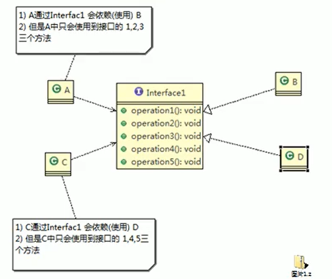

# 基本介绍

- 客户端不应该依赖它不需要的接口，即一个类对另一个类的依赖应该建立在最小的接口上。
- 先看一张图

- 类A通过接口Interface1依赖类B，类C通过接口Interface1依赖类D，如果接口Interface1对于类A和类C来说不是最小的接口，那么类B和类D必须去实现他们不需要的方法。
- 按接口个例原则应当这样处理：将接口Interface1拆分成为独立的几个接口，类A和类C分别与他们需要的接口建立依赖关系，也就是采用接口隔离原则。

# 应传统方法的问题和使用接口隔离原则的改进

- 类A通过接口Interface1依赖类B，类C通过接口Interface1依赖类D，如果接口Interface1对于类A和类C来说不是最小接口，那么类B和类D必须去实现他们不需要的方法。
- 将接口Interface1拆分成为几个接口，类A和类C分别于他们需要的接口建立依赖关系，也就是采用接口隔离原则。
- 接口Interface1中出现的方法，根据实际情况拆分为三个接口

传统方式的代码：

```java
public class Segregation1 {
    public static void main(String[] args) {

    }
}

/**
 * 接口
 */
interface Interface1 {
    void operation1();

    void operation2();

    void operation3();

    void operation4();

    void operation5();
}

class B implements Interface1 {

    @Override
    public void operation1() {
        System.out.println("B 实现 operation1");
    }

    @Override
    public void operation2() {
        System.out.println("B 实现 operation2");
    }

    @Override
    public void operation3() {
        System.out.println("B 实现 operation3");
    }

    @Override
    public void operation4() {
        System.out.println("B 实现 operation4");
    }

    @Override
    public void operation5() {
        System.out.println("B 实现 operation5");
    }
}

class D implements Interface1 {

    @Override
    public void operation1() {
        System.out.println("D 实现 operation1");
    }

    @Override
    public void operation2() {
        System.out.println("D 实现 operation2");
    }

    @Override
    public void operation3() {
        System.out.println("D 实现 operation3");
    }

    @Override
    public void operation4() {
        System.out.println("D 实现 operation4");
    }

    @Override
    public void operation5() {
        System.out.println("D 实现 operation5");
    }
}

/**
 * A 类通过接口Interface1 依赖（调用） B 类，但是只是用到1、2、3方法
 */
class A {
    public void depend1(Interface1 i) {
        i.operation1();
    }

    public void depend2(Interface1 i) {
        i.operation2();
    }

    public void depend3(Interface1 i) {
        i.operation3();
    }
}

/**
 * C 类通过接口Interface1 依赖（调用） D 类，但是只是用到1、4、5方法
 */
class C {
    public void depend1(Interface1 i) {
        i.operation1();
    }

    public void depend4(Interface1 i) {
        i.operation4();
    }

    public void depend5(Interface1 i) {
        i.operation5();
    }
}
```

改进后的UML和代码：

UML


代码

```java
public class Segregation1 {
    public static void main(String[] args) {
        A a = new A();
        a.depend1(new B());//A 类通过方法依赖类 B
        a.depend2(new B());//A 类通过方法依赖类 B
        a.depend3(new B());//A 类通过方法依赖类 B

        C c = new C();
        c.depend1(new D());//C 类通过方法依赖类 D
        c.depend4(new D());
        c.depend5(new D());
    }
}

/**
 * 接口
 */
interface Interface1 {
    void operation1();
}

interface Interface2 {
    void operation2();

    void operation3();
}

interface Interface3 {
    void operation4();

    void operation5();
}

class B implements Interface1, Interface2 {

    @Override
    public void operation1() {
        System.out.println("B 实现 operation1");
    }

    @Override
    public void operation2() {
        System.out.println("B 实现 operation2");
    }

    @Override
    public void operation3() {
        System.out.println("B 实现 operation3");
    }
}

class D implements Interface1, Interface3 {

    @Override
    public void operation1() {
        System.out.println("D 实现 operation1");
    }

    @Override
    public void operation4() {
        System.out.println("D 实现 operation4");
    }

    @Override
    public void operation5() {
        System.out.println("D 实现 operation5");
    }
}

/**
 * A 类通过接口Interface1 依赖（调用） B 类，但是只是用到1、2、3方法
 */
class A {
    public void depend1(Interface1 i) {
        i.operation1();
    }

    public void depend2(Interface2 i) {
        i.operation2();
    }

    public void depend3(Interface2 i) {
        i.operation3();
    }
}

/**
 * C 类通过接口Interface1 依赖（调用） D 类，但是只是用到1、4、5方法
 */
class C {
    public void depend1(Interface1 i) {
        i.operation1();
    }

    public void depend4(Interface3 i) {
        i.operation4();
    }

    public void depend5(Interface3 i) {
        i.operation5();
    }
}
```