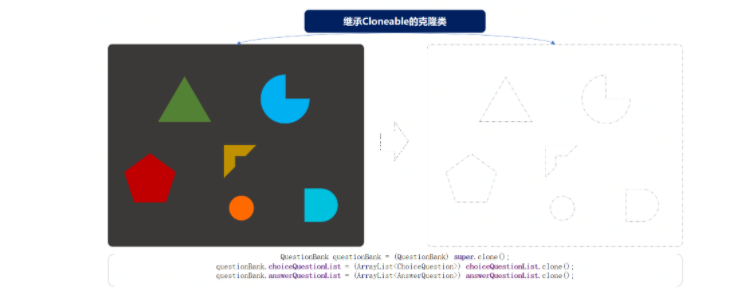

# 定义

原型模式主要解决的问题就是创建重复对象，而这部分对象内容本身就比较复杂，生成过程可能从库或者RPC接口中获取数据的耗时比较长，因此采用克隆的方式节省时间

其实这种场景在我们周围经常出现，比如：

- 你经常Ctrl+C、Ctrl+V，复制粘贴代码。
- Java多数类中提供的API方法；Object clone()。
- 细胞的有丝分裂。

# 使用场景

适用于创建对象比较耗时，并且对性能有较高要求的情况，我们生成一份原始对象，并通过重写clone()的方式生成下一个对象。

比如考试的时候，我们生成一份试卷，那么我们可以采用原型模式，给不同的人分发相同的试卷，在clone()方法中对这一批试卷进行打乱。

# 代码实现

因为需要实现一个上机考试抽题的服务，因此在这里建造一个题库题目的场景类信息，用于创建：选择题、问答题。

题型：

```java
//选择题
public class ChoiceQuestion {

    private String name;                 // 题目
    private Map<String, String> option;  // 选项；A、B、C、D
    private String key;                  // 答案；B

    public ChoiceQuestion() {
    }

    public ChoiceQuestion(String name, Map<String, String> option, String key) {
        this.name = name;
        this.option = option;
        this.key = key;
    }

    // ...get/set
}

//问答题
public class AnswerQuestion {

    private String name;  // 问题
    private String key;   // 答案

    public AnswerQuestion() {
    }

    public AnswerQuestion(String name, String key) {
        this.name = name;
        this.key = key;
    }

    // ...get/set
}
```

原型模式主要解决的问题就是创建大量重复的类，而我们模拟的场景就需要给不同的用户都创建相同的试卷，但是这些试卷的题目不便于每次都从数据库中获取，甚至有的时候需要从远程RPC获取，这样都是非常耗时的

在原型模式中所需要的非常重要的手段就是克隆，在需要用到克隆的类中需要实现implements Cloneable接口。

原型模式模型结构



- 工程中包括了核心的题库类`Questionbank`，题库总主要扶着将各个的题目进行组装最终输出试卷
- 针对每一个试卷都会使用克隆的方式进行复制，复制完成后将试卷中题目以及每个题目的答案进行乱序处理，这里提供工具包：`TopicRandomUtil`

题目选项乱序操作工具包：

```java
/**
 * 乱序Map元素，记录对应答案key
 * @param option 题目
 * @param key    答案
 * @return Topic 乱序后 {A=c., B=d., C=a., D=b.}
 */
static public Topic random(Map<String, String> option, String key) {
    Set<String> keySet = option.keySet();
    ArrayList<String> keyList = new ArrayList<String>(keySet);
    Collections.shuffle(keyList);
    HashMap<String, String> optionNew = new HashMap<String, String>();
    int idx = 0;
    String keyNew = "";
    for (String next : keySet) {
        String randomKey = keyList.get(idx++);
        if (key.equals(next)) {
            keyNew = randomKey;
        }
        optionNew.put(randomKey, option.get(next));
    }
    return new Topic(optionNew, keyNew);
}
```

- 可能你还记得上文里我们提供了Map存储题目选项，同时key的属性存放答案。如果忘记可以往上翻翻
- 这个这个工具类的操作就是将原有Map中的选型乱序操作，也就是A的选项内容给B，B的可能给C，同时记录正确答案在处理后的位置信息。

克隆对象处理类：

```java
public class QuestionBank implements Cloneable {

    private String candidate; // 考生
    private String number;    // 考号

    private ArrayList<ChoiceQuestion> choiceQuestionList = new ArrayList<ChoiceQuestion>();
    private ArrayList<AnswerQuestion> answerQuestionList = new ArrayList<AnswerQuestion>();

    public QuestionBank append(ChoiceQuestion choiceQuestion) {
        choiceQuestionList.add(choiceQuestion);
        return this;
    }

    public QuestionBank append(AnswerQuestion answerQuestion) {
        answerQuestionList.add(answerQuestion);
        return this;
    }

    @Override
    public Object clone() throws CloneNotSupportedException {
        QuestionBank questionBank = (QuestionBank) super.clone();
        questionBank.choiceQuestionList = (ArrayList<ChoiceQuestion>) choiceQuestionList.clone();
        questionBank.answerQuestionList = (ArrayList<AnswerQuestion>) answerQuestionList.clone();

        // 题目乱序
        Collections.shuffle(questionBank.choiceQuestionList);
        Collections.shuffle(questionBank.answerQuestionList);
        // 答案乱序
        ArrayList<ChoiceQuestion> choiceQuestionList = questionBank.choiceQuestionList;
        for (ChoiceQuestion question : choiceQuestionList) {
            Topic random = TopicRandomUtil.random(question.getOption(), question.getKey());
            question.setOption(random.getOption());
            question.setKey(random.getKey());
        }
        return questionBank;
    }

    public void setCandidate(String candidate) {
        this.candidate = candidate;
    }

    public void setNumber(String number) {
        this.number = number;
    }

    @Override
    public String toString() {

        StringBuilder detail = new StringBuilder("考生：" + candidate + "\r\n" +
                "考号：" + number + "\r\n" +
                "--------------------------------------------\r\n" +
                "一、选择题" + "\r\n\n");

        for (int idx = 0; idx < choiceQuestionList.size(); idx++) {
            detail.append("第").append(idx + 1).append("题：").append(choiceQuestionList.get(idx).getName()).append("\r\n");
            Map<String, String> option = choiceQuestionList.get(idx).getOption();
            for (String key : option.keySet()) {
                detail.append(key).append("：").append(option.get(key)).append("\r\n");;
            }
            detail.append("答案：").append(choiceQuestionList.get(idx).getKey()).append("\r\n\n");
        }

        detail.append("二、问答题" + "\r\n\n");

        for (int idx = 0; idx < answerQuestionList.size(); idx++) {
            detail.append("第").append(idx + 1).append("题：").append(answerQuestionList.get(idx).getName()).append("\r\n");
            detail.append("答案：").append(answerQuestionList.get(idx).getKey()).append("\r\n\n");
        }

        return detail.toString();
    }
}
```

这里主要操作内容有三个：
- 两个append()，对各项题目的添加，有点像我们在建造者模式中使用的方式，添加装修物料。
- clone() ，这里的核心操作就是对对象的复制，这里的复制不只是包括了本身，同时对两个集合也做了复制。只有这样的拷贝才能确保在操作克隆对象的时候不影响原对象。
- 乱序操作，在list集合中有一个方法，Collections.shuffle，可以将原有集合的顺序打乱，输出一个新的顺序。在这里我们使用此方法对题目进行乱序操作。

初始化试卷数据：

```java
public class QuestionBankController {

    private QuestionBank questionBank = new QuestionBank();

    public QuestionBankController() {

        Map<String, String> map01 = new HashMap<String, String>();
        map01.put("A", "JAVA2 EE");
        map01.put("B", "JAVA2 Card");
        map01.put("C", "JAVA2 ME");
        map01.put("D", "JAVA2 HE");
        map01.put("E", "JAVA2 SE");

        Map<String, String> map02 = new HashMap<String, String>();
        map02.put("A", "JAVA程序的main方法必须写在类里面");
        map02.put("B", "JAVA程序中可以有多个main方法");
        map02.put("C", "JAVA程序中类名必须与文件名一样");
        map02.put("D", "JAVA程序的main方法中如果只有一条语句，可以不用{}(大括号)括起来");

        Map<String, String> map03 = new HashMap<String, String>();
        map03.put("A", "变量由字母、下划线、数字、$符号随意组成；");
        map03.put("B", "变量不能以数字作为开头；");
        map03.put("C", "A和a在java中是同一个变量；");
        map03.put("D", "不同类型的变量，可以起相同的名字；");

        Map<String, String> map04 = new HashMap<String, String>();
        map04.put("A", "STRING");
        map04.put("B", "x3x;");
        map04.put("C", "void");
        map04.put("D", "de$f");

        Map<String, String> map05 = new HashMap<String, String>();
        map05.put("A", "31");
        map05.put("B", "0");
        map05.put("C", "1");
        map05.put("D", "2");
        
        questionBank.append(new ChoiceQuestion("JAVA所定义的版本中不包括", map01, "D"))
                .append(new ChoiceQuestion("下列说法正确的是", map02, "A"))
                .append(new ChoiceQuestion("变量命名规范说法正确的是", map03, "B"))
                .append(new ChoiceQuestion("以下()不是合法的标识符",map04, "C"))
                .append(new ChoiceQuestion("表达式(11+3*8)/4%3的值是", map05, "D"))
                .append(new AnswerQuestion("小红马和小黑马生的小马几条腿", "4条腿"))
                .append(new AnswerQuestion("铁棒打头疼还是木棒打头疼", "头最疼"))
                .append(new AnswerQuestion("什么床不能睡觉", "牙床"))
                .append(new AnswerQuestion("为什么好马不吃回头草", "后面的草没了"));
    }

    public String createPaper(String candidate, String number) throws CloneNotSupportedException {
        QuestionBank questionBankClone = (QuestionBank) questionBank.clone();
        questionBankClone.setCandidate(candidate);
        questionBankClone.setNumber(number);
        return questionBankClone.toString();
    }
}
```

- 这个类的内容就比较简单了，主要提供对试卷内容的模式初始化操作(所有考生试卷一样，题目顺序不一致)。
- 以及对外部提供创建试卷的方法，在创建的过程中使用的是克隆的方式：`(QuestionBank) questionBank.clone();`，并最终返回试卷信息。

```java
@Test
public void test_QuestionBank() throws CloneNotSupportedException {
    QuestionBankController questionBankController = new QuestionBankController();
    System.out.println(questionBankController.createPaper("花花", "1000001921032"));
    System.out.println(questionBankController.createPaper("豆豆", "1000001921051"));
    System.out.println(questionBankController.createPaper("大宝", "1000001921987"));
}
```

# 总结

- 以上的实际场景模拟了原型模式在开发中重构的作用，但是原型模式的使用频率确实不是很高。如果有一些特殊场景需要使用到，也可以按照此设计模式进行优化。
- 另外原型设计模式的优点包括；便于通过克隆方式创建复杂对象、也可以避免重复做初始化操作、不需要与类中所属的其他类耦合等。但也有一些缺点如果对象中包括了循环引用的克隆，以及类中深度使用对象的克隆，都会使此模式变得异常麻烦。
- 终究设计模式是一整套的思想，在不同的场景合理的运用可以提升整体的架构的质量。永远不要想着去硬凑设计模式，否则将会引起过渡设计，以及在承接业务反复变化的需求时造成浪费的开发和维护成本。
- 初期是代码的优化，中期是设计模式的使用，后期是把控全局服务的搭建。不断的加强自己对全局能力的把控，也加深自己对细节的处理。可上可下才是一个程序员最佳处理方式，选取做合适的才是最好的选择。