这个模式真的不是很懂，只是了解到这个其实和数学里面的组合差不多，就是从头走到尾，很多节点，每一个节点上有不同的选择方式，通过将不同的选择挂到树节点上，然后进行判定走流程。

# 介绍

组合模式是将对象组合成树形结构以表示“部分-整体”的层次结构，组合模式使得用户对单个对象和组合对象的使用具有一致性。

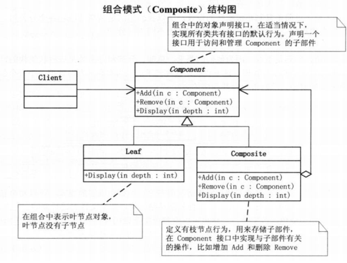

树就是最常用的一种数据结构，组合模式就是将这种数据结构用到类的组合上。

# 代码实现

```java
public abstract class Component {
	protected String name;
	
	public Component(String name) {
		super();
		this.name = name;
	}
	
	public abstract void add(Component component);
	public abstract void removeChildren(Component component);
	public abstract void show(int depth);
	
}
```

```java

import java.util.ArrayList;
import java.util.List;
 
public class Composite extends Component {
 
	private List<Component> children=new ArrayList<>();
	
	public Composite(String name) {
		super(name);
		// TODO Auto-generated constructor stub
	}
 
	@Override
	public void add(Component component) {
		// TODO Auto-generated method stub
		children.add(component);
	}
 
	@Override
	public void removeChildren(Component component) {
		// TODO Auto-generated method stub
		children.remove(component);
	}
 
	@Override
	public void show(int depth) {
		// TODO Auto-generated method stub
		for(int i=0;i<depth;i++)
			System.out.print("-");
		System.out.println("Composite: " + name);
		for(Component component:children) {
			component.show(depth+1);
		}
	}
 
}
```

```java

public class Leaf extends Component {
 
	public Leaf(String name) {
		super(name);
		// TODO Auto-generated constructor stub
	}
 
	@Override
	public void add(Component component) {
		// TODO Auto-generated method stub
		System.out.println("叶子结点不能增加子节点");
	}
 
	@Override
	public void removeChildren(Component component) {
		// TODO Auto-generated method stub
		System.out.println("叶子结点无子节点");
	}
 
	@Override
	public void show(int depth) {
		// TODO Auto-generated method stub
		for(int i=0;i<depth;i++)
			System.out.print("-");
		System.out.println("Leaf: " + name);
	}
}
```

```java
public class Client {
 
	public static void main(String[] args) {
		// TODO Auto-generated method stub
		Component root=new Composite("root");
		Component leftchild=new Composite("left child");
		Component rightchild=new Composite("right child");
		root.add(leftchild);root.add(rightchild);
		Component leafA=new Leaf("leaf A");
		Component leafB=new Leaf("leaf B");
		leftchild.add(leafA);  leftchild.add(leafB);
		root.show(1);
		System.out.println();
		leftchild.removeChildren(leafB);  root.removeChildren(rightchild);
		root.show(1);
	}
}
```

# 透明方式与安全方式：

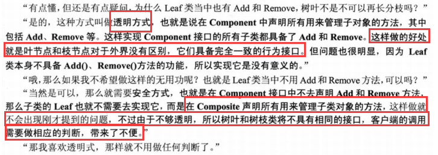

# 读取的另一篇博文

# 组合模式的介绍

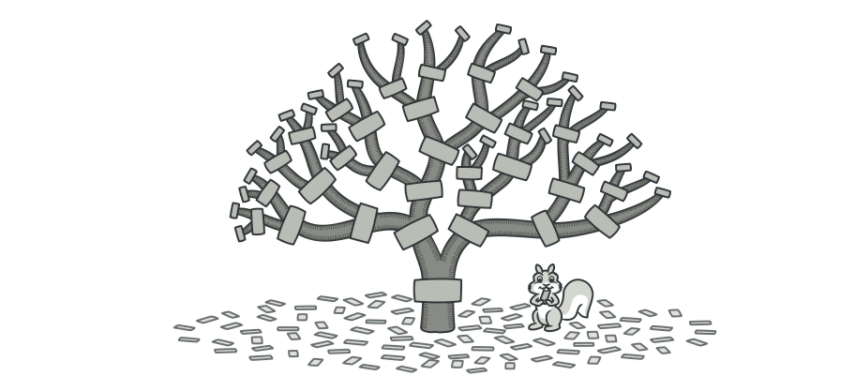

从上图可以看到这有点像螺丝🔩和螺母，通过一堆的链接组织出一棵结构树。而这种通过把相似对象(也可以称作是方法)组合成一组可被调用的结构树对象的设计思路叫做组合模式。

这种设计方式可以让你的服务组节点进行自由组合对外提供服务，例如你有三个原子校验功能(A：身份证、B：银行卡、C：手机号)服务并对外提供调用使用。有些调用方需要使用AB组合，有些调用方需要使用到CBA组合，还有一些可能只使用三者中的一个。那么这个时候你就可以使用组合模式进行构建服务，对于不同类型的调用方配置不同的组织关系树，而这个树结构你可以配置到数据库中也可以不断的通过图形界面来控制树结构。

所以不同的设计模式用在恰当好处的场景可以让代码逻辑非常清晰并易于扩展，同时也可以减少团队新增人员对项目的学习成本。

# 案例场景模拟

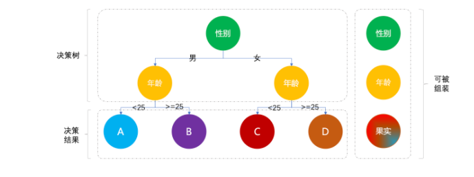

以上是一个非常简化版的营销规则决策树，根据性别、年龄来发放不同类型的优惠券，来刺激消费起到精准用户促活的目的。

虽然一部分小伙伴可能并没有开发过营销场景，但你可能时时刻刻的被营销着。比如你去经常浏览男性喜欢的机械键盘、笔记本电脑、汽车装饰等等，那么久给你推荐此类的优惠券刺激你消费。那么如果你购物不多，或者钱不在自己手里。那么你是否打过车，有一段时间经常有小伙伴喊，为什么同样的距离他就10元，我就15元呢？其实这些都是被营销的案例，一般对于不常使用软件的小伙伴，经常会进行稍微大力度的促活，增加用户粘性。

那么在这里我们就模拟一个类似的决策场景，体现出组合模式在其中起到的重要性。另外，组合模式不只是可以运用于规则决策树，还可以做服务包装将不同的接口进行组合配置，对外提供服务能力，减少开发成本。

# 初始实现

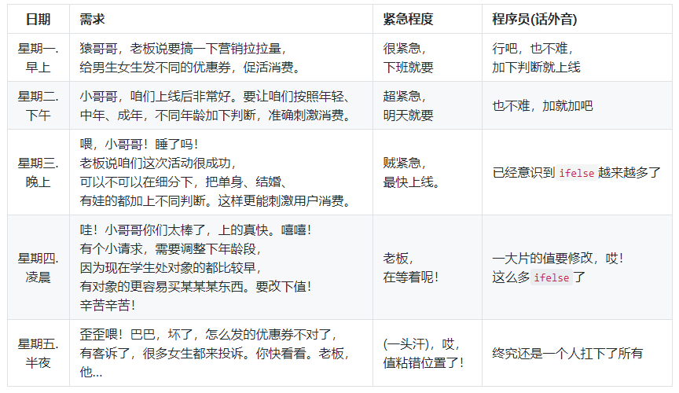

## 工程结构

```
itstack-demo-design-8-01
└── src
    └── main
        └── java
            └── org.itstack.demo.design
                └── EngineController.java
```

## 代码实现

```java
public class EngineController {

    private Logger logger = LoggerFactory.getLogger(EngineController.class);

    public String process(final String userId, final String userSex, final int userAge) {

        logger.info("ifelse实现方式判断用户结果。userId：{} userSex：{} userAge：{}", userId, userSex, userAge);

        if ("man".equals(userSex)) {
            if (userAge < 25) {
                return "果实A";
            }

            if (userAge >= 25) {
                return "果实B";
            }
        }

        if ("woman".equals(userSex)) {
            if (userAge < 25) {
                return "果实C";
            }

            if (userAge >= 25) {
                return "果实D";
            }
        }

        return null;
    }
}
```

## 测试验证

```java
@Test
public void test_EngineController() {
    EngineController engineController = new EngineController();
    String process = engineController.process("Oli09pLkdjh", "man", 29);
    logger.info("测试结果：{}", process);
}
```

# 代码重构

接下来的重构部分代码改动量相对来说会比较大一些，为了让我们可以把不同类型的决策节点和最终的果实组装成一棵可被运行的决策树，需要做适配设计和工厂方法调用，具体会体现在定义接口以及抽象类和初始化配置决策节点(性别、年龄)上。建议这部分代码多阅读几次，最好实践下。

## 工程结构

```
itstack-demo-design-8-02
└── src
    ├── main
    │   └── java
    │      └── org.itstack.demo.design.domain
    │          ├── model
    │          │   ├── aggregates
    │          │   │   └── TreeRich.java
    │          │   └── vo
    │          │       ├── EngineResult.java
    │          │       ├── TreeNode.java
    │          │       ├── TreeNodeLink.java    
    │          │       └── TreeRoot.java	
    │          └── service
    │              ├── engine
    │              │   ├── impl	
    │              │   │   └── TreeEngineHandle.java	   
    │              │   ├── EngineBase.java 
    │              │   ├── EngineConfig.java       
    │              │   └── IEngine.java	
    │              └── logic
    │                  ├── impl	
    │                  │   ├── LogicFilter.java	 
    │                  │   └── LogicFilter.java	    
    │                  └── LogicFilter.java	
    └── test
         └── java
             └── org.itstack.demo.design.test
                 └── ApiTest.java
```

## 组合模式模型结构

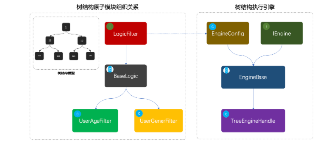

- 首先可以看下黑色框框的模拟指导树结构：1、11、12、111、112、121、122，这是一组树结构的ID，并由节点串联组合出一棵关系树。

- 接下来是类图部分，左侧是从LogicFilter开始定义适配的决策过滤器，BaseLogic是对接口的实现，提供最基本的通用方法。UserAgeFilter、UserGenerFilter，是两个具体的实现类用于判断年龄和性别。

- 最后则是对这颗可以被组织出来的决策树，进行执行的引擎。同样定义了引擎接口和基础的配置，在配置里面设定了需要的模式决策节点。
  -  ```java
      static {
           logicFilterMap = new ConcurrentHashMap<>();
           logicFilterMap.put("userAge", new UserAgeFilter());
           logicFilterMap.put("userGender", new UserGenderFilter());
      }
      ```
- 接下来会对每一个类进行细致的讲解。

## 代码实现

## 基础对象

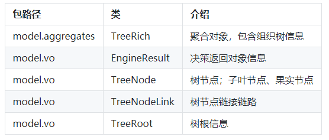

## 树节点逻辑过滤器接口

```java
public interface LogicFilter {

    /**
     * 逻辑决策器
     *
     * @param matterValue          决策值
     * @param treeNodeLineInfoList 决策节点
     * @return 下一个节点Id
     */
    Long filter(String matterValue, List<TreeNodeLink> treeNodeLineInfoList);

    /**
     * 获取决策值
     *
     * @param decisionMatter 决策物料
     * @return 决策值
     */
    String matterValue(Long treeId, String userId, Map<String, String> decisionMatter);
}
```

这一部分定义了适配的通用接口，逻辑决策器、获取决策值，让每一个提供决策能力的节点都必须实现此接口，保证统一性。

## 决策抽象类提供基础服务

```java
public abstract class BaseLogic implements LogicFilter {

    @Override
    public Long filter(String matterValue, List<TreeNodeLink> treeNodeLinkList) {
        for (TreeNodeLink nodeLine : treeNodeLinkList) {
            if (decisionLogic(matterValue, nodeLine)) return nodeLine.getNodeIdTo();
        }
        return 0L;
    }

    @Override
    public abstract String matterValue(Long treeId, String userId, Map<String, String> decisionMatter);

    private boolean decisionLogic(String matterValue, TreeNodeLink nodeLink) {
        switch (nodeLink.getRuleLimitType()) {
            case 1:
                return matterValue.equals(nodeLink.getRuleLimitValue());
            case 2:
                return Double.parseDouble(matterValue) > Double.parseDouble(nodeLink.getRuleLimitValue());
            case 3:
                return Double.parseDouble(matterValue) < Double.parseDouble(nodeLink.getRuleLimitValue());
            case 4:
                return Double.parseDouble(matterValue) <= Double.parseDouble(nodeLink.getRuleLimitValue());
            case 5:
                return Double.parseDouble(matterValue) >= Double.parseDouble(nodeLink.getRuleLimitValue());
            default:
                return false;
        }
    }
}
```

- 在抽象方法中实现了接口方法，同时定义了基本的决策方法；1、2、3、4、5，等于、小于、大于、小于等于、大于等于的判断逻辑。
- 同时定义了抽象方法，让每一个实现接口的类都必须按照规则提供决策值，这个决策值用于做逻辑比对。

## 树节点逻辑实现类

年龄节点

```java
public class UserAgeFilter extends BaseLogic {

    @Override
    public String matterValue(Long treeId, String userId, Map<String, String> decisionMatter) {
        return decisionMatter.get("age");
    }
}
```

性别节点

```java
public class UserGenderFilter extends BaseLogic {

    @Override
    public String matterValue(Long treeId, String userId, Map<String, String> decisionMatter) {
        return decisionMatter.get("gender");
    }
}
```

- 以上两个决策逻辑的节点获取值的方式都非常简单，只是获取用户的入参即可。实际的业务开发可以从数据库、RPC接口、缓存运算等各种方式获取。

## 决策引擎接口定义

```java
public interface IEngine {

    EngineResult process(final Long treeId, final String userId, TreeRich treeRich, final Map<String, String> decisionMatter);

}
```

- 对于使用方来说也同样需要定义统一的接口操作，这样的好处非常方便后续拓展出不同类型的决策引擎，也就是可以建造不同的决策工厂。

## 决策节点配置

```java
public class EngineConfig {

    static Map<String, LogicFilter> logicFilterMap;

    static {
        logicFilterMap = new ConcurrentHashMap<>();
        logicFilterMap.put("userAge", new UserAgeFilter());
        logicFilterMap.put("userGender", new UserGenderFilter());
    }

    public Map<String, LogicFilter> getLogicFilterMap() {
        return logicFilterMap;
    }

    public void setLogicFilterMap(Map<String, LogicFilter> logicFilterMap) {
        this.logicFilterMap = logicFilterMap;
    }
}
```

在这里将可提供服务的决策节点配置到map结构中，对于这样的map结构可以抽取到数据库中，那么就可以非常方便的管理。

## 基础决策引擎功能

```java
public abstract class EngineBase extends EngineConfig implements IEngine {

    private Logger logger = LoggerFactory.getLogger(EngineBase.class);

    @Override
    public abstract EngineResult process(Long treeId, String userId, TreeRich treeRich, Map<String, String> decisionMatter);

    protected TreeNode engineDecisionMaker(TreeRich treeRich, Long treeId, String userId, Map<String, String> decisionMatter) {
        TreeRoot treeRoot = treeRich.getTreeRoot();
        Map<Long, TreeNode> treeNodeMap = treeRich.getTreeNodeMap();
        // 规则树根ID
        Long rootNodeId = treeRoot.getTreeRootNodeId();
        TreeNode treeNodeInfo = treeNodeMap.get(rootNodeId);
        //节点类型[NodeType]；1子叶、2果实
        while (treeNodeInfo.getNodeType().equals(1)) {
            String ruleKey = treeNodeInfo.getRuleKey();
            LogicFilter logicFilter = logicFilterMap.get(ruleKey);
            String matterValue = logicFilter.matterValue(treeId, userId, decisionMatter);
            Long nextNode = logicFilter.filter(matterValue, treeNodeInfo.getTreeNodeLinkList());
            treeNodeInfo = treeNodeMap.get(nextNode);
            logger.info("决策树引擎=>{} userId：{} treeId：{} treeNode：{} ruleKey：{} matterValue：{}", treeRoot.getTreeName(), userId, treeId, treeNodeInfo.getTreeNodeId(), ruleKey, matterValue);
        }
        return treeNodeInfo;
    }

}
```

- 这里主要提供决策树流程的处理过程，有点像通过链路的关系(性别、年龄)在二叉树中寻找果实节点的过程。
- 同时提供一个抽象方法，执行决策流程的方法供外部去做具体的实现。

## 决策引擎的实现

```java
public class TreeEngineHandle extends EngineBase {

    @Override
    public EngineResult process(Long treeId, String userId, TreeRich treeRich, Map<String, String> decisionMatter) {
        // 决策流程
        TreeNode treeNode = engineDecisionMaker(treeRich, treeId, userId, decisionMatter);
        // 决策结果
        return new EngineResult(userId, treeId, treeNode.getTreeNodeId(), treeNode.getNodeValue());
    }

}
```
这里对于决策引擎的实现就非常简单了，通过传递进来的必要信息；决策树信息、决策物料值，来做具体的树形结构决策。

# 测试验证

## 组装树关系

```java
@Before
public void init() {
    // 节点：1
    TreeNode treeNode_01 = new TreeNode();
    treeNode_01.setTreeId(10001L);
    treeNode_01.setTreeNodeId(1L);
    treeNode_01.setNodeType(1);
    treeNode_01.setNodeValue(null);
    treeNode_01.setRuleKey("userGender");
    treeNode_01.setRuleDesc("用户性别[男/女]");
    // 链接：1->11
    TreeNodeLink treeNodeLink_11 = new TreeNodeLink();
    treeNodeLink_11.setNodeIdFrom(1L);
    treeNodeLink_11.setNodeIdTo(11L);
    treeNodeLink_11.setRuleLimitType(1);
    treeNodeLink_11.setRuleLimitValue("man");
    // 链接：1->12
    TreeNodeLink treeNodeLink_12 = new TreeNodeLink();
    treeNodeLink_12.setNodeIdTo(1L);
    treeNodeLink_12.setNodeIdTo(12L);
    treeNodeLink_12.setRuleLimitType(1);
    treeNodeLink_12.setRuleLimitValue("woman");
    List<TreeNodeLink> treeNodeLinkList_1 = new ArrayList<>();
    treeNodeLinkList_1.add(treeNodeLink_11);
    treeNodeLinkList_1.add(treeNodeLink_12);
    treeNode_01.setTreeNodeLinkList(treeNodeLinkList_1);
    // 节点：11
    TreeNode treeNode_11 = new TreeNode();
    treeNode_11.setTreeId(10001L);
    treeNode_11.setTreeNodeId(11L);
    treeNode_11.setNodeType(1);
    treeNode_11.setNodeValue(null);
    treeNode_11.setRuleKey("userAge");
    treeNode_11.setRuleDesc("用户年龄");
    // 链接：11->111
    TreeNodeLink treeNodeLink_111 = new TreeNodeLink();
    treeNodeLink_111.setNodeIdFrom(11L);
    treeNodeLink_111.setNodeIdTo(111L);
    treeNodeLink_111.setRuleLimitType(3);
    treeNodeLink_111.setRuleLimitValue("25");
    // 链接：11->112
    TreeNodeLink treeNodeLink_112 = new TreeNodeLink();
    treeNodeLink_112.setNodeIdFrom(11L);
    treeNodeLink_112.setNodeIdTo(112L);
    treeNodeLink_112.setRuleLimitType(5);
    treeNodeLink_112.setRuleLimitValue("25");
    List<TreeNodeLink> treeNodeLinkList_11 = new ArrayList<>();
    treeNodeLinkList_11.add(treeNodeLink_111);
    treeNodeLinkList_11.add(treeNodeLink_112);
    treeNode_11.setTreeNodeLinkList(treeNodeLinkList_11);
    // 节点：12
    TreeNode treeNode_12 = new TreeNode();
    treeNode_12.setTreeId(10001L);
    treeNode_12.setTreeNodeId(12L);
    treeNode_12.setNodeType(1);
    treeNode_12.setNodeValue(null);
    treeNode_12.setRuleKey("userAge");
    treeNode_12.setRuleDesc("用户年龄");
    // 链接：12->121
    TreeNodeLink treeNodeLink_121 = new TreeNodeLink();
    treeNodeLink_121.setNodeIdFrom(12L);
    treeNodeLink_121.setNodeIdTo(121L);
    treeNodeLink_121.setRuleLimitType(3);
    treeNodeLink_121.setRuleLimitValue("25");
    // 链接：12->122
    TreeNodeLink treeNodeLink_122 = new TreeNodeLink();
    treeNodeLink_122.setNodeIdFrom(12L);
    treeNodeLink_122.setNodeIdTo(122L);
    treeNodeLink_122.setRuleLimitType(5);
    treeNodeLink_122.setRuleLimitValue("25");
    List<TreeNodeLink> treeNodeLinkList_12 = new ArrayList<>();
    treeNodeLinkList_12.add(treeNodeLink_121);
    treeNodeLinkList_12.add(treeNodeLink_122);
    treeNode_12.setTreeNodeLinkList(treeNodeLinkList_12);
    // 节点：111
    TreeNode treeNode_111 = new TreeNode();
    treeNode_111.setTreeId(10001L);
    treeNode_111.setTreeNodeId(111L);
    treeNode_111.setNodeType(2);
    treeNode_111.setNodeValue("果实A");
    // 节点：112
    TreeNode treeNode_112 = new TreeNode();
    treeNode_112.setTreeId(10001L);
    treeNode_112.setTreeNodeId(112L);
    treeNode_112.setNodeType(2);
    treeNode_112.setNodeValue("果实B");
    // 节点：121
    TreeNode treeNode_121 = new TreeNode();
    treeNode_121.setTreeId(10001L);
    treeNode_121.setTreeNodeId(121L);
    treeNode_121.setNodeType(2);
    treeNode_121.setNodeValue("果实C");
    // 节点：122
    TreeNode treeNode_122 = new TreeNode();
    treeNode_122.setTreeId(10001L);
    treeNode_122.setTreeNodeId(122L);
    treeNode_122.setNodeType(2);
    treeNode_122.setNodeValue("果实D");
    // 树根
    TreeRoot treeRoot = new TreeRoot();
    treeRoot.setTreeId(10001L);
    treeRoot.setTreeRootNodeId(1L);
    treeRoot.setTreeName("规则决策树");
    Map<Long, TreeNode> treeNodeMap = new HashMap<>();
    treeNodeMap.put(1L, treeNode_01);
    treeNodeMap.put(11L, treeNode_11);
    treeNodeMap.put(12L, treeNode_12);
    treeNodeMap.put(111L, treeNode_111);
    treeNodeMap.put(112L, treeNode_112);
    treeNodeMap.put(121L, treeNode_121);
    treeNodeMap.put(122L, treeNode_122);
    treeRich = new TreeRich(treeRoot, treeNodeMap);
}
```

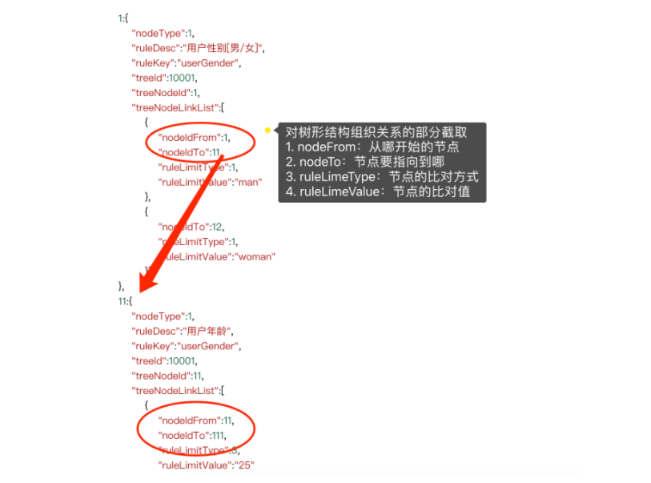

- 重要，这一部分是组合模式非常重要的使用，在我们已经建造好的决策树关系下，可以创建出树的各个节点，以及对节点间使用链路进行串联。
- 及时后续你需要做任何业务的扩展都可以在里面添加相应的节点，并做动态化的配置。
- 关于这部分手动组合的方式可以提取到数据库中，那么也就可以扩展到图形界面的进行配置操作。

## 编写测试类

```java
@Test
public void test_tree() {
    logger.info("决策树组合结构信息：\r\n" + JSON.toJSONString(treeRich));
    
    IEngine treeEngineHandle = new TreeEngineHandle();
    Map<String, String> decisionMatter = new HashMap<>();
    decisionMatter.put("gender", "man");
    decisionMatter.put("age", "29");
    
    EngineResult result = treeEngineHandle.process(10001L, "Oli09pLkdjh", treeRich, decisionMatter);
    
    logger.info("测试结果：{}", JSON.toJSONString(result));
}
```

- 在这里提供了调用的通过组织模式创建出来的流程决策树，调用的时候传入了决策树的ID，那么如果是业务开发中就可以方便的解耦决策树与业务的绑定关系，按需传入决策树ID即可。
- 此外入参我们还提供了需要处理；男(man)、年龄(29岁)，的参数信息。

# 总结

- 从以上的决策树场景来看，组合模式的主要解决的是一系列简单逻辑节点或者扩展的复杂逻辑节点在不同结构的组织下，对于外部的调用是仍然可以非常简单的。
- 这部分设计模式保证了开闭原则，无需更改模型结构你就可以提供新的逻辑节点的使用并配合组织出新的关系树。但如果是一些功能差异化非常大的接口进行包装就会变得比较困难，但也不是不能很好的处理，只不过需要做一些适配和特定化的开发。
- 很多时候因为你的极致追求和稍有倔强的工匠精神，即使在面对同样的业务需求，你能完成出最好的代码结构和最易于扩展的技术架构。不要被远不能给你指导提升能力的影响到放弃自己的追求！


# 因为不懂，就多读一篇博文

PS：[博文链接](https://blog.csdn.net/qq_40709468/article/details/81990084)

# 组合模式的概念

组合模式：组合多个对象形成树形结构以表示有整体-部分关系层次结构，组合模式可以让客户端统一对待单个对象和组合对象

组合模式有点难理解！树形结构就是组合模式的体现。文件中可以包含子文件和子文件夹，但是子文件中不能够再继续包含子文件。简单的说子文件就是最后一级别。上图好吧，上图靠谱。

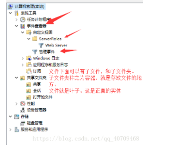

由于在使用的时候，比如某个文件夹的方法被调用，那么这个会遍历整个树形结构，寻找也包含这个方法的具体实现（文件）。并且调用执行，其中会使用到递归调用的机制对整个机构进行处理。由于，容器和叶子的功能上的区别，在使用这些对象代码中必须去别的对待容器和叶子，这样会让程序非常复杂。

所以，组合模式就出现了！通过一些设计。让容器（文件夹）和叶子（文件）作为相同的对象来处理!

# 组合模式的UML图

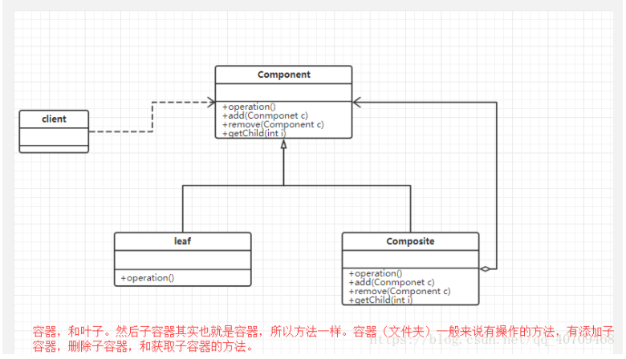

- component (抽象构件：容器)：它可以是接口或者抽象类，为叶子构建和子容器构建对象声明接口，在该角色中可以包含所有子类共有的行为的实现和声明。在抽象构建中定义了访问及管理它的子构件的方法，如增加子构件，删除子构件，获取子构件等。

- leaf(叶子构建)：叶子构建可以说就是各种类型的文件！叶子构建没有子构件。它实现了抽象构建中的定义的行为。对于那些访问子容器，删除子容器，增加子容器的就报错。

- compsite(子容器构建)：它在组合模式中表示容器节点对象，容器结点是子节点，可以是子容器，也可以是叶子构建，它提供一个集合来存储子节点。

# 组合模式的实现

最简单的一个实现：

component

```java

public abstract class Component{
    //这个是容器类的抽象类，定义好行为，定义创建移除子容器的方法抽象的。
    public abstract void addComposite(Component c); //添加成员
    public abstract void removeComposite(Component c);//移除成员
    public abstract Component getComposite(int i);//获取子容器
    public abstract void operation();//业务方法
}
```

leaf

```java
public class Leaf extends Component{
    //首先重写component的方法
    //叶子节点关键点在于业务
    public void Operation(){
        System.out.print("业务方法");
    }
    
    public void addComponent(Component c){
        //提示报错呗 。
        System.out.print("不是子容器");
    }
   public void removeComponent(Component c){
        //提示报错呗 。
        System.out.print("不是子容器");
    }
    public Component addComponent(int c){
        //提示报错呗 。
        System.out.print("不是子容器");
        return null;
    }
}
```
composite

```java
public class Composite extends Component{
    //首先来一个存储的集合
    private ArrayList<Component> list = new ArrayList<Component> ;
    public void addComponent(Component c){
            list.add(c);
    }
   public void removeComponent(Component c){
            list.remove(c);
    }
   public Component getComponent(int c){
            Component c1 =list.get(c);
             return c1;
    }
    public void operation(){
        for(Object obj:list){
            ((Component)obj).operation();
        }
    }
}
```

以上是一个最简单的实现。现在来一个正式例子。

杀毒软件，该软件能够对某个文件夹杀毒，也可以指定对某些文件杀毒。

AbstractFile: 抽象文件类，充当抽象构建。

```java
package compositePattern;
/**
 * 
* <p>Title: AbstractFiles</p>  
* <p>Description:in this class we are  use to test composite pattern </p>  
* @author HAND_WEILI  
* @date 2018年8月26日
 */
public abstract class AbstractFiles {
  public abstract void add(AbstractFiles af);
  public abstract void remove(AbstractFiles af);
  public abstract AbstractFiles get(int  i);
  public abstract void killVirus();
}
```

叶子节点：文件类型，就写了一种。

```java
package compositePattern;
 
public class ImageFile extends AbstractFiles {
	private String name;
	
	public ImageFile(String name) {
		
		this.name=name;
	}
 
	@Override
	public void add(AbstractFiles af) {
		// TODO Auto-generated method stub
			System.out.println("不支持该方法");
	}
 
	@Override
	public void remove(AbstractFiles af) {
		// TODO Auto-generated method stub
		System.out.println("不支持该方法");
	}
 
	@Override
	public AbstractFiles get(int i) {
		// TODO Auto-generated method stub
		System.out.println("不支持该方法");
		return null;
	}
 
	@Override
	public void killVirus() {
		// TODO Auto-generated method stub
		System.out.println("开始进行--"+name+"--文件杀毒");
	}
}
```

文件类型：

```java
package compositePattern;
 
import java.util.ArrayList;
 
public class Folder extends AbstractFiles {
	//文件夹类，所有的都可以用
	private ArrayList<AbstractFiles> list = new ArrayList<AbstractFiles>();
	private String name;
	public Folder(String name) {
		this.name=name;
	}
 
	@Override
	public void add(AbstractFiles af) {
		list.add(af);
		System.out.println("添加成狗");
 
	}
 
	@Override
	public void remove(AbstractFiles af) {
		// TODO Auto-generated method stub
		if(list.remove(af)) {
			System.out.println("删除成功");
		}else{
			System.out.println("删除失败");
		}
		
	}
 
	@Override
	public AbstractFiles get(int i) {
		// TODO Auto-generated method stub
		
		return list.get(i);
	}
 
	@Override
	public void killVirus() {
		// TODO Auto-generated method stub
		System.out.println("对文件夹"+name+"进行杀毒");
		//递归调用
		for(Object o:list) {
		((AbstractFiles)o).killVirus();
		
		}
	}
}
```

测试：

```java
package compositePattern;
 
public class Client {
	public static void main(String[] args) {
		//创建一个文件类型
		AbstractFiles f1 = new Folder("主文件夹");
		//创建文件
		AbstractFiles file1= new ImageFile("孙悟空。png");
		AbstractFiles file2= new ImageFile("龙珠.jpg");
		AbstractFiles file3= new ImageFile("帅哥威.gif");
		f1.add(file1);
		f1.add(file2);
		f1.add(file3);
		f1.killVirus();
		file1.killVirus();
	}
}
```

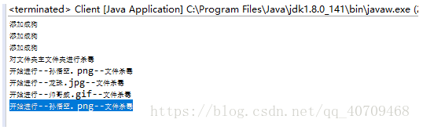

组合模式的优缺点

优点：
- 可以清楚地定义分层次的复杂类型，表示对象的全部层次或者部分层次  ，它让客户端忽略了层次的差异，方便对整个层次经行控制。
- 客户端可以一致的使用一个组合模式或对单个对象，不必关心处理的是单个对象还是整个组合结构，简化了客户端的代码。
- 在组合模式种增加新的容器构件和叶子构件都很方便，无需对现有类库进行任何修改，符合开闭原则。
- 为树形结构的面向对象实现提供了一种灵活的解决方案，通过叶子对象和容器对象的递归组合可以形成复杂的树形机构，但对树形结构的控制却很简单。

缺点：
- 在增加新的构件时就比较难咯。而且难以限定，有时候希望在一个容器种能有某些特定的对象，例如在某个文件夹只能有image或者gif等。这个就比较难以实现。

# 组合模式适用场景

1. 在具有整体和部分的层次结构种希望通过一种忽略整体与个体之间差异的，客户端一致对待的情况。
2. 在一个使用面向对象语言开发的系统中需要处理一个树形结构的。
3. 在一个系统中能分离出叶子和容器的，而且他们的类型还固定不变，需要增加一些新的类型

# 总结

1. 组合模式用于组合多个对象所构成的树形结构层次。
2. 组合模式包含抽象构建，叶子构建，和容器构建三种角色。
3. 组合模式的优点是解决客户端不好统一对待两种类型的类，缺点是面对一些特殊要求时不好办。