# 介绍

外观模式在设计模式当中可以归类为结构型模式，它为子系统的众多接口提供了统一的高层接口。

打个比方：你吃过肯德基吗？肯德基有很多套餐可供选择。首先，肯德基提供了众多基础彩菜品，比如鸡翅、汉堡、薯条、沙拉、可乐等。

这些琳琅满目的菜品虽好，但有些顾客犯了选择困难症，不知道该选什么好。

于是肯德基对这些菜品做了一定的组合，推出了各种各样的套餐。比如A套餐，包括汉堡/薯条/可乐；B套餐，包括汉堡/鸡翅/沙拉/可乐：


套餐不但搭配合理，而且价钱相对便宜，顾客可以更方便地做出选择，餐厅的销量也得到了提升。

假设小灰在维护一个底层模块的代码，该模块提供了5个基础功能，这些功能对外封装成了5个接口。

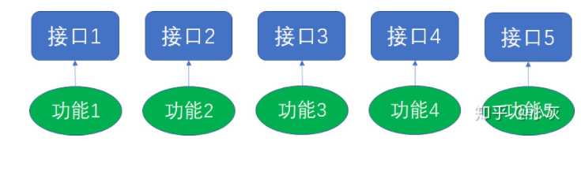

某一天，团队里的程序媛小红跑过来和小灰对接：

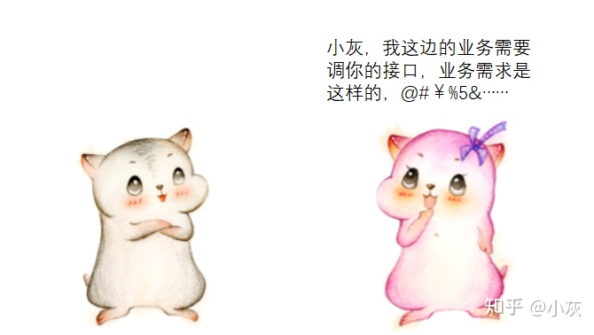

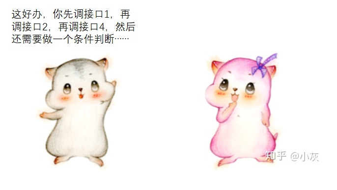

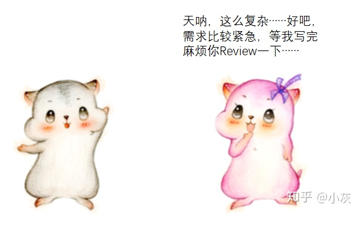

过了几天，小红又跑过来和小灰对接：

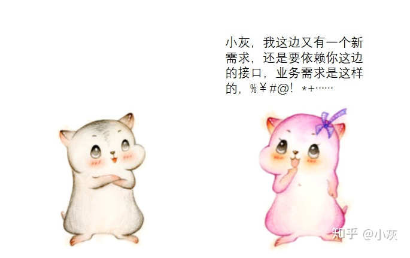

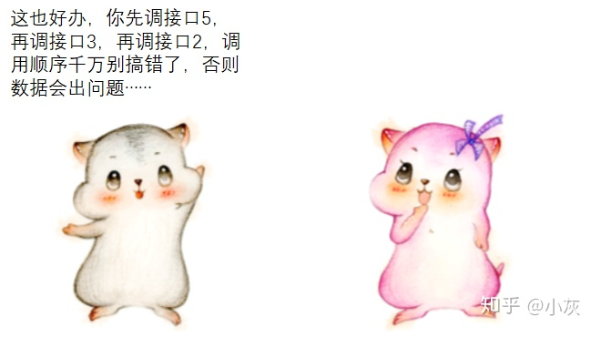

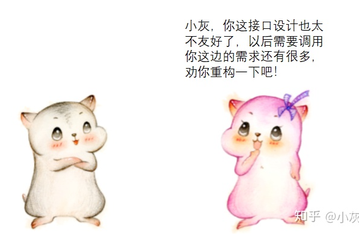

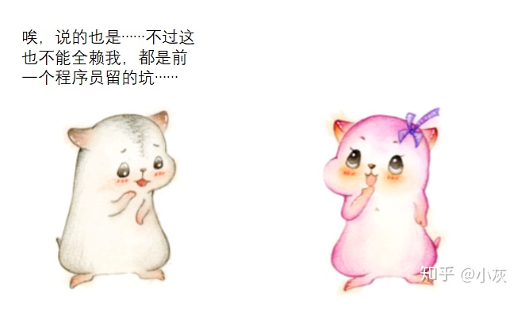

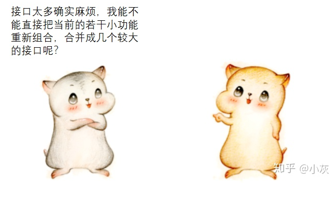

小灰的想法如下：

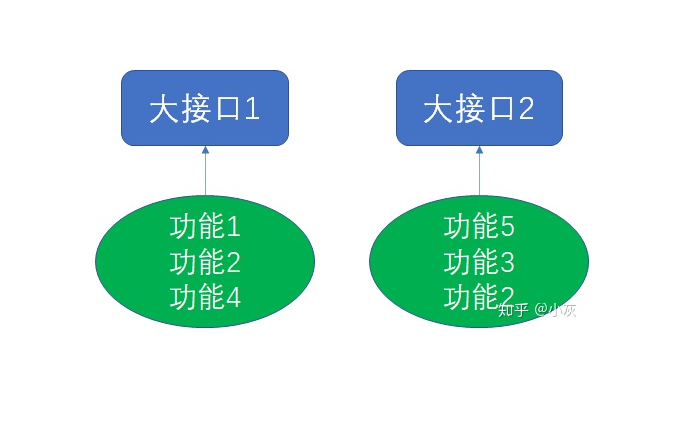

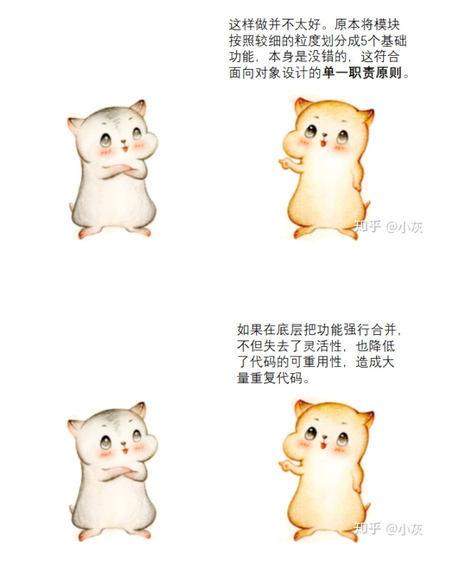

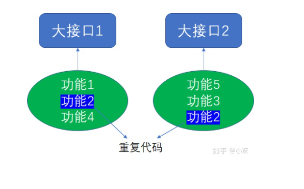

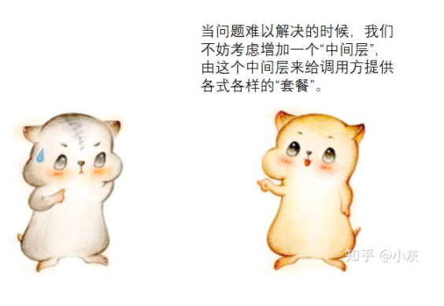

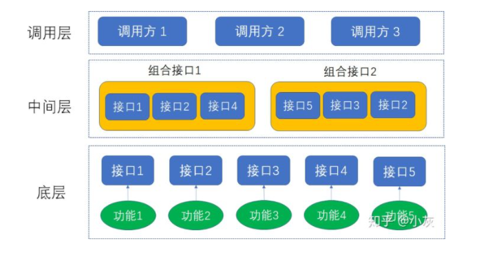

这里所谓的“套餐”，就是底层细粒度接口的不同组合。在保留底层接口不变的前提下，中间层为调用方提供了便利。

这正是外观模式（Facade Pattern）的设计思想：

To make a complex subsystem easier to use, a simple interface should be provided for a set of interfaces in the subsystem.

为了使复杂的子系统更容易被使用，应当为子系统的众多接口提供一个简洁的高层接口。

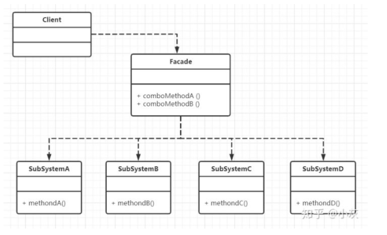

上图中，几个SubSystem类对应着我们刚才所说的底层基础功能，而Facade类对应着中间层，为调用方提供“套餐”服务。

# 代码实现

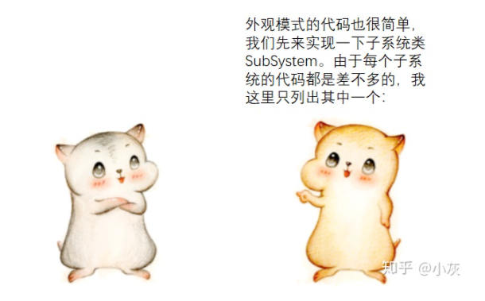

```java
public class SubSystemA {
    public void methodA(){
        System.out.println("执行方法A");
    }
}
```

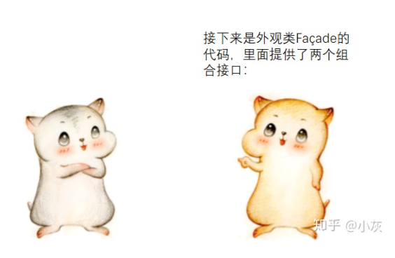

```java
public class Facade {

    public void comboMethodA(){
        SubSystemA subSystemA = new SubSystemA();
        SubSystemB subSystemB = new SubSystemB();
        SubSystemD subSystemD = new SubSystemD();
        subSystemA.methodA();
        subSystemB.methodB();
        subSystemD.methodD();
    }

    public void comboMethodB(){
        SubSystemE subSystemE = new SubSystemE();
        SubSystemD subSystemD = new SubSystemD();
        SubSystemB subSystemB = new SubSystemB();
        subSystemE.methodE();
        subSystemD.methodD();
        subSystemB.methodB();
    }
}
```

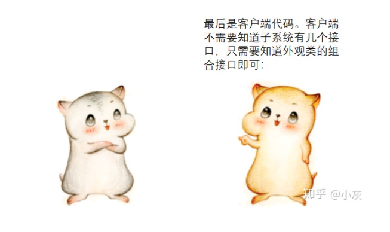

```java
public class Client {
    public static void main(String[] args) {
        Facade facade = new Facade();
        //通过外观模式，调用组合接口A
        facade.comboMethodA();
        //通过外观模式，调用组合接口B
        facade.comboMethodB();
    }
}
```

# 总结

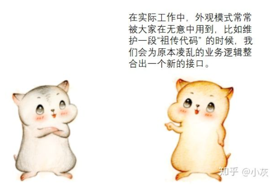

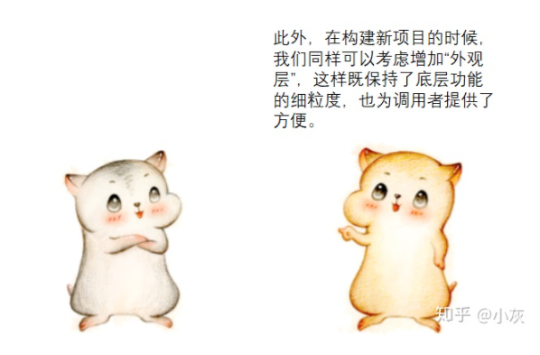